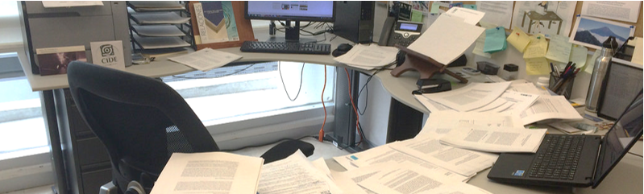
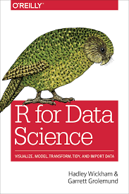

syllabus
================

<small>   <i>Syllabusing</i> by Raul P (cropped) is licensed under
<a href="https://creativecommons.org/licenses/by-nc-nd/2.0/">CC BY-NC-ND
2.0</a>   </small>

## contents

[course description](#course-description)  
[prerequisites](#prerequisites)  
[instructor](#instructor)  
[required textbook](#required-textbook)  
[objectives](#objectives)  
[grades](#grades)  
[homework](#homework)  
[lab](#lab)  
[attendance](#attendance)  
[valid excuses](#valid-excuses)  
[academic integrity](#academic-integrity)  
[academic accommodations](#academic-accommodations)  
[caveat](#caveat)  
[references](#references)

## course description

ME 447 / ME 547 Visualizing Data (3R–3L–4C).

The course is about creating truthful and compelling data visuals. We
study elements of statistical analysis, programming in R, human
perception, graphic design, and visual rhetoric and ethics. After
successfully completing this course, students should be able to design
effective and truthful data displays, credibly explain their design
rationale, produce publication-quality visuals, and credibly critique a
data display. Prior experience with R is not required.

## prerequisites

447: Junior standing  547: Instructor permission required. Graduate
students only with a project underway generating quantitative data.

## instructor

Richard Layton, Ph.D.  Professor of Mechanical Engineering  Moench
Hall C-217  <layton@rose-hulman.edu>  812-877-8905

  <a href="#top">▲ top of page</a>

## required textbook

A [web-version](http://r4ds.had.co.nz/) of the book is available at no
cost.  
Hadley Wickham and Garrett Grolemund (2017) *R for Data Science*,
O’Reilly Media.

## objectives

After successfully completing this course, students should be able to:

  - Design effective and truthful data displays
  - Credibly explain their design rationale
  - Produce publication-quality visuals
  - Credibly critique a data display

  <a href="#top">▲ top of page</a>

## grades

Grades are earned based on the [Institute
standards](http://www.rose-hulman.edu/campus-life/student-services/registrar/rules-and-procedures/grades.html),
for example, an

  - “A” is an *honor grade*
  - “B” is awarded for *thorough competence*
  - “C” indicates that *minimum standards have been met*

There are no exams. The major deliverables and their relative weights
are:

  - (70%) Portfolio of data displays and written critiques
  - (15%) Timely written responses to the reading prompts and the
    presentation prompts
  - (15%) Presenting your work and participating in small-group
    discussions

## homework

Steady and productive weekly progress is the key to success in this
course. Weekly assignments include

**Obtaining data**  
with structures appropriate to the assigned display types.

**R practice problems**  
to learn the skills needed to create the portfolio.

**Readings**  
Start several days before the due date early to give yourself time to
reflect on the reading so that our discussions are meaningful.

**Reading responses**  
in writing (typically one every two weeks) completed before class on the
day of discussion. Again, start these reflective pieces early so you
have time to revise and edit.

**Presenting**  
displays D1 through D7 plus written critiques.

  <a href="#top">▲ top of page</a>

## lab

**Labs in weeks 1–3** are structured as 3-hour workshops to cover
essential components of your work.

  - Software studio, week 1
  - Data studio, week 2
  - Portfolio studio, week 3

**Labs in weeks 4–10** are less structured. Students are assigned to
small discussion groups for presenting their weekly portfolio progress.
I meet with each group, one at a time. For the remaining time, students
are free to work on their weekly assignments.

  - (25 min) Weekly presentation and discussion of the display D1–D7 due
    that week
  - (remaining time) Obtaining data, R practice problems, readings,
    reading responses, and working on the portfolio data carpentry,
    graph design, and critiques.

## attendance

Attendance is required for periods in which we have

  - reading discussions
  - small group presentations of weekly data displays D1–D7

The penalty for missing more than two of these periods without a valid
excuse is a one-letter-grade course grade reduction.

  <a href="#top">▲ top of page</a>

## valid excuses

Absences for professional interviews or conferences and
Institute-sponsored activities are valid provided that 1) you have made
every attempt to avoid missing major deadlines and activities and 2) you
have provided me written notice (email is fine) at least one week in
advance of the event. Illness and exceptional circumstances are valid
excuses if you notify me within one week of the illness or circumstance.

## academic integrity

Do your own work. Write your own scripts. Every draft and every revision
reflects your thinking.

Collaboration is still encouraged. Doing your own work does not mean
that you work in isolation.

  - An ethical author can *discuss ideas* with others. An ethical author
    does not have to be a lone genius working in isolation.
  - An ethical author can use code fragments or design ideas from
    *credible external sources* such as R blogs, books, or class
    materials. The R community provides abundant help.
  - An ethical author can teach others and learn from others. Help a
    classmate debug their code, but *view their code only*.

Avoid peer-to-peer plagiarism. Teaching and learning are not the same as
showing and copying.

Do not compare one another’s code line by line, do not share your files,
do not copy another’s code fragments, and do not represent someone
else’s work as your own. All are academic misconduct.

“Rose-Hulman expects its students to be responsible adults and to behave
at all times with honor and integrity.” ([RHIT Academic Rules and
Procedures](http://www.rose-hulman.edu/campus-life/student-services/registrar/rules-and-procedures/discipline-and-suspension.html).)
It is my policy to follow the letter and intent of the Rules and
Procedures regarding academic misconduct.

  <a href="#top">▲ top of page</a>

## academic accommodations

I understand that “invisible” disabilities (learning and attention
deficit disorders, chronic fatigue syndrome, clinical depression, etc.)
can significantly affect a student’s academic performance. I strongly
encourage students to document special academic needs with staff at the
Office of Student Affairs, and then to contact me as soon as possible so
that we can work together to provide recommended academic accommodations
while protecting your privacy. It is the student’s responsibility to
request any approved, documented academic accommodations at least *one
week* in advance of the event.

## caveat

I reserve the right to modify the course content, schedule, policies,
etc. outlined in this syllabus. I will do my best to give you adequate
notice of revisions.

## references

***
<a href="#top">&#9650; top of page</a>    
[&#9665; calendar](../README.md#calendar)    
[&#9665; index](../README.md#index)
