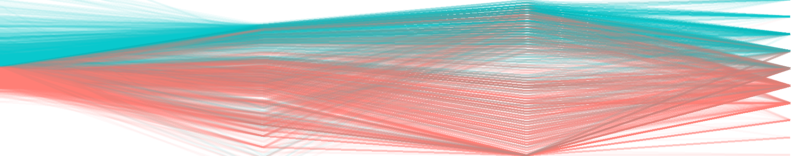
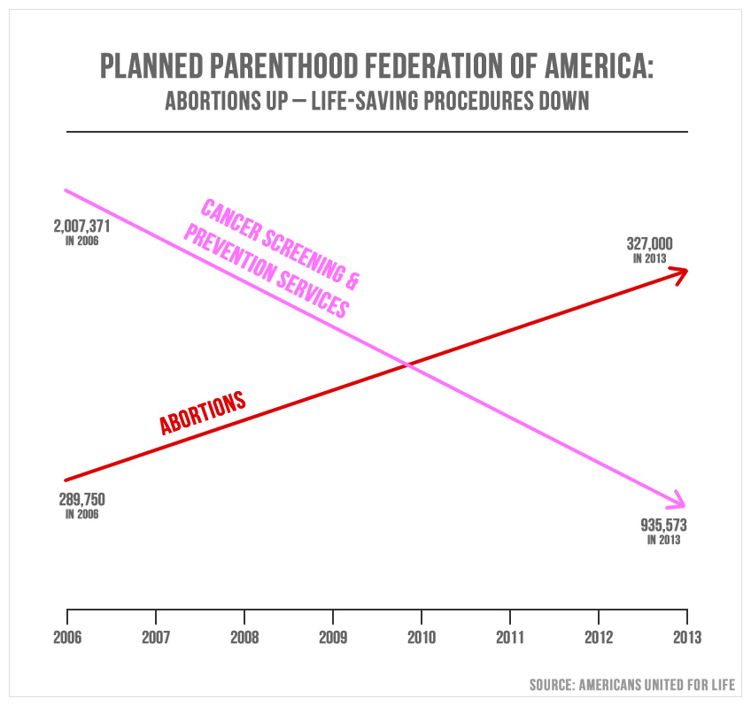
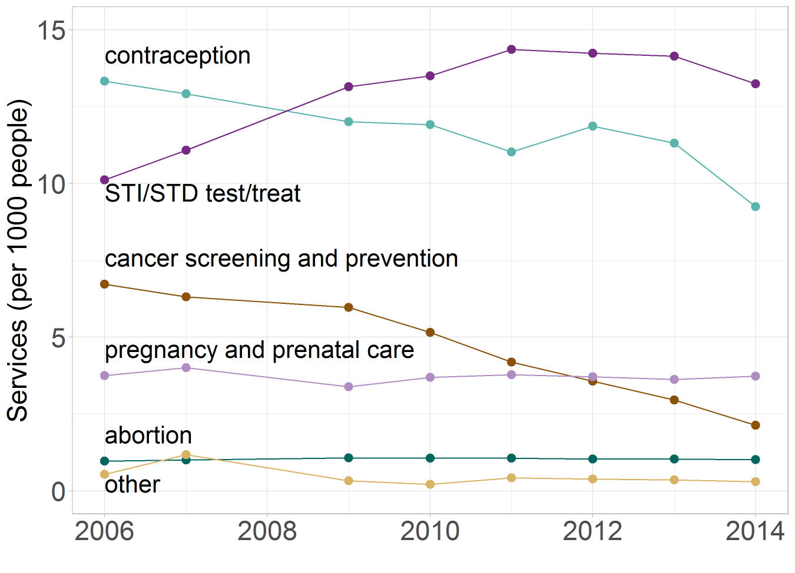

about the course
================

<small>   <i>Ames Iowa Housing</i>, a parallel-coordinate plot
adapted from <a href="https://uc-r.github.io/gda">Visual data
exploration</a> by Bradley Boehmke.   </small>

## contents

[course description](#course-description)  
[about the software](#about-the-software)  
[about visual rhetoric](#about-visual-rhetoric)  
[references](#references)

## course description

*Visualizing Data* is about creating truthful and compelling data
visuals. We study elements of statistical analysis, programming in R,
human perception, graphic design, and visual rhetoric and ethics. After
successfully completing this course, students should be able to design
effective and truthful data displays, credibly explain their design
rationale, produce publication-quality visuals, and credibly critique a
data display.

The class is designed for the R novice. Prior experience with any
programming language is helpful though not necessary.

For more information, see the [course
syllabus](cm001-course-syllabus.md#syllabus).

## about the software

R is an open source language and environment for statistical computing
and graphics (R Core Team, [2018](#ref-R:2018)), ranked by IEEE in 2018
as the 7th most popular programming language (Python, C++, and Java are
the top three) (Cass, [2018](#ref-Cass:2018)). If you are new to R, some
of its best features, paraphrasing Wickham ([2014](#ref-Wickham:2014)),
are:

  - R is free, open source, and available on every major platform,
    making it easy for others to replicate your work.
  - The variety of R packages (more than 13,750 as of 2019-03-22), many
    of them cutting edge tools.
  - R packages provide deep-seated support for data analysis, e.g.,
    missing values, data frames, and subsetting.
  - R packages provide powerful tools for communicating results via
    html, pdf, docx, or interactive websites.
  - It is easy to get help from experts in the R community.

RStudio is our basic software environment for using R. RStudio provides
a console, editor, and tools for plotting, history, debugging, and
workspace management as well as access to GitHub for collaboration and
version control (RStudio Team, [2016](#ref-RStudio:2016)).

GitHub is a web-based hosting service for version control using Git. We
will use it for sharing code and as a website for the course and for
student portfolios.

  <a href="#top">▲ top of page</a>

## about visual rhetoric

Students in mathematics, science, and engineering typically have had
years of instruction and practice in verbal rhetoric—speaking and
writing—yet virtually none in visual rhetoric.

Visual rhetoric is one aspect of the broader area of *visual literacy*
that comprises visual thinking, learning, rhetoric, and communication
(Moriarty, [1997](#ref-Moriarty:1997)). In our course, we focus on
visual thinking and communication. I’ll use the term *visual rhetoric*
to mean

  - using graphs as arguments  
  - arranging visual elements and typography in a graph  
  - rhetorical analysis of graphs

To illustrate some aspects of visual rhetoric—what it means to create
truthful and compelling data graphics—I’ll briefly outline the visual
aspects of a deceptive graph and its redesign.

During a Congressional hearing in August 2015, Representative Jason
Chaffetz, then chair of the House Oversight Committee, confronted Cecile
Richards, president of Planned Parenthood, with a graph created by
Americans United for Life (AUL), an organization dedicated to
[restricting women’s reproductive
rights](https://www.theatlantic.com/politics/archive/2015/07/what-pro-life-activists-really-want/398297/)
in the US and abroad. In justifying his attempt to eliminate Planned
Parenthood’s federal funding, Chaffetz stated, “In pink, that’s the
reduction in the breast exams, and the red is the increase in the
abortions. That’s what’s going on in your organization.” His assertion
echoes AUL’s propaganda that [“Planned Parenthood has become Abortion,
Inc.”](https://web.archive.org/web/20180325145518/http://www.aul.org/new-leviathan/)

This graph is deliberately deceptive—a charge Chaffetz
[denied](https://talkingpointsmemo.com/livewire/jason-chaffetz-planned-parenthood-cnn).
Cancer screenings and prevention services are plotted in millions,
abortions are plotted in hundreds of thousands, and no scales are shown.
The use of deceptive visual rhetoric forces a viewer to see a
relationship that isn’t there. (A more detailed analysis of the visual
rhetoric of this lying graph and its redesign is provided in my 2017
[blog post](http://www.graphdoctor.com/archives/1248).)

A different story emerges in my redesign of this graphic in which all
services are shown to the same scale and on a per capita basis. Cancer
screening has indeed dropped off (due to changing medical standards for
cancer screening as well as the passage of the ACA in 2010) while
abortion services have remained fairly constant.

Showing all services provided by Planned Parenthood puts the original
data in context. Abortion-related services consistently represent about
3% of all Planned Parenthood services. The visual argument of the
original graph—that Planned Parenthood is predominantly a
“life-destructive” organization—is contradicted by the very data they
used.

In addition, a different story about a different public health problem
emerges: STI-STD tests and treatments have been steadily and
dramatically increasing, probably correlated to the opioid crisis
coupled with a 40% reduction in state and local STD budgets since 2003
(Prior, [2018](#ref-Prior:2018)).

## references

Cass S (2018) The 2018 top programming languages. *IEEE Spectrum*
<https://spectrum.ieee.org/at-work/innovation/the-2018-top-programming-languages>

Moriarty SE (1997) A conceptual map of visual communication. *Journal of
Visual Literacy* **17**(2), 9–24
<https://doi.org/10.1080/23796529.1997.11674518>

Prior M (2018) *STDs hit record highs again, threatening millions of
America lives.* National Coalition of STD directors
<http://www.ncsddc.org/stds-hit-record-highs-again-threatening-millions-of-american-lives/>

R Core Team (2018) *R: A Language and Environment for Statistical
Computing.* R Foundation for Statistical Computing, Vienna, Austria
<https://www.R-project.org>

RStudio Team (2016) *RStudio: Integrated Development Environment for R.*
RStudio, Inc., Boston, MA <http://www.rstudio.com/>

Wickham H (2014) *Advanced R.* CRC Press, Taylor & Francis Group, Boca
Raton, FL <http://adv-r.had.co.nz/>

***
<a href="#top">&#9650; top of page</a>    
[&#9665; calendar](../README.md#calendar)    
[&#9665; index](../README.md#index)
