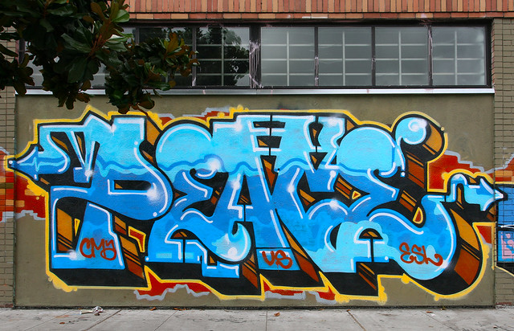

final thoughts
================

 <small>  
<i>Peace</i> by Steve Rotman is licensed under
<a href="https://creativecommons.org/licenses/by-nc-nd/2.0/legalcode">CC
BY-NC-ND 2.0</a>   </small>

When starting a new project

  - Make every project its own R Project  
  - Place a copy of the .Renviron file in the main directory of every
    project  
  - Plan your directory structure  
  - Plan a file-naming scheme

Keep learning

  - Subscribe to [R-bloggers](https://www.r-bloggers.com/)  
  - Apply your graph skills in future technical work

Keep in touch

  - Share any of your graphs with me in the future if you like
  - Send me links to bad graphs

 Richard

***
<a href="#top">&#9650; top of page</a>    
[&#9665; calendar](../README.md#calendar)    
[&#9665; index](../README.md#index)
