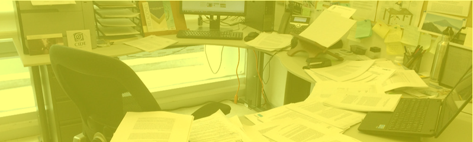

syllabus highlights
================

<small>   <i>Syllabusing</i> by Raul P (cropped) is licensed under
<a href="https://creativecommons.org/licenses/by-nc-nd/2.0/">CC BY-NC-ND
2.0</a>   </small>

  This page covers the syllabus highlights only. For more
information, read the complete
[syllabus](cm001-course-syllabus.md#syllabus)

## contents

[required textbook](#required-textbook)  
[grades](#grades)  
[homework](#homework)  
[lab](#lab)  
[attendance](#attendance)  
[references](#references)

## required textbook

A [web-version](http://r4ds.had.co.nz/) of the book is available at no
cost.  
Hadley Wickham and Garrett Grolemund (2017) *R for Data Science*,
O’Reilly Media.

## grades

Grades are earned based on the [Institute
standards](http://www.rose-hulman.edu/campus-life/student-services/registrar/rules-and-procedures/grades.html),
for example, an

  - “A” is an *honor grade*
  - “B” is awarded for *thorough competence*
  - “C” indicates that *minimum standards have been met*

There are no exams. The major deliverables and their relative weights
are:

  - (70%) Portfolio of data displays and written critiques
  - (15%) Timely written responses to the reading prompts and the
    presentation prompts
  - (15%) Presenting your work and participating in small-group
    discussions

## homework

Steady and productive weekly progress is the key to success in this
course. Weekly assignments include

**Obtaining data**  
with structures appropriate to the assigned display types.

**R practice problems**  
to learn the skills needed to create the portfolio.

**Readings**  
Start several days before the due date early to give yourself time to
reflect on the reading so that our discussions are meaningful.

**Reading responses**  
in writing (typically one every two weeks) completed before class on the
day of discussion. Again, start these reflective pieces early so you
have time to revise and edit.

**Presenting**  
displays D1 through D7 plus written critiques.

  <a href="#top">▲ top of page</a>

## lab

**Labs in weeks 1–3** are structured as 3-hour workshops to cover
essential components of your work.

  - Software studio, week 1
  - Data studio, week 2
  - Portfolio studio, week 3

**Labs in weeks 4–10** are less structured. Students are assigned to
small discussion groups for presenting their weekly portfolio progress.
I meet with each group, one at a time. For the remaining time, students
are free to work on their weekly assignments.

  - (25 min) Weekly presentation and discussion of the display D1–D7 due
    that week
  - (remaining time) Obtaining data, R practice problems, readings,
    reading responses, and working on the portfolio data carpentry,
    graph design, and critiques.

## attendance

Attendance is required for periods in which we have

  - reading discussions
  - small group presentations of weekly data displays D1–D7

The penalty for missing more than two of these periods without a valid
excuse is a one-letter-grade course grade reduction.

  <a href="#top">▲ top of page</a>

## references

***
<a href="#top">&#9650; top of page</a>    
[&#9665; calendar](../README.md#calendar)    
[&#9665; index](../README.md#index)
