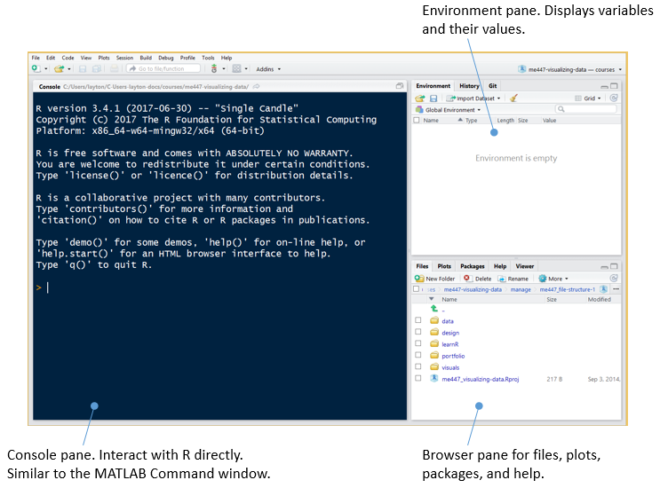
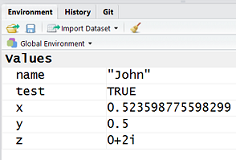
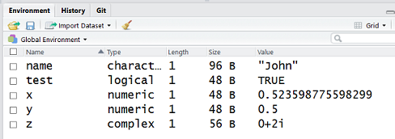
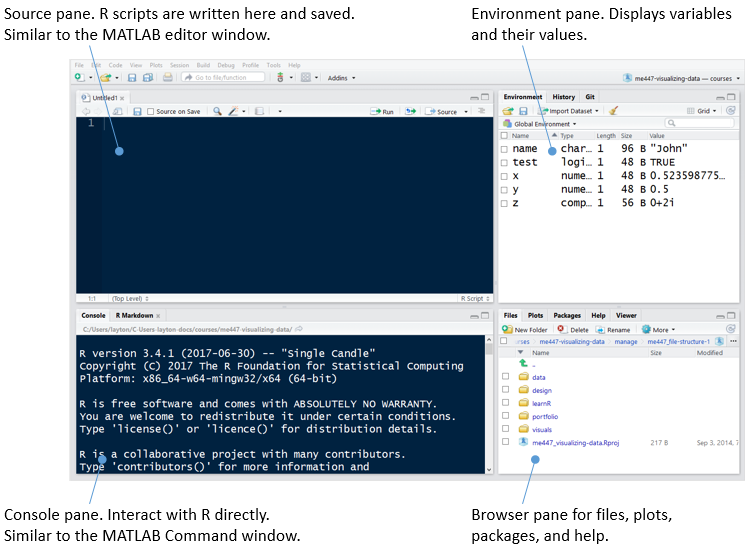
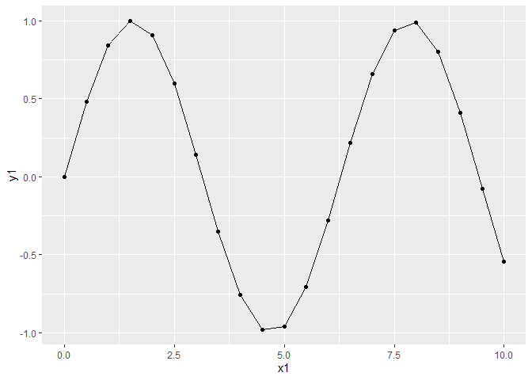

interacting with R
================

## contents

[prerequisites](#prerequisites)  
[interacting with R in the
console](#interacting-with-r-in-the-console)  
[interacting with R using scripts](#interacting-with-r-using-scripts)

## prerequisites

  - Start every work session by launching `portfolio.Rproj`  
  - Your [project directory
    structure](cm501-proj-m-manage-files.md#plan-the-directory-structure)
    satisfies the course requirements

## interacting with R in the console

The start up panel is shown below. The Console pane is where we can
interact with or query R directly.



Press `Ctrl-L` to clear the console window.

In the console, a command line is indicated by a prompt `>`. The
simplest interaction with R is to type an expression at the prompt and
press Enter. R evaluates the expression and prints the result.

Code that you type is shown without prompts (making it easy for you to
copy and paste code to your own Console or script). The R comment
character is a single hash `#`.

    # type this code in your Console to create a vector
    x <- 1:10
    print(x)

The results of running the code (the output) is denoted with `#>`

    #>  [1]  1  2  3  4  5  6  7  8  9 10

Input and output together look like this:

``` r
# type this in your Console
y <- seq(5, 100, by = 5)
print(y)
#>  [1]   5  10  15  20  25  30  35  40  45  50  55  60  65  70  75  80  85
#> [18]  90  95 100
```

In the output, a number in brackets is the row number of the first
element displayed in that line of output. For example,

`[1]` indicates that 5 is the 1st element of array *y*<br> `[18]`
indicates that 90 is the the 18th element of *y*

Type the following expressions in the R console and view the results.
(Your results should match mine except for the double hash mark I use to
indicate a line of output.)

``` r
# type this in your Console
2 + 3
#> [1] 5

2 ^ 3
#> [1] 8

abs(-4)
#> [1] 4
```

The exponential function is `exp()`.

``` r
# type this in your Console
exp(2)
#> [1] 7.389056
```

The base *e* logarithm function is `log()`.

``` r
# type this in your Console
log(10)
#> [1] 2.302585

log(exp(2))
#> [1] 2
```

Base 10 logarithm is `log10()`.

``` r
# type this in your Console
log10(10)
#> [1] 1

log10(1e4)
#> [1] 4
```

The R assignment operators are `<-` or `=`,

``` r
# type this in your Console
x <- pi/6
```

or equivalently,

``` r
x = pi/6
```

Conventional usage is `<-`. As Robert Kabakoff (2011) explains,

> R allows the = sign to be used for object assignments. However, you
> won’t find many programs written that way because it’s not standard
> syntax, there are some situations in which it won’t work, and R
> programmers will make fun of you.

If you use = and it works, I will not make fun of you.

When making assignments, no output appears in the console. To see the
value of the variable, type its name,

``` r
# type this in your Console
x
#> [1] 0.5235988
```

or use `print()`

``` r
# type this in your Console
print(x)
#> [1] 0.5235988
```

The default unit for angular measure is radians.

``` r
# type this in your Console
y <- sin(x)
y
#> [1] 0.5
```

R recognizes four types of variables: numeric, character, logical, and
complex.

``` r
# type this in your Console
name <- "John"
test <- TRUE
z    <- 0 + 2i
```

The RStudio Environment pane lists the variables in the workspace and
their values.



In the corner of the Environment pane, use the pull-down menu to change
”List” to ”Grid” to list the variable names, values, and types.



To list variables using the console, use `ls()`,

``` r
# type this in your Console
ls()
#> [1] "name" "test" "x"    "y"    "z"
```

To list the variables, values, and types, use `ls.str()`

``` r
# type this in your Console
ls.str()
#> name :  chr "John"
#> test :  logi TRUE
#> x :  num 0.524
#> y :  num 0.5
#> z :  cplx 0+2i
```

**Variable names in R** must start with a letter (A-Z) or (a-z). Names
can include letters, digits (0-9), dots (.), and underscores (\_). R is
case-sensitive.

In the typeface used in R and RStudio, a lowercase ell, `l`, and the
number one, `1`, can be hard to distinguish. I suggest that if a
variable name begins with an ell, consider using the full word or the
capital letter. For example, the variable names `length` or `L` would be
preferable to `l`.

## interacting with R using scripts

A script is a file of R commands. To start a new R script, use *File \>
New File \> R Script*.



Save the script in the *explore* folder using the filename

    0204-more-R-basics-explore.R

*File \> Save As…*

My suggested file naming for tutorials

  - starts with a 4-digit number `wwdd` where `ww` is the week of the
    assignment (01, 02, …, 10) and `dd` is the day (01, 02, 03, 04)  
  - using hyphen separation, a word or two that describes the work
  - ending with `-explore.R`

The open R-script file is shown in the Source pane. This is where we
write, edit, and execute R scripts.

Start your script with a minimal header, such as

    # interacting with R 
    # your name
    # date

As you work through the exercises below, add your lines of code to this
file.

Execute the file (run the program) by clicking the *Source* button.

``` r
# packages
library("tidyverse")
```

In your script, create an array  using the `seq()` function.

``` r
# create an array 0, 1, 2, ..., 10
x1 <- seq(from = 0, to = 10, by = 0.5)
```

In a function, arguments are assigned values in an `argument = value`
format. Using the equal sign in this way is conventional R syntax.

Again, press Source to execute the file. The variable
 should appear in
the Environment pane.

When debugging scripts it is often useful to execute just one line of
code at a time.

  - In the script, place your cursor on any line
  - Press the Run button (or Ctrl Enter) to execute the line

To summarize our two methods of executing lines of script:

1.  *Run* to execute one line at a time.
2.  *Source* to execute an entire script.

Add to your script
") assigned to variable
.

``` r
# create a second array that is a function of the first
y1 <- sin(x1)
```

Graph it.

``` r
# put the two variables in a data frame
df <- tibble(x1, y1)

# plot y1 as a function of x1
ggplot(df, aes(x = x1, y = y1)) +
    geom_point() +
    geom_line()
```



Click Source and the graph should appear in the Plots pane.

## references

<div id="refs">

</div>

***
<a href="#top">&#9650; top of page</a>    
[&#9665; calendar](../README.md#calendar)    
[&#9665; index](../README.md#index)
