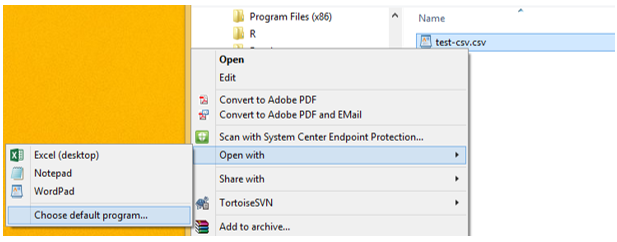

data studio
================

 <small>
  <i>Migrant Pea Picker’s Makeshift Home, Nipomo, California</i> is
licensed under
<a href="https://creativecommons.org/publicdomain/zero/1.0/legalcode">CC0
1.0</a>   </small>

## contents

[prerequisites](#prerequisites)  
[advice from prior years’ students](#advice-from-prior-years-students)  
[classify your data structure](#classify-your-data-structure)  
[data basics](#data-basics)  
[use Notepad for CSV files](#use-notepad-for-csv-files)  
[workflow basics](#workflow-basics)  
[data transformation](#data-transformation)  
[data import](#data-import)  
[optional tutorials](#optional-tutorials)  
[data sources](#data-sources)  
[references](#references)

## prerequisites

Project setup

  - Start every work session by launching the RStudio Project file for
    the course, e.g., `portfolio.Rproj`  
  - Ensure your [project directory
    structure](cm501-proj-m-manage-files.md#planning-the-directory-structure)
    satisfies the course requirements

Ensure you have installed the following packages. See [install
packages](cm902-software-studio.md#install-packages) for instructions if
needed.

  - [**tidyverse**](http://tidyverse.tidyverse.org): The ‘tidyverse’ is
    a set of packages that work in harmony because they share common
    data representations and ‘API’ design. This package is designed to
    make it easy to install and load multiple ‘tidyverse’ packages in a
    single step. Learn more about the ‘tidyverse’ at
    <https://tidyverse.org>.
  - [**nycflights13**](http://github.com/hadley/nycflights13): Airline
    on-time data for all flights departing NYC in 2013. Also includes
    useful ‘metadata’ on airlines, airports, weather, and planes.

  <a href="#top">▲ top of page</a>

## advice from prior years’ students

At the conclusion of the course last time, I asked my students what they
wish they had done differently to make their work in this course less
stressful.

They replied,

  - Get the data sooner. Seriously.
  - Creating the graph is easy. The data carpentry takes most of the
    time. Do the data carpentry early.
  - Look for data that is interesting, but if you can’t find it, let it
    go.
  - After the graph presentations in lab, start the editing
    immediately—otherwise you will forget much of the detail of the
    feedback.

<a href="#top">▲ top of page</a>

## classify your data structure

Every graph in your portfolio has a specific data structure, summarized
in the [portfolio data
summary](cm301-report-display-reqts.md#portfolio-display-requirements).
As you look for data—both for practice and for the final display—know
the data structure you are looking for.

When you think you have a data set suitable for a particular graph type,
classify its structure, i.e.,

  - determine the number of observations  
  - determine the number of variables  
  - classify every variable as quantitative or categorical  
  - determine the number of levels in every categorical variable  
  - classify every categorical variables as ordinal or nominal  
  - classify every quantitative variable as continuous or discrete  
  - other features, if any, relevant to the particular display type, for
    example, a Sankey diagram requires identification of nodes and links

State specifically how each data requirements has been met. This summary
will be part of the prose description that accompanies each graph in the
portfolio.

  <a href="#top">▲ top of page</a>

## data basics

The link to the [data basics](../slides/sd021-data-basics.pdf) material
we covered in a previous session, for reference.

## use Notepad for CSV files

We regularly store data in CSV files.

On a Windows machine, MSExcel is typically the default software for
opening CSV files. Unfortunately, Excel can alter the data in unexpected
ways, so we need to change the default.

**Assignment**

Open Excel. Use Save As… and select the CSV option.

In the `data-raw` directory, save the empty file as `test.csv` using CSV
(Comma delimited) (\*.csv) from the menu.

Close the Excel file. In Explorer, find the file. Right-click and select
*Open with…*, then *Choose default program …*. In the dialog box, select
*Notepad* or any other text-only package.

From now on, when you open a CSV file, it will default to Notepad, and
not alter the data. You can still open the CSV in Excel if you wish with
a right-click on the file, open with, and choose Excel.

  <a href="#top">▲ top of page</a>

## workflow basics

From the text (Wickham and Grolemund,
[2017](#ref-Wickham+Grolemund:2017)), read the following sections and do
the exercises indicated

[4.1 Coding
basics](https://r4ds.had.co.nz/workflow-basics.html#coding-basics)  
[4.2 What’s in a
name?](https://r4ds.had.co.nz/workflow-basics.html#whats-in-a-name)  
[4.3 Calling
functions](https://r4ds.had.co.nz/workflow-basics.html#calling-functions)

  - Exercise
    [4.4.1](https://r4ds.had.co.nz/workflow-basics.html#practice)  
  - Exercise
    [4.4.2](https://r4ds.had.co.nz/workflow-basics.html#practice)  
  - Exercise
    [4.4.3](https://r4ds.had.co.nz/workflow-basics.html#practice)

## data transformation

From the text, read the following sections and do the exercises
indicated

[5.1 Data
transformation](https://r4ds.had.co.nz/transform.html#introduction-2)  
[5.2
filter()](https://r4ds.had.co.nz/transform.html#filter-rows-with-filter)  
[5.3
arrange()](https://r4ds.had.co.nz/transform.html#arrange-rows-with-arrange)  
[5.4 select()](https://r4ds.had.co.nz/transform.html#select)  
[5.5
mutate()](https://r4ds.had.co.nz/transform.html#add-new-variables-with-mutate)

  - Exercise
    [5.2.4](https://r4ds.had.co.nz/transform.html#exercises-7)  
  - Exercise [5.3.1](https://r4ds.had.co.nz/transform.html#exercises-8)
    problems 2, 3, 4  
  - Exercise
    [5.4.1](https://r4ds.had.co.nz/transform.html#exercises-9)  
  - Exercise [5.5.2](https://r4ds.had.co.nz/transform.html#exercises-10)

  <a href="#top">▲ top of page</a>

## data import

From the text, skim the following sections.

[11.1 Data
import](https://r4ds.had.co.nz/data-import.html#getting-started)  
[11.2 Getting
started](https://r4ds.had.co.nz/data-import.html#getting-started)  
[11.5 Writing to a
file](https://r4ds.had.co.nz/data-import.html#writing-to-a-file)  
[11.6 Other types of
data](https://r4ds.had.co.nz/data-import.html#other-types-of-data)

## optional tutorials

Browse these tutorials by Jenny Bryan for another perspective on
obtaining public data

[Getting data from the web
part 1](https://github.com/STAT545-UBC/STAT545-UBC.github.io/blob/master/webdata02_activity.md)  
[Getting data from the web
part 2](https://github.com/STAT545-UBC/STAT545-UBC.github.io/blob/master/webdata03_activity.md)

## data sources

Go to our [data sources page](cm108-data-sources.md#data-sources) for a
list of links to public data. Begin exploring the data available and
selecting data you can use in your portfolio.

  <a href="#top">▲ top of page</a>

## references

Wickham H and Grolemund G (2017) *R for Data Science.* O’Reilly Media,
Inc., Sebastopol, CA <https://r4ds.had.co.nz/>

***
<a href="#top">&#9650; top of page</a>    
[&#9665; calendar](../README.md#calendar)    
[&#9665; index](../README.md#index)
