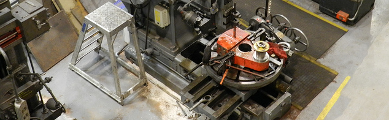
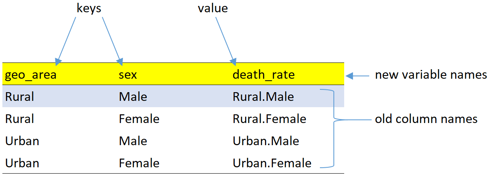
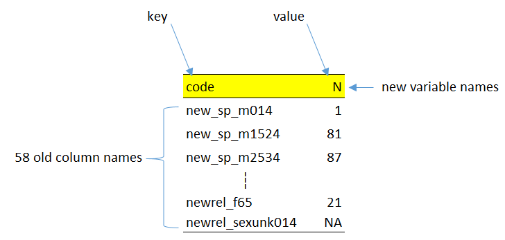
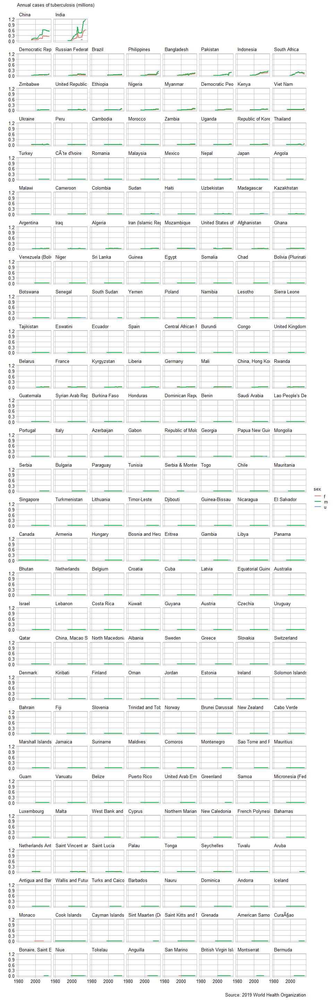
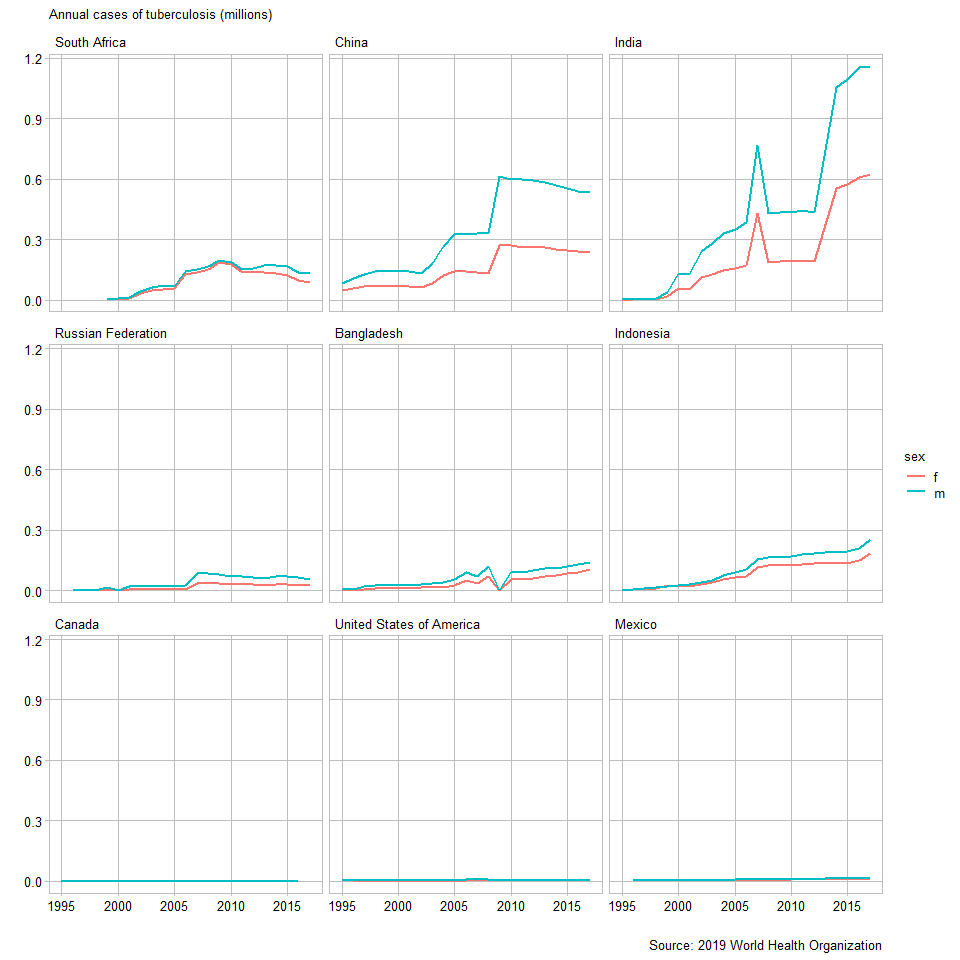
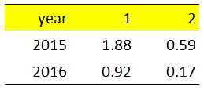

reshaping data
================

 <small> <br>
<i>NRM Shaper</i> by KillamarshianUK is licensed under
<a href="https://creativecommons.org/licenses/by/2.0/legalcode">CC BY
2.0</a> <br> </small>

## contents

[prerequisites](#prerequisites)  
[data in row names](#data-in-row-names)  
[keys and values in coordinatized
data](#keys-and-values-in-coordinatized-data)  
[rowrecs\_to\_blocks()](#rowrecs_to_blocks)  
[blocks\_to\_rowrecs()](#blocks_to_rowrecs)  
[WHO case study in data reshaping](#who-case-study-in-data-reshaping)  
[web download using import()](#web-download-using-import)  
[WHO data encoding](#who-data-encoding)  
[select with matches()](#select-with-matches)  
[unpivot\_to\_blocks()](#unpivot_to_blocks)  
[drop\_na()](#drop_na)  
[str\_replace()](#str_replace)  
[separate()](#separate)  
[group\_summarize()](#group_summarize)  
[WHO graphs](#who-graphs)  
[exercises](#exercises)  
[references](#references)

## prerequisites

Project setup

  - Start every work session by launching the RStudio Project file for
    the course, e.g., `portfolio.Rproj`  
  - Ensure your [project directory
    structure](cm501-proj-m-manage-files.md#planning-the-directory-structure)
    satisfies the course requirements

Ensure you have installed the following packages. See [install
packages](cm902-software-studio.md#install-packages) for instructions if
needed.

  - [**tidyverse**](http://tidyverse.tidyverse.org): The ‘tidyverse’ is
    a set of packages that work in harmony because they share common
    data representations and ‘API’ design. This package is designed to
    make it easy to install and load multiple ‘tidyverse’ packages in a
    single step. Learn more about the ‘tidyverse’ at
    <https://tidyverse.org>.
  - [**graphclassmate**](https://github.com/graphdr/graphclassmate): An
    R package with companion materials for a course in data
    visualization. The package provides data sets structured for a
    variety of graph types plus a ggplot2 theme.  
  - [**cdata**](https://github.com/WinVector/cdata/): Supplies
    higher-order fluid data transform operators that include pivot and
    anti-pivot as special cases. The methodology is describe in ‘Zumel’,
    2018, “Fluid data reshaping with ‘cdata’”,
    <http://winvector.github.io/FluidData/FluidDataReshapingWithCdata.html>
    , <doi:10.5281/zenodo.1173299> . Works on in-memory data or on
    remote data using ‘rquery’ and the ‘DBI’ database interface.
  - [**wrapr**](https://github.com/WinVector/wrapr): Tools for writing
    and debugging R code. Provides: ‘let()’ (converts non-standard
    evaluation interfaces to parametric standard evaluation interfaces,
    inspired by ‘gtools:strmacro()’ and ‘base::bquote()’), ‘%.\>%’
    dot-pipe (an ‘S3’ configurable pipe),
    ‘build\_frame()’/‘draw\_frame()’ (‘data.frame’ example tools),
    ‘qc()’ (quoting concatenate), ‘:=’ (named map builder), and more.
  - [**seplyr**](https://github.com/WinVector/seplyr/): The ‘seplyr’
    (standard evaluation plying) package supplies improved standard
    evaluation adapter methods for important common ‘dplyr’ data
    manipulation tasks. In addition the ‘seplyr’ package supplies
    several new “key operations bound together” methods. These include
    ‘group\_summarize()’ (which combines grouping, arranging and
    calculation in an atomic unit), ‘add\_group\_summaries()’ (which
    joins grouped summaries into a ‘data.frame’ in a well documented
    manner), ‘add\_group\_indices()’ (which adds per-group identifiers
    to a ‘data.frame’ without depending on row-order),
    ‘partition\_mutate\_qt()’ (which optimizes mutate sequences), and
    ‘if\_else\_device()’ (which simulates per-row if-else blocks in
    expression sequences).
  - [**rio**](https://github.com/leeper/rio): Streamlined data import
    and export by making assumptions that the user is probably willing
    to make: ‘import()’ and ‘export()’ determine the data structure from
    the file extension, reasonable defaults are used for data import and
    export (e.g., ‘stringsAsFactors=FALSE’), web-based import is
    natively supported (including from SSL/HTTPS), compressed files can
    be read directly without explicit decompression, and fast import
    packages are used where appropriate. An additional convenience
    function, ‘convert()’, provides a simple method for converting
    between file types.
  - [**feather**](https://github.com/wesm/feather): Read and write
    feather files, a lightweight binary columnar data store designed for
    maximum speed.

Create a new script `explore/0401-data-reshape-VADeaths.R` for today’s
work, write a minimal header and load the packages:

``` r
# reshape VA deaths data   
# your name
# date

# load packages
library("tidyverse")
library("cdata")
library("wrapr")
library("seplyr")
```

<br> <a href="#top">▲ top of page</a>

## data in row names

We’ll revisit the `VADeaths` dataset, part of the base R installation.

``` r
# load the data
data(VADeaths)

# what nature of R object is it? 
class(VADeaths)
#> [1] "matrix"

# print it
print(VADeaths)
#>       Rural Male Rural Female Urban Male Urban Female
#> 50-54       11.7          8.7       15.4          8.4
#> 55-59       18.1         11.7       24.3         13.6
#> 60-64       26.9         20.3       37.0         19.3
#> 65-69       41.0         30.9       54.6         35.1
#> 70-74       66.0         54.3       71.1         50.0
```

The data are in a matrix (not a data frame) and it looks like the age
groups are in the row names. To check, use `row.names()`.

``` r
row.names(VADeaths)
#> [1] "50-54" "55-59" "60-64" "65-69" "70-74"
```

Having data saved in the row names is something to watch out for when
dealing with data in base R or in R packages. When you find such data,
one of your first steps is to move the data stored in the row names to a
new column in the data frame.

As you know, we work almost exclusively with data frames (or tibbles),
so we will want to convert this matrix to a tibble. However, if we do,
we lose the information in the row names

``` r
as_tibble(VADeaths) %>% 
        print()
#> # A tibble: 5 x 4
#>   `Rural Male` `Rural Female` `Urban Male` `Urban Female`
#>          <dbl>          <dbl>        <dbl>          <dbl>
#> 1         11.7            8.7         15.4            8.4
#> 2         18.1           11.7         24.3           13.6
#> 3         26.9           20.3         37             19.3
#> 4         41             30.9         54.6           35.1
#> 5         66             54.3         71.1           50
```

Instead, we convert the matrix to a data frame using the base R
`data.frame()` function, which conserves the data in the row names,

``` r
VA_deaths <- data.frame(VADeaths) %>% 
        print()
#>       Rural.Male Rural.Female Urban.Male Urban.Female
#> 50-54       11.7          8.7       15.4          8.4
#> 55-59       18.1         11.7       24.3         13.6
#> 60-64       26.9         20.3       37.0         19.3
#> 65-69       41.0         30.9       54.6         35.1
#> 70-74       66.0         54.3       71.1         50.0
```

Then create a new variable for the row names using
`tibble::rownames_to_column()`.

``` r
VA_deaths <- VA_deaths %>% 
        rownames_to_column("age_group") %>% 
        print()
#>   age_group Rural.Male Rural.Female Urban.Male Urban.Female
#> 1     50-54       11.7          8.7       15.4          8.4
#> 2     55-59       18.1         11.7       24.3         13.6
#> 3     60-64       26.9         20.3       37.0         19.3
#> 4     65-69       41.0         30.9       54.6         35.1
#> 5     70-74       66.0         54.3       71.1         50.0
```

The row names have been replaced with the conventional integers. Note
also that the spaces in the columns names are replaced with periods.

<br> <a href="#top">▲ top of page</a>

## keys and values in coordinatized data

[John Mount and Nina
Zumel](http://winvector.github.io/FluidData/FluidDataReshapingWithCdata.html)
argue that we should distinguish between data layout and data semantics:

**data layout**: whether data is organized in rows, columns, or even
separate tables  
**data semantics**: which items of data logically belong together

Understanding the difference can help us convert between one layout and
another. The reshaping we will most often encounter converts data
between row-oriented and column-oriented layouts.

Consider the VA deaths data frame. The first row shows all data values
for people in the 50–54 age group. Subsequent rows are organized by
successive age groups. Each row is a row-record—information that
logically belongs together.

    #>   age_group Rural.Male Rural.Female Urban.Male Urban.Female
    #> 1     50-54       11.7          8.7       15.4          8.4
    #> 2     55-59       18.1         11.7       24.3         13.6
    #> 3     60-64       26.9         20.3       37.0         19.3
    #> 4     65-69       41.0         30.9       54.6         35.1
    #> 5     70-74       66.0         54.3       71.1         50.0

To graph these data using ggplot2, we need the data in tidy form. This
is a case of an algorithm (ggplot2) that is “sensitive to how data is
arranged in rows and columns, so there is a need to convert between
representations” (Mount and Zumel,
[2019](#ref-Mount+Zumel:2019:fluid-data)[a](#ref-Mount+Zumel:2019:fluid-data)).
To reshape the data into tidy form, we:

  - add two new categorical variables `sex` (levels: male and female)
    and `geo_area` (levels: rural and urban)  
  - collect the numerical death rates in a single quantitative variable
    `death_rate`  
  - repeat the age groups as many as times as necessary

<!-- end list -->

    #>    age_group geo_area    sex death_rate
    #> 1      50-54    Rural   Male       11.7
    #> 2      50-54    Rural Female        8.7
    #> 3      50-54    Urban   Male       15.4
    #> 4      50-54    Urban Female        8.4
    #> 5      55-59    Rural   Male       18.1
    #> 6      55-59    Rural Female       11.7
    #> 7      55-59    Urban   Male       24.3
    #> 8      55-59    Urban Female       13.6
    #> 9      60-64    Rural   Male       26.9
    #> 10     60-64    Rural Female       20.3
    #> 11     60-64    Urban   Male       37.0
    #> 12     60-64    Urban Female       19.3
    #> 13     65-69    Rural   Male       41.0
    #> 14     65-69    Rural Female       30.9
    #> 15     65-69    Urban   Male       54.6
    #> 16     65-69    Urban Female       35.1
    #> 17     70-74    Rural   Male       66.0
    #> 18     70-74    Rural Female       54.3
    #> 19     70-74    Urban   Male       71.1
    #> 20     70-74    Urban Female       50.0

The original row-record of each age group is now laid out as a block of
rows. For example, the original 50-54 row record is now laid out in the
first four rows of the reshaped data frame.

This layout also highlights that we have three **key** columns—age,
geographical area, and sex—that together uniquely identify a death rate
**value**. Unique combinations of the keys are the “coordinates” of
unique data values.

These data are **coordinatized** regardless of the layout. Look again at
the original data frame. Every death rate has the same coordinates
(keys) as in the tidy layout. A unique combination of age, area, and sex
still identify a unique data value. Thus we can think of the concept of
*coordinatized data* as being invariant across layout transformations.

    #>   age_group Rural.Male Rural.Female Urban.Male Urban.Female
    #> 1     50-54       11.7          8.7       15.4          8.4
    #> 2     55-59       18.1         11.7       24.3         13.6
    #> 3     60-64       26.9         20.3       37.0         19.3
    #> 4     65-69       41.0         30.9       54.6         35.1
    #> 5     70-74       66.0         54.3       71.1         50.0

Summary of new concepts

  - keys and values in coordinatized data
  - records in rows (row-oriented layout)
  - records in blocks (column-oriented layout)

<br> <a href="#top">▲ top of page</a>

## rowrecs\_to\_blocks()

We will use `rowrecs_to_blocks()` function from the cdata package to
reshape data from row-oriented to column oriented layout.
`rowrecs_to_blocks()` is similar to `tidyr::gather()`, but generalized.

For reference, let’s view the row-oriented data layout we created
earlier,

``` r
VA_deaths
#>   age_group Rural.Male Rural.Female Urban.Male Urban.Female
#> 1     50-54       11.7          8.7       15.4          8.4
#> 2     55-59       18.1         11.7       24.3         13.6
#> 3     60-64       26.9         20.3       37.0         19.3
#> 4     65-69       41.0         30.9       54.6         35.1
#> 5     70-74       66.0         54.3       71.1         50.0
```

We have to design the layout we want, that is,

  - a new column called `geo_area` that will contain the values (levels
    of the category) `Rural` and `Urban`
  - a new column called `sex` that will contain the values (levels of
    the category) `Female` and `Male`
  - a new column called `death_rate` to contain the quantitative death
    rate data



One row is highlighted to show how the levels of the two categories
(`Rural` and `Male`) are the coordinates of the data value
(`Rural.Male`) from the original data frame. The table has four rows
because there are four combinations of keys that point to the original
column names `Rural.Male`, `Rural.Female`, etc. The `age_group` variable
is not shown because it is already a key column; its entries will get
repeated but not otherwise transformed when we reshape the layout.

This table is the *control table* for reshaping the data; we create it
using the `wrapr::build_frame()` function.

``` r
control_table <- wrapr::build_frame(
        "geo_area",  "sex",     "death_rate"   |
        "Rural",     "Male",    "Rural.Male"   |
        "Rural",     "Female",  "Rural.Female" |
        "Urban",     "Male",    "Urban.Male"   |
        "Urban",     "Female",  "Urban.Female"
        )
```

The control table is one of the arguments in the
`cdata::rowrecs_to_blocks()` function.

``` r
VA_tall <- rowrecs_to_blocks(
        wideTable        = VA_deaths,
        controlTable     = control_table,
        controlTableKeys = c("geo_area", "sex"),
        columnsToCopy    = c("age_group")
        )
```

Arguments:

  - `wideTable` data frame to be reshaped  
  - `controlTable` table that specifies the reshaping  
  - `controlTableKeys` column names of the control table that are keys  
  - `columnsToCopy` column names (keys) in the original data frame that
    are copied

The output `VA_tall` is the reshaped (tidy) data frame with its records
in blocks.

``` r
kable(VA_tall)
```

| age\_group | geo\_area | sex    | death\_rate |
| :--------- | :-------- | :----- | ----------: |
| 50-54      | Rural     | Male   |        11.7 |
| 50-54      | Rural     | Female |         8.7 |
| 50-54      | Urban     | Male   |        15.4 |
| 50-54      | Urban     | Female |         8.4 |
| 55-59      | Rural     | Male   |        18.1 |
| 55-59      | Rural     | Female |        11.7 |
| 55-59      | Urban     | Male   |        24.3 |
| 55-59      | Urban     | Female |        13.6 |
| 60-64      | Rural     | Male   |        26.9 |
| 60-64      | Rural     | Female |        20.3 |
| 60-64      | Urban     | Male   |        37.0 |
| 60-64      | Urban     | Female |        19.3 |
| 65-69      | Rural     | Male   |        41.0 |
| 65-69      | Rural     | Female |        30.9 |
| 65-69      | Urban     | Male   |        54.6 |
| 65-69      | Urban     | Female |        35.1 |
| 70-74      | Rural     | Male   |        66.0 |
| 70-74      | Rural     | Female |        54.3 |
| 70-74      | Urban     | Male   |        71.1 |
| 70-74      | Urban     | Female |        50.0 |

<br> <a href="#top">▲ top of page</a>

## blocks\_to\_rowrecs()

The transformation can be reversed using the same control table and the
`cdata::blocks_to_rowrecs()` function. `blocks_to_rowrecs()` is similar
to `tidyr::spread()` but generalized.

``` r
VA_wide <- blocks_to_rowrecs(
        tallTable        = VA_tall,
        controlTable     = control_table,
        controlTableKeys = c("geo_area", "sex"), 
        keyColumns       = c("age_group")
)
```

The new arguments:

  - `tallTable` data frame to be reshaped  
  - `keyColumns` column that defines the new row groups

The result:

``` r
kable(VA_wide)
```

| age\_group | Rural.Male | Rural.Female | Urban.Male | Urban.Female |
| :--------- | ---------: | -----------: | ---------: | -----------: |
| 50-54      |       11.7 |          8.7 |       15.4 |          8.4 |
| 55-59      |       18.1 |         11.7 |       24.3 |         13.6 |
| 60-64      |       26.9 |         20.3 |       37.0 |         19.3 |
| 65-69      |       41.0 |         30.9 |       54.6 |         35.1 |
| 70-74      |       66.0 |         54.3 |       71.1 |         50.0 |

To confirm that we have indeed recaptured the original form, compare the
the original data frame `VA_deaths` and the new `VA_wide` data frame
using `dplyr::all_equal()`.

``` r
dplyr::all_equal(VA_deaths, VA_wide)
#> [1] TRUE
```

<br> <a href="#top">▲ top of page</a>

## WHO case study in data reshaping

I adapted this study from the [Data
Tidying](http://garrettgman.github.io/tidying/) a chapter in our text.
I’m following much of their work but have updated the dataset to use
the [2019 case notifications
data](http://www.who.int/tb/country/data/download/en/) data from the
World Health Organization.

Create a new script `explore/0401-data-reshape-who-TB.R`, write a
minimal header and load the packages:

``` r
# reshape World Health Organization tuberculosis data   
# your name
# date

# load packages
library("tidyverse")
library("graphclassmate")
library("cdata")
library("wrapr")
library("rio")
```

<br> <a href="#top">▲ top of page</a>

## web download using import()

The data are in a CSV file on the World Health Organization website. The
following code will download the data and write it to your `data-raw`
directory. \`

``` r
# using rio to read and write 
who_url <- "https://extranet.who.int/tme/generateCSV.asp?ds=notifications"
who     <- rio::import(who_url, format = "csv")
rio::export(who, "data-raw/TB-notifications.csv", )
```

This code chunk only has to be run one time. If you paste in your R
script, comment it out after running it once.

If you have any issues, you can download the CSV file manually from the
WHO data site. Look for the link labeled [Download case
notifications](http://www.who.int/tb/country/data/download/en/).

**First look at the data**

``` r
# read the CSV file 
who <- read.csv("data-raw/TB-notifications.csv") %>% 
        as_tibble() %>% 
        print()
#> # A tibble: 8,070 x 163
#>    country iso2  iso3  iso_numeric g_whoregion  year new_sp new_sn new_su
#>    <fct>   <fct> <fct>       <int> <fct>       <int>  <int>  <int>  <int>
#>  1 Afghan~ AF    AFG             4 EMR          1980     NA     NA     NA
#>  2 Afghan~ AF    AFG             4 EMR          1981     NA     NA     NA
#>  3 Afghan~ AF    AFG             4 EMR          1982     NA     NA     NA
#>  4 Afghan~ AF    AFG             4 EMR          1983     NA     NA     NA
#>  5 Afghan~ AF    AFG             4 EMR          1984     NA     NA     NA
#>  6 Afghan~ AF    AFG             4 EMR          1985     NA     NA     NA
#>  7 Afghan~ AF    AFG             4 EMR          1986     NA     NA     NA
#>  8 Afghan~ AF    AFG             4 EMR          1987     NA     NA     NA
#>  9 Afghan~ AF    AFG             4 EMR          1988     NA     NA     NA
#> 10 Afghan~ AF    AFG             4 EMR          1989     NA     NA     NA
#> # ... with 8,060 more rows, and 154 more variables: new_ep <int>,
#> #   new_oth <int>, ret_rel <int>, ret_taf <int>, ret_tad <int>,
#> #   ret_oth <int>, newret_oth <int>, new_labconf <int>, new_clindx <int>,
#> #   ret_rel_labconf <int>, ret_rel_clindx <int>, ret_rel_ep <int>,
#> #   ret_nrel <int>, notif_foreign <int>, c_newinc <int>, new_sp_m04 <int>,
#> #   new_sp_m514 <int>, new_sp_m014 <int>, new_sp_m1524 <int>,
#> #   new_sp_m2534 <int>, new_sp_m3544 <int>, new_sp_m4554 <int>,
#> #   new_sp_m5564 <int>, new_sp_m65 <int>, new_sp_mu <int>,
#> #   new_sp_f04 <int>, new_sp_f514 <int>, new_sp_f014 <int>,
#> #   new_sp_f1524 <int>, new_sp_f2534 <int>, new_sp_f3544 <int>,
#> #   new_sp_f4554 <int>, new_sp_f5564 <int>, new_sp_f65 <int>,
#> #   new_sp_fu <int>, new_sn_m04 <int>, new_sn_m514 <int>,
#> #   new_sn_m014 <int>, new_sn_m1524 <int>, new_sn_m2534 <int>,
#> #   new_sn_m3544 <int>, new_sn_m4554 <int>, new_sn_m5564 <int>,
#> #   new_sn_m65 <int>, new_sn_m15plus <int>, new_sn_mu <int>,
#> #   new_sn_f04 <int>, new_sn_f514 <int>, new_sn_f014 <int>,
#> #   new_sn_f1524 <int>, new_sn_f2534 <int>, new_sn_f3544 <int>,
#> #   new_sn_f4554 <int>, new_sn_f5564 <int>, new_sn_f65 <int>,
#> #   new_sn_f15plus <int>, new_sn_fu <int>, new_sn_sexunk04 <int>,
#> #   new_sn_sexunk514 <int>, new_sn_sexunk014 <int>,
#> #   new_sn_sexunk15plus <int>, new_ep_m04 <int>, new_ep_m514 <int>,
#> #   new_ep_m014 <int>, new_ep_m1524 <int>, new_ep_m2534 <int>,
#> #   new_ep_m3544 <int>, new_ep_m4554 <int>, new_ep_m5564 <int>,
#> #   new_ep_m65 <int>, new_ep_m15plus <int>, new_ep_mu <int>,
#> #   new_ep_f04 <int>, new_ep_f514 <int>, new_ep_f014 <int>,
#> #   new_ep_f1524 <int>, new_ep_f2534 <int>, new_ep_f3544 <int>,
#> #   new_ep_f4554 <int>, new_ep_f5564 <int>, new_ep_f65 <int>,
#> #   new_ep_f15plus <int>, new_ep_fu <int>, new_ep_sexunk04 <int>,
#> #   new_ep_sexunk514 <int>, new_ep_sexunk014 <int>,
#> #   new_ep_sexunk15plus <int>, new_ep_sexunkageunk <int>,
#> #   rel_in_agesex_flg <int>, newrel_m04 <int>, newrel_m514 <int>,
#> #   newrel_m014 <int>, newrel_m1524 <int>, newrel_m2534 <int>,
#> #   newrel_m3544 <int>, newrel_m4554 <int>, newrel_m5564 <int>,
#> #   newrel_m65 <int>, newrel_m15plus <int>, newrel_mu <int>, ...
```

From `print()` we see we have 8070 observations of 163 variables.

What years are included? This next line uses `select()` to isolate the
year variable (column), then determines the `unique()` values,
transposes the vector `t()`, and prints the unique years in the Console
using `cat()`.

We have all years from 1980 to 2017.

``` r
who %>% select(year) %>% 
        unique() %>% 
        t() %>% 
        cat()
#> 1980 1981 1982 1983 1984 1985 1986 1987 1988 1989 1990 1991 1992 1993 1994 1995 1996 1997 1998 1999 2000 2001 2002 2003 2004 2005 2006 2007 2008 2009 2010 2011 2012 2013 2014 2015 2016 2017
```

<br> <a href="#top">▲ top of page</a>

## WHO data encoding

A data dictionary on the [WHO tuberculosis
website](http://www.who.int/tb/country/data/download/en/) describes the
meaning of the variable names and how they encode additional data.

We’re interested in columns for which the names contain sex and age
information, e.g. `f014` or `m3544`.

  - `f` is female, `m` male, and `sexunk` sex unknown  
  - `014` is the age group, from 0–14 years; other possible levels are
    `1524` 15–24 years; `2534` 25–34 years;; `3544` 35–44 years; `4554`
    45–54 years; `5564` 55–64 years; and `65` 65 years or older.

For our exercise, I’m assuming that all information encoded as
age-groups `04` and `514` is included in data for the age group `014`.

<br> <a href="#top">▲ top of page</a>

## select with matches()

The most distinctive characteristic of the variable names we want are
the sex-age groupings.

We use `dplyr::select()` to select country and year columns plus the
`matches()` argument to select all columns with age group information in
the column name. The argument of `matches()` is a character string of
the age group codes separated by the logical OR `|` character. Thus we
will keep all columns whose column name contains “014” or “1524” or
“2534” etc.

``` r
who <-  who %>% 
        select(country, 
        year, 
        matches("014|1524|2534|3544|4554|5564|65", ignore.case = TRUE))

glimpse(who)
#> Observations: 8,070
#> Variables: 61
#> $ country          <fct> Afghanistan, Afghanistan, Afghanistan, Afghan...
#> $ year             <int> 1980, 1981, 1982, 1983, 1984, 1985, 1986, 198...
#> $ new_sp_m014      <int> NA, NA, NA, NA, NA, NA, NA, NA, NA, NA, NA, N...
#> $ new_sp_m1524     <int> NA, NA, NA, NA, NA, NA, NA, NA, NA, NA, NA, N...
#> $ new_sp_m2534     <int> NA, NA, NA, NA, NA, NA, NA, NA, NA, NA, NA, N...
#> $ new_sp_m3544     <int> NA, NA, NA, NA, NA, NA, NA, NA, NA, NA, NA, N...
#> $ new_sp_m4554     <int> NA, NA, NA, NA, NA, NA, NA, NA, NA, NA, NA, N...
#> $ new_sp_m5564     <int> NA, NA, NA, NA, NA, NA, NA, NA, NA, NA, NA, N...
#> $ new_sp_m65       <int> NA, NA, NA, NA, NA, NA, NA, NA, NA, NA, NA, N...
#> $ new_sp_f014      <int> NA, NA, NA, NA, NA, NA, NA, NA, NA, NA, NA, N...
#> $ new_sp_f1524     <int> NA, NA, NA, NA, NA, NA, NA, NA, NA, NA, NA, N...
#> $ new_sp_f2534     <int> NA, NA, NA, NA, NA, NA, NA, NA, NA, NA, NA, N...
#> $ new_sp_f3544     <int> NA, NA, NA, NA, NA, NA, NA, NA, NA, NA, NA, N...
#> $ new_sp_f4554     <int> NA, NA, NA, NA, NA, NA, NA, NA, NA, NA, NA, N...
#> $ new_sp_f5564     <int> NA, NA, NA, NA, NA, NA, NA, NA, NA, NA, NA, N...
#> $ new_sp_f65       <int> NA, NA, NA, NA, NA, NA, NA, NA, NA, NA, NA, N...
#> $ new_sn_m014      <int> NA, NA, NA, NA, NA, NA, NA, NA, NA, NA, NA, N...
#> $ new_sn_m1524     <int> NA, NA, NA, NA, NA, NA, NA, NA, NA, NA, NA, N...
#> $ new_sn_m2534     <int> NA, NA, NA, NA, NA, NA, NA, NA, NA, NA, NA, N...
#> $ new_sn_m3544     <int> NA, NA, NA, NA, NA, NA, NA, NA, NA, NA, NA, N...
#> $ new_sn_m4554     <int> NA, NA, NA, NA, NA, NA, NA, NA, NA, NA, NA, N...
#> $ new_sn_m5564     <int> NA, NA, NA, NA, NA, NA, NA, NA, NA, NA, NA, N...
#> $ new_sn_m65       <int> NA, NA, NA, NA, NA, NA, NA, NA, NA, NA, NA, N...
#> $ new_sn_f014      <int> NA, NA, NA, NA, NA, NA, NA, NA, NA, NA, NA, N...
#> $ new_sn_f1524     <int> NA, NA, NA, NA, NA, NA, NA, NA, NA, NA, NA, N...
#> $ new_sn_f2534     <int> NA, NA, NA, NA, NA, NA, NA, NA, NA, NA, NA, N...
#> $ new_sn_f3544     <int> NA, NA, NA, NA, NA, NA, NA, NA, NA, NA, NA, N...
#> $ new_sn_f4554     <int> NA, NA, NA, NA, NA, NA, NA, NA, NA, NA, NA, N...
#> $ new_sn_f5564     <int> NA, NA, NA, NA, NA, NA, NA, NA, NA, NA, NA, N...
#> $ new_sn_f65       <int> NA, NA, NA, NA, NA, NA, NA, NA, NA, NA, NA, N...
#> $ new_sn_sexunk014 <int> NA, NA, NA, NA, NA, NA, NA, NA, NA, NA, NA, N...
#> $ new_ep_m014      <int> NA, NA, NA, NA, NA, NA, NA, NA, NA, NA, NA, N...
#> $ new_ep_m1524     <int> NA, NA, NA, NA, NA, NA, NA, NA, NA, NA, NA, N...
#> $ new_ep_m2534     <int> NA, NA, NA, NA, NA, NA, NA, NA, NA, NA, NA, N...
#> $ new_ep_m3544     <int> NA, NA, NA, NA, NA, NA, NA, NA, NA, NA, NA, N...
#> $ new_ep_m4554     <int> NA, NA, NA, NA, NA, NA, NA, NA, NA, NA, NA, N...
#> $ new_ep_m5564     <int> NA, NA, NA, NA, NA, NA, NA, NA, NA, NA, NA, N...
#> $ new_ep_m65       <int> NA, NA, NA, NA, NA, NA, NA, NA, NA, NA, NA, N...
#> $ new_ep_f014      <int> NA, NA, NA, NA, NA, NA, NA, NA, NA, NA, NA, N...
#> $ new_ep_f1524     <int> NA, NA, NA, NA, NA, NA, NA, NA, NA, NA, NA, N...
#> $ new_ep_f2534     <int> NA, NA, NA, NA, NA, NA, NA, NA, NA, NA, NA, N...
#> $ new_ep_f3544     <int> NA, NA, NA, NA, NA, NA, NA, NA, NA, NA, NA, N...
#> $ new_ep_f4554     <int> NA, NA, NA, NA, NA, NA, NA, NA, NA, NA, NA, N...
#> $ new_ep_f5564     <int> NA, NA, NA, NA, NA, NA, NA, NA, NA, NA, NA, N...
#> $ new_ep_f65       <int> NA, NA, NA, NA, NA, NA, NA, NA, NA, NA, NA, N...
#> $ new_ep_sexunk014 <int> NA, NA, NA, NA, NA, NA, NA, NA, NA, NA, NA, N...
#> $ newrel_m014      <int> NA, NA, NA, NA, NA, NA, NA, NA, NA, NA, NA, N...
#> $ newrel_m1524     <int> NA, NA, NA, NA, NA, NA, NA, NA, NA, NA, NA, N...
#> $ newrel_m2534     <int> NA, NA, NA, NA, NA, NA, NA, NA, NA, NA, NA, N...
#> $ newrel_m3544     <int> NA, NA, NA, NA, NA, NA, NA, NA, NA, NA, NA, N...
#> $ newrel_m4554     <int> NA, NA, NA, NA, NA, NA, NA, NA, NA, NA, NA, N...
#> $ newrel_m5564     <int> NA, NA, NA, NA, NA, NA, NA, NA, NA, NA, NA, N...
#> $ newrel_m65       <int> NA, NA, NA, NA, NA, NA, NA, NA, NA, NA, NA, N...
#> $ newrel_f014      <int> NA, NA, NA, NA, NA, NA, NA, NA, NA, NA, NA, N...
#> $ newrel_f1524     <int> NA, NA, NA, NA, NA, NA, NA, NA, NA, NA, NA, N...
#> $ newrel_f2534     <int> NA, NA, NA, NA, NA, NA, NA, NA, NA, NA, NA, N...
#> $ newrel_f3544     <int> NA, NA, NA, NA, NA, NA, NA, NA, NA, NA, NA, N...
#> $ newrel_f4554     <int> NA, NA, NA, NA, NA, NA, NA, NA, NA, NA, NA, N...
#> $ newrel_f5564     <int> NA, NA, NA, NA, NA, NA, NA, NA, NA, NA, NA, N...
#> $ newrel_f65       <int> NA, NA, NA, NA, NA, NA, NA, NA, NA, NA, NA, N...
#> $ newrel_sexunk014 <int> NA, NA, NA, NA, NA, NA, NA, NA, NA, NA, NA, N...
```

This trims the data frame down to size. Now we have 8070 observations of
61 variables.

<br> <a href="#top">▲ top of page</a>

## unpivot\_to\_blocks()

Examine the columns names. Country and year are already keys. All the
remaining column names contain encoded sex and age group information.
The data values in these columns are the the number of TB cases.

``` r
names(who)
#>  [1] "country"          "year"             "new_sp_m014"     
#>  [4] "new_sp_m1524"     "new_sp_m2534"     "new_sp_m3544"    
#>  [7] "new_sp_m4554"     "new_sp_m5564"     "new_sp_m65"      
#> [10] "new_sp_f014"      "new_sp_f1524"     "new_sp_f2534"    
#> [13] "new_sp_f3544"     "new_sp_f4554"     "new_sp_f5564"    
#> [16] "new_sp_f65"       "new_sn_m014"      "new_sn_m1524"    
#> [19] "new_sn_m2534"     "new_sn_m3544"     "new_sn_m4554"    
#> [22] "new_sn_m5564"     "new_sn_m65"       "new_sn_f014"     
#> [25] "new_sn_f1524"     "new_sn_f2534"     "new_sn_f3544"    
#> [28] "new_sn_f4554"     "new_sn_f5564"     "new_sn_f65"      
#> [31] "new_sn_sexunk014" "new_ep_m014"      "new_ep_m1524"    
#> [34] "new_ep_m2534"     "new_ep_m3544"     "new_ep_m4554"    
#> [37] "new_ep_m5564"     "new_ep_m65"       "new_ep_f014"     
#> [40] "new_ep_f1524"     "new_ep_f2534"     "new_ep_f3544"    
#> [43] "new_ep_f4554"     "new_ep_f5564"     "new_ep_f65"      
#> [46] "new_ep_sexunk014" "newrel_m014"      "newrel_m1524"    
#> [49] "newrel_m2534"     "newrel_m3544"     "newrel_m4554"    
#> [52] "newrel_m5564"     "newrel_m65"       "newrel_f014"     
#> [55] "newrel_f1524"     "newrel_f2534"     "newrel_f3544"    
#> [58] "newrel_f4554"     "newrel_f5564"     "newrel_f65"      
#> [61] "newrel_sexunk014"
```

The data layout we want is

  - a new column called `code` that will contain the 58 column names  
  - a new column called `N` for the quantitative variable, number of
    cases



If we were to use the control table approach we saw earlier, we would
have to enter all 58 column names in the control table key column. We
can avoid that by using the `cdata::unpivot_to_blocks()` function,
specifically designed for a case like this one in which we have one new
key column and one new value column.

First we identify the columns from which the quantitative data will be
taken. In this case, the column names 3 through 61.

``` r
these_names <- names(who)[3:61]
```

Then we invoke `unpivot_to_blocks` with arguments

  - `data` the data frame to work with
  - `nameForNewKeyColumn` name of column to write new key in
  - `nameForNewValueColumn` name of column to write new values in
  - `columnsToTakeFrom` character array of the names of columns to take
    values from

<!-- end list -->

``` r
who_tall <- unpivot_to_blocks(
        data                  = who,
        nameForNewKeyColumn   = "code",
        nameForNewValueColumn = "N",
        columnsToTakeFrom     = these_names
        )
```

The keys `country` and `year` are automatically copied as many times as
needed,

``` r
glimpse(who_tall)
#> Observations: 476,130
#> Variables: 4
#> $ country <fct> Afghanistan, Afghanistan, Afghanistan, Afghanistan, Af...
#> $ year    <int> 1980, 1980, 1980, 1980, 1980, 1980, 1980, 1980, 1980, ...
#> $ code    <chr> "new_sp_m014", "new_sp_m1524", "new_sp_m2534", "new_sp...
#> $ N       <int> NA, NA, NA, NA, NA, NA, NA, NA, NA, NA, NA, NA, NA, NA...
```

<br> <a href="#top">▲ top of page</a>

## drop\_na()

As we’ve seen in some of our glimpses of the data, there are a large
number of NA values in these data.

Now that the data are in column format, every row with an NA can be
deleted. We drop them using `dplyr::drop_na()`.

``` r
who_tall <- who_tall %>% 
        drop_na() %>% 
        glimpse()
#> Observations: 86,998
#> Variables: 4
#> $ country <fct> Afghanistan, Afghanistan, Afghanistan, Afghanistan, Af...
#> $ year    <int> 1997, 1997, 1997, 1997, 1997, 1997, 1997, 1997, 1997, ...
#> $ code    <chr> "new_sp_m014", "new_sp_m1524", "new_sp_m2534", "new_sp...
#> $ N       <int> 0, 10, 6, 3, 5, 2, 0, 5, 38, 36, 14, 8, 0, 1, 30, 129,...
```

<br> <a href="#top">▲ top of page</a>

## str\_replace()

To separate the encoded sex and age group, we first have to ensure that
the character entries have a similar form.

``` r
unique(who_tall$code)
#>  [1] "new_sp_m014"      "new_sp_m1524"     "new_sp_m2534"    
#>  [4] "new_sp_m3544"     "new_sp_m4554"     "new_sp_m5564"    
#>  [7] "new_sp_m65"       "new_sp_f014"      "new_sp_f1524"    
#> [10] "new_sp_f2534"     "new_sp_f3544"     "new_sp_f4554"    
#> [13] "new_sp_f5564"     "new_sp_f65"       "new_sn_m014"     
#> [16] "new_sn_m1524"     "new_sn_m2534"     "new_sn_m3544"    
#> [19] "new_sn_m4554"     "new_sn_m5564"     "new_sn_m65"      
#> [22] "new_ep_m014"      "new_ep_m1524"     "new_ep_m2534"    
#> [25] "new_ep_m3544"     "new_ep_m4554"     "new_ep_m5564"    
#> [28] "new_ep_m65"       "new_sn_f014"      "newrel_m014"     
#> [31] "newrel_f014"      "newrel_sexunk014" "newrel_m1524"    
#> [34] "newrel_m2534"     "newrel_m3544"     "newrel_m4554"    
#> [37] "newrel_m5564"     "newrel_m65"       "newrel_f1524"    
#> [40] "newrel_f2534"     "newrel_f3544"     "newrel_f4554"    
#> [43] "newrel_f5564"     "newrel_f65"       "new_sn_f1524"    
#> [46] "new_sn_f2534"     "new_sn_f3544"     "new_sn_f4554"    
#> [49] "new_sn_f5564"     "new_sn_f65"       "new_ep_f014"     
#> [52] "new_ep_f1524"     "new_ep_f2534"     "new_ep_f3544"    
#> [55] "new_ep_f4554"     "new_ep_f5564"     "new_ep_f65"      
#> [58] "new_ep_sexunk014" "new_sn_sexunk014"
```

Some of the entries have the string `new_` and others omit the
underscore. To simplify the separate task later, we will find all
instances of `newrel` and replace them with `new_rel`.

``` r
who_tall <- who_tall %>% 
        mutate(code = stringr::str_replace(code, "newrel", "new_rel"))
```

Check the unique values again and we see that all the values have the
same form.

``` r
unique(who_tall$code)
#>  [1] "new_sp_m014"       "new_sp_m1524"      "new_sp_m2534"     
#>  [4] "new_sp_m3544"      "new_sp_m4554"      "new_sp_m5564"     
#>  [7] "new_sp_m65"        "new_sp_f014"       "new_sp_f1524"     
#> [10] "new_sp_f2534"      "new_sp_f3544"      "new_sp_f4554"     
#> [13] "new_sp_f5564"      "new_sp_f65"        "new_sn_m014"      
#> [16] "new_sn_m1524"      "new_sn_m2534"      "new_sn_m3544"     
#> [19] "new_sn_m4554"      "new_sn_m5564"      "new_sn_m65"       
#> [22] "new_ep_m014"       "new_ep_m1524"      "new_ep_m2534"     
#> [25] "new_ep_m3544"      "new_ep_m4554"      "new_ep_m5564"     
#> [28] "new_ep_m65"        "new_sn_f014"       "new_rel_m014"     
#> [31] "new_rel_f014"      "new_rel_sexunk014" "new_rel_m1524"    
#> [34] "new_rel_m2534"     "new_rel_m3544"     "new_rel_m4554"    
#> [37] "new_rel_m5564"     "new_rel_m65"       "new_rel_f1524"    
#> [40] "new_rel_f2534"     "new_rel_f3544"     "new_rel_f4554"    
#> [43] "new_rel_f5564"     "new_rel_f65"       "new_sn_f1524"     
#> [46] "new_sn_f2534"      "new_sn_f3544"      "new_sn_f4554"     
#> [49] "new_sn_f5564"      "new_sn_f65"        "new_ep_f014"      
#> [52] "new_ep_f1524"      "new_ep_f2534"      "new_ep_f3544"     
#> [55] "new_ep_f4554"      "new_ep_f5564"      "new_ep_f65"       
#> [58] "new_ep_sexunk014"  "new_sn_sexunk014"
```

Similarly, I’d like to change the unknown sex to a single letter *u*.

``` r
who_tall <- who_tall %>% 
        mutate(code = stringr::str_replace(code, "sexunk", "u"))
```

<br> <a href="#top">▲ top of page</a>

## separate()

We use `tidyr::separate()` to split the `code` values at the underscores
into three new variables.

``` r
who_tall <- who_tall %>% 
        separate(code, c("new_or_old", "type_of_case", "sex_age"), sep = "_")

glimpse(who_tall)
#> Observations: 86,998
#> Variables: 6
#> $ country      <fct> Afghanistan, Afghanistan, Afghanistan, Afghanista...
#> $ year         <int> 1997, 1997, 1997, 1997, 1997, 1997, 1997, 1997, 1...
#> $ new_or_old   <chr> "new", "new", "new", "new", "new", "new", "new", ...
#> $ type_of_case <chr> "sp", "sp", "sp", "sp", "sp", "sp", "sp", "sp", "...
#> $ sex_age      <chr> "m014", "m1524", "m2534", "m3544", "m4554", "m556...
#> $ N            <int> 0, 10, 6, 3, 5, 2, 0, 5, 38, 36, 14, 8, 0, 1, 30,...
```

We can then omit `new_or_old` and `type_of_case` because these are not
variables we are examining today.

``` r
who_tall <- who_tall %>% 
        select(country, year, sex_age, N) %>% 
        glimpse()
#> Observations: 86,998
#> Variables: 4
#> $ country <fct> Afghanistan, Afghanistan, Afghanistan, Afghanistan, Af...
#> $ year    <int> 1997, 1997, 1997, 1997, 1997, 1997, 1997, 1997, 1997, ...
#> $ sex_age <chr> "m014", "m1524", "m2534", "m3544", "m4554", "m5564", "...
#> $ N       <int> 0, 10, 6, 3, 5, 2, 0, 5, 38, 36, 14, 8, 0, 1, 30, 129,...
```

Now we can separate *sex\_age*. The `sep = 1` argument separates the
character string after the first character, i.e., after the initial `f`,
`m`, or `u`. (This is why I changed `sexunk` to `u`. )

``` r
who_tall <- who_tall %>% 
        separate(sex_age, c("sex", "age_group"), sep = 1) %>% 
        glimpse()
#> Observations: 86,998
#> Variables: 5
#> $ country   <fct> Afghanistan, Afghanistan, Afghanistan, Afghanistan, ...
#> $ year      <int> 1997, 1997, 1997, 1997, 1997, 1997, 1997, 1997, 1997...
#> $ sex       <chr> "m", "m", "m", "m", "m", "m", "m", "f", "f", "f", "f...
#> $ age_group <chr> "014", "1524", "2534", "3544", "4554", "5564", "65",...
#> $ N         <int> 0, 10, 6, 3, 5, 2, 0, 5, 38, 36, 14, 8, 0, 1, 30, 12...
```

Confirm the values for the sex key.

``` r
unique(who_tall$sex)
#> [1] "m" "f" "u"
```

<br> <a href="#top">▲ top of page</a>

## group\_summarize()

The `group_summarize()` function groups a data frame by the grouping
variables you define, computes summaries from the data frame, and
produces an output data frame with those summaries.

In the WHO case study example, I want to group the data frame `who_tall`
by the grouping variables `c("country", "year", "sex")` and compute the
`sum()` summary.

``` r
grouping_variables <- c("country", "year", "sex")
who_sum <- seplyr::group_summarise(who_tall, 
                grouping_variables,
                N = sum(N)) %>%
        as.data.frame() %>% 
        glimpse()
#> Observations: 8,585
#> Variables: 4
#> $ country <fct> Afghanistan, Afghanistan, Afghanistan, Afghanistan, Af...
#> $ year    <int> 1997, 1997, 1998, 1998, 1999, 1999, 2000, 2000, 2001, ...
#> $ sex     <chr> "f", "m", "f", "m", "f", "m", "f", "m", "f", "m", "f",...
#> $ N       <int> 102, 26, 1207, 571, 517, 228, 1751, 915, 3062, 1577, 4...
```

Other summary functions you might use include,

  - `count()`
  - `IQR(x)` interquartile range
  - `max(x)` and `min(x)`  
  - `mean(x)`  
  - `median(x)`
  - `sd(x)` standard deviation
  - `sum(x)`
  - `first(x)`, `nth(x, 2)`, `last(x)` for position
  - `sum(!is.na(x))` number of non-missing values
  - `n_distinct(x)` number of distinct values

<br> <a href="#top">▲ top of page</a>

## WHO graphs

All countries

``` r
p <- ggplot(data = who_sum, aes(x = year, y = N/1e+6, col = sex, group = sex)) +
        geom_line(size = 1) +
        facet_wrap(~reorder(country, N), ncol = 8, as.table = FALSE) +
        labs(x = "", 
                y = "", 
                title   = "Annual cases of tuberculosis (millions)", 
                caption = "Source: 2019 World Health Organization") +
        scale_x_continuous(breaks = c(1980, 2000)) +
        theme_graphclass()
p
```



Looking at selected countries.

``` r
who2 <- who_sum %>% 
        dplyr::filter(country %in% c("India", "China", "South Africa", "Indonesia", "Bangladesh", "Canada", "United States of America", "Mexico", "Russian Federation")) %>% 
        dplyr::filter(sex != "u")

# edit the existing graph 
p <- p %+% 
        who2 +
        facet_wrap(~reorder(country, N), ncol = 3, as.table = FALSE) +
        scale_x_continuous(breaks = seq(1995, 2015, by = 5), limits = c(1995, 2017))

p
```



<br> <a href="#top">▲ top of page</a>

## exercises

**1. Check your earlier work**

In an earlier [exercise](cm101-data-basics.md#exercises) you manually
tidied the VA deaths data. Open that xlsx file and compare your answer
to the `VA_tall` data frame above. The variable names and row order
might be different but the variables and number of rows should be the
same.

If not, revisit the earlier assignment and manually edit the xlsx file
to obtain the tidy form. This is a useful exercise to help you visualize
what `rowrecs_to_blocks()` is doing.

**2. Information in row names**

  - Load the `mtcars` data set from base R
  - Create a new column to capture the information contained in the row
    names
  - Convert the data frame to a tibble

**3. Pivot and unpivot**

Given the tidy data frame `stocks` below, where the `half` variable
indicates the first or second half of the year,

``` r
stocks <- tibble(
        year   = c( 2015,  2015,  2016,  2016),
        half   = c("1st", "2nd", "1st", "2nd"),
        return = c( 1.88,  0.59,  0.92,  0.17)
        ) %>% 
        print() 
#> # A tibble: 4 x 3
#>    year half  return
#>   <dbl> <chr>  <dbl>
#> 1  2015 1st     1.88
#> 2  2015 2nd     0.59
#> 3  2016 1st     0.92
#> 4  2016 2nd     0.17
```

Use `cdata::pivot_to_rowrecs()` to widen the data with the year key in
the first column and the half keys in the new column header. Type `?
pivot_to_rowrecs()` to see the help page.



Then use `cdata::unpivot_to_blocks()` to recover the original layout.
Use `all_equal()` to show that this version is identical to the original
`stocks` data frame.

**4. Coordinatize and reshape iris data**

The `iris` data set in base R is in row-record form though not quite
coordinatized. For example, the species and sepal length do not uniquely
identify a measurement.

``` r
head(iris)
#>   Sepal.Length Sepal.Width Petal.Length Petal.Width Species
#> 1          5.1         3.5          1.4         0.2  setosa
#> 2          4.9         3.0          1.4         0.2  setosa
#> 3          4.7         3.2          1.3         0.2  setosa
#> 4          4.6         3.1          1.5         0.2  setosa
#> 5          5.0         3.6          1.4         0.2  setosa
#> 6          5.4         3.9          1.7         0.4  setosa
```

Suppose we wanted to graph the iris data as shown below, with `Length`
and `Width` on the axes, the panels conditioned by `flower_part`, and
the data markers conditioned by `Species`.


  - Coordinatize the iris data by adding a key column called `row_id`.
    The values will be integers, 1–150.
  - Create a control table for reshaping from row records to block form
    such that the data could be used to create the graph shown (no graph
    is necessary)
  - Use `rowrecs_to_blocks()` to reshape the data to block form  
  - Use `blocks_to_rowrecs()` to recover the original layout
  - Use `all_equal()` to show that this version is identical to the
    original coordinatized data frame

## references

<div id="refs">

<div id="ref-Mount+Zumel:2019:fluid-data">

Mount J and Zumel N (2019a) *Coordinatized data: A fluid data
specification.* Win Vector LLC
<http://winvector.github.io/FluidData/RowsAndColumns.html>

</div>

<div id="ref-Mount+Zumel:2019:iris">

Mount J and Zumel N (2019b) *Designing transforms for data reshaping
with cdata.* Win Vector LLC
<https://winvector.github.io/cdata/articles/design.html>

</div>

<div id="ref-Wickham+Grolemund:2017">

Wickham H and Grolemund G (2017) *R for Data Science.* O’Reilly Media,
Inc., Sebastopol, CA <https://r4ds.had.co.nz/>

</div>

</div>

***
<a href="#top">&#9650; top of page</a>    
[&#9665; calendar](../README.md#calendar)    
[&#9665; index](../README.md#index)
