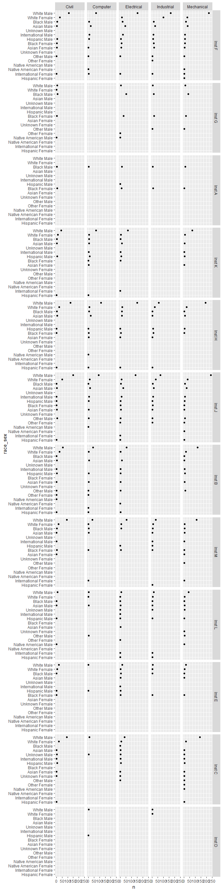
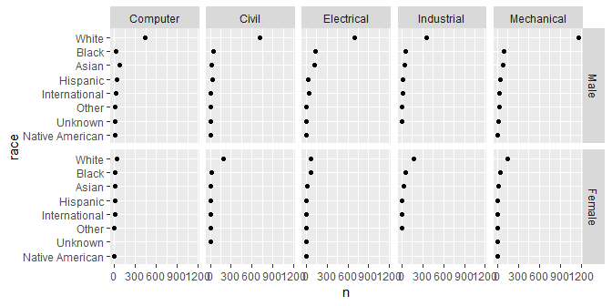
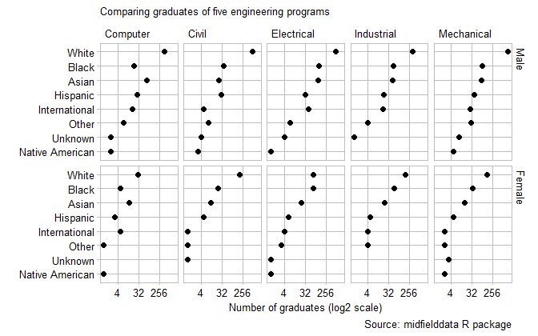
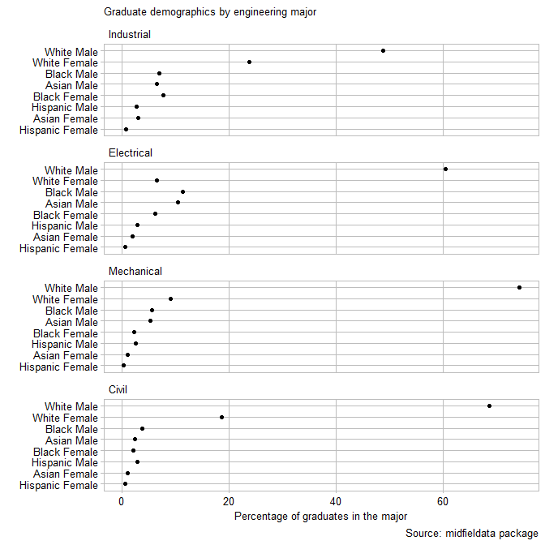

carpentry with joins
================

 <small> <br>
<i>Joined</i> by David Seibold is licensed under
<a href="https://creativecommons.org/licenses/by-nc/2.0/legalcode">CC
BY-NC 2.0</a> <br> </small>

## contents

[introduction](#introduction)  
[prerequisites](#prerequisites)  
[midfield data](#midfield-data)  
[joins](#joins)  
[carpentry](#carpentry)  
[design](#design)  
[exercises](#exercises)  
[references](#references)

## introduction

“It’s rare that a data analysis involves only a single table of data.
Typically you have many tables of data, and you must combine them to
answer the questions that you’re interested in. Collectively, multiple
tables of data are called **relational data** because it is the
relations, not just the individual datasets, that are important.”
(Wickham and Grolemund, [2017](#ref-Wickham+Grolemund:2017), Sec. 13.1)
(Relational tables is the basic idea underlying relational databases.)

Data frames are our basic form of table. Combining information from two
data frames is called a **join**. The dplyr package has joining
functions called `inner_join()`, `left_join()`, `right_join()`, and
others. We’ll use the left join regularly. You can read about the others
at the help page by running `? dplyr::join` or [Ch. 13 Relational
Data](https://r4ds.had.co.nz/relational-data.html) in the text.

To perform a join, the two data frames must have at least one key-column
in common. Here again we see the importance of [coordinatized
data](cm103-data-reshaping.md#keys-and-values-in-coordinatized-data).

## prerequisites

Project setup

  - Start every work session by launching the RStudio Project file for
    the course, e.g., `portfolio.Rproj`  
  - Ensure your [project directory
    structure](cm501-proj-m-manage-files.md#planning-the-directory-structure)
    satisfies the course requirements

Ensure you have installed the following packages. See [install
packages](cm902-software-studio.md#install-packages) for instructions if
needed. For midfielddata, see the instructions below.

  - [**tidyverse**](http://tidyverse.tidyverse.org): The ‘tidyverse’ is
    a set of packages that work in harmony because they share common
    data representations and ‘API’ design. This package is designed to
    make it easy to install and load multiple ‘tidyverse’ packages in a
    single step. Learn more about the ‘tidyverse’ at
    <https://tidyverse.org>.
  - [**wrapr**](https://github.com/WinVector/wrapr): Tools for writing
    and debugging R code. Provides: ‘let()’ (converts non-standard
    evaluation interfaces to parametric standard evaluation interfaces,
    inspired by ‘gtools:strmacro()’ and ‘base::bquote()’), ‘%.\>%’
    dot-pipe (an ‘S3’ configurable pipe),
    ‘build\_frame()’/‘draw\_frame()’ (‘data.frame’ example tools),
    ‘qc()’ (quoting concatenate), ‘:=’ (named map builder), and more.
  - [**midfielddata**](https://github.com/MIDFIELDR/midfielddata): A
    stratified sample of the MIDFIELD database of student records
    (registrar’s data) for 98,000 undergraduates at participating US
    institutions from 1987 to 2016. The data sample includes entering
    demographics, individual course and term data, and graduation status
    and degrees earned.

Install midfielddata as follows,

    install.packages("drat")
    drat::addRepo("midfieldr")
    install.packages("midfielddata")

Scripts to initialize

``` 
explore/0601-joins-explore.R     
```

And start the file with a minimal header

``` r
# your name
# date

# load packages
library("tidyverse")
library("wrapr")
library("midfielddata")
```

Duplicate the lines of code in the session one chunk at a time. Save,
Source, and compare your results to the results shown.

<br> <a href="#top">▲ top of page</a>

## midfield data

The midfielddata data package comprises demographic, term, course, and
degree information for 97,640 undergraduate students from 1987 to 2016
(Layton and others, [2018](#ref-Layton+Long+Ohland:2018:midfielddata)).
If you want to learn more about the data set, open its help page by
running `? midfielddata`.

In this exercise, we’ll work with the degree data (`midfielddegrees`)
and the student demographic data (`midfieldstudents`).

``` r
# degree status 
glimpse(midfielddegrees)
#> Observations: 97,640
#> Variables: 5
#> $ id          <chr> "MID25783135", "MID25783147", "MID25783156", "MID2...
#> $ institution <chr> "Institution M", "Institution M", "Institution M",...
#> $ cip6        <chr> NA, NA, NA, "521401", NA, NA, "143501", NA, "23010...
#> $ term_degree <dbl> NA, NA, NA, 19963, NA, NA, 20001, NA, 20023, 19966...
#> $ degree      <chr> NA, NA, NA, "Bachelor of Science", NA, NA, "Bachel...


# student information at matriculation  
glimpse(midfieldstudents)
#> Observations: 97,640
#> Variables: 15
#> $ id             <chr> "MID25783135", "MID25783147", "MID25783156", "M...
#> $ institution    <chr> "Institution M", "Institution M", "Institution ...
#> $ cip6           <chr> "511199", "131202", "040201", "14XXXX", "14XXXX...
#> $ term_enter     <dbl> 19911, 20041, 20011, 19921, 20091, 20051, 19946...
#> $ transfer       <chr> "N", "N", "N", "N", "N", "N", "N", "N", "N", "N...
#> $ hours_transfer <dbl> NA, NA, NA, NA, NA, NA, NA, NA, NA, NA, NA, NA,...
#> $ sex            <chr> "Male", "Female", "Female", "Male", "Male", "Ma...
#> $ race           <chr> "White", "White", "White", "White", "White", "W...
#> $ age            <dbl> 17, 17, 18, 17, 18, 18, 17, 18, 18, 18, 18, 17,...
#> $ us_citizen     <chr> "Y", "Y", "Y", "Y", "Y", "Y", "Y", "Y", "Y", "Y...
#> $ home_zip       <chr> "29485", "29072", "43026", "29572", "29016", "2...
#> $ high_school    <chr> "411900", "410825", "210568", "411465", "410210...
#> $ sat_math       <dbl> 580, 470, 750, 560, 670, 620, 642, 590, 492, 62...
#> $ sat_verbal     <dbl> 505, 530, 627, 395, 530, 500, 486, 620, 594, 45...
#> $ act_comp       <dbl> 21, 19, 29, 18, 26, 22, 24, 25, 21, 21, 25, 20,...
```

Possible keys:

  - `id` when students are the unit of analysis, uniquely identifies
    each of the 97640 students in the dataset  
  - `cip6` when programs are the unit of analysis, uniquely identifies
    each of the 338 academic programs in the dataset  
  - `institution` when institutions are the unit of analysis, uniquely
    identifies each of the 12 institutions in the dataset

The IDs and institutions are anonymized. The 6-digit program codes,
however, are from the US Integrated Postsecondary Education Data System
(IPEDS), Classification of Instructional Programs
[(CIP)](https://nces.ed.gov/ipeds/cipcode/browse.aspx?y=55). A sampling
of the CIP codes:

``` r
midfielddegrees %>% 
        select(cip6)  %>% 
        arrange(cip6) %>% 
        distinct()    %>% 
        sample_n(10) 
#> # A tibble: 10 x 1
#>    cip6  
#>    <chr> 
#>  1 450601
#>  2 030502
#>  3 010999
#>  4 131203
#>  5 400202
#>  6 161200
#>  7 380299
#>  8 169999
#>  9 260301
#> 10 512001
```

From the IPEDS website, we find that [engineering codes start
with 14](https://nces.ed.gov/ipeds/cipcode/cipdetail.aspx?y=55&cipid=88196).
We filter `midfielddegrees` using `str_start()` to keep the rows of
students graduating in an engineering major.

``` r
grad_engr <- midfielddegrees %>% 
    filter(str_starts(cip6, "14"))
    
grad_engr %>% 
        select(cip6)  %>% 
        arrange(cip6) %>% 
        distinct()  
#> # A tibble: 27 x 1
#>    cip6  
#>    <chr> 
#>  1 140101
#>  2 140201
#>  3 140301
#>  4 140401
#>  5 140501
#>  6 140601
#>  7 140701
#>  8 140801
#>  9 140901
#> 10 141001
#> # ... with 17 more rows
```

In this exercise, I would like to examine students in 5 engineering
majors: Civil, Computer, Electrical, Mechanical, and Industrial
Engineering. The first 4 digits of `cip6` define these majors, for
example, every 6-digit code that starts with 1408 is Civil Engineering,
1409 Computer Engineering, etc.

Let’s create a data frame that contains the 4-digit codes of the 5
majors, using `wrapr::build_frame()`.

``` r
(engr_major <- wrapr::build_frame(
        "major",      "cip4" |
        "Civil",      "1408" |
        "Computer",   "1409" | 
        "Electrical", "1410" | 
        "Mechanical", "1419" |
        "Industrial", "1435" 
    ))
#>        major cip4
#> 1      Civil 1408
#> 2   Computer 1409
#> 3 Electrical 1410
#> 4 Mechanical 1419
#> 5 Industrial 1435
```

I will use the `cip4` column to filter the `grad_engr` data frame to
keep all students graduating in these majors. First, a create a single
string of the `cip4` values, separated by the logical OR symbol,

``` r
(major_string <- str_c(engr_major$cip4, collapse = "|"))
#> [1] "1408|1409|1410|1419|1435"
```

Then I filter the `grad_engr` data frame to keep the rows whose `cip6`
columns starts with any of the 4 digit codes in the `keep_code` string,
again using `filter()` with `str_starts()`,

``` r
grad <- grad_engr %>% 
        filter(str_starts(cip6, major_string))  %>% 
        glimpse()
#> Observations: 5,322
#> Variables: 5
#> $ id          <chr> "MID25783178", "MID25783197", "MID25783441", "MID2...
#> $ institution <chr> "Institution M", "Institution M", "Institution M",...
#> $ cip6        <chr> "143501", "140801", "140801", "141001", "143501", ...
#> $ term_degree <dbl> 20001, 19911, 19963, 20001, 20001, 19963, 19981, 1...
#> $ degree      <chr> "Bachelor of Science", "Bachelor of Science", "Bac...
```

Every row in `grad` is a unique student who graduated in one of these 5
majors.

``` r
grad %>% 
        select(cip6)  %>% 
        arrange(cip6) %>% 
        distinct() 
#> # A tibble: 5 x 1
#>   cip6  
#>   <chr> 
#> 1 140801
#> 2 140901
#> 3 141001
#> 4 141901
#> 5 143501
```

The original data frame had 97640 students; the five engineering majors
have 5322 graduates.

## joins

The `left_join()` is perhaps the most commonly used joining function.
The basic syntax is

``` 
left_join(x, y, by)   
```

where `x` and `y` are two data frames and `by` is the key or keys that
the tables have in common. The left join (from the help page) “returns
all rows from `x`, and all columns from `x` and `y`. Rows in `x` with no
match in `y` will have `NA` values in the new columns. If there are
multiple matches between `x` and `y`, all combinations of the matches
are returned.”

Before joining, let’s reduce the number of columns to the minimum that
we want to use,

``` r
grad <- grad %>%
        select(id, institution, cip6) 

demographics <- midfieldstudents %>% 
        select(id, sex, race) 
```

Using the student `id` as the key, we join the student demographic
information to the student graduates data frame.

``` r
grad <- left_join(x = grad, y = demographics, by = "id") %>% 
        glimpse()
#> Observations: 5,322
#> Variables: 5
#> $ id          <chr> "MID25783178", "MID25783197", "MID25783441", "MID2...
#> $ institution <chr> "Institution M", "Institution M", "Institution M",...
#> $ cip6        <chr> "143501", "140801", "140801", "141001", "143501", ...
#> $ sex         <chr> "Male", "Male", "Male", "Male", "Male", "Female", ...
#> $ race        <chr> "Black", "White", "White", "White", "White", "Whit...
```

Earlier, we created the data frame `engr_major` with the 4-digit CIP
code and our name for the major. Next we join these major names to the
`grad` data frame.

``` r
grad <- left_join(x = grad, y = engr_major)

#> Error: `by` required, because the data sources have no common variables
```

This line throws an error because the two data frames I’m trying to join
do not have a common key. The fix is to create a cip4 variable in `grad`
using the first 4 digits of `cip6`.

``` r
grad <- grad %>% 
    mutate(cip4 = str_sub(cip6, start = 1L, end = 4L)) %>% 
    glimpse()
#> Observations: 5,322
#> Variables: 6
#> $ id          <chr> "MID25783178", "MID25783197", "MID25783441", "MID2...
#> $ institution <chr> "Institution M", "Institution M", "Institution M",...
#> $ cip6        <chr> "143501", "140801", "140801", "141001", "143501", ...
#> $ sex         <chr> "Male", "Male", "Male", "Male", "Male", "Female", ...
#> $ race        <chr> "Black", "White", "White", "White", "White", "Whit...
#> $ cip4        <chr> "1435", "1408", "1408", "1410", "1435", "1408", "1...
```

Now the left join will work,

``` r
grad <- left_join(x = grad, y = engr_major, by = "cip4") %>%
    glimpse()
#> Observations: 5,322
#> Variables: 7
#> $ id          <chr> "MID25783178", "MID25783197", "MID25783441", "MID2...
#> $ institution <chr> "Institution M", "Institution M", "Institution M",...
#> $ cip6        <chr> "143501", "140801", "140801", "141001", "143501", ...
#> $ sex         <chr> "Male", "Male", "Male", "Male", "Male", "Female", ...
#> $ race        <chr> "Black", "White", "White", "White", "White", "Whit...
#> $ cip4        <chr> "1435", "1408", "1408", "1410", "1435", "1408", "1...
#> $ major       <chr> "Industrial", "Civil", "Civil", "Electrical", "Ind...
```

## carpentry

Before creating graphs, I’d like to clean up the data, The student ID
and the CIP codes are no longer needed.

``` r
grad <- grad %>% 
    select(institution, major, sex, race) %>% 
    glimpse()
#> Observations: 5,322
#> Variables: 4
#> $ institution <chr> "Institution M", "Institution M", "Institution M",...
#> $ major       <chr> "Industrial", "Civil", "Civil", "Electrical", "Ind...
#> $ sex         <chr> "Male", "Male", "Male", "Male", "Male", "Female", ...
#> $ race        <chr> "Black", "White", "White", "White", "White", "Whit...
```

Shorten the variable name for institution

``` r
grad <- grad %>% 
    dplyr::rename("inst" = "institution") %>% 
    glimpse()
#> Observations: 5,322
#> Variables: 4
#> $ inst  <chr> "Institution M", "Institution M", "Institution M", "Inst...
#> $ major <chr> "Industrial", "Civil", "Civil", "Electrical", "Industria...
#> $ sex   <chr> "Male", "Male", "Male", "Male", "Male", "Female", "Male"...
#> $ race  <chr> "Black", "White", "White", "White", "White", "White", "W...
```

Recode the institution values by shortening the string “Institution” to
“Inst”.

``` r
grad <- grad %>% 
    mutate(inst = str_remove_all(inst, "itution")) %>% 
  glimpse()
#> Observations: 5,322
#> Variables: 4
#> $ inst  <chr> "Inst M", "Inst M", "Inst M", "Inst M", "Inst M", "Inst ...
#> $ major <chr> "Industrial", "Civil", "Civil", "Electrical", "Industria...
#> $ sex   <chr> "Male", "Male", "Male", "Male", "Male", "Female", "Male"...
#> $ race  <chr> "Black", "White", "White", "White", "White", "White", "W...
```

Create a new variable `race_sex` that unites race and sex—a useful
variable in this type of graph.

``` r
grad <- grad %>%
  unite(col = "race_sex", c("race", "sex"), sep = " ", remove = FALSE) %>% 
    glimpse()
#> Observations: 5,322
#> Variables: 5
#> $ inst     <chr> "Inst M", "Inst M", "Inst M", "Inst M", "Inst M", "In...
#> $ major    <chr> "Industrial", "Civil", "Civil", "Electrical", "Indust...
#> $ race_sex <chr> "Black Male", "White Male", "White Male", "White Male...
#> $ sex      <chr> "Male", "Male", "Male", "Male", "Male", "Female", "Ma...
#> $ race     <chr> "Black", "White", "White", "White", "White", "White",...
```

## design

Use `count()` to quickly group and summarize, then convert the character
variables into factors ordered by `n` (`count()` creates a variable
`n`).

``` r
grad1 <- grad %>% 
    count(inst, major, race_sex) %>% 
    mutate(inst = fct_reorder(inst, n)) %>% 
    mutate(major = fct_reorder(major, n)) %>% 
    mutate(race_sex = fct_reorder(race_sex, n)) %>% 
    glimpse()
#> Observations: 368
#> Variables: 4
#> $ inst     <fct> Inst A, Inst A, Inst A, Inst A, Inst A, Inst A, Inst ...
#> $ major    <fct> Civil, Civil, Computer, Electrical, Electrical, Elect...
#> $ race_sex <fct> Black Female, Black Male, Black Male, Black Female, B...
#> $ n        <int> 6, 4, 2, 11, 16, 1, 7, 6, 2, 12, 1, 3, 2, 1, 3, 1, 1,...

ggplot(data = grad1, mapping = aes(x = n, y = race_sex)) +
    geom_point() + 
    facet_grid(rows = vars(inst), cols = vars(major), as.table = FALSE)
```



Not all populations are present at all institutions, so I’ll do a
recount, this time omitting institution. By eliminating this category, I
can use race and sex separately.

``` r
grad2 <- grad %>% 
    count(major, race, sex) %>% 
    mutate(major = fct_reorder(major, n)) %>% 
    mutate(race = fct_reorder(race, n)) %>% 
    mutate(sex = fct_reorder(sex, n)) %>% 
    glimpse()
#> Observations: 75
#> Variables: 4
#> $ major <fct> Civil, Civil, Civil, Civil, Civil, Civil, Civil, Civil, ...
#> $ race  <fct> Asian, Asian, Black, Black, Hispanic, Hispanic, Internat...
#> $ sex   <fct> Female, Male, Female, Male, Female, Male, Female, Male, ...
#> $ n     <int> 11, 24, 21, 39, 5, 30, 1, 5, 3, 1, 8, 1, 4, 192, 708, 13...

ggplot(data = grad2, mapping = aes(x = n, y = race)) +
    geom_point() + 
    facet_grid(rows = vars(sex), cols = vars(major), as.table = FALSE)
```



Add a log scale to help compare small numbers and edit the theme.

``` r
ggplot(data = grad2, mapping = aes(x = n, y = race)) +
    geom_point(size = 2) + 
    facet_grid(rows = vars(sex), cols = vars(major), as.table = FALSE) + 
  scale_x_continuous(trans = "log2") +
    labs(x = "Number of graduates (log2 scale)", y = "", caption = "Source: midfielddata R package", title = "Comparing graduates of five engineering programs") +
    theme_graphclass() 
```



## exercises

**1. midfield**

Initialize a new script

``` 
explore/0601-dotplot-midfield-exercise.R    
```

Starting with `midfielddegrees` and `midfieldstudents`, create the data
frame such that you can graph the answer to the question: “Of all the
students graduating in a given major, what percent are in each sex-race
group?”

  - Limit the majors to Mechanical, Electrical, Civil, and Industrial
    Engineering.  
  - Limit the race values to Asian, Black, Hispanic, and White.

Answer:



## references

<div id="refs">

<div id="ref-Layton+Long+Ohland:2018:midfielddata">

Layton R, Long R and Ohland M (2018) *midfielddata: Student record data
for 98,000 undergraduates.* R package version 0.1.0
<https://midfieldr.github.io/midfielddata/>

</div>

<div id="ref-Wickham+Grolemund:2017">

Wickham H and Grolemund G (2017) *R for Data Science.* O’Reilly Media,
Inc., Sebastopol, CA <https://r4ds.had.co.nz/>

</div>

</div>

***
<a href="#top">&#9650; top of page</a>    
[&#9665; calendar](../README.md#calendar)    
[&#9665; index](../README.md#index)
