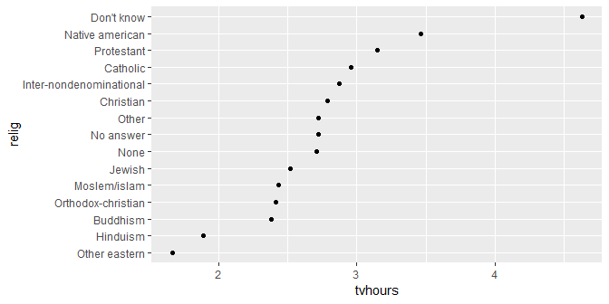

working with factors
================

 <small> <br>
<i>Flower working</i> by Paolo Negri is licensed under
<a href="https://creativecommons.org/licenses/by-nc/2.0/legalcode">CC
BY-NC 2.0</a> <br> </small>

## contents

[introduction](#introduction)  
[prerequisites](#prerequisites)  
[creating a factor variable](#creating-a-factor-variable)  
[reorder factor levels manually](#reorder-factor-levels-manually)  
[reorder factor levels by a date
variable](#reorder-factor-levels-by-a-date-variable)  
[reorder factor levels by a quantitative
variable](#reorder-factor-levels-by-a-quantitative-variable)  
[reorder factor levels by frequency of
levels](#reorder-factor-levels-by-frequency-of-levels)  
[recode factor levels](#recode-factor-levels)  
[remove unused levels](#remove-unused-levels)  
[reverse factor level order](#reverse-factor-level-order)  
[exercises](#exercises)  
[references](#references)

## introduction

A factor is special data structure in R for categorical variables. This
special structure permits us to order the levels of a categorical
variable in any way we wish—a critical design aid for creating effective
graphs.

  - the fixed and known levels of the category are the levels of the
    factor
  - the levels are character strings, but are stored in memory as
    integers

The functions we use to treat factors are primarily those in the forcats
package, part of the tidyverse.

## prerequisites

Project setup

  - Start every work session by launching the RStudio Project file for
    the course, e.g., `portfolio.Rproj`  
  - Ensure your [project directory
    structure](cm501-proj-m-manage-files.md#planning-the-directory-structure)
    satisfies the course requirements

Ensure you have installed the following packages. See [install
packages](cm902-software-studio.md#install-packages) for instructions if
needed.

  - [**tidyverse**](http://tidyverse.tidyverse.org): The ‘tidyverse’ is
    a set of packages that work in harmony because they share common
    data representations and ‘API’ design. This package is designed to
    make it easy to install and load multiple ‘tidyverse’ packages in a
    single step. Learn more about the ‘tidyverse’ at
    <https://tidyverse.org>.
  - [**lubridate**](http://lubridate.tidyverse.org): Functions to work
    with date-times and time-spans: fast and user friendly parsing of
    date-time data, extraction and updating of components of a date-time
    (years, months, days, hours, minutes, and seconds), algebraic
    manipulation on date-time and time-span objects. The ‘lubridate’
    package has a consistent and memorable syntax that makes working
    with dates easy and fun. Parts of the ‘CCTZ’ source code, released
    under the Apache 2.0 License, are included in this package. See
    <https://github.com/google/cctz> for more details.
  - [**seplyr**](https://github.com/WinVector/seplyr/): The ‘seplyr’
    (standard evaluation plying) package supplies improved standard
    evaluation adapter methods for important common ‘dplyr’ data
    manipulation tasks. In addition the ‘seplyr’ package supplies
    several new “key operations bound together” methods. These include
    ‘group\_summarize()’ (which combines grouping, arranging and
    calculation in an atomic unit), ‘add\_group\_summaries()’ (which
    joins grouped summaries into a ‘data.frame’ in a well documented
    manner), ‘add\_group\_indices()’ (which adds per-group identifiers
    to a ‘data.frame’ without depending on row-order),
    ‘partition\_mutate\_qt()’ (which optimizes mutate sequences), and
    ‘if\_else\_device()’ (which simulates per-row if-else blocks in
    expression sequences).

Create a new script `explore/0502-data-working-with-factors.R`. Write a
minimal header and load the packages.

``` r
# your name
# date

# load packages
library("tidyverse")
library("lubridate")
library("seplyr") 
```

Duplicate the lines of code in the session one chunk at a time. Save,
Source, and compare your results to the results shown.

<br> <a href="#top">▲ top of page</a>

## creating a factor variable

We often want to order the levels of a categorical variable for
graphing. A character variable is converted to a factor using `factor()`
(base R) or `as_factor()` (forcats package).

For example, consider the `presidential` data set that comes with
ggplot2. The `name` variable is a character.

``` r
df <- presidential
kable(df)
```

| name       | start      | end        | party      |
| :--------- | :--------- | :--------- | :--------- |
| Eisenhower | 1953-01-20 | 1961-01-20 | Republican |
| Kennedy    | 1961-01-20 | 1963-11-22 | Democratic |
| Johnson    | 1963-11-22 | 1969-01-20 | Democratic |
| Nixon      | 1969-01-20 | 1974-08-09 | Republican |
| Ford       | 1974-08-09 | 1977-01-20 | Republican |
| Carter     | 1977-01-20 | 1981-01-20 | Democratic |
| Reagan     | 1981-01-20 | 1989-01-20 | Republican |
| Bush       | 1989-01-20 | 1993-01-20 | Republican |
| Clinton    | 1993-01-20 | 2001-01-20 | Democratic |
| Bush       | 2001-01-20 | 2009-01-20 | Republican |
| Obama      | 2009-01-20 | 2017-01-20 | Democratic |

The rows of the data frame are in chronological order. If we graph the
names however, the rows of the graph are in alphabetical order. I’m
using `geom_segment()` to create a line that spans the term in office.

``` r
ggplot(data = df, aes(x = start, xend = end, y = name, yend = name)) +
    geom_segment()
```


Before doing any additional work, we notice that there are two Bush
terms in the same row. To distinguish between them, we change the values
to “Bush\_41” and Bush\_43".

  - use `lubridate::date()` to convert a string to a date object type
  - then replace the name in the row with that date

<!-- end list -->

``` r
year_index <- df$start == lubridate::date("1989-01-20")
df$name[year_index] <- "Bush_41"

year_index <- df$start == lubridate::date("2001-01-20")
df$name[year_index] <- "Bush_43"
```

Now we can convert `name` to a factor.

``` r
df <- df %>% 
    mutate(name = factor(name))

attributes(df$name)
#> $levels
#>  [1] "Bush_41"    "Bush_43"    "Carter"     "Clinton"    "Eisenhower"
#>  [6] "Ford"       "Johnson"    "Kennedy"    "Nixon"      "Obama"     
#> [11] "Reagan"    
#> 
#> $class
#> [1] "factor"
```

The new plot shows two separate Bush administrations.

``` r
ggplot(data = df, aes(x = start, xend = end, y = name, yend = name)) +
    geom_segment()
```


The name variable is now a factor, but its levels are in alphabetical
order—this is the default behavior of base R `factor()`.

If we had used `forcats::as_factor()` instead of base R `factor()`, the
levels would have been ordered in the order they appear in the data
frame—which in this example is chronological order. However, for this
exercise, I wanted the levels in alphabetical order to illustrate how to
reorder the levels manually.

<br> <a href="#top">▲ top of page</a>

## reorder factor levels manually

First I’ll reset the `name` variable from a factor back to its original
character type.

``` r
# name is a factor
attributes(df$name)
#> $levels
#>  [1] "Bush_41"    "Bush_43"    "Carter"     "Clinton"    "Eisenhower"
#>  [6] "Ford"       "Johnson"    "Kennedy"    "Nixon"      "Obama"     
#> [11] "Reagan"    
#> 
#> $class
#> [1] "factor"

# convert to character
df <- df %>% 
    mutate(name = as.character(name))

# name is a character (no attributes)
attributes(df$name)
#> NULL
class(df$name)
#> [1] "character"
```

Then construct a vector to list all the levels in the desired order. You
must include all the levels.

``` r
name_levels = c("Eisenhower", "Kennedy", "Johnson", "Nixon", "Ford", "Carter", "Reagan", "Bush_41", "Clinton", 
                "Bush_43", "Obama")
```

Now I can use `factor()` to convert `name` from a character to factor
variable and the `levels` argument to assign the order of the levels.

``` r
df <- df %>% 
    mutate(name = factor(name, levels = name_levels))

levels(df$name)
#>  [1] "Eisenhower" "Kennedy"    "Johnson"    "Nixon"      "Ford"      
#>  [6] "Carter"     "Reagan"     "Bush_41"    "Clinton"    "Bush_43"   
#> [11] "Obama"
```

Now the name variable on the y-axis is ordered by the level-order we
assigned.

``` r
ggplot(data = df, aes(x = start, xend = end, y = name, yend = name)) +
    geom_segment()
```


<br> <a href="#top">▲ top of page</a>

## reorder factor levels by a date variable

First I’ll reset the `name` variable from a factor back to its original
character type.

``` r
# convert to character
df <- df %>% 
    mutate(name = as.character(name))
```

The `presidential` data frame includes the start and stop dates of their
administrations as object type `Date`.

``` r
# Date is a class 
class(df$start)
#> [1] "Date"
```

We can use a date to order the name levels because the Date class is
stored in memory (like factors) as integers.

``` r
# Date type is integer 
typeof(df$start)
#> [1] "integer"
```

Using `fct_reorder(f, x)`, the first argument `f` can be a factor or a
character variable. If a character, the variable is converted to a
factor. The factor is then ordered by the values in variable `x`,
ascending.

Here we convert character `name` to a factor and order its levels by the
`start` date.

``` r
df <- df %>% 
    mutate(name = fct_reorder(name, start))
```

Confirm that `name` is a factor

``` r
attributes(df$name)
#> $levels
#>  [1] "Eisenhower" "Kennedy"    "Johnson"    "Nixon"      "Ford"      
#>  [6] "Carter"     "Reagan"     "Bush_41"    "Clinton"    "Bush_43"   
#> [11] "Obama"     
#> 
#> $class
#> [1] "factor"
```

We get the same graph as we had earlier but without having to write a
vector of the ordered levels.

``` r
ggplot(data = df, aes(x = start, xend = end, y = name, yend = name)) +
    geom_segment()
```


<br> <a href="#top">▲ top of page</a>

## reorder factor levels by a quantitative variable

Ordering the levels of a factor by date, as above, is a special case of
ordering by any quantitative variable. To illustrate, we’ll use the
`gss_cat` data frame loaded with the forcats package.

``` r
glimpse(gss_cat)
#> Observations: 21,483
#> Variables: 9
#> $ year    <int> 2000, 2000, 2000, 2000, 2000, 2000, 2000, 2000, 2000, ...
#> $ marital <fct> Never married, Divorced, Widowed, Never married, Divor...
#> $ age     <int> 26, 48, 67, 39, 25, 25, 36, 44, 44, 47, 53, 52, 52, 51...
#> $ race    <fct> White, White, White, White, White, White, White, White...
#> $ rincome <fct> $8000 to 9999, $8000 to 9999, Not applicable, Not appl...
#> $ partyid <fct> "Ind,near rep", "Not str republican", "Independent", "...
#> $ relig   <fct> Protestant, Protestant, Protestant, Orthodox-christian...
#> $ denom   <fct> Southern baptist, Baptist-dk which, No denomination, N...
#> $ tvhours <int> 12, NA, 2, 4, 1, NA, 3, NA, 0, 3, 2, NA, 1, NA, 1, 7, ...
```

In this data frame, 6 of the variables are factors. Recall from [the
nature of factors](cm106-data-nature-of-factors.md) that factors have a
known and fixed set of levels. Let’s look at levels of factor `relig`.

``` r
attributes(gss_cat$relig)
#> $levels
#>  [1] "No answer"               "Don't know"             
#>  [3] "Inter-nondenominational" "Native american"        
#>  [5] "Christian"               "Orthodox-christian"     
#>  [7] "Moslem/islam"            "Other eastern"          
#>  [9] "Hinduism"                "Buddhism"               
#> [11] "Other"                   "None"                   
#> [13] "Jewish"                  "Catholic"               
#> [15] "Protestant"              "Not applicable"         
#> 
#> $class
#> [1] "factor"
```

The factor has 16 levels in no particular order. I’d like to graph a
comparison of religions by a quantitative variable, say, the mean number
of hours per day watching TV.

First we group and summarize, using `relig` as the grouping variable.
Let me introduce a group and summarize approach provided by the seplyr
package. First we define the vector of variables to group by, with the
column names in quotes.

``` r
grouping_variables <- c("relig")
```

Then we use a single function `group_summarize()` to compute the mean TV
hours.

``` r
relig_tv <- gss_cat %>%
    group_summarize(grouping_variables, tvhours = mean(tvhours, na.rm = TRUE))

relig_tv
#> # A tibble: 15 x 2
#>    relig                   tvhours
#>    <fct>                     <dbl>
#>  1 No answer                  2.72
#>  2 Don't know                 4.62
#>  3 Inter-nondenominational    2.87
#>  4 Native american            3.46
#>  5 Christian                  2.79
#>  6 Orthodox-christian         2.42
#>  7 Moslem/islam               2.44
#>  8 Other eastern              1.67
#>  9 Hinduism                   1.89
#> 10 Buddhism                   2.38
#> 11 Other                      2.73
#> 12 None                       2.71
#> 13 Jewish                     2.52
#> 14 Catholic                   2.96
#> 15 Protestant                 3.15
```

If we graph using the existing order of levels,

``` r
ggplot(data = relig_tv, aes(x = tvhours, y = relig)) + 
    geom_point()
```


Reorder `relig` factor levels by `tvhours` using `fct_reorder()` and
graph again.

``` r
# reorder the levels of the factor by number of TV hours
relig_tv <- relig_tv %>%
  mutate(relig = fct_reorder(relig, tvhours))

# graph with reordered factor  
ggplot(data = relig_tv, aes(x = tvhours, y = relig)) + 
    geom_point()
```



Suppose we want to look at grouping by two variables, say, marital
status and religion,

``` r
grouping_variables <- c("marital", "relig")
marital_relig_tv <- gss_cat %>%
    group_summarize(grouping_variables, tvhours = mean(tvhours, na.rm = TRUE)) %>% 
    ungroup() 
```

Before graphing, I’m going to filter out some of the levels

``` r
marital_relig_tv <-  marital_relig_tv %>% 
    filter(marital != "No answer") %>% 
    filter(relig   != "No answer") %>% 
    filter(relig   != "Don't know")
```

Because we’ve grouped and summarized by two variables, some of our
counts have an NA result.

``` r
# how many NA entries
sum(is.na(marital_relig_tv$tvhours))
#> [1] 3
```

Convert these NA to zero using `replace_na()`

``` r
marital_relig_tv <- marital_relig_tv %>%
    mutate(tvhours = replace_na(tvhours, 0)) 
```

Now we can reorder the levels of the two factors.

``` r
marital_relig_tv <- marital_relig_tv %>%
  mutate(marital = fct_reorder(marital, tvhours)) %>% 
  mutate(relig = fct_reorder(relig, tvhours)) 
```

and graph the multiway.

``` r
ggplot(data = marital_relig_tv, aes(x = tvhours, y = relig)) + 
  geom_point() +
  facet_wrap(vars(marital), ncol = 1, as.table = FALSE)
```


<br> <a href="#top">▲ top of page</a>

## reorder factor levels by frequency of levels

**Single variable**

A frequency table reports the number of times a value occurs in a data
set. There are a number of methods for generating frequency tables in R.
Let’s use `dplyr::count()`, which yields the variable column plus a
column of counts, `n`,

``` r
df <- gss_cat %>% 
    count(marital) %>% 
    glimpse()
#> Observations: 6
#> Variables: 2
#> $ marital <fct> No answer, Never married, Separated, Divorced, Widowed...
#> $ n       <int> 17, 5416, 743, 3383, 1807, 10117
```

Then ordering by frequency is just a case of ordering by the
quantitative variable `n`,

``` r
df <- df %>% 
        mutate(marital = fct_reorder(marital, n)) 

ggplot(data = df, aes(x = n, y = marital)) +
    geom_point() 
```


**Two variables**

`count()` can also create 2-way frequency tables in tidy form,

``` r
df <- gss_cat %>% 
    count(marital, relig) %>% 
    glimpse()
#> Observations: 78
#> Variables: 3
#> $ marital <fct> No answer, No answer, No answer, No answer, No answer,...
#> $ relig   <fct> No answer, Christian, Buddhism, Other, None, Catholic,...
#> $ n       <int> 4, 1, 1, 1, 2, 1, 7, 22, 6, 30, 8, 218, 13, 31, 10, 22...
```

Order `marital`and `relig` by `n`,

``` r
df <- df %>% 
        mutate(marital = fct_reorder(marital, n)) %>% 
        mutate(relig   = fct_reorder(relig, n))
```

Filter to omit small populations

``` r
df <-  df %>% 
    filter(n > 100)
```

Graph dot plots of the number of people responding to the survey by
religion and marital status,

``` r
ggplot(data = df, aes(x = n, y = relig)) + 
  geom_point() +
  facet_wrap(vars(marital), ncol = 1, as.table = FALSE)
```


<br> <a href="#top">▲ top of page</a>

## recode factor levels

`fct_recode()` allows you to recode, or change, the value of each level
of a factor—especially useful for preparing a graph for publication.

Let’s count frequency by party

``` r
df <- gss_cat %>% 
    count(partyid)

df
#> # A tibble: 10 x 2
#>    partyid                n
#>    <fct>              <int>
#>  1 No answer            154
#>  2 Don't know             1
#>  3 Other party          393
#>  4 Strong republican   2314
#>  5 Not str republican  3032
#>  6 Ind,near rep        1791
#>  7 Independent         4119
#>  8 Ind,near dem        2499
#>  9 Not str democrat    3690
#> 10 Strong democrat     3490
```

To make the labels easier to read in a graph, we recode the levels,

``` r
df <- df %>% 
    mutate(partyid = fct_recode(partyid,
    "Republican, strong"    = "Strong republican",
    "Republican, weak"      = "Not str republican",
    "Independent, near rep" = "Ind,near rep",
    "Independent, near dem" = "Ind,near dem",
    "Democrat, weak"        = "Not str democrat",
    "Democrat, strong"      = "Strong democrat"
  ))

df
#> # A tibble: 10 x 2
#>    partyid                   n
#>    <fct>                 <int>
#>  1 No answer               154
#>  2 Don't know                1
#>  3 Other party             393
#>  4 Republican, strong     2314
#>  5 Republican, weak       3032
#>  6 Independent, near rep  1791
#>  7 Independent            4119
#>  8 Independent, near dem  2499
#>  9 Democrat, weak         3690
#> 10 Democrat, strong       3490
```

To combine groups, you can assign several old levels to fewer new
levels,

``` r
df <- df %>% 
    mutate(partyid = fct_recode(partyid,
    "Independent"           = "Independent, near rep",
    "Independent"           = "Independent, near dem",
    "Other"                 = "No answer",
    "Other"                 = "Don't know",
    "Other"                 = "Other party"
  )) 

df
#> # A tibble: 10 x 2
#>    partyid                n
#>    <fct>              <int>
#>  1 Other                154
#>  2 Other                  1
#>  3 Other                393
#>  4 Republican, strong  2314
#>  5 Republican, weak    3032
#>  6 Independent         1791
#>  7 Independent         4119
#>  8 Independent         2499
#>  9 Democrat, weak      3690
#> 10 Democrat, strong    3490
```

Then we can group and summarize using the fewer levels

``` r
grouping_names <- c("partyid")
df <- df %>% 
    group_summarise(grouping_names, n = sum(n))

df
#> # A tibble: 6 x 2
#>   partyid                n
#>   <fct>              <int>
#> 1 Other                548
#> 2 Republican, strong  2314
#> 3 Republican, weak    3032
#> 4 Independent         8409
#> 5 Democrat, weak      3690
#> 6 Democrat, strong    3490
```

<br> <a href="#top">▲ top of page</a>

## remove unused levels

The `Other` group is small, so I’ll omit it,

``` r
df <- df %>% 
    filter(partyid != "Other")

df
#> # A tibble: 5 x 2
#>   partyid                n
#>   <fct>              <int>
#> 1 Republican, strong  2314
#> 2 Republican, weak    3032
#> 3 Independent         8409
#> 4 Democrat, weak      3690
#> 5 Democrat, strong    3490
```

Checking the factor levels, the `Other` level is still assigned to the
`partyid` variable.

``` r
attributes(df$partyid)
#> $levels
#> [1] "Other"              "Republican, strong" "Republican, weak"  
#> [4] "Independent"        "Democrat, weak"     "Democrat, strong"  
#> 
#> $class
#> [1] "factor"
```

We can remove unused levels with `fct_drop()`.

``` r
fct_drop(df$partyid)
#> [1] Republican, strong Republican, weak   Independent       
#> [4] Democrat, weak     Democrat, strong  
#> 5 Levels: Republican, strong Republican, weak ... Democrat, strong
```

The levels of `partyid` are already ordered, so we can go straight to
the graph,

``` r
ggplot(data = df, aes(x = partyid, y = n)) +
    geom_point()
```


<br> <a href="#top">▲ top of page</a>

## reverse factor level order

In this format, if we wanted left-to-right order of party ID to be
consistent with the left-to-right political spectrum, we reverse the
factor levels using `fct_rev()`,

``` r
df <- df %>% 
    mutate(partyid = fct_rev(partyid))

ggplot(data = df, aes(x = partyid, y = n)) +
    geom_point()
```


## exercises

Create R script `explore/0502-working-with-factors-exercises.R`

#### 1\. gapminder

Data

  - `gapminder::gapminder`  
  - See its help page by running `? gapminder`

Carpentry

  - Subset the `gapminder` data for Asia in 2007  
  - As a factor, order countries by life expectancy

Design: Graph countries by life expectancy

#### 2\. US state area

Data

  - `state.x77` in base R  
  - See its help page by running `? state`

Carpentry

  - Move the state names to a column
  - As a factor, order the states by area

Design: Graph state by area with a log scale.

#### 3\. Nontraditional students

Data

  - `graphclassmate::nontraditional`  
  - See its help page by running `? nontraditional`

Carpentry

  - Determine the frequency (number of observations) by sex, race, and
    path.  
  - As factors, order each of sex, race, and path by the count `n`.  
  - Recode the ethnicity `Hispanic` as `Latino` and `Asian` as
    `Asian-American`.

Design

  - We will use one quantitative variable (frequency) and three
    categorical variables (sex, race, and path)  
  - Graph the number of students by race, conditioned by path and sex.
    (The graph you are trying to create is shown below.)


## references

<div id="refs">

<div id="ref-Wickham+Grolemund:2017">

Wickham H and Grolemund G (2017) *R for Data Science.* O’Reilly Media,
Inc., Sebastopol, CA <https://r4ds.had.co.nz/>

</div>

</div>

***
<a href="#top">&#9650; top of page</a>    
[&#9665; calendar](../README.md#calendar)    
[&#9665; index](../README.md#index)
