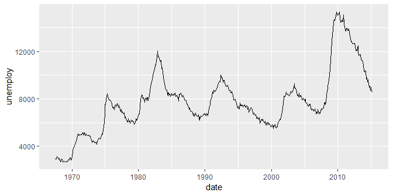
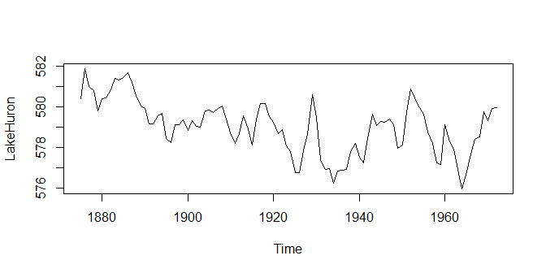
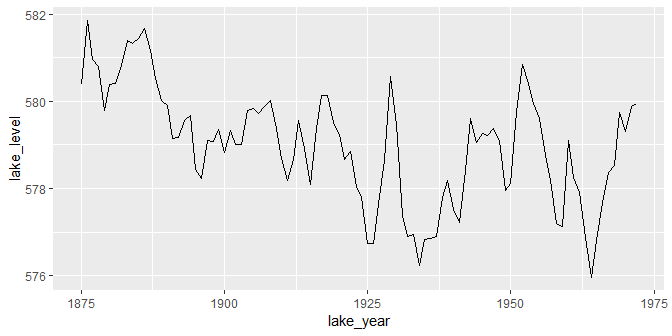
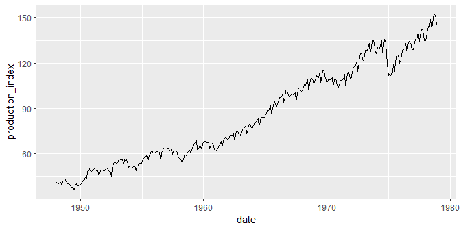
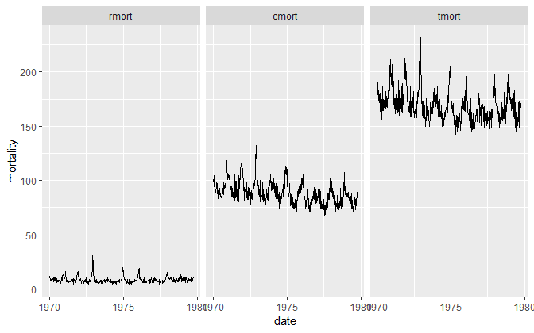

time series data
================


<small> <br> <i>Time Adjustments</i> by Bill Smith is licensed under
<a href="https://creativecommons.org/licenses/by/2.0/legal code">CC BY
2.0</a> <br> </small>

## contents

[introduction](#introduction)  
[prerequisites](#prerequisites)  
[time series in Date class](#time-series-in-date-class)  
[time series in ts class](#time-series-in-ts-class)  
[convert ts to data frame](#convert-ts-to-data-frame)  
[tsibble](#tsibble)  
[references](#references)

## introduction

In time series data, dates and times are the typically independent
variable and the quantitative observation is the dependent variable.

In many cases, the quantitative variables IA a column in a data frame
encoded as class `Date` or `POSIXct` (these classes are discussed in the
[time and dates](cm109-data-time-dates.md) tutorial). In other cases,
the quantitative variable is a vector encoded as an R `Time-Series`
object. I will use “time series” (lowercase) to denote time-dependent
data in general and “Time-Series” to denote the R object of class `ts`.

<br> <a href="#top">▲ top of page</a>

## prerequisites

Project setup

  - Start every work session by launching the RStudio Project file for
    the course, e.g., `portfolio.Rproj`  
  - Ensure your [project directory
    structure](cm501-proj-m-manage-files.md#planning-the-directory-structure)
    satisfies the course requirements

Ensure you have installed the following packages. See [install
packages](cm902-software-studio.md#install-packages) for instructions if
needed.

  - tidyverse  
  - lubridate
  - tsbox
  - astsa

Scripts to initialize

    explore/     0603-time-series-explore.R 

And start with a minimal header

``` r
# your name
# date

# load packages
library("tidyverse")
library("lubridate")
library("tsbox")
library("astsa")
```

## time series in Date class

Consider the `economics` data set that comes bundled with ggplot2. It
has five quantitative variables and one date variable of class `Date`.
View the data help page by running `? economics`.

``` r
data(economics, package = "ggplot2")
economics
#> # A tibble: 574 x 6
#>    date         pce    pop psavert uempmed unemploy
#>    <date>     <dbl>  <int>   <dbl>   <dbl>    <int>
#>  1 1967-07-01  507. 198712    12.5     4.5     2944
#>  2 1967-08-01  510. 198911    12.5     4.7     2945
#>  3 1967-09-01  516. 199113    11.7     4.6     2958
#>  4 1967-10-01  513. 199311    12.5     4.9     3143
#>  5 1967-11-01  518. 199498    12.5     4.7     3066
#>  6 1967-12-01  526. 199657    12.1     4.8     3018
#>  7 1968-01-01  532. 199808    11.7     5.1     2878
#>  8 1968-02-01  534. 199920    12.2     4.5     3001
#>  9 1968-03-01  545. 200056    11.6     4.1     2877
#> 10 1968-04-01  545. 200208    12.2     4.6     2709
#> # ... with 564 more rows

class(economics$date)
#> [1] "Date"
```

In this form, we can go right to the graph. I’ll graph the number of
unemployed (in 1000s) by date.

``` r
ggplot(data = economics, mapping = aes(x = date, y = unemploy)) +
    geom_line()
```



## time series in ts class

Class `ts` is fundamentally different from date-time classes `Date` and
`POSIXct`. The date-time classes represent date and time values. The
`ts` class represents Time-Series objects, typically numeric data
vectors, that are observed at equally-spaced time intervals in time.

Examples of possible Time-Series objects: unemployment rate observed
every month, CO<sub>2</sub> levels observed every day, temperature
observed every hour, etc.

For illustrating the `ts` class, we’ll examine the `LakeHuron` data
set—a time series in base R, recording annual measurements of the lake
level, in feet, from 1875 to 1972.

``` r
data(LakeHuron)
```

Printing Time-Series shows the data vector plus additional information
that identifies the object as a Time-Series. “Frequency = 1” indicates
that the constant interval between observations is 1 year; the start and
end years are also printed. Note that time is not printed as a vector.

``` r
print(LakeHuron)
#> Time Series:
#> Start = 1875 
#> End = 1972 
#> Frequency = 1 
#>  [1] 580.38 581.86 580.97 580.80 579.79 580.39 580.42 580.82 581.40 581.32
#> [11] 581.44 581.68 581.17 580.53 580.01 579.91 579.14 579.16 579.55 579.67
#> [21] 578.44 578.24 579.10 579.09 579.35 578.82 579.32 579.01 579.00 579.80
#> [31] 579.83 579.72 579.89 580.01 579.37 578.69 578.19 578.67 579.55 578.92
#> [41] 578.09 579.37 580.13 580.14 579.51 579.24 578.66 578.86 578.05 577.79
#> [51] 576.75 576.75 577.82 578.64 580.58 579.48 577.38 576.90 576.94 576.24
#> [61] 576.84 576.85 576.90 577.79 578.18 577.51 577.23 578.42 579.61 579.05
#> [71] 579.26 579.22 579.38 579.10 577.95 578.12 579.75 580.85 580.41 579.96
#> [81] 579.61 578.76 578.18 577.21 577.13 579.10 578.25 577.91 576.89 575.96
#> [91] 576.80 577.68 578.38 578.52 579.74 579.31 579.89 579.96
```

The structure reveals that the vector is a Time-Series object.

``` r
str(LakeHuron) 
#>  Time-Series [1:98] from 1875 to 1972: 580 582 581 581 580 ...
```

The class is `ts`. The `tsp` attribute gives the start time in time
units, the end time, and the frequency (the number of observations per
unit of time). Run `? tsp` for its help page.

``` r
attributes(LakeHuron)
#> $tsp
#> [1] 1875 1972    1
#> 
#> $class
#> [1] "ts"
```

The data are numeric.

``` r
typeof(LakeHuron)
#> [1] "double"
```

We could use the base R `plot()` function to graph the data. This will
not be our usual procedure, but it makes the point that Time-Series
objects do actually encode both a data value and a time value.

``` r
plot(LakeHuron)
```



## convert ts to data frame

To use our usual ggplot functions, we need the data in a data frame.

**Example 1. Level of Lake Huron 1875–1972**

In this firs example, the class of the data object is `ts`.

``` r
class(LakeHuron)
#> [1] "ts"
```

  - `tsbox::ts_df()` to convert to data frame

<!-- end list -->

``` r
df <- ts_df(LakeHuron) %>% 
    glimpse()
#> Observations: 98
#> Variables: 2
#> $ time  <date> 1875-01-01, 1876-01-01, 1877-01-01, 1878-01-01, 1879-01...
#> $ value <dbl> 580.38, 581.86, 580.97, 580.80, 579.79, 580.39, 580.42, ...
class(df)
#> [1] "data.frame"
```

In this case, however, the conversion has introduced a month and day in
the date variable that was not present in the original data. I would
therefore extract the years only.

  - `year()` to extract year from date, result is numeric

<!-- end list -->

``` r
df <- df %>% 
    mutate(time = year(time)) %>% 
    glimpse()
#> Observations: 98
#> Variables: 2
#> $ time  <dbl> 1875, 1876, 1877, 1878, 1879, 1880, 1881, 1882, 1883, 18...
#> $ value <dbl> 580.38, 581.86, 580.97, 580.80, 579.79, 580.39, 580.42, ...
```

  - `rename()` the variables

<!-- end list -->

``` r
df <- df %>% 
    dplyr::rename("lake_year" = "time", "lake_level" = "value") %>% 
    glimpse()
#> Observations: 98
#> Variables: 2
#> $ lake_year  <dbl> 1875, 1876, 1877, 1878, 1879, 1880, 1881, 1882, 188...
#> $ lake_level <dbl> 580.38, 581.86, 580.97, 580.80, 579.79, 580.39, 580...
```

In the graph, we assign the date to the x-scale.

``` r
ggplot(data = df, mapping = aes(x = lake_year, y = lake_level)) +
    geom_line()
```



**Example 2. Monthly Federal Reserve Board Production Index**

In the second example, we use a Time-Series with data every month.

``` r
data(prodn, package = "astsa")
class(prodn)
#> [1] "ts"
prodn
#>        Jan   Feb   Mar   Apr   May   Jun   Jul   Aug   Sep   Oct   Nov
#> 1948  40.6  41.1  40.5  40.1  40.4  41.2  39.3  41.6  42.3  43.2  41.8
#> 1949  40.0  40.1  39.3  38.5  37.7  37.9  36.0  39.0  40.0  39.2  39.0
#> 1950  39.8  40.3  41.6  42.6  43.0  44.7  43.4  48.3  48.7  50.0  48.3
#> 1951  48.5  49.6  50.0  49.4  48.6  49.1  45.5  48.0  49.1  49.5  48.9
#> 1952  49.0  50.1  50.4  49.1  48.3  48.4  44.9  50.6  53.4  54.5  54.5
#> 1953  54.2  55.6  56.3  55.8  55.8  55.9  53.2  55.8  55.5  55.8  53.2
#> 1954  51.3  52.0  51.8  51.2  51.3  51.9  48.8  51.3  52.3  53.5  53.6
#> 1955  54.7  56.2  57.5  57.9  58.4  59.1  55.8  58.6  60.1  61.9  61.3
#> 1956  60.5  61.1  61.2  61.6  60.7  61.0  55.2  60.4  62.6  63.8  62.6
#> 1957  62.0  63.5  63.6  62.3  61.8  63.1  59.4  62.8  63.0  62.6  60.4
#> 1958  57.0  56.4  55.8  54.7  55.0  57.6  59.4  58.7  60.7  61.3  62.1
#> 1959  61.9  63.8  65.2  66.4  67.2  68.5  62.9  63.3  64.5  64.6  63.6
#> 1960  67.8  68.2  68.0  67.5  67.3  67.5  63.4  65.6  66.6  66.9  64.5
#> 1961  62.0  62.7  63.5  65.1  66.1  68.0  64.6  67.9  69.5  71.1  70.5
#> 1962  68.9  71.0  72.1  72.4  72.4  73.4  69.7  71.9  74.7  75.0  73.6
#> 1963  72.4  74.7  75.7  76.4  77.1  78.6  73.4  75.5  78.9  80.2  78.7
#> 1964  77.5  79.8  80.2  81.5  81.9  83.2  78.3  81.3  84.6  83.9  84.5
#> 1965  84.8  87.0  88.8  88.8  89.5  91.7  86.7  89.4  92.4  94.5  93.0
#> 1966  92.7  95.3  97.3  97.1  97.8 100.0  93.8  97.2 101.7 102.8 100.0
#> 1967  98.1  99.1  99.0  99.6  98.7 100.9  94.4  99.6 102.7 103.4 103.1
#> 1968 101.8 104.5 105.6 104.9 106.5 109.3 102.5 105.5 109.6 110.1 109.6
#> 1969 107.3 110.4 111.6 110.6 110.5 114.0 107.3 111.6 115.1 115.1 112.0
#> 1970 106.5 109.1 109.4 108.8 108.6 110.8 104.5 108.0 110.4 108.0 105.1
#> 1971 105.5 108.3 108.6 108.8 109.5 112.5 105.4 108.8 113.5 113.9 111.6
#> 1972 111.5 115.6 116.8 118.7 118.4 121.8 114.2 120.5 125.5 126.8 125.2
#> 1973 122.7 128.1 128.8 128.6 129.6 133.0 126.4 130.3 134.8 135.3 132.9
#> 1974 126.3 129.8 130.8 129.9 131.7 135.3 127.3 131.4 135.5 133.1 125.5
#> 1975 111.8 113.0 111.8 113.0 113.8 119.2 114.5 121.4 125.9 125.4 123.8
#> 1976 122.2 128.3 128.6 128.7 130.0 133.2 126.5 131.7 134.3 133.8 132.1
#> 1977 128.8 133.6 135.7 136.2 137.2 141.5 134.1 138.2 142.4 142.7 139.5
#> 1978 134.8 139.6 141.4 144.2 144.2 148.8 141.9 146.9 152.0 152.6 149.7
#>        Dec
#> 1948  40.5
#> 1949  38.8
#> 1950  48.2
#> 1951  48.2
#> 1952  53.6
#> 1953  51.0
#> 1954  53.4
#> 1955  60.4
#> 1956  62.0
#> 1957  57.8
#> 1958  60.8
#> 1959  65.9
#> 1960  61.7
#> 1961  69.4
#> 1962  71.8
#> 1963  76.5
#> 1964  83.4
#> 1965  91.4
#> 1966  97.5
#> 1967 101.4
#> 1968 106.2
#> 1969 108.3
#> 1970 104.1
#> 1971 108.5
#> 1972 121.8
#> 1973 126.7
#> 1974 114.9
#> 1975 119.8
#> 1976 128.3
#> 1977 134.9
#> 1978 145.0
```

  - `tsbox::ts_df()` to create a data frame

<!-- end list -->

``` r
df <- ts_df(prodn) %>% 
    glimpse()
#> Observations: 372
#> Variables: 2
#> $ time  <date> 1948-01-01, 1948-02-01, 1948-03-01, 1948-04-01, 1948-05...
#> $ value <dbl> 40.6, 41.1, 40.5, 40.1, 40.4, 41.2, 39.3, 41.6, 42.3, 43...
```

  - `rename()` the variables

<!-- end list -->

``` r
df <- df %>% 
    dplyr::rename("date" = "time", "production_index" = "value") %>% 
    glimpse()
#> Observations: 372
#> Variables: 2
#> $ date             <date> 1948-01-01, 1948-02-01, 1948-03-01, 1948-04-...
#> $ production_index <dbl> 40.6, 41.1, 40.5, 40.1, 40.4, 41.2, 39.3, 41....
```

Graph

``` r
ggplot(data = df, mapping = aes(x = date, y = production_index)) +
    geom_line()
```



**Example 3. LA Pollution-Mortality Study**

In this example, the original data is a Time-Series matrix, with
multiple measurements taken at the same time.

``` r
data(lap, package = "astsa")
class(lap)
#> [1] "mts" "ts"
summary(lap)
#>      tmort           rmort            cmort            tempr      
#>  Min.   :142.1   Min.   : 4.150   Min.   : 68.11   Min.   :50.91  
#>  1st Qu.:159.6   1st Qu.: 6.668   1st Qu.: 81.90   1st Qu.:67.23  
#>  Median :166.7   Median : 7.760   Median : 87.33   Median :74.06  
#>  Mean   :169.0   Mean   : 8.387   Mean   : 88.70   Mean   :74.26  
#>  3rd Qu.:176.4   3rd Qu.: 9.182   3rd Qu.: 94.36   3rd Qu.:81.49  
#>  Max.   :231.7   Max.   :30.430   Max.   :132.04   Max.   :99.88  
#>        rh              co              so2             no2        
#>  Min.   :17.65   Min.   : 2.520   Min.   :0.860   Min.   : 4.140  
#>  1st Qu.:51.84   1st Qu.: 4.970   1st Qu.:2.050   1st Qu.: 8.258  
#>  Median :60.46   Median : 6.865   Median :2.740   Median :10.555  
#>  Mean   :58.83   Mean   : 7.909   Mean   :2.844   Mean   :11.221  
#>  3rd Qu.:67.12   3rd Qu.:10.080   3rd Qu.:3.465   3rd Qu.:13.510  
#>  Max.   :93.01   Max.   :22.390   Max.   :6.570   Max.   :25.180  
#>      hycarb             o3              part      
#>  Min.   : 21.57   Min.   : 1.140   Min.   :20.25  
#>  1st Qu.: 40.21   1st Qu.: 4.588   1st Qu.:35.85  
#>  Median : 48.23   Median : 7.850   Median :44.25  
#>  Mean   : 50.48   Mean   : 8.334   Mean   :47.41  
#>  3rd Qu.: 59.69   3rd Qu.:11.255   3rd Qu.:57.54  
#>  Max.   :100.12   Max.   :22.050   Max.   :97.94
```

  - `tsbox::ts_df()` to create a data frame, adds the variable `id` to
    capture the original column names

<!-- end list -->

``` r
df <- ts_df(lap) %>% 
    glimpse()
#> Observations: 5,588
#> Variables: 3
#> $ id    <chr> "tmort", "tmort", "tmort", "tmort", "tmort", "tmort", "t...
#> $ time  <dttm> 1970-01-01 00:00:00, 1970-01-08 00:33:22, 1970-01-15 01...
#> $ value <dbl> 183.63, 191.05, 180.09, 184.67, 173.60, 183.73, 171.79, ...
```

  - `rename()` the variables

<!-- end list -->

``` r
df <- df %>% 
    dplyr::rename("date" = "time", "mortality" = "value") %>% 
    glimpse()
#> Observations: 5,588
#> Variables: 3
#> $ id        <chr> "tmort", "tmort", "tmort", "tmort", "tmort", "tmort"...
#> $ date      <dttm> 1970-01-01 00:00:00, 1970-01-08 00:33:22, 1970-01-1...
#> $ mortality <dbl> 183.63, 191.05, 180.09, 184.67, 173.60, 183.73, 171....
```

From the original `ts` object, the frequency is 52, hence the data are
weekly. Thus the times shown are spurious.

  - `as_date()` to convert `dttm` to `Date`.

<!-- end list -->

``` r
df <-  df %>% 
    mutate(date = as_date(date)) %>% 
    glimpse()
#> Observations: 5,588
#> Variables: 3
#> $ id        <chr> "tmort", "tmort", "tmort", "tmort", "tmort", "tmort"...
#> $ date      <date> 1970-01-01, 1970-01-08, 1970-01-15, 1970-01-22, 197...
#> $ mortality <dbl> 183.63, 191.05, 180.09, 184.67, 173.60, 183.73, 171....
```

Retain the mortality data only,

``` r
df_subset <- df %>% 
    filter(id %in% c("cmort", "rmort", "tmort"))
```

Graph, faceting on `id`

``` r
ggplot(data = df_subset, mapping = aes(x = date, y = mortality)) +
    geom_line() +
    facet_wrap(vars(reorder(id, mortality)), as.table = FALSE, ncol = 3)
```



## tsibble

Have a look at package **tsibble** that extends the tidyverse to
temporal data. Built on top of the tibble, a tsibble (or tbl\_ts) is a
data-centric format that preserves time indices as the essential data
column and makes heterogeneous data structures possible.

## references

<div id="refs">

<div id="ref-Wickham+Grolemund:2017">

Wickham H and Grolemund G (2017) *R for Data Science.* O’Reilly Media,
Inc., Sebastopol, CA <https://r4ds.had.co.nz/>

</div>

</div>

***
<a href="#top">&#9650; top of page</a>    
[&#9665; calendar](../README.md#calendar)    
[&#9665; index](../README.md#index)
