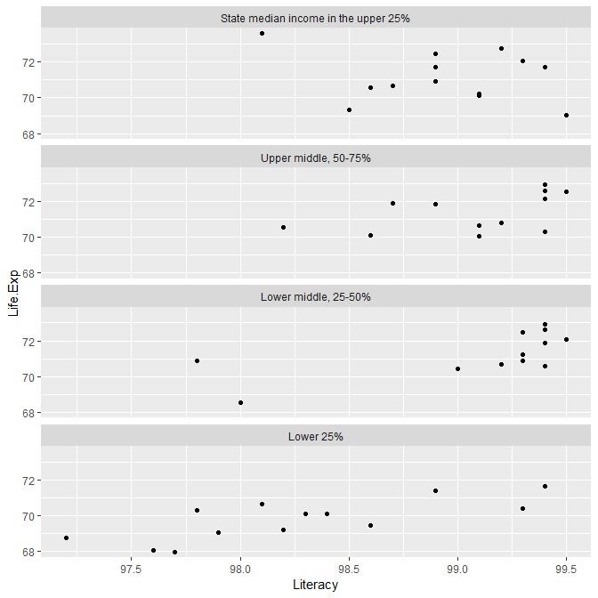
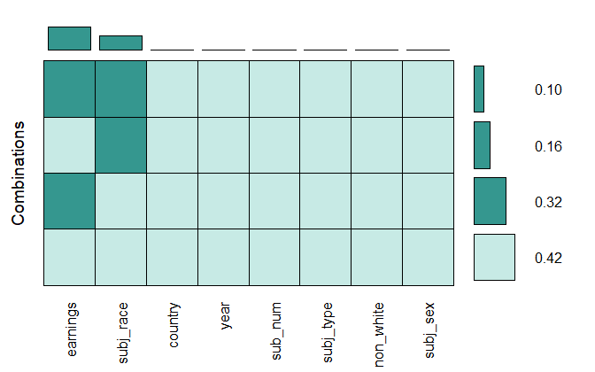
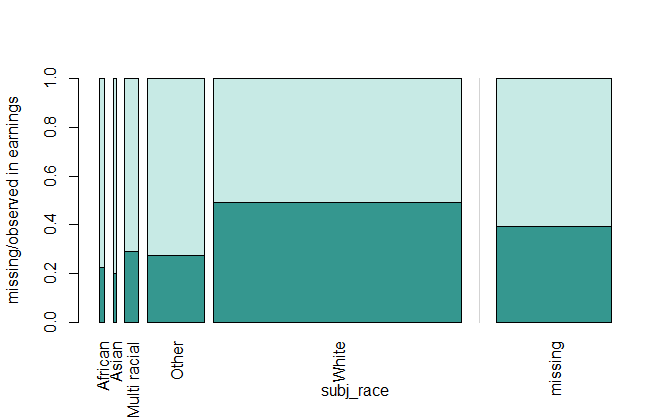

misc data carpentry
================

 <small> <br>
<i>Stairs To Nowhere</i> by nrg\_crisis is licensed under
<a href="https://creativecommons.org/licenses/by-nc/2.0/legalcode/">CC
BY-NC 2.0</a> <br> </small>

## contents

[introduction](#introduction)  
[prerequisites](#prerequisites)  
[comparison operators](#comparison-operators)  
[bind\_rows()](#bind_rows)  
[bind\_cols()](#bind_cols)  
[cut()](#cut)  
[visualizing missing values](#visualizing-missing-values)  
[dealing with missing values](#dealing-with-missing-values)  
[unloading a package](#unloading-a-package)  
[exercises](#exercises)  
[references](#references)

## introduction

A collection of miscellaneous data carpentry tools we haven’t needed in
our earlier work but that you should know about.

<br> <a href="#top">▲ top of page</a>

## prerequisites

Project setup

  - Start every work session by launching the RStudio Project file for
    the course, e.g., `portfolio.Rproj`  
  - Ensure your [project directory
    structure](cm501-proj-m-manage-files.md#planning-the-directory-structure)
    satisfies the course requirements

Ensure you have installed the following packages. See [install
packages](cm902-software-studio.md#install-packages) for instructions if
needed.

  - tidyverse  
  - nycflights13
  - wrapr
  - fivethirtyeight
  - VIM

Scripts to initialize

``` 
explore/     0703-misc-data-carpentry.R  
```

And start with a minimal header

``` r
# your name
# date

# load packages
library("tidyverse")
library("nycflights13")
library("wrapr")
```

Duplicate the lines of code in the session one chunk at a time. Save,
Source, and compare your results to the results shown.

<br> <a href="#top">▲ top of page</a>

## comparison operators

To filter by comparing a variable to something, R uses the standard
collection of relational operators `>`, `>=`, `<`, `<=`, `!=` (not
equal), and `==` (equal).

Relational operators return a logical `TRUE` or `FALSE`.

Be careful when looking for equality between two floating point numbers.

``` r
sqrt(2) ^ 2 == 2
#> [1] FALSE

1/49 * 49 == 1
#> [1] FALSE
```

Instead of relying on `==`, use `dplyr::near(x, y)` to compare floating
point numbers `x` and `y`,

``` r
dplyr::near(sqrt(2) ^ 2,  2)
#> [1] TRUE

dplyr::near(1 / 49 * 49, 1)
#> [1] TRUE
```

R includes the usual set of Boolean operators: AND `&`, OR `|`, XOR
`xor()`, and NOT `!`. If you haven’t encountered the exclusive-or (XOR),
it means:

  - XOR: true only when inputs different, i.e., one is true, the other
    is false
  - \!XOR: true only when both inputs are the same

The following code finds all flights that departed in November or
December:

``` r
data(flights, package = "nycflights13")
filter(flights, month == 11 | month == 12)
#> # A tibble: 55,403 x 19
#>     year month   day dep_time sched_dep_time dep_delay arr_time
#>    <int> <int> <int>    <int>          <int>     <dbl>    <int>
#>  1  2013    11     1        5           2359         6      352
#>  2  2013    11     1       35           2250       105      123
#>  3  2013    11     1      455            500        -5      641
#>  4  2013    11     1      539            545        -6      856
#>  5  2013    11     1      542            545        -3      831
#>  6  2013    11     1      549            600       -11      912
#>  7  2013    11     1      550            600       -10      705
#>  8  2013    11     1      554            600        -6      659
#>  9  2013    11     1      554            600        -6      826
#> 10  2013    11     1      554            600        -6      749
#> # ... with 55,393 more rows, and 12 more variables: sched_arr_time <int>,
#> #   arr_delay <dbl>, carrier <chr>, flight <int>, tailnum <chr>,
#> #   origin <chr>, dest <chr>, air_time <dbl>, distance <dbl>, hour <dbl>,
#> #   minute <dbl>, time_hour <dttm>
```

A useful shorthand is `x %in% y`. This will select every row where x is
one of the values in y. We could use it to rewrite the code above:

``` r
filter(flights, month %in% c(11, 12))
#> # A tibble: 55,403 x 19
#>     year month   day dep_time sched_dep_time dep_delay arr_time
#>    <int> <int> <int>    <int>          <int>     <dbl>    <int>
#>  1  2013    11     1        5           2359         6      352
#>  2  2013    11     1       35           2250       105      123
#>  3  2013    11     1      455            500        -5      641
#>  4  2013    11     1      539            545        -6      856
#>  5  2013    11     1      542            545        -3      831
#>  6  2013    11     1      549            600       -11      912
#>  7  2013    11     1      550            600       -10      705
#>  8  2013    11     1      554            600        -6      659
#>  9  2013    11     1      554            600        -6      826
#> 10  2013    11     1      554            600        -6      749
#> # ... with 55,393 more rows, and 12 more variables: sched_arr_time <int>,
#> #   arr_delay <dbl>, carrier <chr>, flight <int>, tailnum <chr>,
#> #   origin <chr>, dest <chr>, air_time <dbl>, distance <dbl>, hour <dbl>,
#> #   minute <dbl>, time_hour <dttm>
```

`filter()` only includes rows where its condition is TRUE; it excludes
both FALSE and NA values. If you want to preserve missing values, ask
for them explicitly:

``` r
# filter excludes NA values by default
filter(flights, dep_delay > 370)
#> # A tibble: 214 x 19
#>     year month   day dep_time sched_dep_time dep_delay arr_time
#>    <int> <int> <int>    <int>          <int>     <dbl>    <int>
#>  1  2013     1     1      848           1835       853     1001
#>  2  2013     1     1     2343           1724       379      314
#>  3  2013     1     2     2131           1512       379     2340
#>  4  2013     1     9      641            900      1301     1242
#>  5  2013     1    10     1121           1635      1126     1239
#>  6  2013     1    10     1525            900       385     1713
#>  7  2013     1    13     1809            810       599     2054
#>  8  2013     1    16     1622            800       502     1911
#>  9  2013     1    23     1551            753       478     1812
#> 10  2013    10     7     1858           1240       378     2025
#> # ... with 204 more rows, and 12 more variables: sched_arr_time <int>,
#> #   arr_delay <dbl>, carrier <chr>, flight <int>, tailnum <chr>,
#> #   origin <chr>, dest <chr>, air_time <dbl>, distance <dbl>, hour <dbl>,
#> #   minute <dbl>, time_hour <dttm>

# filter includes NA values if you so specify
filter(flights, is.na(dep_delay) | dep_delay > 30)
#> # A tibble: 56,546 x 19
#>     year month   day dep_time sched_dep_time dep_delay arr_time
#>    <int> <int> <int>    <int>          <int>     <dbl>    <int>
#>  1  2013     1     1      732            645        47     1011
#>  2  2013     1     1      749            710        39      939
#>  3  2013     1     1      811            630       101     1047
#>  4  2013     1     1      826            715        71     1136
#>  5  2013     1     1      848           1835       853     1001
#>  6  2013     1     1      903            820        43     1045
#>  7  2013     1     1      909            810        59     1331
#>  8  2013     1     1      953            921        32     1320
#>  9  2013     1     1      957            733       144     1056
#> 10  2013     1     1     1025            951        34     1258
#> # ... with 56,536 more rows, and 12 more variables: sched_arr_time <int>,
#> #   arr_delay <dbl>, carrier <chr>, flight <int>, tailnum <chr>,
#> #   origin <chr>, dest <chr>, air_time <dbl>, distance <dbl>, hour <dbl>,
#> #   minute <dbl>, time_hour <dttm>
```

## bind\_rows()

dplyr includes a `bind_rows()` function that allows you to bind data
frames by columns. When row-binding, columns are matched by name, and
any missing columns will be filled with NA.

To illustrate, let’s create two data frames that have the same column
names. Here, I’m using `wrapr::qchar_frame()` that builds a data frame
with character variables. Quotes are not required unless you have a
value that is more than one word (contains a space).

``` r
band1 <- wrapr::qchar_frame(
    name, surname |
        John, Lennon|
        Paul, McCartney|
        George, Harrison|
        Ringo, Starr
)

band1
#>     name   surname
#> 1   John    Lennon
#> 2   Paul McCartney
#> 3 George  Harrison
#> 4  Ringo     Starr

band2 <- wrapr::qchar_frame(
    name, surname |
        Mic, Jagger|
        Keith, Richards|
        Charlie, Watts|
        Ronnie, Wood
)

band2
#>      name  surname
#> 1     Mic   Jagger
#> 2   Keith Richards
#> 3 Charlie    Watts
#> 4  Ronnie     Wood
```

Check that the two data frames have the same columns names.

``` r
all_equal(names(band1), names(band2))
#> [1] TRUE
```

If true, then you can bind by rows.

``` r
bind_rows(band1, band2)
#>      name   surname
#> 1    John    Lennon
#> 2    Paul McCartney
#> 3  George  Harrison
#> 4   Ringo     Starr
#> 5     Mic    Jagger
#> 6   Keith  Richards
#> 7 Charlie     Watts
#> 8  Ronnie      Wood
```

In this case it would be convenient to add a new column with the band
name. One approach is to add the new variable at the same time you bind
by rows.

``` r
bind_rows(.id = "band", "Beatles" = band1, "Stones" = band2) 
#>      band    name   surname
#> 1 Beatles    John    Lennon
#> 2 Beatles    Paul McCartney
#> 3 Beatles  George  Harrison
#> 4 Beatles   Ringo     Starr
#> 5  Stones     Mic    Jagger
#> 6  Stones   Keith  Richards
#> 7  Stones Charlie     Watts
#> 8  Stones  Ronnie      Wood
```

## bind\_cols()

dplyr includes a `bind_cols()` function that allows you to bind data
frames by columns. When column-binding, rows are matched by position, so
all data frames must have the same number of rows.

This approach can be error-prone: it depends on the rows of both data
frames being in the same order so that the rows match by position.

Instead, I suggest you use joins with coordinatized data.

<!-- ## rbind()  -->

<!-- For example, let's use the data frame of word spoken in the Lord of the Rings -->

<!-- ```{r} -->

<!-- dialogue <- read_csv("https://raw.githubusercontent.com/MokoSan/FSharpAdvent/master/Data/WordsByCharacter.csv") %>%  -->

<!--    select(Film, Character, Race, Words) %>%  -->

<!--    arrange(desc(Words)) %>%  -->

<!--    glimpse() -->

<!-- dialogue <- dialogue %>%  -->

<!--    mutate(Race  = fct_recode(Race, "Human" = "Men")) %>%  -->

<!--    mutate(Race  = fct_recode(Race, "Hobbit" = "Gollum")) -->

<!-- characters <- wrapr::build_frame( -->

<!--    "Sex",  "Character" | -->

<!--        "M",  "Gandalf"| -->

<!--        "F",  "Galadriel"|           -->

<!--        "M",  "Bilbo"|      -->

<!--        "M",  "Gollum"| -->

<!--        "M",  "Saruman"| -->

<!--        "M",  "Elrond"| -->

<!--        "M",  "Denethor"| -->

<!--        "M",  "Boromir"| -->

<!--        "M",  "Theoden"| -->

<!--        "M",  "Treebeard"| -->

<!--        "M",  "Sam"| -->

<!--        "M",  "Grima Wormtongue"| -->

<!--        "M",  "Eomer"| -->

<!--        "M",  "Faramir"| -->

<!--        "M",  "Frodo"| -->

<!--        "M",  "Merry"| -->

<!--        "F",  "Arwen"| -->

<!--        "M",  "Legolas"| -->

<!--        "M",  "Pippin"| -->

<!--        "NA", "Orc"| -->

<!--        "M",  "Aragorn"| -->

<!--        "M",  "Celeborn"| -->

<!--        "M",  "Smeagol"| -->

<!--        "NA", "Mouth Of Sauron"|        -->

<!--        "M",  "Gimli"|    -->

<!--        "M",  "Innkeeper"| -->

<!--        "F",  "Eowyn"| -->

<!--        "M",  "Gondor Man"| -->

<!--        "M",  "Ted"| -->

<!--        "NA", "Shagrat"|        -->

<!--        "Unk", "Hobbits"|    -->

<!--        "M",  "King Of The Dead"| -->

<!--        "M",  "Haldir"| -->

<!--        "NA", "Ugluk"| -->

<!--        "NA", "Gothmog"| -->

<!--        "NA", "Grishnakh"| -->

<!--        "M",  "Gatekeeper"| -->

<!--        "F",  "Morwen"| -->

<!--        "M",  "Gamling"| -->

<!--        "M",  "Rohan Warrior"| -->

<!--        "M",  "Hama"| -->

<!--        "M",  "Madril"| -->

<!--        "F",  "Freda"| -->

<!--        "M",  "Witch King"| -->

<!--        "F",  "Haleth"| -->

<!--        "NA", "Grobag"| -->

<!--        "M",  "Gaffer"| -->

<!--        "M",  "Farmer Maggot"| -->

<!--        "Unk", "Voice Of The Ring"| -->

<!--        "M",  "Sandyman"| -->

<!--        "F",  "Rohan Maiden"| -->

<!--        "M",  "Man"| -->

<!--        "NA", "Uruk-hai"| -->

<!--        "M",  "Deagol"| -->

<!--        "M",  "Irolas"| -->

<!--        "M",  "Wild Man"| -->

<!--        "Unk",  "Hobbit Kids"| -->

<!--        "NA", "Snaga"| -->

<!--        "M",  "Grimhold"| -->

<!--        "F",  "Lobelia Sackville-Baggins"| -->

<!--        "M",  "Voice Of Sauron"| -->

<!--        "M",  "Figwit"| -->

<!--        "M",  "Boson"| -->

<!--        "M",  "Nazgul"| -->

<!--        "NA", "Lurtz"| -->

<!--        "Unk", "Crowd"| -->

<!--        "M",  "Mercenary"| -->

<!--        "F",  "Rosie"| -->

<!--        "M",  "Damrod" | -->

<!--        "F",  "Mrs. Bracegirdle" | -->

<!--        "NA", "Mauhur" | -->

<!--        "M",  "Eothain" | -->

<!--        "M",  "Proudfoot"| -->

<!--        "M",  "Isildur" -->

<!-- ) -->

<!-- dialogue <- left_join(dialogue, characters, by = "Character") %>%  -->

<!--    mutate(Sex = ifelse(Race == "Orc", NA, Sex)) %>%  -->

<!--    mutate(Sex = ifelse(Race == "Nazgul", "M", Sex)) %>%  -->

<!--    mutate(Sex = ifelse(Race == "Dead", "Unk", Sex)) %>%  -->

<!--    mutate(Sex = fct_recode(Sex,  -->

<!--                                                    "Female" = "F",  -->

<!--                                                    "Male" = "M")) -->

<!-- grouping_variables <- c("Character", "Race", "Sex") -->

<!-- dialogue <- seplyr::group_summarise(dialogue,  -->

<!--                                                                     grouping_variables,  -->

<!--                                                                     Words = sum(Words)) %>%  -->

<!--    arrange(desc(Words)) -->

<!-- kable(dialogue) -->

<!-- grouping_variables <- c("Race", "Sex") -->

<!-- dialogue <- seplyr::group_summarise(dialogue,  -->

<!--                                                                     grouping_variables,  -->

<!--                                                                     Words = sum(Words)) %>%  -->

<!--    arrange(desc(Words)) -->

<!-- kable(dialogue) -->

<!-- ``` -->

## cut()

*cut()* is a base-R function that creates divides your data into bins.
It can be useful when one wishes to convert a continuous variable into
factors used for faceting.

``` r
data(state)
df <- data.frame(state.x77)

# state names are in the row names
df <- df %>% 
        rownames_to_column("State") %>% 
        glimpse() 
#> Observations: 50
#> Variables: 9
#> $ State      <chr> "Alabama", "Alaska", "Arizona", "Arkansas", "Califo...
#> $ Population <dbl> 3615, 365, 2212, 2110, 21198, 2541, 3100, 579, 8277...
#> $ Income     <dbl> 3624, 6315, 4530, 3378, 5114, 4884, 5348, 4809, 481...
#> $ Illiteracy <dbl> 2.1, 1.5, 1.8, 1.9, 1.1, 0.7, 1.1, 0.9, 1.3, 2.0, 1...
#> $ Life.Exp   <dbl> 69.05, 69.31, 70.55, 70.66, 71.71, 72.06, 72.48, 70...
#> $ Murder     <dbl> 15.1, 11.3, 7.8, 10.1, 10.3, 6.8, 3.1, 6.2, 10.7, 1...
#> $ HS.Grad    <dbl> 41.3, 66.7, 58.1, 39.9, 62.6, 63.9, 56.0, 54.6, 52....
#> $ Frost      <dbl> 20, 152, 15, 65, 20, 166, 139, 103, 11, 60, 0, 126,...
#> $ Area       <dbl> 50708, 566432, 113417, 51945, 156361, 103766, 4862,...
```

Use *cut* to create a new factor variable with the levels “Lowest 25%”,
“Lower middle”, “Upper middle”, “Top 25%”

``` r
df <- df %>% 
        mutate(Income_bins = cut(
                Income,  
                include.lowest = TRUE, 
                breaks = quantile(Income, probs = c(0, 0.25, 0.5, 0.75, 1)), 
                labels = c("Lower 25%", 
                        "Lower middle, 25-50%", 
                        "Upper middle, 50-75%", 
                        "State median income in the upper 25%")
                )) %>% 
        glimpse()
#> Observations: 50
#> Variables: 10
#> $ State       <chr> "Alabama", "Alaska", "Arizona", "Arkansas", "Calif...
#> $ Population  <dbl> 3615, 365, 2212, 2110, 21198, 2541, 3100, 579, 827...
#> $ Income      <dbl> 3624, 6315, 4530, 3378, 5114, 4884, 5348, 4809, 48...
#> $ Illiteracy  <dbl> 2.1, 1.5, 1.8, 1.9, 1.1, 0.7, 1.1, 0.9, 1.3, 2.0, ...
#> $ Life.Exp    <dbl> 69.05, 69.31, 70.55, 70.66, 71.71, 72.06, 72.48, 7...
#> $ Murder      <dbl> 15.1, 11.3, 7.8, 10.1, 10.3, 6.8, 3.1, 6.2, 10.7, ...
#> $ HS.Grad     <dbl> 41.3, 66.7, 58.1, 39.9, 62.6, 63.9, 56.0, 54.6, 52...
#> $ Frost       <dbl> 20, 152, 15, 65, 20, 166, 139, 103, 11, 60, 0, 126...
#> $ Area        <dbl> 50708, 566432, 113417, 51945, 156361, 103766, 4862...
#> $ Income_bins <fct> "Lower 25%", "State median income in the upper 25%...
```

To abide by the convention that generally a higher number is “better”,
I’m going to create a new variable `Literacy` that is the reverse of
`Illiteracy`.

``` r
df <- df %>% 
        mutate(Literacy = 100 - Illiteracy)
```

Ready to graph life expectancy as a function of literacy faceted by
income quartiles.

``` r
ggplot(data = df, mapping = aes(x = Literacy, y = Life.Exp)) +
    geom_point() +
    facet_wrap(vars(Income_bins), ncol = 1, as.table = FALSE)
```



## visualizing missing values

Visualizing missing values is part of the data carpentry process—these
graphs would not necessarily be part of a portfolio presentation, but
are part of you investigation of the data.

Using the VIM package to visualize missing data. I’m using the `biopics`
data set from fivethirtyeight.

First, some data carpentry.

``` r
data(biopics, package = "fivethirtyeight")

biopics <- biopics %>%
        select(country, year_release, box_office, number_of_subjects, type_of_subject, subject_race, person_of_color, subject_sex) %>%
        mutate(subject_race = str_replace(subject_race, "^Hispanic", "Hispanic")) %>% 
        mutate(subject_race = str_replace(subject_race, "^African", "African")) %>%     
        mutate(subject_race = str_replace(subject_race, "^Middle", "Mid Eastern")) %>%  
        mutate(subject_race = ifelse(subject_race %in% c("White", "Asian", "African", "Hispanic", "Mid Eastern", "Multi racial", NA), subject_race, "Other")) %>%
        mutate(country          = factor(country),
                type_of_subject = factor(type_of_subject),
                subject_race    = factor(subject_race),
                subject_sex     = factor(subject_sex),
                person_of_color = as.integer(person_of_color)) %>%
        as.data.frame()

colnames(biopics) <- c("country", "year", "earnings", "sub_num", "subj_type", "subj_race", "non_white", "subj_sex")
```

Now we can use `VIM::aggr()` to create a graph that summarizes missing
data.

``` r
library("VIM")
aggr(biopics, 
        # color: observed, missing, imputed
        col = c(rcb("pale_BG"), rcb("mid_BG")), 
        numbers  = TRUE, 
        bars     = TRUE, 
        sortVars = TRUE, 
        prop     = TRUE, 
        combine  = TRUE
        )
```



    #> 
    #>  Variables sorted by number of missings: 
    #>   Variable Count
    #>   earnings   324
    #>  subj_race   197
    #>    country     0
    #>       year     0
    #>    sub_num     0
    #>  subj_type     0
    #>  non_white     0
    #>   subj_sex     0

Looking at the graph row-wise,

  - 42% of the rows are complete
  - 32% of the rows are missing earnings only
  - 16% of the rows are missing subject race only
  - 10% of the rows are missing both earnings and race

Column-wise we can extract that

  - 0.32 + 0.10 = 42% of the rows are missing earnings
  - 0.16 + 0.10 = 26% of the rows are missing race

We can also select two of the columns and visualize how their missing
values interact using `VIM::spineMiss()`. From the previous graph, we
see that earnings and race are the two variables that have the missing
values.

The width of the bars represents the relative frequency of the levels;
the height represents the relative proportion of missing to observed.
Thus the area represents the relative proportion of missing values among
these two values.

``` r
x <- biopics %>% 
    select("subj_race", "earnings")
spineMiss(x, 
                    col = c(rcb("pale_BG"), rcb("mid_BG")))
```



The bar chart at the far right gives an overall ratio of missing
earnings for all races combined.

## dealing with missing values

Dealing with missing values is beyond our scope of work, but you should
know that the essential approaches are

  - omit the missing observations  
  - impute the missing observations

Imputation is a process of replacing missing data with substituted
values that are a “best guess” at what the values would have been. I
have used the **mice** package for imputing missing data when necessary.

Some articles on imputation, for future reference:

  - [How to handle missing
    data](https://towardsdatascience.com/how-to-handle-missing-data-8646b18db0d4)  
  - [Imputing missing data with R: MICE
    package](https://datascienceplus.com/imputing-missing-data-with-r-mice-package/)  
  - [The mice
    package](https://cran.r-project.org/web/packages/mice/mice.pdf)

## unloading a package

We started the session by loading the tidyverse package. When we loaded
the VIM packages, we saw a string of messages in the Console, something
like this:

    > library("VIM")
    Loading required package: colorspace
    Loading required package: grid
    Loading required package: data.table
    data.table 1.12.0  Latest news: r-datatable.com
    
    Attaching package: ‘data.table’
    
    The following objects are masked from ‘package:dplyr’:
    
        between, first, last
    
    The following object is masked from ‘package:purrr’:
    
        transpose
    
    Attaching package: ‘VIM’
    
    The following object is masked from ‘package:datasets’:
    
        sleep

If the functions that have been masked are ones we know we will be
using, we can unload a package after using it with the base R function,
`unloadNamespace()`.

``` r
# unload a package
unloadNamespace("VIM")
```

## exercises

**1. D1 distributions**

Open a new explore file for your D1 display.

``` 
explore/d1-missing-values-explore.R    
```

  - From the source data frame, select only those variables you graph in
    the final data display
  - Use the VIM package to visualize the missing values in these
    variables
  - Add a comment about the missing values to your discussion and a
    brief explanation of what you did about the missing values (if any).

**2. D2 multiway**

Open a new explore file for your D2 display.

``` 
explore/d2-missing-values-explore.R    
```

Repeat the steps from above.

**3. D3 correlations**

Open a new explore file for your D3 display.

``` 
explore/d3-missing-values-explore.R    
```

Repeat the steps from above.

## references

<div id="refs">

<div id="ref-Wickham+Grolemund:2017">

Wickham H and Grolemund G (2017) *R for Data Science.* O’Reilly Media,
Inc., Sebastopol, CA <https://r4ds.had.co.nz/>

</div>

</div>

***
<a href="#top">&#9650; top of page</a>    
[&#9665; calendar](../README.md#calendar)    
[&#9665; index](../README.md#index)
