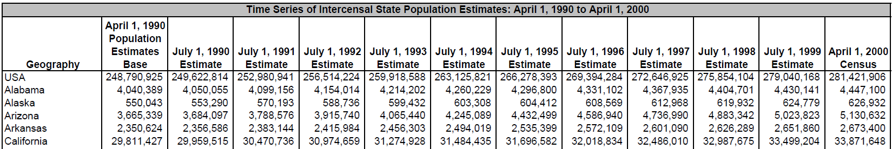
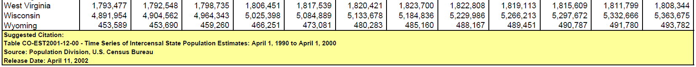

pdf scraping
================


<small> <br> <i>Time Series of Intercensal State Population Estimates:
April 1, 1990 to April 1, 2000</i> by the US Census. <br> </small>

## contents

[introduction](#introduction)  
[download pdf](#download-pdf)  
[read pdf](#read-pdf)  
[split into rows](#split-into-rows)  
[keep selected rows](#keep-selected-rows)  
[column separation](#column-separation)  
[combine pages](#combine-pages)  
[reshape](#reshape)  
[write to file](#write-to-file)  
[references](#references)

## introduction

I’m using a specific example to illustrate the using pdftools to convert
a pdf table to text, tidyverse to transform the data, and cdata to
reshape it.

  - I’ve borrowed the pdftools steps from (Rodrigues,
    [2018](#ref-Rodrigues:2018))
  - I’ve borrowed the cdata reshaping procedure from (Mount and Zumel,
    [2019](#ref-Mount+Zumel:2019:data-layout-exercises))

## download pdf

Packages

``` r
library("tidyverse")
library("pdftools")
library("cdata")
```

Download the file and write it to `data-raw` directory.

``` r
url <- "https://www2.census.gov/programs-surveys/popest/tables/1990-2000/intercensal/st-co/co-est2001-12-00.pdf" 

# my file name
data_raw_file <- "data-raw/census-1990-2000-population-by-state.pdf"

# only download once
if (!file.exists(data_raw_file)) {
        download.file(url, data_raw_file, mode = "wb") 
}
```

## read pdf

Read the pdf using `pdf_text()`.

``` r
txt <- pdf_text(data_raw_file)


str(txt)
#>  chr [1:2] "                                               Time Series of Intercensal State Population Estimates: April 1, "| __truncated__ ...
```

The `txt` object has two long character strings. Each page is one
string.

``` r
# assign each page to its own object 
page1 <- txt[1]
page2 <- txt[2]


# each is one long string 
str(page1)
#>  chr "                                               Time Series of Intercensal State Population Estimates: April 1, "| __truncated__
str(page2)
#>  chr "                                                            Time Series of Intercensal State Population Estimat"| __truncated__


# view the first several hundred characters
str_trim(str_sub(page1, 1, 751))
#> [1] "Time Series of Intercensal State Population Estimates: April 1, 1990 to April 1, 2000\r\n                     April 1, 1990\r\n                      Population\r\n                      Estimates July 1, 1990 July 1, 1991 July 1, 1992 July 1, 1993 July 1, 1994 July 1, 1995 July 1, 1996 July 1, 1997 July 1, 1998 July 1, 1999 April 1, 2000\r\n      Geography         Base       Estimate   Estimate      Estimate      Estimate      Estimate    Estimate       Estimate       Estimate   Estimate  Estimate     Census\r\nUSA                  248,790,925 249,622,814 252,980,941 256,514,224 259,918,588 263,125,821 266,278,393 269,394,284 272,646,925 275,854,104 279,040,168 281,421,906\r\nAlabama                4,040,389"
```

Looking at the first few hundred characters in this string, we see the
characters `\r\n` following text at the end of every row in the original
table.

The Internet tells us that:

  - `\r` CR (carriage return), used as a new line character in Mac OS
    before X
  - `\n` LF (line feed), used as a new line character in Unix/Mac OS X
  - `\r\n` CR + LF, used as a new line character in Windows

Forewarning: The next steps are eventually collected into a user-defined
function so we can apply the same steps to page 1 and page 2.

## split into rows

We use `str_split()` to split the long string to create a matrix having
one row and 48 columns. The split occurs at every instance of at every
instance of `\r\n`

``` r
table <- str_split(page1, "\r\n", simplify = TRUE) %>% 
        glimpse()
#>  chr [1, 1:48] "                                               Time Series of Intercensal State Population Estimates: April 1, "| __truncated__ ...


class(table)
#> [1] "matrix"


attributes(table)
#> $dim
#> [1]  1 48
```

## keep selected rows

Looking at the original PDF, the data I want starts with the word
“Alabama” and ends with the string just before “Page 1 of 2”. Use
`str_which()` to find the location of these terms then subset the matrix

``` r
# identify the first and last strings we want to keep 
table_start  <- str_which(table, "Alabama")
table_end    <- str_which(table, "Page 1 of 2") - 1

# subset the table 
table <- table[1, table_start : table_end] %>% 
        glimpse()
#>  chr [1:40] "Alabama                4,040,389   4,050,055   4,099,156    4,154,014      4,214,202    4,260,229    4,296,800 "| __truncated__ ...
```

## column separation

In this particular data set, the original table columns are separated by
spaces. Commas are used as digit separators only, so I can remove the
commas.

``` r
table <- str_replace_all(table, ",", "") %>% 
        glimpse()
#>  chr [1:40] "Alabama                4040389   4050055   4099156    4154014      4214202    4260229    4296800      4331102  "| __truncated__ ...
```

Eventually I will want to use `dplyr::separate()` to split each row of
the matrix into multiple columns. In anticipation of that, I replace a
string of one or more spaces with a semicolon `;` using regular
expressions.

Regular expression syntax:

  - `\s` space
  - `{1,}` one or more  
  - [cheat sheet](http://www.rexegg.com/regex-quickstart.html#ref) for
    regular expressions

<!-- end list -->

``` r
table <- str_replace_all(table, "\\s{1,}", ";") %>% 
        glimpse()
#>  chr [1:40] "Alabama;4040389;4050055;4099156;4154014;4214202;4260229;4296800;4331102;4367935;4404701;4430141;4447100" ...
```

Great except for state names that have spaces such as New Hampshire,
North Dakota, etc.

``` r
# example 
table[30]
#> [1] "New;Hampshire;1109252;1112384;1109929;1117784;1129458;1142560;1157561;1174719;1189425;1205940;1222014;1235786"
```

I’ll use `str_replace()` again to replace every instance of `New;` with
`New` (i.e., followed by one space)

``` r
table <- str_replace_all(table, "District;of;Columbia", "District of Columbia")
table <- str_replace_all(table, "New;",   "New ")
table <- str_replace_all(table, "North;", "North ")
table <- str_replace_all(table, "South;", "South ")
table <- str_replace_all(table, "Rhode;", "Rhode ")
table <- str_replace_all(table, "West;",  "West ")


# example 
table[30]
#> [1] "New Hampshire;1109252;1112384;1109929;1117784;1129458;1142560;1157561;1174719;1189425;1205940;1222014;1235786"
```

Now the table can be made into a tibble,

``` r
table <- tibble::enframe(table, name = NULL, value = "state")


table
#> # A tibble: 40 x 1
#>    state                                                                   
#>    <chr>                                                                   
#>  1 Alabama;4040389;4050055;4099156;4154014;4214202;4260229;4296800;4331102~
#>  2 Alaska;550043;553290;570193;588736;599432;603308;604412;608569;612968;6~
#>  3 Arizona;3665339;3684097;3788576;3915740;4065440;4245089;4432499;4586940~
#>  4 Arkansas;2350624;2356586;2383144;2415984;2456303;2494019;2535399;257210~
#>  5 California;29811427;29959515;30470736;30974659;31274928;31484435;316965~
#>  6 Colorado;3294473;3307618;3387119;3495939;3613734;3724168;3826653;391997~
#>  7 Connecticut;3287116;3291967;3302895;3300712;3309175;3316121;3324144;333~
#>  8 Delaware;666168;669567;683080;694925;706378;717545;729734;740977;751487~
#>  9 District of Columbia;606900;605321;600870;597565;595301;589239;580517;5~
#> 10 Florida;12938071;13033307;13369798;13650553;13927185;14239444;14537875;~
#> # ... with 30 more rows
```

Separate into columns

``` r
table <- table %>% 
        separate(col = "state", 
                into = c("state", "base", seq(1990, 1999), "census"), 
                sep = ";")


table
#> # A tibble: 40 x 13
#>    state base  `1990` `1991` `1992` `1993` `1994` `1995` `1996` `1997`
#>    <chr> <chr> <chr>  <chr>  <chr>  <chr>  <chr>  <chr>  <chr>  <chr> 
#>  1 Alab~ 4040~ 40500~ 40991~ 41540~ 42142~ 42602~ 42968~ 43311~ 43679~
#>  2 Alas~ 5500~ 553290 570193 588736 599432 603308 604412 608569 612968
#>  3 Ariz~ 3665~ 36840~ 37885~ 39157~ 40654~ 42450~ 44324~ 45869~ 47369~
#>  4 Arka~ 2350~ 23565~ 23831~ 24159~ 24563~ 24940~ 25353~ 25721~ 26010~
#>  5 Cali~ 2981~ 29959~ 30470~ 30974~ 31274~ 31484~ 31696~ 32018~ 32486~
#>  6 Colo~ 3294~ 33076~ 33871~ 34959~ 36137~ 37241~ 38266~ 39199~ 40182~
#>  7 Conn~ 3287~ 32919~ 33028~ 33007~ 33091~ 33161~ 33241~ 33366~ 33493~
#>  8 Dela~ 6661~ 669567 683080 694925 706378 717545 729734 740977 751487
#>  9 Dist~ 6069~ 605321 600870 597565 595301 589239 580517 572377 567736
#> 10 Flor~ 1293~ 13033~ 13369~ 13650~ 13927~ 14239~ 14537~ 14853~ 15186~
#> # ... with 30 more rows, and 3 more variables: `1998` <chr>, `1999` <chr>,
#> #   census <chr>
```

## combine pages

These steps have to be repeated for page 2, so I collect the steps from
above into a function `clean_table()` that I can apply to each page, one
at a time.

``` r
clean_table <- function(table, table_start, table_end){
        table       <- str_split(table, "\r\n", simplify = TRUE)
        table_start <- str_which(table, table_start)
        table_end   <- str_which(table, table_end)
        table       <- table[1, (table_start):(table_end - 1)]
        table <- str_replace_all(table, ",", "")
        table <- str_replace_all(table, "\\s{1,}", ";")
        table <- str_replace_all(table, "District;of;Columbia", "District of Columbia")
        table <- str_replace_all(table, "New;",   "New ")
        table <- str_replace_all(table, "North;", "North ")
        table <- str_replace_all(table, "South;", "South ")
        table <- str_replace_all(table, "Rhode;", "Rhode ")
        table <- str_replace_all(table, "West;",  "West ")
        table <- tibble::enframe(table, name = NULL, value = "state")
}
```

Applying the new function to both pages,

``` r
clean_page1 <- clean_table(page1, "Alabama", "Page 1 of 2")
clean_page2 <- clean_table(page2, "South Carolina", "Suggested")
```

Use `bind_rows()` to combine the two pages and then separate the tibble
into columns. The column names I write out manually (should be
automated).

``` r
clean <- bind_rows(clean_page1, clean_page2) %>% 
        separate(col = "state", 
                into = c("state", "base", seq(1990, 1999), "census"), 
                sep = ";")
```

## reshape

Now I’m ready to gather the years into a column using
`cdata::rowrecs_to_blocks()`. In a recent post, a systematic approach

``` r
# identify the record key
recordKeys <- "state"

# specify the outgoing record shape
outgoing_record <- wrapr::qchar_frame(
        "year", "population"|
        "1990", "1990" |
        "1991", "1991" |
        "1992", "1992" |
        "1993", "1993" |
        "1994", "1994" |
        "1995", "1995" |
        "1996", "1996" |
        "1997", "1997" |
        "1998", "1998" |
        "1999", "1999" 
        )

# specify the layout 
layout <- rowrecs_to_blocks_spec(
        outgoing_record,
        recordKeys = recordKeys)
```

Having setup the data reshaping, we apply it.

``` r
# apply the layout
df <- clean %.>% 
        layout %.>% 
        as_tibble(.) %>% 
        glimpse(.)
#> Observations: 510
#> Variables: 3
#> $ state      <chr> "Alabama", "Alabama", "Alabama", "Alabama", "Alabam...
#> $ year       <chr> "1990", "1991", "1992", "1993", "1994", "1995", "19...
#> $ population <chr> "4050055", "4099156", "4154014", "4214202", "426022...
```

Now we can convert the year and population variables to integers.

``` r
df <- df %>% 
        mutate(year = as.integer(year), population = as.integer(population))


df
#> # A tibble: 510 x 3
#>    state    year population
#>    <chr>   <int>      <int>
#>  1 Alabama  1990    4050055
#>  2 Alabama  1991    4099156
#>  3 Alabama  1992    4154014
#>  4 Alabama  1993    4214202
#>  5 Alabama  1994    4260229
#>  6 Alabama  1995    4296800
#>  7 Alabama  1996    4331102
#>  8 Alabama  1997    4367935
#>  9 Alabama  1998    4404701
#> 10 Alabama  1999    4430141
#> # ... with 500 more rows
```

There are 510 rows because we have 50 states plus DC, 10 years each. We
have two keys, state and year, and one value, population.

## write to file

As always, when data carpentry is concluded, we write to the data file

``` r
saveRDS(df, "data/0804-data-pdf-scraping-census.rds")
```

## references

<div id="refs">

<div id="ref-Mount+Zumel:2019:data-layout-exercises">

Mount J and Zumel N (2019) *Data layout exercises.* Win Vector LLC
<http://www.win-vector.com/blog/2019/04/data-layout-exercises/#more-6286>

</div>

<div id="ref-Rodrigues:2018">

Rodrigues B (2018) Getting data from pdfs using the pdftools package.
<https://www.brodrigues.co/blog/2018-06-10-scraping_pdfs/>

</div>

<div id="ref-Watanabe:2017">

Watanabe A (2017) US Census Bureau state-level population estimates,
1990–2016. <https://tinyurl.com/y58z8svf>

</div>

<div id="ref-Wickham+Grolemund:2017">

Wickham H and Grolemund G (2017) *R for Data Science.* O’Reilly Media,
Inc., Sebastopol, CA <https://r4ds.had.co.nz/>

</div>

</div>

***
<a href="#top">&#9650; top of page</a>    
[&#9665; calendar](../README.md#calendar)    
[&#9665; index](../README.md#index)
