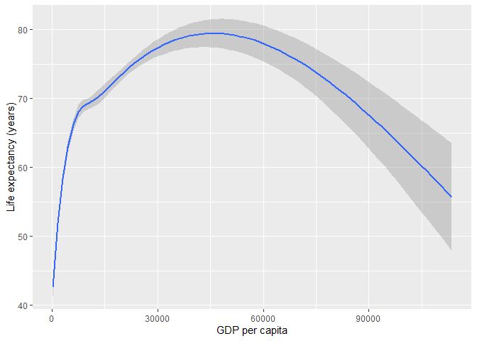
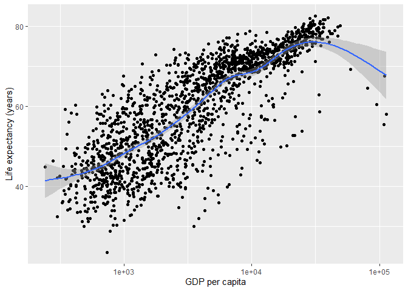
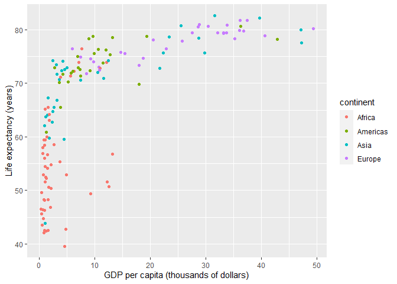

graph basics
================

 <small> <br>
<i>Decline</i> by Randall Munroe (xkcd.com) is licensed under
<a href="https://creativecommons.org/licenses/by-nc/2.5/">CC BY-NC
2.5</a> <br> </small>

An introduction to ggplot2 adapted from Chapter 3 from (Healy,
[2019](#ref-Healy:2019)). If you already have R experience, you might
still want to browse this section in case you find something new.

## contents

[prerequisites](#prerequisites)  
[first plot](#first-plot)  
[geom layers](#geom-layers)  
[log scale](#log-scale)  
[mapping aesthetics](#mapping-aesthetics)  
[setting properties](#setting-properties)  
[data carpentry](#data-carpentry)  
[facets](#facets)  
[ordering the panels](#ordering-the-panels)  
[beyond basics: a complex design](#beyond-basics-a-complex-design)  
[resize, save, and import the
image](#resize-save-and-import-the-image)  
[exercises](#exercises)  
[references](#references)

## prerequisites

  - Start every work session by launching `portfolio.Rproj`  
  - Your [project directory
    structure](cm501-proj-m-manage-files.md#plan-the-directory-structure)
    satisfies the course requirements

If any of these packages have not yet been installed, they can be
installed using these commands,

    install.packages("tidyverse")
    install.packages("gapminder")
    devtools::install_github("graphdr/graphclassmate")
    devtools::install_github("kjhealy/socviz")

Use *File \> New File \> R Script* to create a new R script in your
`explore` directory

    explore/0201-graph-basics-explore.R 

At the top of the script, load the packages we’ll be using. As we work
through the tutorial, add each line of code, one at a time, to your
script. Save, Source, and check that your results match the results
shown here.

``` r
library("tidyverse")
library("gapminder")
library("graphclassmate")
```

<br> <a href="#top">▲ top of page</a>

## tidy data

If the data set is “tidy”, then every row is an observation and every
column is a variable. The `gapmainder` data frame is tidy. We use
`glimpse()` to get a look at the structure.

``` r
glimpse(gapminder)
#> Observations: 1,704
#> Variables: 6
#> $ country   <fct> Afghanistan, Afghanistan, Afghanistan, Afghanistan, ...
#> $ continent <fct> Asia, Asia, Asia, Asia, Asia, Asia, Asia, Asia, Asia...
#> $ year      <int> 1952, 1957, 1962, 1967, 1972, 1977, 1982, 1987, 1992...
#> $ lifeExp   <dbl> 28.801, 30.332, 31.997, 34.020, 36.088, 38.438, 39.8...
#> $ pop       <int> 8425333, 9240934, 10267083, 11537966, 13079460, 1488...
#> $ gdpPercap <dbl> 779.4453, 820.8530, 853.1007, 836.1971, 739.9811, 78...
```

And we can just type its name to see the first few rows,

``` r
gapminder
#> # A tibble: 1,704 x 6
#>    country     continent  year lifeExp      pop gdpPercap
#>    <fct>       <fct>     <int>   <dbl>    <int>     <dbl>
#>  1 Afghanistan Asia       1952    28.8  8425333      779.
#>  2 Afghanistan Asia       1957    30.3  9240934      821.
#>  3 Afghanistan Asia       1962    32.0 10267083      853.
#>  4 Afghanistan Asia       1967    34.0 11537966      836.
#>  5 Afghanistan Asia       1972    36.1 13079460      740.
#>  6 Afghanistan Asia       1977    38.4 14880372      786.
#>  7 Afghanistan Asia       1982    39.9 12881816      978.
#>  8 Afghanistan Asia       1987    40.8 13867957      852.
#>  9 Afghanistan Asia       1992    41.7 16317921      649.
#> 10 Afghanistan Asia       1997    41.8 22227415      635.
#> # ... with 1,694 more rows
```

Read more about [tidy
data](https://r4ds.had.co.nz/tidy-data.html#tidy-data-1) in (Wickham and
Grolemund, [2017](#ref-Wickham+Grolemund:2017)).

<br> <a href="#top">▲ top of page</a>

## first plot

`ggplot()` is a function from the ggplot2 package which is a package
within the tidyverse package.

``` r
p <- ggplot(data = gapminder)
```

  - `data = ...` assigns the dataframe

We add the mapping `aes()` argument,

``` r
p <- ggplot(data = gapminder, mapping = aes(x = gdpPercap, y = lifeExp))
```

  - `mapping = aes(...)` assigns variables from the dataframe (column
    names) to the x and y axis

If we try to print the graph by typing the name of the graph object
(everything in R is an object), we get an empty graph because we haven’t
told ggplot what sort of a graph we want.

``` r
p
```

<!-- -->

Because the graph will be a scatterplot, we use the `geom_point()`
layer.

``` r
p <- p + 
    geom_point()

p # print the graph
```

<!-- -->

We could also have simply added the layer to the original object,

``` r
p <- ggplot(data = gapminder, mapping = aes(x = gdpPercap, y = lifeExp)) +
    geom_point()

p # print the graph
```

<!-- -->

Notice that the default axis labels are the variables names from the
data frame. We can edit those with another layer

``` r
p <- p +
    labs(x = "GDP per capita", y = "Life expectancy (years)")

p # print the graph
```

<!-- -->

Or,

``` r
p <- ggplot(data = gapminder, mapping = aes(x = gdpPercap, y = lifeExp)) +
    geom_point() +
    labs(x = "GDP per capita", y = "Life expectancy (years)")

p # print the graph
```

<!-- -->

Summary. The basics steps for building up the layers of any graph
consist of,

  - assign the dataframe
  - map the aesthetics
  - choose a geom
  - adjust scales, labels, etc.

<br> <a href="#top">▲ top of page</a>

## geom layers

Suppose you wanted a smooth fit curve only. You can use the
`geom_smooth()` layer to create a smooth curve and standard error
(shaded region).

``` r
p <- ggplot(data = gapminder, mapping = aes(x = gdpPercap, y = lifeExp)) +
    geom_smooth() +
    labs(x = "GDP per capita", y = "Life expectancy (years)")

p # print the graph
```

<!-- -->

You can show both the curve and the data by adding both layers,

``` r
p <- ggplot(data = gapminder, mapping = aes(x = gdpPercap, y = lifeExp)) +
    geom_smooth() +
    geom_point() +
    labs(x = "GDP per capita", y = "Life expectancy (years)")

p # print the graph
```

<!-- -->

Because the data points overprint the smooth curve, we can rearrange the
layer order to print the data markers then the fitted curve,

``` r
p <- ggplot(data = gapminder, mapping = aes(x = gdpPercap, y = lifeExp)) +
    geom_point() +
    geom_smooth() +
    labs(x = "GDP per capita", y = "Life expectancy (years)")

p # print the graph
```

<!-- -->

<br> <a href="#top">▲ top of page</a>

## log scale

We have orders of magnitude differences in the GDP per capita variable,
To confirm, let’s summarize the variable

``` r
summarytools::dfSummary(gapminder)
#> Data Frame Summary  
#> gapminder  
#> Dimensions: 1704 x 6  
#> Duplicates: 0  
#> 
#> ------------------------------------------------------------------------------------------------------------------------------------------
#> No   Variable     Stats / Values                          Freqs (% of Valid)     Graph                                  Valid    Missing  
#> ---- ------------ --------------------------------------- ---------------------- -------------------------------------- -------- ---------
#> 1    country      1. Afghanistan                            12 ( 0.7%)                                                  1704     0        
#>      [factor]     2. Albania                                12 ( 0.7%)                                                  (100%)   (0%)     
#>                   3. Algeria                                12 ( 0.7%)                                                                    
#>                   4. Angola                                 12 ( 0.7%)                                                                    
#>                   5. Argentina                              12 ( 0.7%)                                                                    
#>                   6. Australia                              12 ( 0.7%)                                                                    
#>                   7. Austria                                12 ( 0.7%)                                                                    
#>                   8. Bahrain                                12 ( 0.7%)                                                                    
#>                   9. Bangladesh                             12 ( 0.7%)                                                                    
#>                   10. Belgium                               12 ( 0.7%)                                                                    
#>                   [ 132 others ]                          1584 (93.0%)           IIIIIIIIIIIIIIIIII                                       
#> 
#> 2    continent    1. Africa                               624 (36.6%)            IIIIIII                                1704     0        
#>      [factor]     2. Americas                             300 (17.6%)            III                                    (100%)   (0%)     
#>                   3. Asia                                 396 (23.2%)            IIII                                                     
#>                   4. Europe                               360 (21.1%)            IIII                                                     
#>                   5. Oceania                               24 ( 1.4%)                                                                     
#> 
#> 3    year         Mean (sd) : 1979.5 (17.3)               12 distinct values     :                 :                    1704     0        
#>      [integer]    min < med < max:                                               :                 :                    (100%)   (0%)     
#>                   1952 < 1979.5 < 2007                                           : . . . . . . . . :                                      
#>                   IQR (CV) : 27.5 (0)                                            : : : : : : : : : :                                      
#>                                                                                  : : : : : : : : : :                                      
#> 
#> 4    lifeExp      Mean (sd) : 59.5 (12.9)                 1626 distinct values                 . :                      1704     0        
#>      [numeric]    min < med < max:                                                     . .     : :                      (100%)   (0%)     
#>                   23.6 < 60.7 < 82.6                                                   : : : : : :                                        
#>                   IQR (CV) : 22.6 (0.2)                                              : : : : : : : .                                      
#>                                                                                    . : : : : : : : :                                      
#> 
#> 5    pop          Mean (sd) : 29601212.3 (106157896.7)    1704 distinct values   :                                      1704     0        
#>      [integer]    min < med < max:                                               :                                      (100%)   (0%)     
#>                   60011 < 7023595.5 < 1318683096                                 :                                                        
#>                   IQR (CV) : 16791557.8 (3.6)                                    :                                                        
#>                                                                                  :                                                        
#> 
#> 6    gdpPercap    Mean (sd) : 7215.3 (9857.5)             1704 distinct values   :                                      1704     0        
#>      [numeric]    min < med < max:                                               :                                      (100%)   (0%)     
#>                   241.2 < 3531.8 < 113523.1                                      :                                                        
#>                   IQR (CV) : 8123.4 (1.4)                                        :                                                        
#>                                                                                  : : .                                                    
#> ------------------------------------------------------------------------------------------------------------------------------------------
```

In exploring a graph like this, it might be useful to add a layer that
changes the horizontal scale to a log-base-10 scale.

``` r
p <- p +
    scale_x_log10()

p # print the graph
```

<!-- -->

In this case, a linear fit might be an improvement. We add the argument
`method = "gam"` to the `geom_smooth()` layer.

``` r
p <- ggplot(data = gapminder, mapping = aes(x = gdpPercap, y = lifeExp)) +
    geom_point() +
    geom_smooth(method = "gam") +
    labs(x = "GDP per capita", y = "Life expectancy (years)") +
    scale_x_log10()

p # print the graph
```

<!-- -->

The scales package allows us to change the GDP scale to dollars. Using
the syntax `thepackage::thefunction` we can use the `scales::dollar`
function without loading the scales package.

``` r
p <- ggplot(data = gapminder, mapping = aes(x = gdpPercap, y = lifeExp)) +
    geom_point() +
    geom_smooth(method = "gam") +
    labs(x = "GDP per capita", y = "Life expectancy (years)") +
  scale_x_log10(labels = scales::dollar)

p # print the graph
```

<!-- -->

<br> <a href="#top">▲ top of page</a>

## mapping aesthetics

The aesthetics of the display—such as the type or color of the data
marker—can be mapped to a variable in the data frame. For example, color
maps continent as follows,

``` r
p <- ggplot(data = gapminder, 
            mapping = aes(x = gdpPercap, y = lifeExp, color = continent)) +
    geom_point() +
    geom_smooth(method = "gam") +
    labs(x = "GDP per capita", y = "Life expectancy (years)") +
  scale_x_log10(labels = scales::dollar)

p # print the graph
```

<!-- -->

You can see that ggplot groups all data by continent and assigns a color
to the data marker and the linear fit for each group of data. When
mapping aesthetics this way, the value of the argument must be a
variable name (column name) in the tidy dataframe.

The `aes()` function is for mapping to variables only, not to change
properties to a particular value.

<br> <a href="#top">▲ top of page</a>

## setting properties

If on the other hand we were fine with having all the data markers the
same color but we want to change the color, we don’t map it, we set it
in the geom. Here, the color purple has no meaning regarding the data.

``` r
p <- ggplot(data = gapminder, 
            mapping = aes(x = gdpPercap, y = lifeExp)) +
    geom_point(color = "purple") +
    geom_smooth(method = "gam") +
    labs(x = "GDP per capita", y = "Life expectancy (years)") +
  scale_x_log10(labels = scales::dollar)

p # print the graph
```

<!-- -->

Read more about [all the R color
names](http://www.stat.columbia.edu/~tzheng/files/Rcolor.pdf).

<br> <a href="#top">▲ top of page</a>

## data carpentry

Let’s examine the data to see how many country-year combinations we have
for each continent.

``` r
gapminder %>%
    count(continent)
#> # A tibble: 5 x 2
#>   continent     n
#>   <fct>     <int>
#> 1 Africa      624
#> 2 Americas    300
#> 3 Asia        396
#> 4 Europe      360
#> 5 Oceania      24
```

  - `count()` tells us the number of observations we have for each
    continent
  - `%>%` is the pipe operator. You can think of it as the word “then”.

Thus, this code chunk could be read as "Start with the `gapminder`
object **then** `count()` the number of observations grouped by the
levels of the `continent` variable.

It seems that Oceania is underrepresented in this data set, so I will
remove it using the `filter()` function

``` r
my_gapminder <- gapminder %>%
    filter(continent != "Oceania") %>%
    glimpse()
#> Observations: 1,680
#> Variables: 6
#> $ country   <fct> Afghanistan, Afghanistan, Afghanistan, Afghanistan, ...
#> $ continent <fct> Asia, Asia, Asia, Asia, Asia, Asia, Asia, Asia, Asia...
#> $ year      <int> 1952, 1957, 1962, 1967, 1972, 1977, 1982, 1987, 1992...
#> $ lifeExp   <dbl> 28.801, 30.332, 31.997, 34.020, 36.088, 38.438, 39.8...
#> $ pop       <int> 8425333, 9240934, 10267083, 11537966, 13079460, 1488...
#> $ gdpPercap <dbl> 779.4453, 820.8530, 853.1007, 836.1971, 739.9811, 78...
```

This chunk could be read, "Start with the `gapminder` data frame, assign
it to a new name `my_gapminder`, **then** filter to keep all continents
not equal (`!=`) to Oceania, **then** `glimpse()` the result.

Let’s examine how many years of data we have,

``` r
summary(my_gapminder$year)
#>    Min. 1st Qu.  Median    Mean 3rd Qu.    Max. 
#>    1952    1966    1980    1980    1993    2007
```

From the Hans Rosling TED talk, we know that global GDP and life
expectancy have changed dramatically since 1952, Therefore, I would like
to filter our data set to keep only the most recent year.

``` r
my_gapminder <- my_gapminder %>%
    filter(year == max(year)) %>%
    glimpse()
#> Observations: 140
#> Variables: 6
#> $ country   <fct> Afghanistan, Albania, Algeria, Angola, Argentina, Au...
#> $ continent <fct> Asia, Europe, Africa, Africa, Americas, Europe, Asia...
#> $ year      <int> 2007, 2007, 2007, 2007, 2007, 2007, 2007, 2007, 2007...
#> $ lifeExp   <dbl> 43.828, 76.423, 72.301, 42.731, 75.320, 79.829, 75.6...
#> $ pop       <int> 31889923, 3600523, 33333216, 12420476, 40301927, 819...
#> $ gdpPercap <dbl> 974.5803, 5937.0295, 6223.3675, 4797.2313, 12779.379...
```

This code chunk reads, “Start with `my_gapminder`, assign it to the same
object name, **then** `filter()` to keep those rows in which the `year`
variable is equal (`==`) to the maximum (`max()`) year, **then**
`glimpse()` the result.”

<br> <a href="#top">▲ top of page</a>

## facets

Let’s graph that version of the data and at the same time, change the
GDP numbers by dividing by 1000.

``` r
p <- ggplot(data = my_gapminder, 
            mapping = aes(x = gdpPercap / 1000, y = lifeExp)) +
    labs(x = "GDP per capita (thousands of dollars)", y = "Life expectancy (years)") +
    geom_point() 

p
```

<!-- -->

If we were to map the `continent` variable to color again, we would
have,

``` r
p <- ggplot(data = my_gapminder, 
            mapping = aes(x = gdpPercap / 1000, y = lifeExp, color = continent)) +
    labs(x = "GDP per capita (thousands of dollars)", y = "Life expectancy (years)") +
    geom_point() 

p # print the graph
```

<!-- -->

With the data by continent overlapping as much as it does, it is
difficult to visually compare the groups. in such cases, we prefer to
use facets or separate panels for each level of the categorical variable
(continent).

``` r
p <- ggplot(data = my_gapminder, 
            mapping = aes(x = gdpPercap / 1000, y = lifeExp)) +
    labs(x = "GDP per capita (thousands of dollars)", y = "Life expectancy (years)") +
    geom_point() +
    facet_wrap(facets = vars(continent))

p # print the graph
```

<!-- -->

Comparisons are facilitated by having the facets appear in one column,
by using the `ncols` argument of `facet_wrap()`.

``` r
p <- p +
    facet_wrap(facets = vars(continent), ncol = 1)

p # print the graph
```

<!-- -->

<br> <a href="#top">▲ top of page</a>

## ordering the panels

The panels should be ordered by the data, not alphabetically.

To do that, we require that the variable (in this case, continent) be
the type of variable called a factor so that we can order its levels by
the quantitative data (life expectancy).

``` r
glimpse(my_gapminder)
#> Observations: 140
#> Variables: 6
#> $ country   <fct> Afghanistan, Albania, Algeria, Angola, Argentina, Au...
#> $ continent <fct> Asia, Europe, Africa, Africa, Americas, Europe, Asia...
#> $ year      <int> 2007, 2007, 2007, 2007, 2007, 2007, 2007, 2007, 2007...
#> $ lifeExp   <dbl> 43.828, 76.423, 72.301, 42.731, 75.320, 79.829, 75.6...
#> $ pop       <int> 31889923, 3600523, 33333216, 12420476, 40301927, 819...
#> $ gdpPercap <dbl> 974.5803, 5937.0295, 6223.3675, 4797.2313, 12779.379...
```

The `<fct>` label in the glimpse above indicates that `continent` is a
factor variable. Therefore all we have to do is tell R that we want the
levels ordered by the median life expectancy in the continent.

``` r
my_gapminder <- my_gapminder %>%
    mutate(continent = fct_reorder(continent, lifeExp)) %>%
    glimpse()
#> Observations: 140
#> Variables: 6
#> $ country   <fct> Afghanistan, Albania, Algeria, Angola, Argentina, Au...
#> $ continent <fct> Asia, Europe, Africa, Africa, Americas, Europe, Asia...
#> $ year      <int> 2007, 2007, 2007, 2007, 2007, 2007, 2007, 2007, 2007...
#> $ lifeExp   <dbl> 43.828, 76.423, 72.301, 42.731, 75.320, 79.829, 75.6...
#> $ pop       <int> 31889923, 3600523, 33333216, 12420476, 40301927, 819...
#> $ gdpPercap <dbl> 974.5803, 5937.0295, 6223.3675, 4797.2313, 12779.379...
```

Here, the `mutate()` function overwrites `continent` with a new variable
of the same name with its levels reordered by the median life expectancy
of the continent.

``` r
p <- ggplot(data = my_gapminder, 
            mapping = aes(x = gdpPercap / 1000, y = lifeExp)) +
    labs(x = "GDP per capita (thousands of dollars)", y = "Life expectancy (years)") +
    geom_point() +
    facet_wrap(facets = vars(continent), ncol = 1, as.table = FALSE)

p # print the graph
```

<!-- -->

Setting the `as.table = FALSE` argument places the panel with the
highest median in the top panel.

<br> <a href="#top">▲ top of page</a>

## beyond basics: a complex design

To wrap up this introduction, I’ll show you how we can use functions in
various layers to show all the data in every panel, but highlight the
the continent data in the panel, making it easier to compare the
continent to the global data.

Without further explanation, here’s the code,

``` r
ggplot(data    = my_gapminder,
       mapping = aes(x  = gdpPercap / 1000, y = lifeExp)) +
    geom_point(data     = select(my_gapminder, -continent),
               size     = 1.25,
               color    = "#C7EAE5") +
    geom_smooth(data    = select(my_gapminder, -continent),
                method  = "loess",
                se      = FALSE,
                size    = 0.7,
                color   = "#35978F") +
    geom_point(mapping  = aes(color = continent),
               size     = 1.25,
               color    = "#01665E") +
    facet_wrap(vars(continent),
               ncol     = 1,
               as.table = FALSE) +
    labs(x = "GDP per capita (thousands of dollars)",
         y = "Life expectancy (years)",
         title   = "Life expectancy by country in 2007",
         caption = "Source: Gapminder") +
    theme_graphclass() +
    theme(legend.position = "none")
```

<!-- -->

The `theme_graphclass()` function is a set of graph design choices I’ve
included in the graphclassmate package for our use.

<br> <a href="#top">▲ top of page</a>

## resize, save, and import the image

For the best results in your portfolio, you should always conclude your
design by saving the image and sizing it at the same time,

``` r
ggsave(filename = "figures/0201-graph-basics-gapminder.png", 
       width = 6.5,
       height = 7.5,
       units = "in", 
       dpi = 300)

```


<br> <a href="#top">▲ top of page</a>

## exercises

**1. Gapminder**

  - Data: `gapminder` from the gapminder package.
  - Determine the number of observations.
  - Determine the number of variables.
  - Classify each variable as quantitative or categorical.
  - Classify each quantitative variable as continuous or discrete.
  - Classify each categorical variable as nominal or ordinal.

**2. Deciphering a script**

The code that creates the final graph has a number of functions and
arguments we have not discussed. The exercise is to find out for
yourself, to the best of your ability:

  - what each layer does  
  - what each argument within a layer accomplishes
  - recall that a function help page is seen by typing `? function_name`
    in the console
  - you can also experiment with the code by running it yourself, then
    commenting out a line or changing argument values to see what
    happens
  - you can search in the [text](https://r4ds.had.co.nz/)
  - you can search [Stack Exchange](https://stackexchange.com/).
    Remember to type `[R]` as the first term in a search string.

## references

<div id="refs">

<div id="ref-Healy:2019">

Healy K (2019) *Data Visualization: A Practical Introduction.* Princeton
University Press, Princeton, NJ
<https://kieranhealy.org/publications/dataviz/>

</div>

<div id="ref-Wickham+Grolemund:2017">

Wickham H and Grolemund G (2017) *R for Data Science.* O’Reilly Media,
Inc., Sebastopol, CA <https://r4ds.had.co.nz/>

</div>

</div>

***
<a href="#top">&#9650; top of page</a>    
[&#9665; calendar](../README.md#calendar)    
[&#9665; index](../README.md#index)
