strip plot
================

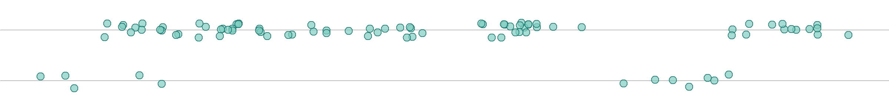

## contents

[introduction](#introduction)  
[prerequisites](#prerequisites)  
[explore](#explore)  
[carpentry](#carpentry)  
[design](#design)  
[report](#report)  
[exercises](#exercises)  
[references](#references)

## introduction

A *strip plot*—also called a strip chart, a univariate scatterplot, or a
jitter plot—is designed for displaying the distribution of a single
quantitative variable.

Data characteristics in tidy form

  - One quantitative variable in one column, values are numerical,
    continuous or discrete  
  - One categorical variable (if any) per column, values are the
    category levels, nominal or ordinal

Graph characteristics

  - Displays distributions of a single quantitative variable
  - Shows all the data values, not a summary  
  - Shows range, outliers, and clusters

Data can be grouped by one or more categorical variables and are often
jittered to avoid overprinting. However, as Robbins
([2013](#ref-Robbins:2013), 85) explains, “Even with jittering, the
plots will become indecipherable for a large number of observations with
a small range of values. In such a case,
[box-and-whisker](cm203-graph-boxplot.md#boxplot) plots are better for
comparing distributions.”

<br> <a href="#top">▲ top of page</a>

## prerequisites

Project setup

  - Start every work session by launching the RStudio Project file for
    the course, e.g., `portfolio.Rproj`  
  - Ensure your [project directory
    structure](cm501-proj-m-manage-files.md#planning-the-directory-structure)
    satisfies the course requirements

Packages: Ensure you have installed the following packages. See [install
packages](cm902-software-studio.md#install-packages) for instructions if
needed.

  - [**tidyverse**](http://tidyverse.tidyverse.org): The ‘tidyverse’ is
    a set of packages that work in harmony because they share common
    data representations and ‘API’ design. This package is designed to
    make it easy to install and load multiple ‘tidyverse’ packages in a
    single step. Learn more about the ‘tidyverse’ at
    <https://tidyverse.org>.
  - [**graphclassmate**](https://github.com/graphdr/graphclassmate): An
    R package with companion materials for a course in data
    visualization. The package provides data sets structured for a
    variety of graph types plus a ggplot2 theme.  
  - [**GDAdata**](https://CRAN.R-project.org/package=GDAdata): Datasets
    used in the book ‘Graphical Data Analysis with R’ (Antony Unwin, CRC
    Press 2015).

<br> <a href="#top">▲ top of page</a>

## explore

Create the R file `explore/0302-strip-plot-speedski-explore.R`. Start by
loading the packages.

``` r
library("tidyverse")
library("GDAdata")
```

We are using `SpeedSki` data from the GDAdata package (Unwin,
[2015](#ref-Unwin:2015:GDAdata)). If you want to learn more about the
data set, open its help page by running `? SpeedSki`.

For exploring the data, I assign it a new name, leaving the original
data frame unaltered.

``` r
explore <- SpeedSki %>% 
        glimpse()
```

    #> Observations: 91
    #> Variables: 10
    #> $ Rank       <int> 1, 2, 3, 4, 5, 6, 7, 8, 9, 10, 11, 12, 13, 14, 15, ...
    #> $ Bib        <int> 61, 59, 66, 57, 69, 75, 67, 58, 62, 56, 81, 80, 93,...
    #> $ FIS.Code   <int> 7039, 7078, 190130, 7178, 510089, 7204, 7053, 7170,...
    #> $ Name       <fct> ORIGONE Simone, ORIGONE Ivan, MONTES Bastien, SCHRO...
    #> $ Year       <int> 1979, 1987, 1985, 1979, 1970, 1993, 1975, 1991, 198...
    #> $ Nation     <fct> ITA, ITA, FRA, AUT, SUI, FRA, SWE, FRA, CZE, SWE, P...
    #> $ Speed      <dbl> 211.67, 209.70, 209.69, 209.67, 209.19, 208.33, 208...
    #> $ Sex        <fct> Male, Male, Male, Male, Male, Male, Male, Male, Mal...
    #> $ Event      <fct> Speed One, Speed One, Speed One, Speed One, Speed O...
    #> $ no.of.runs <int> 4, 4, 4, 4, 4, 4, 4, 4, 4, 4, 4, 4, 4, 4, 4, 4, 4, ...

The data set has 91 observations. The variables of interest are `Speed`,
`Sex`, and `Event`. Speed is numeric (`<dbl>`) and sex and event are
both factors (`<fct>`).

Speed (in km/hr) is the quantitative, continuous variable. The
statistical range, median, and quartiles are obtained using `summary()`,

``` r
# summarize the quantitative variable 
explore %>% 
        select(Speed) %>% 
        summary()
```

    #>      Speed      
    #>  Min.   :160.2  
    #>  1st Qu.:171.8  
    #>  Median :183.1  
    #>  Mean   :184.1  
    #>  3rd Qu.:192.3  
    #>  Max.   :211.7

Each observation is a unique person, so we can `count()` them by
category, yielding the list of levels for both categories as well as how
many people are in each group.

``` r
# categorical variables levels and count
explore %>% count(Sex, Event)
```

    #> # A tibble: 5 x 3
    #>   Sex    Event                     n
    #>   <fct>  <fct>                 <int>
    #> 1 Female Speed Downhill Junior     5
    #> 2 Female Speed One                 7
    #> 3 Male   Speed Downhill           29
    #> 4 Male   Speed Downhill Junior    11
    #> 5 Male   Speed One                39

Note that there are no women competing in Speed Downhill. It is
sometimes useful to make such implicit missing values into explicit
missing values using `complete()`.

``` r
explore %>% 
        count(Sex, Event) %>% 
        complete(Sex, Event, fill = list(n = 0)) %>% 
        arrange(desc(n))
```

    #> # A tibble: 6 x 3
    #>   Sex    Event                     n
    #>   <fct>  <fct>                 <dbl>
    #> 1 Male   Speed One                39
    #> 2 Male   Speed Downhill           29
    #> 3 Male   Speed Downhill Junior    11
    #> 4 Female Speed One                 7
    #> 5 Female Speed Downhill Junior     5
    #> 6 Female Speed Downhill            0

For our first graph of the data, we’ll look at the distribution of
speeds for all events. We don’t have a variable for “all events” so we
can add one,

``` r
# add a new category with one level
explore <- explore %>% 
        mutate(allevents = "All events")
```

Now we can plot using `x = Speed, y = allevents`.

``` r
# examine the full distribution 
ggplot(explore, aes(x = Speed, y = allevents)) +
        geom_point()
```

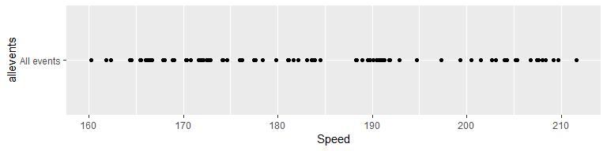

We reduce the amount of overprinting by replacing `geom_point()` with
`geom_jitter()`. So that subsequent data markers appear in the same
jittered locations we set the random number seed as well.

``` r
# full distribution, jittered
set.seed(20181216)
ggplot(explore, aes(x = Speed, y = allevents)) +
        geom_jitter(width = 0, height = 0.1)
```

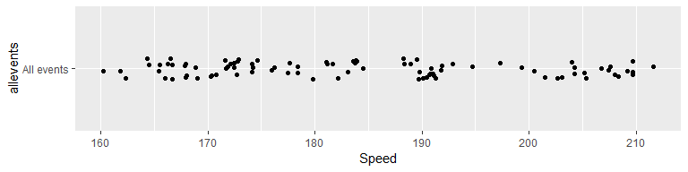

One approach to grouping data is by adding a color argument to the main
`aes()` function. For example, adding the argument `color = Event` shows
that the Speed One event has the largest number of competitors.

``` r
# group by event
ggplot(explore, aes(x = Speed, y = allevents, color = Event)) +
        geom_jitter(width = 0, height = 0.1) 
```

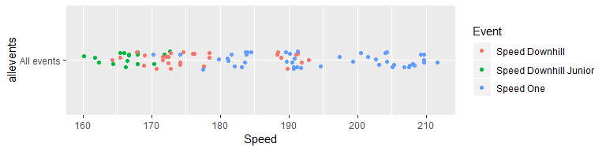

Changing the grouping to `color = Sex` shows that men significantly
outnumber women.

``` r
# group by sex
ggplot(explore, aes(x = Speed, y = allevents, color = Sex)) +
        geom_jitter(width = 0, height = 0.1) 
```

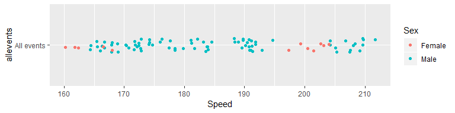

We have two categorical variables however, so assigning one to the
y-variable and one to the color argument may be more informative. For
example, assigning `y = Sex` and `color = Event` shows that men
outnumber women and that women competed in only two of the three events.

``` r
# group by sex and event, with sex on the rows
ggplot(SpeedSki, aes(x = Speed, y = Sex, color = Event)) +
        geom_jitter(width = 0, height = 0.1) 
```

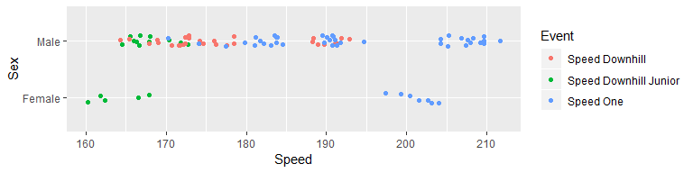

Swapping the category assignments to `y = Event` and `color = Sex`
yields a display that tells (perhaps) the most interesting story.

``` r
# with event on the rows
ggplot(SpeedSki, aes(x = Speed, y = Event, color = Sex)) +
        geom_jitter(width = 0, height = 0.1)
```

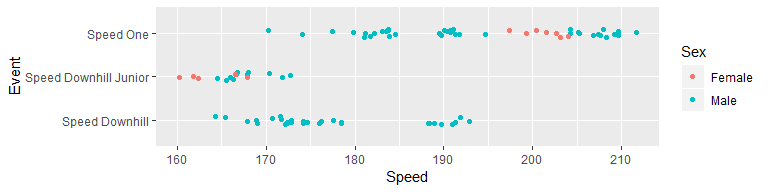

We see here that

  - Speed One is the fastest event  
  - Women competing in Speed One have little variance in speed and are
    faster than most (but not all) of the men competing in this event  
  - No women compete in Speed Downhill  
  - There is little variation among the Juniors

This concludes our initial exploration. This final graph will be the
starting point for the final design.

<br> <a href="#top">▲ top of page</a>

## carpentry

For data carpentry, we take what we learned from the exploration and
concisely prepare the data for the selected graph type and design.

Create the R file `carpentry/0302-strip-plot-speedski-data.R`. Start by
loading the packages.

``` r
library("tidyverse")
library("GDAdata")
```

I start by assigning a new data frame name, leaving the original data
frame unaltered.

``` r
# leave the original data frame unaltered
speed_ski <- SpeedSki
```

Select speed, event, and sex. Convert to a tibble.

``` r
# select only the variables I need
# use tibble for consistency through entire project
speed_ski <- speed_ski %>% 
        select(Event, Sex, Speed) %>% 
        as_tibble()
```

This data set is already tidy, but I prefer lower case variable names,

``` r
# prefer lowercase variable names
speed_ski <- speed_ski %>%
        rename(event = Event, sex = Sex, speed = Speed) %>% 
        glimpse()
```

    #> Observations: 91
    #> Variables: 3
    #> $ event <fct> Speed One, Speed One, Speed One, Speed One, Speed One, S...
    #> $ sex   <fct> Male, Male, Male, Male, Male, Male, Male, Male, Male, Ma...
    #> $ speed <dbl> 211.67, 209.70, 209.69, 209.67, 209.19, 208.33, 208.03, ...

From the exploration, I know I’ll want to order the event levels by the
median speeds, so I convert event to a factor and order its levels by
speed.

``` r
# factors for ordering data 
speed_ski <- speed_ski %>% 
        mutate(event = as_factor(event)) %>% 
        mutate(event = fct_reorder(event, speed))
```

A data carpentry file typically concludes by saving the data frame.

``` r
# RDS format preserves factors
saveRDS(speed_ski, "data/0302-strip-plot-speedski-data.rds")
```

<br> <a href="#top">▲ top of page</a>

## design

Create the R file `design/0302-strip-plot-speedski.R`. Start by loading
the packages.

``` r
library("tidyverse")
library("graphclassmate")
```

A design file typically starts by reading the tidy data file.

``` r
speed_ski <- readRDS("data/0302-strip-plot-speedski-data.rds") %>% 
        glimpse()
```

    #> Observations: 91
    #> Variables: 3
    #> $ event <fct> Speed One, Speed One, Speed One, Speed One, Speed One, S...
    #> $ sex   <fct> Male, Male, Male, Male, Male, Male, Male, Male, Male, Ma...
    #> $ speed <dbl> 211.67, 209.70, 209.69, 209.67, 209.19, 208.33, 208.03, ...

Draw the graph with the reordered event levels and the data increases
from left to right and from bottom to top.

``` r
p <- ggplot(speed_ski, aes(x = speed, y = event, color = sex)) +
        geom_jitter(width = 0, height = 0.1)
p
```

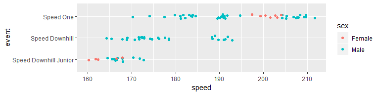

For formatting the graph, the `theme_graphclass()` is a good starting
point.

``` r
p <- p + 
        theme_graphclass()
p
```

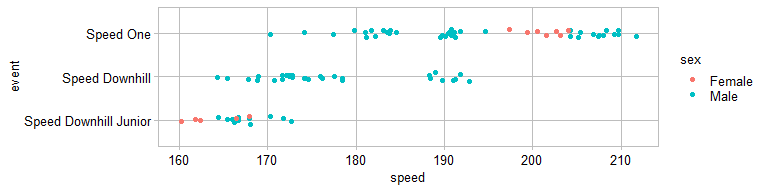

To manually control the data marker color, we use
`ggplot2::scale_color_manual()`. We are also using the
`graphclassmate::rcb()` function to consistently assign named colors
from the RColorBrewer package.

``` r
p <- p + 
        scale_color_manual(values = c(rcb("dark_BG"), rcb("dark_Br")))
p
```

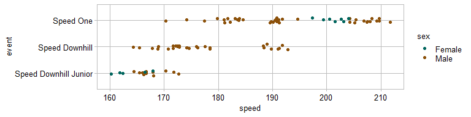

We can assign a separate fill color to a data marker by using `shape
= 21`, adding `fill = sex` to the `aes()` function, then using
`scale_fill_manual()` to assign the fill color. To do this, we redraw
the figure instead of adding a layer,

``` r
p <- ggplot(speed_ski, aes(x = speed, y = event, color = sex, fill = sex)) +
        geom_jitter(width = 0, height = 0.1, shape = 21) +
        theme_graphclass() +
        scale_color_manual(values = c(rcb("dark_BG"), rcb("dark_Br"))) +
        scale_fill_manual(values = c(rcb("mid_BG"), rcb("mid_Br")))
p
```

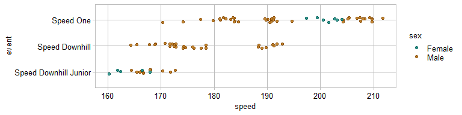

We can edit the data markers further by adding a `size` and `alpha`
argument to `geom_jitter()`.

``` r
p <- ggplot(speed_ski, aes(x = speed, y = event, color = sex, fill = sex)) +
        geom_jitter(width = 0, height = 0.1, shape = 21, size = 2, alpha = 0.7) +
        theme_graphclass() +
        scale_color_manual(values = c(rcb("dark_BG"), rcb("dark_Br"))) +
        scale_fill_manual(values = c(rcb("mid_BG"), rcb("mid_Br")))
p
```

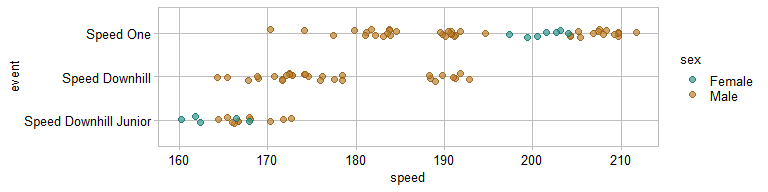

We can label the data directly using `geom_text()`, manually selecting
the coordinates of the text and matching the text color by sex. Then the
legend can be omitted using the `legend.position` argument. We can also
edit the axis labels.

``` r
p <- p + 
        geom_text(aes(x = 200, y = 2.7, label = "women"), color = rcb("mid_BG")) +
        geom_text(aes(x = 210, y = 2.7, label = "men"), color = rcb("mid_Br")) +
        theme(legend.position = "none")  +
        labs(x = "Speed (km/hr)", y = "") 
p
```

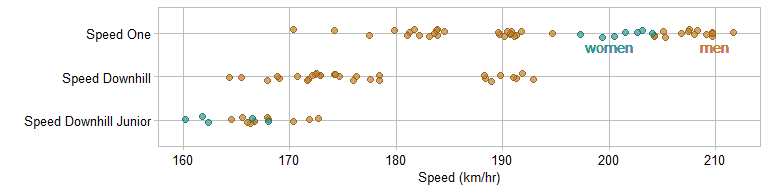

A design file typically concludes by saving the graph to the `figures/`
directory. Using `ggsave()` to control the figure dimensions, we can
control the aspect ratio and dpi to produce the final version.

``` r
ggsave(filename = "0302-strip-plot-speedski.png",
        path    = "figures",
        device  = "png",
        width   = 8,
        height  = 2.5,
        units   = "in",
        dpi     = 300)
```

<br> <a href="#top">▲ top of page</a>

## report

If we were to include this graph in a report, we would insert the
following code chunk in the Rmd script.

    ```{r}
    library("knitr")
    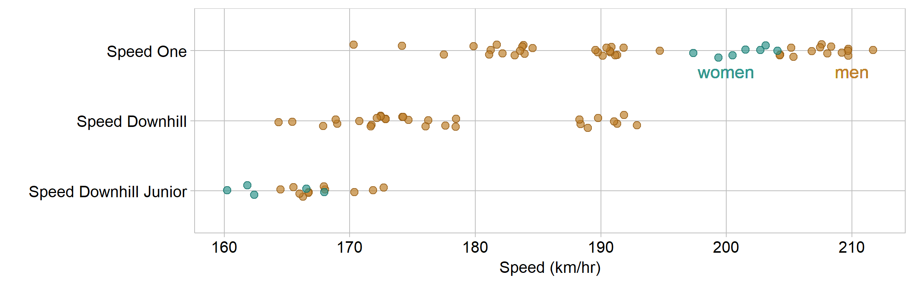
    ```

<br> <a href="#top">▲ top of page</a>

## exercises

**1. Museum exhibits**

  - Data: `museum_exhibits` from the graphclassmate package. If you want
    to learn more about the data set, open its help page by running `?
    graphclassmate::museum_exhibits`.

  - Explore: Create `explore/0303-strip-plot-museum-explore.R` to
    explore the data, identify the number, type, and levels of
    variables, and create exploratory graphs to compare distributions.

  - Carpentry: Create `carpentry/0303-strip-plot-museum-data.R` to
    create a tidy data frame, make the appropriate categorical variable
    a factor, and order its levels. Save to
    `data/0303-strip-plot-museum-data.rds`.

  - Design: Create `design/0303-strip-plot-museum.R` to read the tidy
    data, create the final graph with ordered rows, use
    `theme_graphclass()`, edit axis labels, and add additional
    formatting you think suitable for publication. Save it to
    `figures/0303-strip-plot-museum.png`.

**2. Ozone readings**

  - Data: `airquality` in base R. If you want to learn more about the
    data set, open its help page by running `? airquality`.

  - Explore: Create `explore/0304-strip-plot-ozone-explore.R` to examine
    the data. Explore the ozone readings using month as the categorical
    variable, identify the number, type, and levels of variables, create
    exploratory graphs to compare distributions.

  - Carpentry: Create `carpentry/0304-strip-plot-ozone-data.R` to create
    a tidy data frame, make the appropriate categorical variable a
    factor, and order its levels. Save to
    `data/0304-strip-plot-ozone-data.rds`.

  - Design: Create `design/0304-strip-plot-ozone.R`. As a time series,
    we would conventionally assign months to the x-scale and ozone
    measurements to the y-scale. Use the design script to read the tidy
    data, create the final graph, use `theme_graphclass()`, edit axis
    labels, and add additional formatting you think suitable for
    publication. Save it to `figures/0304-strip-plot-ozone.png`.

## references

<div id="refs">

<div id="ref-Robbins:2013">

Robbins N (2013) *Creating More Effective Graphs.* Chart House, Wayne,
NJ

</div>

<div id="ref-Unwin:2015:GDAdata">

Unwin A (2015) *GDAdata: Datasets for the book Graphical Data Analysis
with R.* R package version 0.93
<https://CRAN.R-project.org/package=GDAdata>

</div>

<div id="ref-Wickham+Grolemund:2017">

Wickham H and Grolemund G (2017) *R for Data Science.* O’Reilly Media,
Inc., Sebastopol, CA <https://r4ds.had.co.nz/>

</div>

</div>

***
<a href="#top">&#9650; top of page</a>    
[&#9665; calendar](../README.md#calendar)    
[&#9665; index](../README.md#index)
