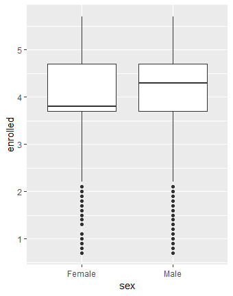
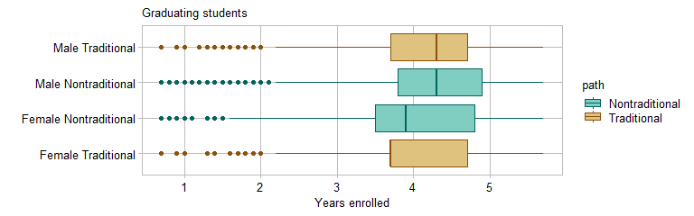

box plots
================


## contents

[introduction](#introduction)  
[prerequisites](#prerequisites)  
[explore](#explore)  
[carpentry](#carpentry)  
[design](#design)  
[report](#report)  
[exercises](#exercises)  
[references](#references)

## introduction

A *box-and-whisker plot* (or box plot), like a [strip
plot](cm201_strip-plot.md#strip-plot), is designed for displaying the
distribution of a single quantitative variable.

Data characteristics in tidy form

  - One quantitative variable in one column, values are numerical,
    continuous or discrete  
  - One categorical variable (if any) per column, values are the
    category levels, nominal or ordinal

Graph characteristics

  - displays distributions of a single quantitative variable  
  - shows a 5-point statistical summary  
  - shows range, outliers, and data symmetry or skew about the median  
  - data can be grouped by one or more categorical variables
  - a horizontal layout can make it easier to read category labels


<br>

Reading a box plot. Figure adapted from (Zhao and Bryan,
[2016](#ref-Zhao+Bryan:2016)).

  - The box shows the inter-quartile range (IQR), the distance between
    the lower quartile (25th percentile) and upper quartile (75th
    percentile)  
  - The median (50th percentile) is the straight line inside the box  
  - The upper whisker extends to the largest value no greater than 1.5
    IQR from the upper quartile  
  - The lower whisker extends to the smallest value no less than 1.5 IQR
    from the lower quartile  
  - Data beyond the whiskers are “outlying” points and are plotted
    individually. Alternative versions of the box plot extend the
    whiskers to the min/max values or to the 10th and 90th percentiles.

Box plots are superior to strip plots for large numbers of observations
with a small range of values (Robbins, [2013](#ref-Robbins:2013), 85).
Later in the tutorial, we create box plots to visualize the
`nontraditional` data set (in graphclassmate). The same data in a strip
plot is shown below—with nearly 270,000 observations over a range of
roughly 6 years, the strip plot is not visually informative.


<br> <a href="#top">▲ top of page</a>

## prerequisites

Project setup

  - Start every work session by launching the RStudio Project file for
    the course, e.g., `portfolio.Rproj`  
  - Ensure your [project directory
    structure](cm501-proj-m-manage-files.md#planning-the-directory-structure)
    satisfies the course requirements

Packages: Ensure you have installed the following packages. See [install
packages](cm902-software-studio.md#install-packages) for instructions if
needed.

  - [**tidyverse**](http://tidyverse.tidyverse.org): The ‘tidyverse’ is
    a set of packages that work in harmony because they share common
    data representations and ‘API’ design. This package is designed to
    make it easy to install and load multiple ‘tidyverse’ packages in a
    single step. Learn more about the ‘tidyverse’ at
    <https://tidyverse.org>.
  - [**graphclassmate**](https://github.com/graphdr/graphclassmate): An
    R package with companion materials for a course in data
    visualization. The package provides data sets structured for a
    variety of graph types plus a ggplot2 theme.

<br> <a href="#top">▲ top of page</a>

## explore

Create the R file `explore/0305-boxplot-nontrad-explore.R`. Start by
loading the packages.

``` r
library("tidyverse")
library("graphclassmate")
```

We are using `nontraditional` data from the graphclassmate package
(Layton, [2019](#ref-Layton:2019:graphclassmate)). If you want to learn
more about the data set, open its help page by running `?
nontraditional`.

For exploring the data, I assign it a new name, leaving the original
data frame unaltered.

``` r
# examine data 
explore <- nontraditional %>% glimpse()
```

    #> Observations: 269,057
    #> Variables: 5
    #> $ sex      <chr> "Female", "Female", "Male", "Female", "Male", "Female...
    #> $ race     <chr> "White", "White", "White", "White", "White", "White",...
    #> $ path     <chr> "Traditional", "Traditional", "Traditional", "Traditi...
    #> $ SAT      <dbl> 1400, 610, 1030, 870, 920, 1200, 1400, 1560, 880, 830...
    #> $ enrolled <dbl> 1.7, 2.7, 1.7, 2.7, 2.7, 2.7, 2.7, 2.3, 4.4, 3.9, 4.8...

The number of years enrolled is the quantitative, continuous variable
for our example. The statistical range, median, and quartiles are
obtained using `summary()`.

``` r
# summarize the quantitative variable 
explore %>% 
    select(enrolled) %>% 
    summary()
```

    #>     enrolled    
    #>  Min.   :0.700  
    #>  1st Qu.:3.700  
    #>  Median :4.000  
    #>  Mean   :4.072  
    #>  3rd Qu.:4.700  
    #>  Max.   :5.700

Sex and path are two categories we might like to examine. Each
observation is a unique person, so we can `count()` them by category,
yielding the list of levels for both categories as well as how many
people are in each group.

``` r
# categorical variables levels and count
explore %>% 
        count(sex, path) %>% 
        arrange(desc(n))
```

    #> # A tibble: 4 x 3
    #>   sex    path                n
    #>   <chr>  <chr>           <int>
    #> 1 Male   Traditional    106182
    #> 2 Female Traditional    104688
    #> 3 Male   Nontraditional  30414
    #> 4 Female Nontraditional  27773

We see that the numbers of observations by sex are fairly close and that
we have about 3 times as many traditional students as nontraditional
students.

For the first box plot, let’s compare traditional to nontraditional
students. Assigning the quantitative years enrolled to the x-scale, we
get an unexpected result.

``` r
ggplot(explore, aes(x = enrolled, y = path)) +
        geom_boxplot()
```


We don’t have a boxplot because in ggplot2, the boxplot geom expects the
quantitative variable to be assigned to the y-scale. Making that change
we obtain,

``` r
ggplot(explore, aes(y = enrolled, x = path)) +
        geom_boxplot()
```


Our first observation is that the median years enrolled is less for
nontraditional students than for traditional students.

Using the second category, sex, we find that the median years enrolled
is less for women than for men.

``` r
ggplot(explore, aes(y = enrolled, x = sex)) +
        geom_boxplot()
```



We can view both categories by adding a fill argument,

``` r
ggplot(explore, aes(y = enrolled, x = sex, fill = path)) +
        geom_boxplot()
```


The IQRs are fairly consistent. The trend, if any, appears to be the
median value. To order the box plots in order of increasing median, we
create a new categorical variable that merges sex and path, then order
the levels by years enrolled.

``` r
explore <- explore %>% 
        mutate(sex_path = str_c(sex, path, sep = " ")) %>% 
        mutate(sex_path = fct_reorder(sex_path, enrolled))

ggplot(explore, aes(y = enrolled, x = sex_path)) +
        geom_boxplot()
```


In this version, you can see the increasing median and that women in
both traditional and nontraditional paths are enrolled fewer years than
men.

<br> <a href="#top">▲ top of page</a>

## carpentry

For data carpentry, we take what we learned from the exploration and
concisely prepare the data for the selected graph type and design.

Create the R file `carpentry/0305-boxplot-nontrad-data.R`. Start by
loading the packages.

``` r
library("tidyverse")
library("graphclassmate")
```

From the exploration, I’ll be using the years enrolled as the
quantitative variable. I’ll create the new categorical variable
`sex_path` and order it by the years enrolled.

``` r
data(nontraditional, package = "graphclassmate")

nontrad <- nontraditional %>% 
        mutate(sex_path = str_c(sex, path, sep = " ")) %>% 
        mutate(sex_path = fct_reorder(sex_path, enrolled))
```

A data carpentry file typically concludes by saving the data frame.

``` r
saveRDS(nontrad, "data/0305-boxplot-nontrad-data.rds")
```

<br> <a href="#top">▲ top of page</a>

## design

Create the R file `design/0305-boxplot-nontrad.R`. Start by loading the
packages.

``` r
library("tidyverse")
library("graphclassmate")
```

A design file typically starts by reading the tidy data file.

``` r
nontrad <- readRDS("data/0305-boxplot-nontrad-data.rds") %>% 
        glimpse()
```

    #> Observations: 269,057
    #> Variables: 6
    #> $ sex      <chr> "Female", "Female", "Male", "Female", "Male", "Female...
    #> $ race     <chr> "White", "White", "White", "White", "White", "White",...
    #> $ path     <chr> "Traditional", "Traditional", "Traditional", "Traditi...
    #> $ SAT      <dbl> 1400, 610, 1030, 870, 920, 1200, 1400, 1560, 880, 830...
    #> $ enrolled <dbl> 1.7, 2.7, 1.7, 2.7, 2.7, 2.7, 2.7, 2.3, 4.4, 3.9, 4.8...
    #> $ sex_path <fct> Female Traditional, Female Traditional, Male Traditio...

Start with the basic box plot and make it easier to read the category
labels by swapping the axes with `coord_flip()`.

``` r
p <- ggplot(nontrad, aes(y = enrolled, x = sex_path)) +
        geom_boxplot() +
        coord_flip()
p
```


Edit labels and apply the class theme,

``` r
p <- p + 
        labs(y = "Years enrolled", x = "", title = "Graduating students") +
        theme_graphclass()
p
```


We can further distinguish between traditional and nontraditional by
adding a fill argument to `aes()` and `scale_fill_manual()` to select
colors.

``` r
p <- p + 
        aes(fill = path) +
        scale_fill_manual(values = c(rcb("light_BG"), rcb("light_Br")))
p
```


Edit the color of the box outlines and the outliers by adding a color
argument to `aes()` and `scale_color_manual()` to select colors.

``` r
p <- p + 
        aes(color = path) +
        scale_color_manual(values = c(rcb("dark_BG"), rcb("dark_Br")))
p
```



We can omit the legend title using `guides()`. We set `color = "none"`
to avoid printing a second legend.

``` r
p <- p + 
        guides(fill  = guide_legend(title = NULL), color = "none")
p
```


Lastly, I’d like to do something about the outliers. As drawn, it
appears that there are only a few, but because of overprinting, there
are actually a lot more than the visual image suggests.

To edit the outlier visual, we

  - create a new data frame with the outliers in a a separate column  
  - omit showing outliers with the boxplot geom  
  - use a point geom to draw the outliers as a layer on top of the
    boxplot and jitter them

First, create a new data frame that has a logical outlier variable
(values = TRUE or FALSE). We isolate outliers below the lower whisker
only because none appear above the upper whisker.

``` r
outlier_only <- nontrad %>%
        group_by(sex_path) %>%
        mutate(outlier = enrolled < median(enrolled) - 1.5 * IQR(enrolled)) %>%
        ungroup() %>% 
        filter(outlier == TRUE)
```

Confirm the new data frame has only outliers in it.

``` r
unique(outlier_only$outlier)
```

    #> [1] TRUE

Next, graph the original box plot with outliers omitted by
`outlier.shape = NA`. I’ve also added a alpha and width argument to the
box and increased the legend symbols slightly.

``` r
p <- ggplot(nontrad, aes(y = enrolled, x = sex_path, color = path, fill = path)) +
        geom_boxplot(width = 0.45, alpha = 0.75, outlier.shape = NA) +
        coord_flip() +
        labs(y = "Years enrolled", x = "", title = "Graduating students") +
        theme_graphclass() +
        scale_color_manual(values = c(rcb("dark_BG"),  rcb("dark_Br"))) +
        scale_fill_manual(values  = c(rcb("light_BG"), rcb("light_Br"))) +
        guides(fill = guide_legend(title = NULL, reverse = TRUE, keyheight = 2), color = "none") 
p
```


Now add the outliers as jittered points. Note that we can assign a new
data argument in the geom.

``` r
p <- p + 
        geom_jitter(data = outlier_only, width = 0.05, height = 0.2, alpha = 0.25, shape = 21)
p
```


And the figure is ready to save, using width and height to control the
aspect ratio.

``` r
ggsave(filename = "0305-boxplot-nontrad.png",
        path    = "figures",
        width   = 8,
        height  = 2.5,
        units   = "in",
        dpi     = 300)
```

<br> <a href="#top">▲ top of page</a>

## report

If we were to include this graph in a report, we would insert the
following code chunk in the Rmd script.

    ```{r}
    library("knitr")
    
    ```

<br> <a href="#top">▲ top of page</a>

## exercises

**1. Speed ski**

  - Data: `speedski` data previously saved in
    `data/0302-strip-plot-speedski-data.rds`

  - Explore: Create `explore/0306-boxplot-speedski-explore.R` to explore
    how to graph these data as boxplots to compare distributions.
    Identify the number, type, and levels of variables. Create
    exploratory graphs to compare distributions.

  - Carpentry: Create `carpentry/0306-boxplot-speedski-data.R` to edit
    the data (if needed), make the appropriate categorical variable a
    factor, and order its levels. Save to
    `data/0306-boxplot-speedski-data.rds`.

  - Design: Create `design/0306-boxplot-speedski.R` to read the tidy
    data, create the final graph with ordered rows, use
    `theme_graphclass()`, edit axis labels, and add additional
    formatting you think suitable for publication. Save it to
    `figures/0306-boxplot-speedski.png`.

**2. Diamonds**

  - Data: `diamonds` from the ggplot2 package (part of the tidyverse).
    If you want to learn more about the data set, open its help page by
    running `? ggplot2::diamonds`.

  - Explore: Create `explore/0307-boxplot-diamonds-explore.R`. Explore
    the data by computing the price per carat and examine the
    distribution grouped by cut, color, and clarity, independently and
    pairwise. Find a combination of categorical variables that tells an
    interesting story, then identify the number, type, and levels of
    variables you plan to use in a graph. What is the interesting story?

  - Carpentry: Create `carpentry/0307-boxplot-diamonds-data.R` to create
    a tidy data frame, make the appropriate categorical variable a
    factor, and order its levels. Save to
    `data/0307-boxplot-diamonds-data.rds`.

  - Design: Create `design/0307-boxplot-diamonds.R` to read the tidy
    data, create the final graph with ordered rows, use
    `theme_graphclass()`, edit axis labels, and add additional
    formatting you think suitable for publication. Save it to
    `figures/0307-boxplot-diamonds.png`.

## references

<div id="refs">

<div id="ref-Layton:2019:graphclassmate">

Layton R (2019) *graphclassmate: Companion materials for a course in
data visualization.* R package version 0.1.0.9000
<https://github.com/graphdr/graphclassmate>

</div>

<div id="ref-Robbins:2013">

Robbins N (2013) *Creating More Effective Graphs.* Chart House, Wayne,
NJ

</div>

<div id="ref-Wickham+Grolemund:2017">

Wickham H and Grolemund G (2017) *R for Data Science.* O’Reilly Media,
Inc., Sebastopol, CA <https://r4ds.had.co.nz/>

</div>

<div id="ref-Zhao+Bryan:2016">

Zhao J and Bryan J (2016) R Graph Catalog.
<https://github.com/jennybc/r-graph-catalog>

</div>

</div>

***
<a href="#top">&#9650; top of page</a>    
[&#9665; calendar](../README.md#calendar)    
[&#9665; index](../README.md#index)
