multiway dot plot
================

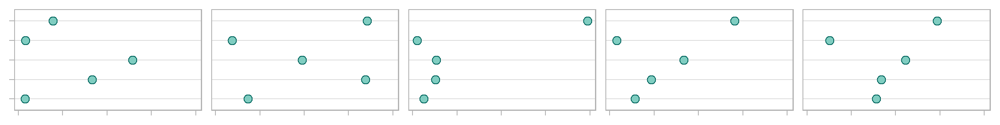

## contents

[introduction](#introduction)  
[prerequisites](#prerequisites)  
[explore](#explore)  
[carpentry](#carpentry)  
[design](#design)  
[report](#report)  
[exercises](#exercises)  
[references](#references)

## introduction

A *multiway dot plot* is a set of graphs of a single quantitative
variable (or response) dependent on two independent categorical
variables. As Cleveland explains ([1993](#ref-Cleveland:1993)),

> What distinguishes multiway data is the cross-classification of the
> categorical variables; there is a value of the response for each
> combination of levels of the two categorical variables.

Data characteristics in tidy form

  - First categorical variable with *m* levels in a column with *m* ×
    *n* observations
  - Second categorical variable with *n* levels in a column with *m* ×
    *n* observations
  - The categorical variables must be independent
  - One quantitative variable in a column with *m* × *n* observations  
  - Though time can be considered an ordinal categorical variable, time
    series data are more commonly displayed using line graphs, spark
    charts. or cycle plots where the dots are connected to show changes
    over time. A multiway form may not be the most effective type of
    display for time-series data.

Graph characteristics

  - The levels of one category are the row labels and the levels of the
    other category are the panel labels, thus a multiway has either *m*
    panels with *n* rows, or *n* panels with *m* rows  
  - A data marker in every panel for every row  
  - The rows and panels are ordered by a statistical measure, often the
    median

Reading a multiway graph

  - We can more effectively compare values within a panel than between
    panels.  
  - Because rows are ordered, one expects a generally increasing trend
    within a panel. A response greater or smaller than expected creates
    a visual asymmetry. The interesting stories are often in these
    visual anomalies.  
  - To explore the comparison between panels, we swap the row and panel
    categories, creating the *dual* multiway.

<br> <a href="#top">▲ top of page</a>

## prerequisites

Project setup

  - Start every work session by launching the RStudio Project file for
    the course, e.g., `portfolio.Rproj`  
  - Ensure your [project directory
    structure](cm501-proj-m-manage-files.md#planning-the-directory-structure)
    satisfies the course requirements

Packages: Ensure you have installed the following packages. See [install
packages](cm902-software-studio.md#install-packages) for instructions if
needed.

  - [**tidyverse**](http://tidyverse.tidyverse.org): The ‘tidyverse’ is
    a set of packages that work in harmony because they share common
    data representations and ‘API’ design. This package is designed to
    make it easy to install and load multiple ‘tidyverse’ packages in a
    single step. Learn more about the ‘tidyverse’ at
    <https://tidyverse.org>.
  - [**graphclassmate**](https://github.com/graphdr/graphclassmate): An
    R package with companion materials for a course in data
    visualization. The package provides data sets structured for a
    variety of graph types plus a ggplot2 theme.  
  - [**vcdExtra**](https://CRAN.R-project.org/package=vcdExtra):
    Provides additional data sets, methods and documentation to
    complement the ‘vcd’ package for Visualizing Categorical Data and
    the ‘gnm’ package for Generalized Nonlinear Models. In particular,
    ‘vcdExtra’ extends mosaic, assoc and sieve plots from ‘vcd’ to
    handle ‘glm()’ and ‘gnm()’ models and adds a 3D version in
    ‘mosaic3d’. Additionally, methods are provided for comparing and
    visualizing lists of ‘glm’ and ‘loglm’ objects. This package is now
    a support package for the book, “Discrete Data Analysis with R” by
    Michael Friendly and David Meyer.

<br> <a href="#top">▲ top of page</a>

## explore

Create the R file `explore/0402-multiway-metropop-explore.R`. Start by
loading the packages.

``` r
library("tidyverse")
library("graphclassmate")
```

We are using `metro_pop` data from the graphclassmate package (Layton,
[2019](#ref-Layton:2019:graphclassmate)). If you want to learn more
about the data set, open its help page by running `? metro_pop`.

For exploring the data, I assign it a new name, leaving the original
data frame unaltered. Using `glimpse()` we find that the data have 60
observations of 3 variables.

``` r
# examine data 
explore <- metro_pop %>% 
    glimpse()
```

    #> Observations: 60
    #> Variables: 3
    #> $ race       <chr> "White", "Latino", "Black", "Asian", "Others", "Whi...
    #> $ county     <chr> "Bronx", "Bronx", "Bronx", "Bronx", "Bronx", "Kings...
    #> $ population <dbl> 194000, 645000, 415000, 38000, 40000, 855000, 48800...

The population count is the quantitative, continuous variable. Its
statistical range, median, and quartiles are obtained using `summary()`.
We find a nearly three orders-of-magnitude difference between the
minimum and maximum values.

``` r
# summarize the quantitative variable 
explore %>% 
    select(population) %>% 
    summary()
```

    #>    population     
    #>  Min.   :   6000  
    #>  1st Qu.:  38750  
    #>  Median : 125500  
    #>  Mean   : 232517  
    #>  3rd Qu.: 335750  
    #>  Max.   :1118000

For categorical variables, we can see the levels with `unique()`. We
find that race has 5 levels and county has 12 levels.

``` r
# unique levels of categorical variables 
explore %>% 
    select(race) %>%
    unique() %>% 
    arrange(race)
```

    #> # A tibble: 5 x 1
    #>   race  
    #>   <chr> 
    #> 1 Asian 
    #> 2 Black 
    #> 3 Latino
    #> 4 Others
    #> 5 White

``` r
explore %>% 
    select(county) %>%
    unique() %>% 
    arrange(county)
```

    #> # A tibble: 12 x 1
    #>    county     
    #>    <chr>      
    #>  1 Bergen     
    #>  2 Bronx      
    #>  3 Hudson     
    #>  4 Kings      
    #>  5 Nassau     
    #>  6 New York   
    #>  7 Passiac    
    #>  8 Queens     
    #>  9 Richmond   
    #> 10 Rockland   
    #> 11 Suffolk    
    #> 12 Westchester

The data frame is complete, i.e., a count for every combination of race
(5 levels) and county (12 levels), with 5 × 12 = 60 observations.

Explore the data graphically. Use a strip plot to examine the
distribution of population counts.

``` r
ggplot(explore, aes(x = population, y = race)) +
  geom_point()
```

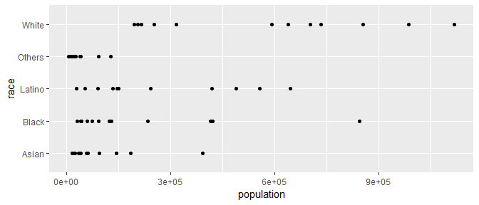

With the numbers in the hundreds of thousands, let’s divide the
population by 1000.

``` r
ggplot(explore, aes(x = population / 1000, y = race)) +
  geom_point() +
  scale_x_continuous(breaks = seq(0, 1100, 100))
```

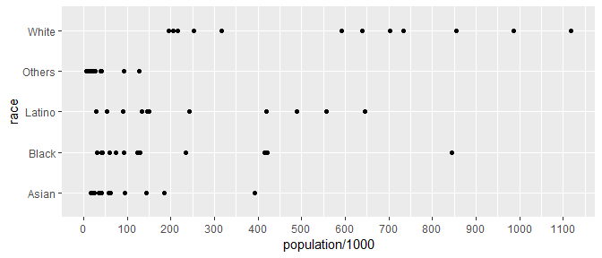

When a range of values spans orders of magnitude, a logarithmic scale
can be useful. I’ll start with a base-10 scale,

``` r
ggplot(explore, aes(x = population / 1000, y = race)) +
  geom_point() +
  scale_x_continuous(trans = 'log10')
```


Try base-2. This works for these data. Each grid line represents a
doubling of the previous grid line.

``` r
ggplot(explore, aes(x = population / 1000, y = race)) +
  geom_point() +
  scale_x_continuous(trans = 'log2')
```

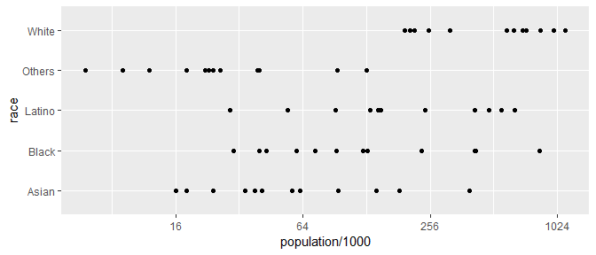

Summary: we’ll divide the population by 1000 and use a log-base-2 scale.

<br> <a href="#top">▲ top of page</a>

## carpentry

A data carpentry file typically begins by reading the source data file.
In this case, the data are loaded with the graphclassmate package.

From the exploration, population is the quantitative variable and race
and county are the two categorical variables. For ordering the rows and
panels, we’ll want the categories converted to factors and ordered by
population median.

Create the R file `carpentry/0402-multiway-metropop-data.R`. Start by
loading the packages.

``` r
# start the carpentry
data(metro_pop, package = "graphclassmate")
```

When order the levels of a factor by a quantitative variable, the
default metric is the median. Here, we will use `sum` rather than
median.

``` r
# convert categories to factors ordered by total population 
metro_pop <- metro_pop %>% 
    mutate(county = fct_reorder(county, population, sum)) %>% 
    mutate(race   = fct_reorder(race, population, sum)) %>% 
    mutate(population = population / 1000)
```

A data carpentry file typically concludes by saving the data frame.

``` r
saveRDS(metro_pop, "data/0402-multiway-metropop-data.rds")
```

<br> <a href="#top">▲ top of page</a>

## design

Create the R file `design/0402-multiway-metropop.R`. Start by loading
the packages.

``` r
library("tidyverse")
library("graphclassmate")
```

A design file typically starts by reading the tidy data file.

``` r
# start the graph design 
metro_pop <- readRDS("data/0402-multiway-metropop-data.rds") %>%  
    glimpse()
```

    #> Observations: 60
    #> Variables: 3
    #> $ race       <fct> White, Latino, Black, Asian, Others, White, Latino,...
    #> $ county     <fct> Bronx, Bronx, Bronx, Bronx, Bronx, Kings, Kings, Ki...
    #> $ population <dbl> 194, 645, 415, 38, 40, 855, 488, 845, 184, 93, 703,...

Create the basic multiway dot plot. The `as.table = FALSE` argument
orders the panels like a plot with the highest value at the top-right.

``` r
p <- ggplot(metro_pop, aes(x = population, y = race)) +
    geom_point() +
    facet_wrap(vars(county), as.table = FALSE)
p
```

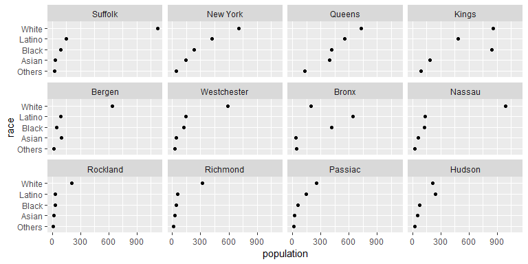

Add the log-base-2 scale

``` r
p <- p +
    scale_x_continuous(trans = 'log2', breaks = 2^seq(2, 10))
p
```

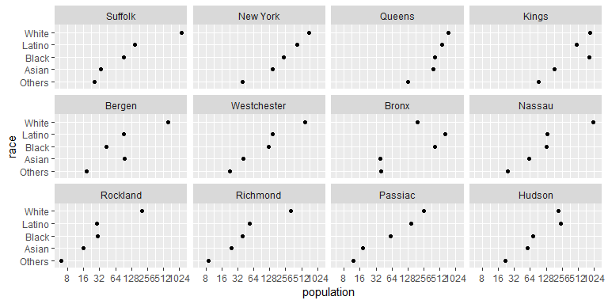

Add a theme and labels.

``` r
p <- p +
    theme_graphclass() +
    labs(y = NULL, x = "Population (thousands) log-2 scale")
p
```

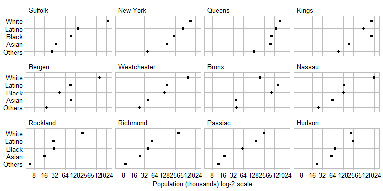

Finally, edit `geom_point()` for size and color of the data markers and
edit `facet_wrap()` to change the number of columns to reduce
overprinting the scale text.

``` r
ggplot(metro_pop, aes(x = population, y = race)) +
    geom_point(size = 2, shape = 21, color = rcb("dark_BG"), fill = rcb("light_BG")) +
    facet_wrap(vars(county), as.table = FALSE, ncol = 3) +
    scale_x_continuous(trans = 'log2', breaks = 2^seq(2, 10)) +
    theme_graphclass() +
    labs(y = NULL, x = "Population (thousands) log-2 scale")    
```

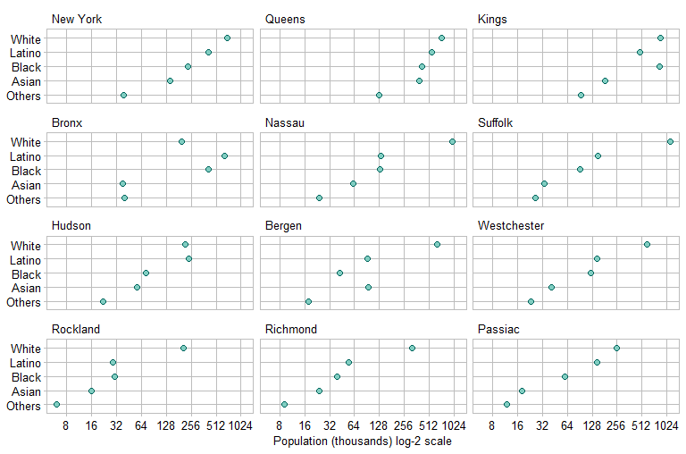

And the figure is ready to save, using width and height to control the
aspect ratio.

``` r
ggsave(filename = "0402-multiway-metropop-01.png",
        path    = "figures",
        width   = 8,
        height  = 5.3,
        units   = "in",
        dpi     = 300)
```

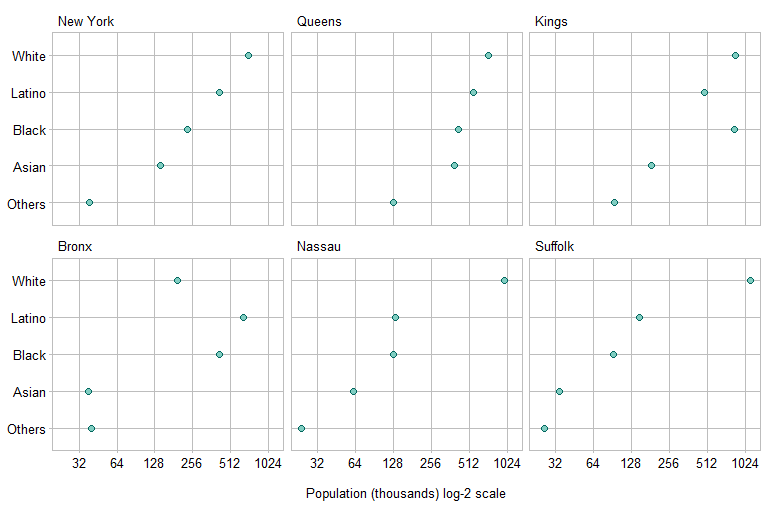

In the dual multiway, we swap the rows and panels by setting `y =
county` and `facet_wrap(vars(race))`.

``` r
ggplot(metro_pop, aes(x = population, y = county)) +
    geom_point(size = 2, shape = 21, color = rcb("dark_BG"), fill = rcb("light_BG")) +
    facet_wrap(vars(race), as.table = FALSE, ncol = 3) +
    scale_x_continuous(trans = 'log2', breaks = 2^seq(2, 10)) +
    theme_graphclass() +
    labs(y = NULL, x = "Population (thousands) log-2 scale")
```

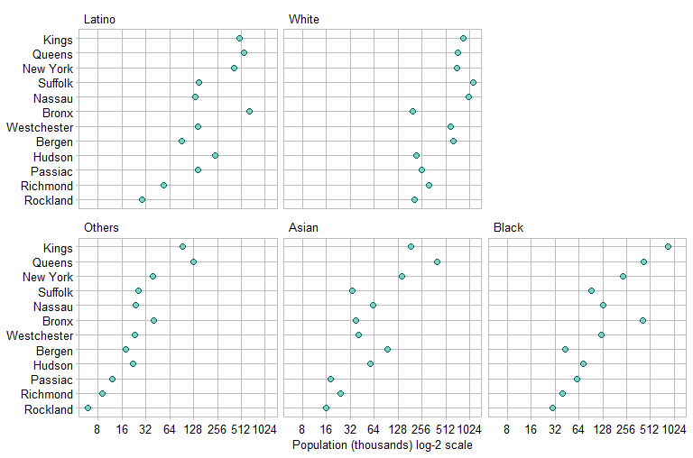

And write to file.

``` r
ggsave(filename = "0402-multiway-metropop-02.png",
        path    = "figures",
        width   = 8,
        height  = 5.3,
        units   = "in",
        dpi     = 300)
```

<br> <a href="#top">▲ top of page</a>

## report

In the final portfolio, it is possible that only one of the two final
graphs is shown, depending on which one tells the most interesting
story. Assuming the second graph were the more interesting, if we were
to include it in a report, we would insert the following code chunk in
the Rmd script.

    ```{r}
    library("knitr")
    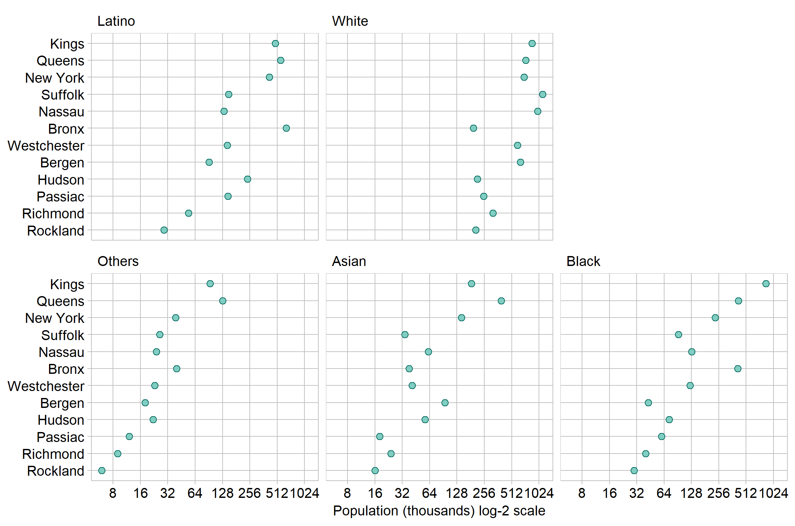
    ```

If we were to include a data table in the report, it would look
something like this, with rows and columns ordered by descending
subtotals of populatioon. [Reshaping
data](cm103-data-reshaping.md#reshaping-data) and creating
[tables](cm308-report-tables.md#tables) are developed in separate
tutorials.

| county       | White | Latino | Black | Asian | Others | subtotal |
| :----------- | ----: | -----: | ----: | ----: | -----: | -------: |
| Kings        |   855 |    488 |   845 |   184 |     93 |     2465 |
| Queens       |   733 |    556 |   420 |   392 |    128 |     2229 |
| New York     |   703 |    418 |   233 |   143 |     39 |     1536 |
| Suffolk      |  1118 |    149 |    92 |    34 |     26 |     1419 |
| Nassau       |   986 |    133 |   129 |    62 |     24 |     1334 |
| Bronx        |   194 |    645 |   415 |    38 |     40 |     1332 |
| Westchester  |   592 |    145 |   123 |    41 |     23 |      924 |
| Bergen       |   638 |     91 |    43 |    94 |     18 |      884 |
| Hudson       |   215 |    242 |    73 |    57 |     22 |      609 |
| Passiac      |   252 |    147 |    60 |    18 |     12 |      489 |
| Richmond     |   317 |     54 |    40 |    24 |      9 |      444 |
| Rockland     |   205 |     29 |    30 |    16 |      6 |      286 |
| **subtotal** |  6808 |   3097 |  2503 |  1103 |    440 |    13951 |

Table 1: Population of selected NY counties (in thousands)

<br> <a href="#top">▲ top of page</a>

## exercises

**1. Alligator**

  - Data: `Alligator` from the vcdExtra package. If you want to learn
    more about the data set, open its help page by running `?
    vcdExtra::Alligator`.

  - Explore: Create `explore/0403-multiway-alligator-explore.R` to
    explore the data to find an interesting story. There are four
    factors to choose from (any two at a time) and one quantitative
    variable (count). In your exploration, the `sex` variable could be
    combined with one of the other three factors to create a new
    categorical variable.

  - Carpentry: Create `carpentry/0403-multiway-alligator-data.R` to
    create a tidy data frame, make the appropriate categorical variables
    into factors, and order their levels. Save to
    `data/0403-multiway-alligator-data.rds`.

  - Design: Create `design/0403-multiway-alligator.R` to read the tidy
    data, create the final graphs with ordered rows, use
    `theme_graphclass()`, edit axis labels, and add additional
    formatting you think suitable for publication. Save the graph to
    `figures/0403-multiway-alligator-01.png` and its dual to
    `figures/0403-multiway-alligator-02.png`.

**2. UCB admissions**

  - Data: `ucb_admit` in the graphclassmate package. If you want to
    learn more about the data set, open its help page by running `?
    graphclassmate::ucb_admit`. The data set in base R from which these
    data were derived has a help page at `? UCBAdmissions`.

  - Explore: Create `explore/0404-multiway-ucb-admit-explore.R` to
    explore the data for interesting stories. A possible variable to
    examine is the ratio of the number admitted to the number applied.

  - Carpentry: Create `carpentry/0404-multiway-ucb-admit-data.R` to
    create a tidy data frame, make the appropriate categorical variables
    into factors, and order their levels. Save to
    `data/0404-multiway-ucb-admit-data.rds`.

  - Design: Create `design/0404-multiway-ucb-admit.R` to read the tidy
    data, create the final graphs with ordered rows, use
    `theme_graphclass()`, edit axis labels, and add additional
    formatting you think suitable for publication. Save the graph to
    `figures/0404-multiway-ucb-admit-01.png` and its dual to
    `figures/0404-multiway-ucb-admit-02.png`.

## references

<div id="refs">

<div id="ref-Cleveland:1993">

Cleveland WS (1993) *Visualizing Data.* Hobart Press, Summit, NJ

</div>

<div id="ref-Layton:2019:graphclassmate">

Layton R (2019) *graphclassmate: Companion materials for a course in
data visualization.* R package version 0.1.0.9000
<https://github.com/graphdr/graphclassmate>

</div>

<div id="ref-Wickham+Grolemund:2017">

Wickham H and Grolemund G (2017) *R for Data Science.* O’Reilly Media,
Inc., Sebastopol, CA <https://r4ds.had.co.nz/>

</div>

</div>

***
<a href="#top">&#9650; top of page</a>    
[&#9665; calendar](../README.md#calendar)    
[&#9665; index](../README.md#index)
