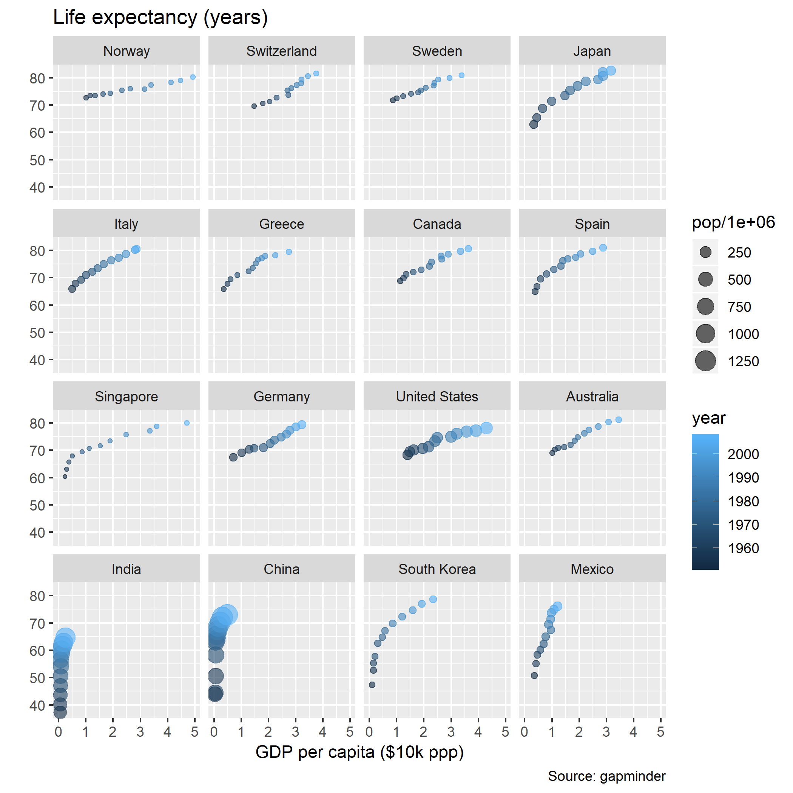

scatterplot
================


## contents

[introduction](#introduction)  
[prerequisites](#prerequisites)  
[explore](#explore)  
[carpentry](#carpentry)  
[design](#design)  
[report](#report)  
[exercises](#exercises)  
[references](#references)

## introduction

“By encoding the data as positions along two orthogonal scales, a
two-dimensional scatter plot reveals the strength of the relation
between two variables, together with outliers. It can easily identify
subsets with different markers, although these must be well contrasted,
lest the display look cluttered.” (Doumont,
[2009](#ref-Doumont:2009:Ch.4))

Data characteristics

  - Two quantitative variables  
  - One or more categorical variables (optional)  
  - A key variable if data are not coordinatized

Graph characteristics

  - Two-dimensional orthogonal axes with scales that increase from left
    to right and from top to bottom
  - The levels of a category can be distinguished by data marker type or
    color or with facets
  - Facets, if used, have identical scales

[D3 Correlations](cm301-report-display-reqts.md#D3-correlations) data
and graph requirements

<br> <a href="#top">▲ top of page</a>

## prerequisites

Project setup

  - Start every work session by launching the RStudio Project file for
    the course, e.g., `portfolio.Rproj`  
  - Ensure your [project directory
    structure](cm501-proj-m-manage-files.md#planning-the-directory-structure)
    satisfies the course requirements

Ensure you have installed the following packages. See [install
packages](cm902-software-studio.md#install-packages) for instructions if
needed.

  - [**tidyverse**](http://tidyverse.tidyverse.org): The ‘tidyverse’ is
    a set of packages that work in harmony because they share common
    data representations and ‘API’ design. This package is designed to
    make it easy to install and load multiple ‘tidyverse’ packages in a
    single step. Learn more about the ‘tidyverse’ at
    <https://tidyverse.org>.
  - [**graphclassmate**](https://github.com/graphdr/graphclassmate): An
    R package with companion materials for a course in data
    visualization. The package provides data sets structured for a
    variety of graph types plus a ggplot2 theme.  
  - [**VGAMdata**](https://www.stat.auckland.ac.nz/~yee/VGAMdata): Data
    sets to accompany the VGAM package and the book “Vector Generalized
    Linear and Additive Models: With an Implementation in R” (Yee, 2015)
    <DOI:10.1007/978-1-4939-2818-7>. These are used to illustrate vector
    generalized linear and additive models (VGLMs/VGAMs), and associated
    models (Reduced-Rank VGLMs, Quadratic RR-VGLMs, Row-Column
    Interaction Models, and constrained and unconstrained ordination
    models in ecology).

Scripts to initialize

    explore/     0503-scatterplot-oly12-explore.R  
    carpentry/   0503-scatterplot-oly12-data.R   
    design/      0503-scatterplot-oly12.R 

And start each file with a minimal header

``` r
# your name
# date

# load packages
library("tidyverse")
```

Duplicate the lines of code in the session one chunk at a time. Save,
Source, and compare your results to the results shown.

<br> <a href="#top">▲ top of page</a>

## explore

Open the explore script you initialized earlier. Load the package that
has the data.

``` r
library("VGAMdata")
```

Data about athletes in the 2012 summer Olympics is in `VGAMdata::oly12`.
The number of observations is greater than the number of names, probably
because some athletes compete in more than one event.

``` r
prep <- oly12
str(prep)
#> 'data.frame':    10384 obs. of  14 variables:
#>  $ Name   : Factor w/ 10366 levels "Aaron Brown",..: 5353 121 4117 16 6033 5686 6061 6765 2738 3854 ...
#>  $ Country: Factor w/ 205 levels "Afghanistan",..: 144 195 68 125 154 68 8 125 94 3 ...
#>  $ Age    : int  23 33 30 24 26 27 30 23 27 19 ...
#>  $ Height : num  1.7 1.93 1.87 NA 1.78 1.82 1.82 1.87 1.9 1.7 ...
#>  $ Weight : int  60 125 76 NA 85 80 73 75 80 NA ...
#>  $ Sex    : Factor w/ 2 levels "F","M": 2 2 2 2 1 2 1 2 2 2 ...
#>  $ DOB    : Date, format: "1989-02-06" NA ...
#>  $ PlaceOB: Factor w/ 4108 levels "","Aachen (GER)",..: 2486 3302 398 48 3436 1 1 1 1172 2266 ...
#>  $ Gold   : int  0 0 0 0 0 0 0 0 0 0 ...
#>  $ Silver : int  0 0 0 0 0 0 0 0 0 0 ...
#>  $ Bronze : int  0 0 0 0 0 0 0 0 0 0 ...
#>  $ Total  : int  0 0 0 0 0 0 0 0 0 0 ...
#>  $ Sport  : Factor w/ 42 levels "Archery","Athletics",..: 27 2 2 7 2 25 29 22 2 7 ...
#>  $ Event  : Factor w/ 763 levels "Group All-Around",..: 350 405 251 443 699 406 726 403 248 491 ...
```

It is a data frame, so I’ll convert it to a tibble

``` r
prep <- prep %>% 
    as_tibble() %>% 
    glimpse()
#> Observations: 10,384
#> Variables: 14
#> $ Name    <fct> Lamusi A, A G Kruger, Jamale Aarrass, Abdelhak Aatakni...
#> $ Country <fct> People's Republic of China, United States of America, ...
#> $ Age     <int> 23, 33, 30, 24, 26, 27, 30, 23, 27, 19, 37, 28, 28, 28...
#> $ Height  <dbl> 1.70, 1.93, 1.87, NA, 1.78, 1.82, 1.82, 1.87, 1.90, 1....
#> $ Weight  <int> 60, 125, 76, NA, 85, 80, 73, 75, 80, NA, NA, NA, 60, 6...
#> $ Sex     <fct> M, M, M, M, F, M, F, M, M, M, M, M, F, F, M, F, M, M, ...
#> $ DOB     <date> 1989-02-06, NA, NA, 1988-09-02, NA, 1984-06-09, NA, 1...
#> $ PlaceOB <fct> NEIMONGGOL (CHN), Sheldon (USA), BEZONS (FRA), AIN SEB...
#> $ Gold    <int> 0, 0, 0, 0, 0, 0, 0, 0, 0, 0, 0, 0, 0, 0, 0, 0, 0, 0, ...
#> $ Silver  <int> 0, 0, 0, 0, 0, 0, 0, 0, 0, 0, 0, 0, 0, 0, 0, 0, 0, 0, ...
#> $ Bronze  <int> 0, 0, 0, 0, 0, 0, 0, 0, 0, 0, 0, 0, 0, 0, 0, 0, 0, 0, ...
#> $ Total   <int> 0, 0, 0, 0, 0, 0, 0, 0, 0, 0, 0, 0, 0, 0, 0, 0, 0, 0, ...
#> $ Sport   <fct> Judo, Athletics, Athletics, Boxing, Athletics, Handbal...
#> $ Event   <fct> "Men's -60kg", "Men's Hammer Throw", "Men's 1500m", "M...
```

Examine the quantitative variables. I’m not interested in medals, so
age, height, and weight are potentially useful data to graph.

``` r
prep_numeric <- prep %>% 
    select_if(is.numeric) %>% 
    glimpse()
#> Observations: 10,384
#> Variables: 7
#> $ Age    <int> 23, 33, 30, 24, 26, 27, 30, 23, 27, 19, 37, 28, 28, 28,...
#> $ Height <dbl> 1.70, 1.93, 1.87, NA, 1.78, 1.82, 1.82, 1.87, 1.90, 1.7...
#> $ Weight <int> 60, 125, 76, NA, 85, 80, 73, 75, 80, NA, NA, NA, 60, 64...
#> $ Gold   <int> 0, 0, 0, 0, 0, 0, 0, 0, 0, 0, 0, 0, 0, 0, 0, 0, 0, 0, 0...
#> $ Silver <int> 0, 0, 0, 0, 0, 0, 0, 0, 0, 0, 0, 0, 0, 0, 0, 0, 0, 0, 0...
#> $ Bronze <int> 0, 0, 0, 0, 0, 0, 0, 0, 0, 0, 0, 0, 0, 0, 0, 0, 0, 0, 0...
#> $ Total  <int> 0, 0, 0, 0, 0, 0, 0, 0, 0, 0, 0, 0, 0, 0, 0, 0, 0, 0, 0...
```

Keep age, height, and weight, and examine the quantiles. Results show we
have some NAs in height and weight.

``` r
# keep age, height, and weight 
prep_numeric <- prep_numeric %>% 
    select(Age, Height, Weight)

summary(prep_numeric)
#>       Age            Height          Weight      
#>  Min.   :13.00   Min.   :1.320   Min.   : 36.00  
#>  1st Qu.:22.00   1st Qu.:1.690   1st Qu.: 61.00  
#>  Median :25.00   Median :1.770   Median : 70.00  
#>  Mean   :26.07   Mean   :1.769   Mean   : 72.85  
#>  3rd Qu.:29.00   3rd Qu.:1.850   3rd Qu.: 81.00  
#>  Max.   :71.00   Max.   :2.210   Max.   :218.00  
#>                  NA's   :561     NA's   :1280
```

Let’s see how many levels of each factor we have,

``` r
prep_factor <- prep %>% 
    select_if(is.factor) %>% 
    glimpse()
#> Observations: 10,384
#> Variables: 6
#> $ Name    <fct> Lamusi A, A G Kruger, Jamale Aarrass, Abdelhak Aatakni...
#> $ Country <fct> People's Republic of China, United States of America, ...
#> $ Sex     <fct> M, M, M, M, F, M, F, M, M, M, M, M, F, F, M, F, M, M, ...
#> $ PlaceOB <fct> NEIMONGGOL (CHN), Sheldon (USA), BEZONS (FRA), AIN SEB...
#> $ Sport   <fct> Judo, Athletics, Athletics, Boxing, Athletics, Handbal...
#> $ Event   <fct> "Men's -60kg", "Men's Hammer Throw", "Men's 1500m", "M...

sapply(prep_factor, nlevels)
#>    Name Country     Sex PlaceOB   Sport   Event 
#>   10366     205       2    4108      42     763
```

Based on the number of levels present, we might want to condition on
sex, sport, or event. So the first thing I’ll do is select the columns
just mentioned and filter for complete rows.

``` r
prep <- prep %>% 
    select(Name, Country, Age, Height, Weight, Sex, Sport, Event) %>% 
    filter(complete.cases(.)) %>% 
    glimpse()
#> Observations: 9,038
#> Variables: 8
#> $ Name    <fct> Lamusi A, A G Kruger, Jamale Aarrass, Maria Abakumova,...
#> $ Country <fct> People's Republic of China, United States of America, ...
#> $ Age     <int> 23, 33, 30, 26, 27, 30, 23, 27, 28, 28, 22, 22, 25, 25...
#> $ Height  <dbl> 1.70, 1.93, 1.87, 1.78, 1.82, 1.82, 1.87, 1.90, 1.73, ...
#> $ Weight  <int> 60, 125, 76, 85, 80, 73, 75, 80, 60, 64, 62, 63, 69, 8...
#> $ Sex     <fct> M, M, M, F, M, F, M, M, F, F, M, M, M, M, F, M, M, F, ...
#> $ Sport   <fct> Judo, Athletics, Athletics, Athletics, Handball, Rowin...
#> $ Event   <fct> "Men's -60kg", "Men's Hammer Throw", "Men's 1500m", "W...
```

Remove duplicate rows using `dplyr::distinct()`. The glimpse shows the
same number of rows as before the operation so we conclude there were no
duplicates.

``` r
prep <- prep %>% 
  distinct() %>% 
    glimpse()
#> Observations: 9,038
#> Variables: 8
#> $ Name    <fct> Lamusi A, A G Kruger, Jamale Aarrass, Maria Abakumova,...
#> $ Country <fct> People's Republic of China, United States of America, ...
#> $ Age     <int> 23, 33, 30, 26, 27, 30, 23, 27, 28, 28, 22, 22, 25, 25...
#> $ Height  <dbl> 1.70, 1.93, 1.87, 1.78, 1.82, 1.82, 1.87, 1.90, 1.73, ...
#> $ Weight  <int> 60, 125, 76, 85, 80, 73, 75, 80, 60, 64, 62, 63, 69, 8...
#> $ Sex     <fct> M, M, M, F, M, F, M, M, F, F, M, M, M, M, F, M, M, F, ...
#> $ Sport   <fct> Judo, Athletics, Athletics, Athletics, Handball, Rowin...
#> $ Event   <fct> "Men's -60kg", "Men's Hammer Throw", "Men's 1500m", "W...
```

With only three quantitative variables to study, we might expect a
correlation between height and weight but not age. Let’s graph that.

``` r
ggplot(data = prep, aes(x = Height, y = Weight)) +
    geom_jitter()
```


Looks like a possible correlation. Next, condition on sex,

``` r
ggplot(data = prep, aes(x = Height, y = Weight, color = Sex)) +
    geom_jitter()
```


And a facet by sport,

``` r
ggplot(data = prep, aes(x = Height, y = Weight, color = Sex)) +
    geom_jitter() +
    facet_wrap(vars(Sport))
```


We have a number of sports with only a few values. let’s count,

<small>

``` r
n_athletes <- prep %>% 
  count(Sport) %>% 
    arrange(desc(n))

kable(n_athletes)
```

| Sport                                                    |    n |
| :------------------------------------------------------- | ---: |
| Athletics                                                | 1900 |
| Swimming                                                 |  859 |
| Football                                                 |  589 |
| Rowing                                                   |  512 |
| Hockey                                                   |  383 |
| Sailing                                                  |  351 |
| Judo                                                     |  341 |
| Shooting                                                 |  338 |
| Handball                                                 |  304 |
| Wrestling                                                |  296 |
| Volleyball                                               |  271 |
| Basketball                                               |  258 |
| Water Polo                                               |  249 |
| Fencing                                                  |  229 |
| Weightlifting                                            |  229 |
| Canoe Sprint                                             |  224 |
| Equestrian                                               |  181 |
| Cycling - Road                                           |  176 |
| Cycling - Track                                          |  160 |
| Badminton                                                |  159 |
| Tennis                                                   |  156 |
| Table Tennis                                             |  151 |
| Diving                                                   |  128 |
| Archery                                                  |  114 |
| Triathlon                                                |  103 |
| Beach Volleyball                                         |   93 |
| Canoe Slalom                                             |   80 |
| Cycling - Mountain Bike                                  |   70 |
| Modern Pentathlon                                        |   66 |
| Cycling - BMX                                            |   42 |
| Cycling - Road, Cycling - Track                          |   16 |
| Cycling - Mountain Bike, Cycling - Road, Cycling - Track |    3 |
| Cycling - Mountain Bike, Cycling - Track                 |    3 |
| Cycling - Mountain Bike, Cycling - Road                  |    2 |
| Athletics, Triathlon                                     |    1 |
| Cycling - BMX, Cycling - Track                           |    1 |
| </small>                                                 |      |

The largest level of Sport is “Athletics” which includes all the
competitive running, jumping, throwing, and walking. In contrast, there
are a few with less than 50 athletes. I’ll drop those Sports for the
data display.

``` r
n_small <- n_athletes %>% 
    filter(n < 50)

drop_these <- n_small$Sport %>% 
    droplevels() %>% 
    as.character()

prep <- prep %>% 
    filter(!Sport %in% drop_these)

ggplot(data = prep, aes(x = Height, y = Weight, color = Sex)) +
    geom_jitter() +
    facet_wrap(vars(Sport))
```


There is one weight outlier in Judo I think I’ll drop because he makes
all the scales span more than need be for the rest of the facets.

``` r
prep <- prep %>% 
    filter(Weight < 200)

ggplot(data = prep, aes(x = Height, y = Weight, color = Sex)) +
    geom_jitter() +
    facet_wrap(vars(Sport))
```


Later, in design, we’ll continue to edit the visual elements, but this
seems to be an acceptable layout.

<br> <a href="#top">▲ top of page</a>

## carpentry

Open the carpentry script you initialized earlier.

A data carpentry file typically begins by reading the source data file.
In this case of course, the data are provided with a package.

``` r
library("tidyverse")
data(oly12, package = "VGAMdata")
```

I would like to take another look at the sports levels to see if some
should be recoded.

``` r
levels(oly12$Sport)
#>  [1] "Archery"                                                 
#>  [2] "Athletics"                                               
#>  [3] "Athletics, Triathlon"                                    
#>  [4] "Badminton"                                               
#>  [5] "Basketball"                                              
#>  [6] "Beach Volleyball"                                        
#>  [7] "Boxing"                                                  
#>  [8] "Canoe Slalom"                                            
#>  [9] "Canoe Sprint"                                            
#> [10] "Cycling - BMX"                                           
#> [11] "Cycling - BMX, Cycling - Track"                          
#> [12] "Cycling - Mountain Bike"                                 
#> [13] "Cycling - Mountain Bike, Cycling - Road"                 
#> [14] "Cycling - Mountain Bike, Cycling - Road, Cycling - Track"
#> [15] "Cycling - Mountain Bike, Cycling - Track"                
#> [16] "Cycling - Road"                                          
#> [17] "Cycling - Road, Cycling - Track"                         
#> [18] "Cycling - Track"                                         
#> [19] "Diving"                                                  
#> [20] "Equestrian"                                              
#> [21] "Fencing"                                                 
#> [22] "Football"                                                
#> [23] "Gymnastics - Artistic"                                   
#> [24] "Gymnastics - Rhythmic"                                   
#> [25] "Handball"                                                
#> [26] "Hockey"                                                  
#> [27] "Judo"                                                    
#> [28] "Modern Pentathlon"                                       
#> [29] "Rowing"                                                  
#> [30] "Sailing"                                                 
#> [31] "Shooting"                                                
#> [32] "Swimming"                                                
#> [33] "Synchronised Swimming"                                   
#> [34] "Table Tennis"                                            
#> [35] "Taekwondo"                                               
#> [36] "Tennis"                                                  
#> [37] "Trampoline"                                              
#> [38] "Triathlon"                                               
#> [39] "Volleyball"                                              
#> [40] "Water Polo"                                              
#> [41] "Weightlifting"                                           
#> [42] "Wrestling"
```

I am going to recode some of the cycling levels to combine them and drop
unused levels.

``` r
oly12 <- oly12 %>% 
    mutate(Sport = fct_recode(Sport,
    "BMX" = "Cycling - BMX",
    "BMX" = "Cycling - BMX, Cycling - Track",
    "Mountain Bike" = "Cycling - Mountain Bike",
    "Mountain Bike" = "Cycling - Mountain Bike, Cycling - Road",
    "Mountain Bike" = "Cycling - Mountain Bike, Cycling - Road, Cycling - Track",
    "Mountain Bike" = "Cycling - Mountain Bike, Cycling - Track", 
    "Road Cycling"  = "Cycling - Road", 
    "Road Cycling"  = "Cycling - Road, Cycling - Track",  
    "Pentathlon"    = "Modern Pentathlon"
  )) %>% 
    droplevels() 
```

Now I’ll collect all the steps from the explore file that we intend to
keep.

``` r
# sports to drop because of limited participation 
drop_these <- oly12 %>% 
  count(Sport) %>% 
    filter(n < 50) %>% 
    select(Sport) %>% 
    droplevels()

drop_these_sports <- as.character(drop_these$Sport)

# select and filter
df <- oly12 %>% 
    as_tibble() %>% 
    select(Name, Country, Age, Height, Weight, Sex, Sport, Event) %>% 
    filter(!Sport %in% drop_these_sports) %>% 
    filter(Weight < 200) %>% 
    filter(complete.cases(.)) %>% 
    distinct() %>% 
    droplevels()
```

Before leaving data carpentry, we should order the sports by some
combination of height and weight. From our summaries earlier, we can see
that the median height is 1.77 m and the median weight is 70 kg. The
ratio of the two medians is about 1:40.

I’m going to order the factors by a weighted sum of the two quantities,
*w + 40h*.

``` r
df <- df %>% 
    mutate(Sex   = fct_reorder(Sex,   Weight + 40*Height)) %>% 
    mutate(Sport = fct_reorder(Sport, Weight + 40*Height))
```

A data carpentry file typically concludes by saving the data frame. I
want to preserve the factor, so I’ll save to RDS format.

``` r
saveRDS(df, "data/0503-scatterplot-oly12-data.rds")
```

<br> <a href="#top">▲ top of page</a>

## design

Open the design script you initialized earlier.

A design file typically begins by reading the data prepared by the
carpentry script.

``` r
library("tidyverse")
library("graphclassmate")
oly12 <- readRDS("data/0503-scatterplot-oly12-data.rds")

glimpse(oly12)
#> Observations: 8,993
#> Variables: 8
#> $ Name    <fct> Lamusi A, A G Kruger, Jamale Aarrass, Maria Abakumova,...
#> $ Country <fct> People's Republic of China, United States of America, ...
#> $ Age     <int> 23, 33, 30, 26, 27, 30, 23, 27, 28, 28, 22, 22, 25, 25...
#> $ Height  <dbl> 1.70, 1.93, 1.87, 1.78, 1.82, 1.82, 1.87, 1.90, 1.73, ...
#> $ Weight  <int> 60, 125, 76, 85, 80, 73, 75, 80, 60, 64, 62, 63, 69, 8...
#> $ Sex     <fct> M, M, M, F, M, F, M, M, F, F, M, M, M, M, F, M, M, F, ...
#> $ Sport   <fct> Judo, Athletics, Athletics, Athletics, Handball, Rowin...
#> $ Event   <fct> "Men's -60kg", "Men's Hammer Throw", "Men's 1500m", "W...
```

In `geom_jitter()` we add an `alpha` argument to add transparency to the
data markers.

``` r
p <- ggplot(data = oly12, aes(x = Height, y = Weight, col = Sex)) +
    geom_jitter(alpha = 0.2) +
    facet_wrap(vars(Sport), as.table = FALSE)

p
```


We need fewer columns to leave more room in the panel strips to be able
to read the strip text (the sport). I’m also editing the breaks for tick
marks to improve readability.

``` r
p <- p +
    facet_wrap(vars(Sport), as.table = FALSE, ncol = 4) +
    scale_x_continuous(breaks = seq(0, 3, by = 0.2)) +
    scale_y_continuous(breaks = seq(0, 200, by = 50))

p
```


Next is the theme, labels, and manual color assignment using `rcb()`
from graphclassmate.

``` r
p <-  p + 
    theme_graphclass() +
    labs(x = "Height (m)", 
             y = "Weight (kg)",
             title = "2012 Summer Olympics, Individual Athletes", 
             subtitle = "For sports with 50 or more athletes", 
             caption = "Source: VGAMdata package"
    ) +
    scale_color_manual(values = c(rcb("mid_BG"), rcb("mid_Br")))

p
```


And write to file.

``` r
ggsave(filename = "0503-scatterplot-oly12.png",
        path    = "figures",
        width   = 8,
        height  = 16,
        units   = "in",
        dpi     = 300)
```

<br> <a href="#top">▲ top of page</a>

## report

The story: With the panels ordered by the overall “size” of the athletes
(the weighted combination of height and weight), I find it interesting
that water sports are at the two extremes. Water polo athletes have the
largest median size and diving the smallest.

If we were to include this graph in a report, we would insert the
following code chunk in the Rmd script.

    ```{r}
    library("knitr")
    
    ```

<br> <a href="#top">▲ top of page</a>

## exercises

**1. gapminder**

In the gapminder data, dollar values are in constant 2007 “international
dollars”, a hypothetical unit of currency that has the same [purchasing
power parity
(PPP)](https://financial-dictionary.thefreedictionary.com/purchasing+power+parity)
that the US dollar had in the US at the time. [Constant
dollars](https://financial-dictionary.thefreedictionary.com/constant+dollars)
have been adjusted for inflation with respect to a particular year—in
this case, 2007.

Scripts to initialize

    explore/     0503-scatterplot-gapminder-explore.R  
    carpentry/   0503-scatterplot-gapminder-data.R   
    design/      0503-scatterplot-gapminder.R 

With the minimal instructions below, the graph you are trying to create
is this one:


Data: `gapminder` from the gapminder package. If you want to learn more
about the data set, open its help page by running `?
gapminder::gapminder`

Explore script: write the code to determine the number of variables and
for each variable, determine its

  - type
  - class
  - levels (if categorical)

Carpentry script

  - omit the continent column
  - extract the data for the countries shown
  - reorder the levels of the country factor by life expectancy
  - recode country level `"Korea, Rep."` to `"South Korea"`
  - drop unused levels
  - write the data frame to `data/0503-scatterplot-gapminder-01.rds`

Design script

  - read the data frame you just saved
  - create the the graph shown, with panels ordered as shown
  - save it to file `figures/0503-scatterplot-gapminder-01.png`

**2. add two more variables**

Continue the previous problem. In the design script,

  - assign the color of the data marker to correspond year
  - assign the size of the data marker to population
  - save the figure to `figures/0503-scatterplot-gapminder-02.png`

If you accomplish both, the graph should look like this,



**3. one year, all countries**

Carpentry script

  - continue the same script  
  - start with the full gapminder data frame
  - extract the data for the most recent year
  - omit the year column
  - omit data for the continent “Oceania”
  - reorder the levels of the continent factor by life expectancy
  - drop unused levels
  - write the data frame to `data/0503-scatterplot-gapminder-03.rds`

Design script

  - read the data frame you just saved
  - create the the graph shown, with panels ordered as shown
  - save it to file `figures/0503-scatterplot-gapminder-03.png`

Answer:


## references

<div id="refs">

<div id="ref-Doumont:2009:Ch.4">

Doumont J-L (2009) Designing the graph. *Trees, maps, and theorems:
Effective communication for rational minds*. Principiae, Kraainem,
Belgium, 133–143 <http://www.treesmapsandtheorems.com/>

</div>

<div id="ref-Wickham+Grolemund:2017">

Wickham H and Grolemund G (2017) *R for Data Science.* O’Reilly Media,
Inc., Sebastopol, CA <https://r4ds.had.co.nz/>

</div>

</div>

***
<a href="#top">&#9650; top of page</a>    
[&#9665; calendar](../README.md#calendar)    
[&#9665; index](../README.md#index)
