dot plot
================

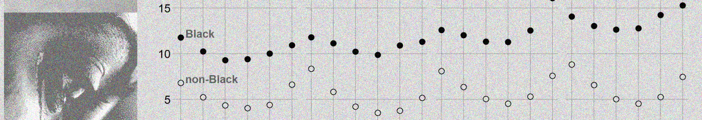

## contents

[introduction](#introduction)  
[prerequisites](#prerequisites)  
[explore](#explore)  
[carpentry](#carpentry)  
[design](#design)  
[design aesthetics](#design-aesthetics)  
[image magick](#image-magick)  
[report](#report)  
[exercises](#exercises)  
[references](#references)

## introduction

You already have experience creating dot plots. In this work, we focus
on creating a dot plot that treats human suffering, injury, or death in
the humanizing style proposed by Dragga and Voss
([2001](#ref-Dragga+Voss:2001)).

Data characteristics

  - One quantitative variable  
  - One or more categorical variables  
  - A key variable if data are not coordinatized

Graph characteristics

  - One quantitative variable, typically along the x-axis.  
  - The levels of the category are row labels on the y-axis.
  - Consider swapping the axes if time is the categorical variable.
  - If you have a second categorical variable, its levels are the panel
    headings.

[D4 Injuries or
fatalities](cm301-report-display-reqts.md#D4-injuries-or-fatalities)
data and graph requirements

<br> <a href="#top">▲ top of page</a>

## prerequisites

**Spring 2019: Reinstall graphclassmate to access the new data sets used
here**

Project setup

  - Start every work session by launching the RStudio Project file for
    the course, e.g., `portfolio.Rproj`  
  - Ensure your [project directory
    structure](cm501-proj-m-manage-files.md#planning-the-directory-structure)
    satisfies the course requirements

Ensure you have installed the following packages. See [install
packages](cm902-software-studio.md#install-packages) for instructions if
needed.

  - [**tidyverse**](http://tidyverse.tidyverse.org): The ‘tidyverse’ is
    a set of packages that work in harmony because they share common
    data representations and ‘API’ design. This package is designed to
    make it easy to install and load multiple ‘tidyverse’ packages in a
    single step. Learn more about the ‘tidyverse’ at
    <https://tidyverse.org>.
  - [**graphclassmate**](https://github.com/graphdr/graphclassmate): An
    R package with companion materials for a course in data
    visualization. The package provides data sets structured for a
    variety of graph types plus a ggplot2 theme.  
  - [**cdata**](https://github.com/WinVector/cdata/): Supplies
    higher-order fluid data transform operators that include pivot and
    anti-pivot as special cases. The methodology is describe in ‘Zumel’,
    2018, “Fluid data reshaping with ‘cdata’”,
    <http://winvector.github.io/FluidData/FluidDataReshapingWithCdata.html>
    , <doi:10.5281/zenodo.1173299> . Works on in-memory data or on
    remote data using ‘rquery’ and the ‘DBI’ database interface.
  - [**seplyr**](https://github.com/WinVector/seplyr/): The ‘seplyr’
    (standard evaluation plying) package supplies improved standard
    evaluation adapter methods for important common ‘dplyr’ data
    manipulation tasks. In addition the ‘seplyr’ package supplies
    several new “key operations bound together” methods. These include
    ‘group\_summarize()’ (which combines grouping, arranging and
    calculation in an atomic unit), ‘add\_group\_summaries()’ (which
    joins grouped summaries into a ‘data.frame’ in a well documented
    manner), ‘add\_group\_indices()’ (which adds per-group identifiers
    to a ‘data.frame’ without depending on row-order),
    ‘partition\_mutate\_qt()’ (which optimizes mutate sequences), and
    ‘if\_else\_device()’ (which simulates per-row if-else blocks in
    expression sequences).
  - [**magick**](https://github.com/ropensci/magick#readme): Bindings to
    ‘ImageMagick’: the most comprehensive open-source image processing
    library available. Supports many common formats (png, jpeg, tiff,
    pdf, etc) and manipulations (rotate, scale, crop, trim, flip, blur,
    etc). All operations are vectorized via the Magick++ STL meaning
    they operate either on a single frame or a series of frames for
    working with layers, collages, or animation. In RStudio images are
    automatically previewed when printed to the console, resulting in an
    interactive editing environment. The latest version of the package
    includes a native graphics device for creating in-memory graphics or
    drawing onto images using pixel coordinates.

Scripts to initialize

``` 
explore/     0602-dotplot-cdc-infants-explore.R  
carpentry/   0602-dotplot-cdc-infants-data.R   
design/      0602-dotplot-cdc-infants.R  
```

And start each file with a minimal header

``` r
# your name
# date

# load packages
library("tidyverse")
```

Duplicate the lines of code in the session one chunk at a time. Save,
Source, and compare your results to the results shown.

<br> <a href="#top">▲ top of page</a>

## explore

Open the explore script you initialized earlier. Load the package that
has the data. We are using `infant_mortality` data from the
graphclassmate package. If you want to learn more about the data set,
load the package and open its help page by running `? infant_mortality`.

``` r
library("seplyr")
data(infant_mortality, package = "graphclassmate")
```

We’ll use `glimpse()` to see the variables and their types: 4 character
and 2 numeric.

``` r
glimpse(infant_mortality)
#> Observations: 12,120
#> Variables: 6
#> $ region    <chr> "CENS-R1", "CENS-R1", "CENS-R1", "CENS-R1", "CENS-R1...
#> $ county_id <chr> "09001", "09001", "09001", "09001", "09001", "09001"...
#> $ race      <chr> "Amerind", "Amerind", "Amerind", "Amerind", "Amerind...
#> $ age       <chr> "15", "15-19", "20-24", "25-29", "30-34", "35-39", "...
#> $ deaths    <dbl> NA, NA, NA, NA, NA, NA, NA, NA, NA, NA, NA, NA, NA, ...
#> $ births    <dbl> NA, NA, NA, NA, NA, NA, NA, NA, NA, NA, NA, NA, NA, ...
```

Let’s group by county, race, and age and compute the mortality rates in
number of deaths per 1000 births.

``` r
grouping_variables <- c("region", "county_id", "race", "age")
df <- infant_mortality %>% 
        seplyr::group_summarise(., 
                grouping_variables, 
                births = sum(births, na.rm = TRUE), 
                deaths = sum(deaths, na.rm = TRUE)) %>% 
        mutate(rate = round(deaths / births * 1000, 0)) %>% 
        filter(complete.cases(.)) %>% 
        glimpse()
#> Observations: 3,361
#> Variables: 7
#> $ region    <chr> "CENS-R1", "CENS-R1", "CENS-R1", "CENS-R1", "CENS-R1...
#> $ county_id <chr> "09001", "09001", "09001", "09001", "09001", "09001"...
#> $ race      <chr> "Black", "Black", "Black", "Black", "Black", "Black"...
#> $ age       <chr> "15-19", "20-24", "25-29", "30-34", "35-39", "40-44"...
#> $ births    <dbl> 1083, 3023, 3307, 3051, 1826, 550, 4719, 5506, 5031,...
#> $ deaths    <dbl> 13, 38, 19, 38, 25, 10, 31, 28, 25, 10, 10, 29, 54, ...
#> $ rate      <dbl> 12, 13, 6, 12, 14, 18, 7, 5, 5, 5, 3, 3, 2, 2, 3, 5,...
```

Infant mortality might also be correlated to income levels. To obtain
that data, we can use the `county_income` data set included with
graphclassmate.

``` r
data(county_income)
glimpse(county_income)
#> Observations: 3,220
#> Variables: 4
#> $ county_id <chr> "01001", "01003", "01005", "01007", "01009", "01011"...
#> $ county    <chr> "Autauga County", "Baldwin County", "Barbour County"...
#> $ state     <chr> "Alabama", "Alabama", "Alabama", "Alabama", "Alabama...
#> $ income    <dbl> 26836, 25961, 17498, 21190, 25143, 17657, 19658, 212...
```

We join the two data frames using the county ID variable

``` r
df <- left_join(df, county_income, by = "county_id")  %>% 
        select(region, county_id, state, county, everything()) %>% 
        arrange(region, county_id) %>% 
        filter(complete.cases(.))

glimpse(df)
#> Observations: 2,652
#> Variables: 10
#> $ region    <chr> "CENS-R1", "CENS-R1", "CENS-R1", "CENS-R1", "CENS-R1...
#> $ county_id <chr> "09001", "09001", "09001", "09001", "09001", "09001"...
#> $ state     <chr> "Connecticut", "Connecticut", "Connecticut", "Connec...
#> $ county    <chr> "Fairfield County", "Fairfield County", "Fairfield C...
#> $ race      <chr> "Black", "Black", "Black", "Black", "Black", "Black"...
#> $ age       <chr> "15-19", "20-24", "25-29", "30-34", "35-39", "40-44"...
#> $ births    <dbl> 1083, 3023, 3307, 3051, 1826, 550, 4719, 5506, 5031,...
#> $ deaths    <dbl> 13, 38, 19, 38, 25, 10, 31, 28, 25, 10, 10, 29, 54, ...
#> $ rate      <dbl> 12, 13, 6, 12, 14, 18, 7, 5, 5, 5, 3, 3, 2, 2, 3, 5,...
#> $ income    <dbl> 36597, 36597, 36597, 36597, 36597, 36597, 36597, 365...
```

OK. Let’s graph infant mortality as a function of income, conditioned by
race and age group, one dot per county.

``` r
ggplot(df, aes(x = income, y = rate, color = race)) +
        geom_jitter() +
        facet_wrap(vars(age), as.table = FALSE)
```

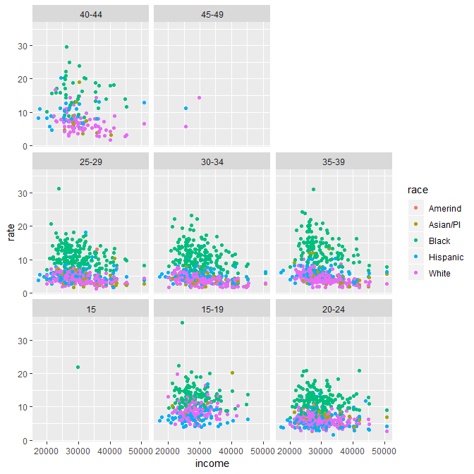

We see right away that the two extreme age groups can be omitted from
the dataset.

There appears to be very little variation by income, but there may be a
correlation with age and race. Let’s omit the income, but include the
region.

``` r
ggplot(df, aes(x = rate, y = age, color = race)) +
        geom_jitter() +
        facet_wrap(vars(region), as.table = FALSE)
```

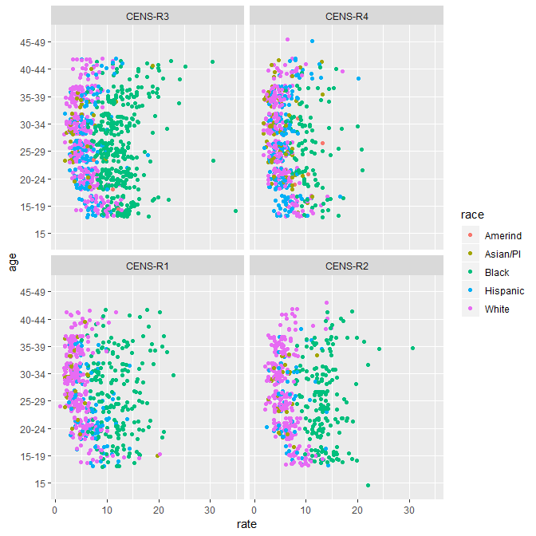

I think the age groups would be better along the x-axis. And this time,
when we use facets, we’ll use two variables, race and region, and
`facet_grid()` instead of our customary `facet_wrap()`. Also, I’ll
convert race and region to factors with their levels ordered by the
median rate.

``` r
df <- df %>% 
    filter(complete.cases(.)) %>% 
    mutate(race   = forcats::fct_reorder(race,  rate)) %>% 
    mutate(region = forcats::fct_reorder(region, rate))

ggplot(df, aes(x = age, y = rate, color = race)) +
        geom_jitter() +
        facet_grid(rows = vars(region), cols = vars(race), as.table = FALSE)
```

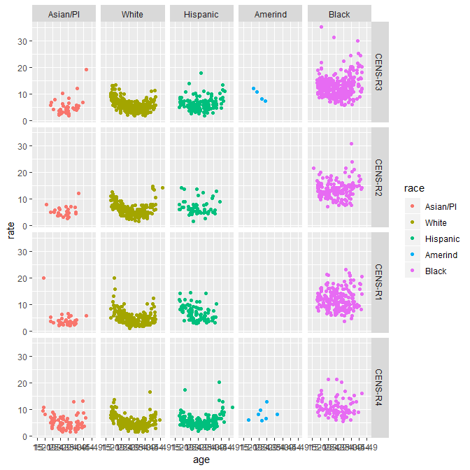

  - The mortality rates for Black infants is much higher than the other
    race/ethnic groups
  - The non-Black groups are similar  
  - The regions are similar except for Black infants

Let’s ignore region but look at race and income

``` r
ggplot(df, aes(x = income, y = rate, color = race)) +
        geom_jitter() +
        facet_grid(rows = vars(age), cols = vars(race), as.table = FALSE)
```

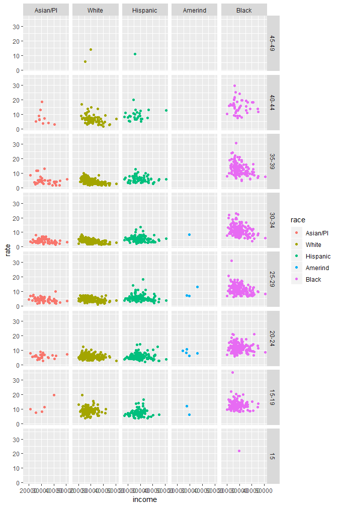

So again, really no income effect, possibly because county median income
is too coarse a measure. Had we looked at the mother’s family income we
may have found a different story.

Going forward, we can safely omit data for the two extreme age groups.
It appears that the mother’s age group and whether or not she is Black
are the two most significant contributors to infant mortality, with
possibly a modest effect by region.

We’ll do the data carpentry on that basis.

<br> <a href="#top">▲ top of page</a>

## carpentry

Open the carpentry script you initialized earlier.

``` r
library("tidyverse")
library("seplyr")
library("cdata")
data(infant_mortality, package = "graphclassmate")
glimpse(infant_mortality)
#> Observations: 12,120
#> Variables: 6
#> $ region    <chr> "CENS-R1", "CENS-R1", "CENS-R1", "CENS-R1", "CENS-R1...
#> $ county_id <chr> "09001", "09001", "09001", "09001", "09001", "09001"...
#> $ race      <chr> "Amerind", "Amerind", "Amerind", "Amerind", "Amerind...
#> $ age       <chr> "15", "15-19", "20-24", "25-29", "30-34", "35-39", "...
#> $ deaths    <dbl> NA, NA, NA, NA, NA, NA, NA, NA, NA, NA, NA, NA, NA, ...
#> $ births    <dbl> NA, NA, NA, NA, NA, NA, NA, NA, NA, NA, NA, NA, NA, ...
```

The basic steps will be to;

  - ignore the county variable
  - omit data for the two extreme age groups
  - omit data for Amerind peoples
  - recode all race/ethnicity into two groups: Black and Non-Black  
  - recode the regions to West, South, etc.
  - group and summarize by age, race, and region
  - plot mortality as a function of age and condition by race and region

Omit data for the two extreme age groups

``` r
df <- infant_mortality %>% 
        filter(!age %in% c("15","45-49"))

# check results
sort(unique(df$age))
#> [1] "15-19" "20-24" "25-29" "30-34" "35-39" "40-44"
```

Recode all race/ethnicity into two groups: Black and Non-Black.

``` r
df <- df %>% 
        mutate(race = if_else(race == "Black", 
                true   = "Black", 
                false  = "non-Black"))

# check results
sort(unique(df$race))
#> [1] "Black"     "non-Black"
```

Recode the regions to West, South, etc.

``` r
df <- df %>%  
        mutate(region = recode(region, 
                "CENS-R1" = "Northeast", 
                "CENS-R2" = "Midwest",
                "CENS-R3" = "South",
                "CENS-R4" = "West"))

# check results
sort(unique(df$region))
#> [1] "Midwest"   "Northeast" "South"     "West"
```

Group and summarize by age, race, and region

``` r
grouping_variables <- c("age", "race", "region")
df <- df %>% 
        seplyr::group_summarise(grouping_variables, 
                deaths = sum(deaths, na.rm = TRUE), 
                births = sum(births, na.rm = TRUE)) %>% 
        mutate(rate = deaths / births * 1000) %>% 
        filter(complete.cases(.))

glimpse(df)
#> Observations: 48
#> Variables: 6
#> $ age    <chr> "15-19", "15-19", "15-19", "15-19", "15-19", "15-19", "...
#> $ race   <chr> "Black", "Black", "Black", "Black", "non-Black", "non-B...
#> $ region <chr> "Midwest", "Northeast", "South", "West", "Midwest", "No...
#> $ deaths <dbl> 2394, 892, 5455, 486, 3634, 1141, 7126, 3910, 5025, 236...
#> $ births <dbl> 170077, 75584, 433204, 41292, 412247, 136403, 878710, 5...
#> $ rate   <dbl> 14.075977, 11.801439, 12.592220, 11.769834, 8.815104, 8...
```

Convert the regions variable to a factor with its levels ordered by the
mean mortality rate.

``` r
df <- df %>%    
        mutate(region = fct_reorder(region, rate))
```

A data carpentry file typically concludes by saving the data frame. I
want to preserve the factor, so I’ll save to RDS format.

``` r
saveRDS(df, "data/0602-dotplot-cdc-infants-data.rds")
```

For my headline later, I need to know what the ratio of Black to
Non-Black mortality. To do that, I have to reshape the data frame,

``` r
temp <- df %>% 
        select(age, region, race, rate) %>% 
        cdata::pivot_to_rowrecs(
                data = ., 
                columnToTakeKeysFrom   = "race", 
                columnToTakeValuesFrom = "rate",
                rowKeyColumns          = c("age", "region")
        ) %>% 
        dplyr::rename(non_Black = "non-Black") %>% 
        mutate(ratio = Black/non_Black) %>% 
        arrange(desc(ratio))


temp
#> # A tibble: 24 x 5
#>    age   region    Black non_Black ratio
#>    <chr> <fct>     <dbl>     <dbl> <dbl>
#>  1 35-39 Northeast 10.9       3.76  2.90
#>  2 30-34 Midwest   12.8       4.55  2.81
#>  3 30-34 Northeast  9.89      3.53  2.80
#>  4 35-39 Midwest   14.2       5.26  2.71
#>  5 25-29 Midwest   12.7       5.03  2.52
#>  6 30-34 South     11.3       4.53  2.49
#>  7 25-29 Northeast 10.2       4.22  2.43
#>  8 35-39 South     12.5       5.31  2.36
#>  9 30-34 West       9.40      4.04  2.33
#> 10 35-39 West      10.0       4.39  2.28
#> # ... with 14 more rows

# statistical summary of the ratios 
summary(temp$ratio)
#>    Min. 1st Qu.  Median    Mean 3rd Qu.    Max. 
#>   1.411   1.908   2.159   2.168   2.443   2.905
```

The median ratio of Black to non-Black infant deaths per 1000 births
from 2007 to 2016 is 2.2:1

<br> <a href="#top">▲ top of page</a>

## design

Open the design script you initialized earlier and read the data file,

``` r
library("tidyverse")
library("magick")
df <- readRDS("data/0602-dotplot-cdc-infants-data.rds")
```

Start with a basic plot

``` r
p <- ggplot(data = df, mapping = aes(x = age, y = rate)) +
        geom_point() +
        facet_wrap(vars(region), as.table = FALSE)
p
```

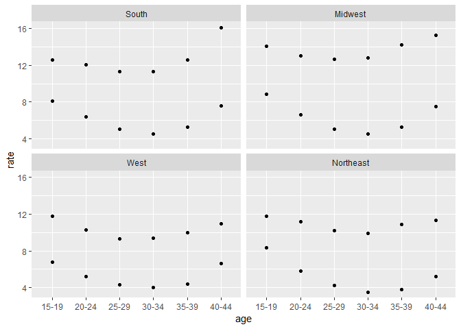

I think one row would serve us better

``` r
p <- p + 
        facet_wrap(vars(region), as.table = FALSE, nrow = 1)
p
```

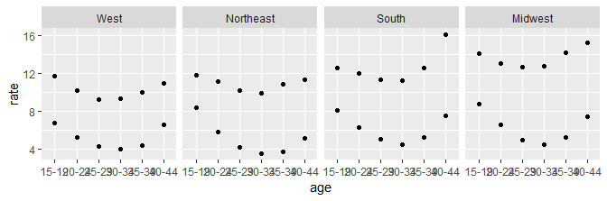

Let’s make the axis labels clear. Including `\n` in the character string
adds a line space between the label and the graph.

``` r
p <- p + 
        labs(y = "", 
                title = "Infant deaths per 1000 births, less than one year old, born to US citizens\n", 
                caption = "Source: CDC, 2007-2016")
p
```

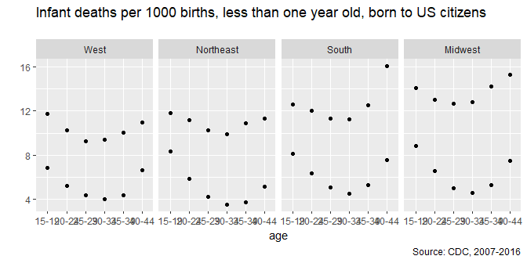

To address the overprinting in the x-axis, I’m going to edit the levels
of the age category by changing them to an integer that is the upper
limit of the range.

``` r
df <- df %>% 
        mutate(age = str_sub(age, 4, 5))  %>% 
        mutate(age = as.integer(age) + 1)

p <- p %+% 
        df +
        labs(x = "\nUpper limit of mother's age group")
p
```

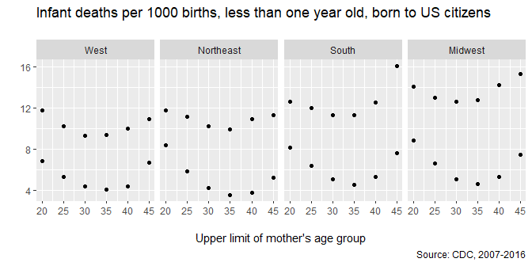

## design aesthetics

I have a separate section on design aesthetics because of our attempt to
humanize the graph.

The first thing I’m going to do is select a somber color scheme. I’ll
start with `theme_graphclass()` them use the `theme()` function to edit
the background color.

``` r
p <- p + 
        theme_graphclass(line_color = rcb("mid_Gray"), 
                font_color = "black", 
                font_size = 12) + 
        theme(axis.line = element_line(colour = rcb("pale_Gray")), 
                strip.text = element_text(color = rcb("dark_Gray"), face = "bold"), 
                plot.margin = unit(c(2, 4, 1, 0), "mm"), # top, right, bottom, and left margins
                panel.border = element_rect(color = rcb("pale_Gray"), fill = NA), 
                panel.spacing = unit(3, "mm"), 
                plot.background = element_rect(color = NA, fill = rcb("pale_Gray")), 
                panel.background = element_rect(color = NA, fill = rcb("pale_Gray")), 
                panel.grid.minor = element_blank(), 
                strip.background = element_rect(color = rcb("pale_Gray"), fill = rcb("pale_Gray"))
        )
p
```

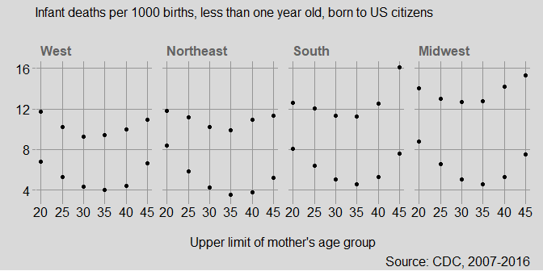

Next I’ll increase the data marker size, use the shape `21` that has
separate border color and fill color. Then I can add `fill = race` to
the `aes()`.

``` r
p <- p + 
        aes(fill = race) +
        geom_point(size = 2.5, shape = 21, color = "black") +
        scale_fill_manual(values = c("black", rcb("pale_Gray")))
p
```

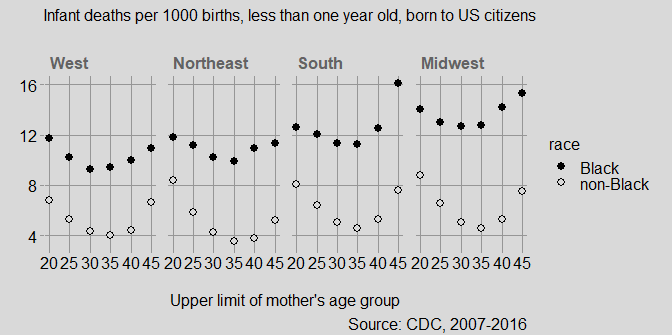

To directly label specific data markers in one panel only, I create a
new data frame. Then inside `geom_text()` I assign the new data frame
and a new aesthetic mapping. The remaining arguments adjust the
position, size, and color of the text.

``` r
df_note <- df %>% 
        filter(region == "West") %>% 
        filter(age == 20)

# the new data frame and the new aes() in the geom 
p <- p + 
        geom_text(data = df_note, 
                mapping = aes(x = age, y = rate, label = race), 
                hjust    = 0, 
                nudge_x  = 1, 
                vjust    = 0, 
                nudge_y  = 0, 
                size     = 4, 
                color    = rcb("dark_Gray"), 
                fontface = "bold")

# adjust the y-scale and omit the legend 
final_graph <- p +
        scale_y_continuous(limits = c(0, max(df$rate))) +
        theme(legend.position = "none") 
```

I added the scale limits on the y-axis because—as you will see in the
next section—the important message (the headline) is that Black infant
mortality is twice (median is a factor of 2.2) that of Non-Black
infants.

The graph is ready to save to prepare for the image `magick` in the next
section.

``` r
ggsave(plot = final_graph, 
        filename = "0602-dotplot-cdc-infants-1.png",
        path    = "cm/images",
        width   = 8,
        height  = 4,
        units   = "in",
        dpi     = "retina")
```

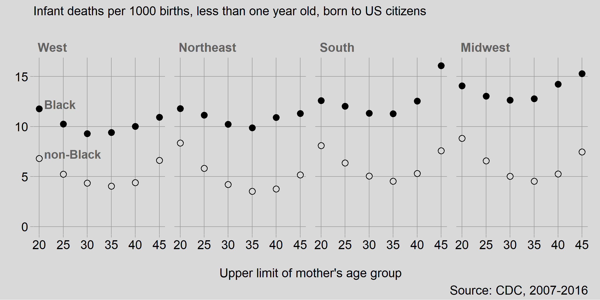

<br> <a href="#top">▲ top of page</a>

## image magick

A graph of infant mortality reveals none of the human suffering
encompassed by the death of a child. By adding a humanizing image, I’ll
attempt to provide some context for the story the data tell.

I found two images I want to work with. I use `magick::image_read()` to
download the image and `image_write()` to save it as a PNG file to the
`resources` directory. I put the read/write functions inside an `if()`
statement so that if the file already exists, I don’t have to download
it again.

``` r
image_file <- "resources/0602-dotplot-child.png"
image_url  <- "http://tinyurl.com/y3xjyh63"

if(!file.exists(image_file)) {
        child <- image_read(image_url)  
        image_write(child, path = image_file, format = "png")
        }

image_file <- "resources/0602-dotplot-woman.png"
image_url  <- "http://tinyurl.com/y474loe7"

if (!file.exists(image_file)) {
        woman <- image_read(image_url)
        image_write(woman, path = image_file, format = "png")
        }
```

The first image is of a child in an ICU; the second is of a grieving
woman of color,


<br> Using magick functions, I can read the images and convert to gray
scale,

``` r
# read images
the_graph <- image_read("figures/0602-dotplot-cdc-infants-1.png")
child     <- image_read("resources/0602-dotplot-child.png")
mother    <- image_read("resources/0602-dotplot-woman.png")

# convert to gray scale 
child  <- image_quantize(child,  max = 10, colorspace = "gray")
mother <- image_quantize(mother, max = 10, colorspace = "gray")
```


<br> Adjust the brightness and contrast

``` r
# adjust brightness and contrast
mother <- image_modulate(mother, brightness = 200)
mother <- image_contrast(mother, sharpen = 0)
```


<br> Overlay a partially opaque white rectangle to soften the images

``` r
# overlay a solid color frame with specified opacity 
child  <- image_colorize(child,  opacity = 25, color = "white")
mother <- image_colorize(mother, opacity = 25, color = "white")
```


<br> Scale the images to the same width and join them together

``` r
# scale them to the same width (in pixels) 
child  <- image_scale(child, "500")
mother <- image_scale(mother, "500")

# append them together in a stacked image
people <- image_append(c(child, mother), stack = TRUE)
```


<br> Add a stippling effect and a border

``` r
# add an effect
people <- image_noise(people)

# add a border 
people <- image_border(people, rcb("pale_Gray"), "15x15")
```

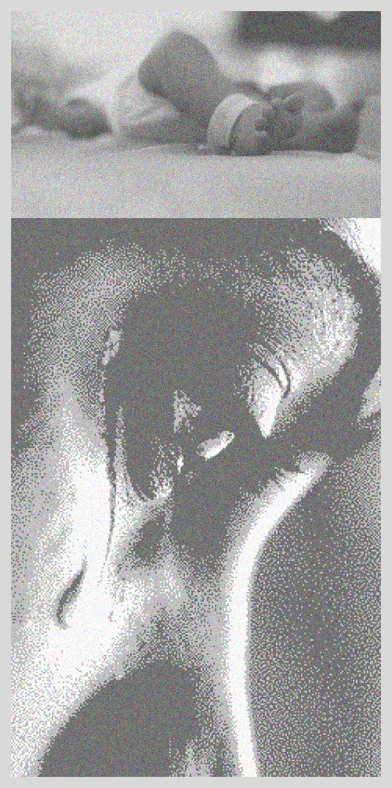

<br> Add the same border to the graph, scale them to the same height,
and join them

``` r
# add a border 
the_graph <- image_border(the_graph, rcb("pale_Gray"), "15x15")

# scale the heights to match 
people    <- image_scale(people, "x500")
the_graph <- image_scale(the_graph, "x500")

# append to the graph image 
final_img <- image_append(c(people, the_graph), stack = FALSE)
```

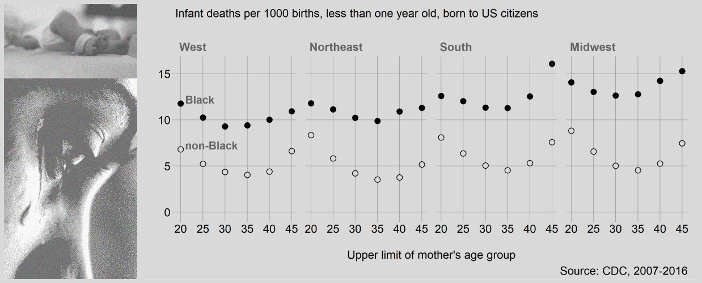

<br> Create a headline box, scaled to match the width of the graph
image.

``` r
# headline box same wiodth as figure 
width  <- image_info(final_img)[["width"]]

# select a height (pixels) by trial and error
height <- 60

# create the box 
text_box <- image_blank(width = width, height = height, color = rcb("pale_Gray"))

# add the headline text to the box 
text_box <- image_annotate(text_box, 
        text     = "Mortality of Black infants is twice that of non-Black infants", 
        gravity  = "west", 
        location = "+10+0", 
        size     = 40, 
        color    = rcb("dark_Gray"), 
        font     = "Georgia")
```


<br> And join the headline to the figure

``` r
# join the headline to the image 
final_img <- image_append(c(text_box, final_img), stack = TRUE)

# and write to file
image_write(final_img, 
        path = "figures/0602-dotplot-cdc-infants-2.png", 
        format = "png")
```

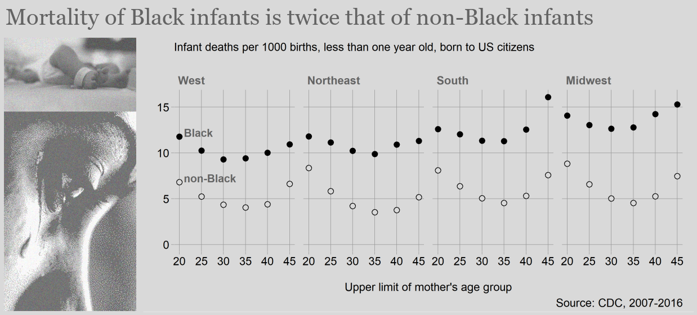

<br> <a href="#top">▲ top of page</a>

## report

The main story is captured in the headline. The other story is why the
death rates are higher at the two extreme age groups. Doing a little bit
of additional reading and we suspect that

  - higher mortality at the lowest age groups mighty be correlated to a
    higher level of drug use by young mothers  
  - higher mortality at the higher age groups is probably caused by risk
    factors associated with the mother’s age

Additional work is needed to consider the effects of income level on
mortality rates.

If we were to include this graph in a report, we would insert the
following code chunk in the Rmd script.

    ```{r}
    library("knitr")
    
    ```

<br> <a href="#top">▲ top of page</a>

## exercises

**1. magick practice**

  - Initialize a new script: `explore/0602-magick-explore.R`  
  - Repeat as much of the magick [introductory
    vignette](https://CRAN.R-project.org/package=magick/vignettes/intro.html)
    as you want to  
  - Experiment with other functions listed on the CRAN [reference
    page](https://CRAN.R-project.org/package=magick/magick.pdf)

**2. Nontraditional**

Carpentry:

  - Initialize a new script:
    `explore/0602-dotplot-nontraditional-explore.R`  
  - Data: `nontraditional` in graphclassmate  
  - Use SAT scores as the quantitative variable  
  - Three categorical variables are sex, race, and path. Group and
    summarize the median SAT by all three variables.
  - Convert each to a factor with levels ordered by SAT score.

The first graph

  - Assign one of the categorical variables to a y-axis mapping in
    `aes()` and assign the other two as `vars()` in `facet_grid()`.
  - Graph and look for a story. Swap the roles of the categorical
    variables and graph again. Repeat until you think you have the best
    display of these data.

Try a different mapping

  - Use `facet_wrap()` with a single `vars()` and map the other
    categorical variable to a color in `aes()`.
  - Again, swap how the categorical variables are assigned until you
    have a story to tell.

## references

<div id="refs">

<div id="ref-Dragga+Voss:2001">

Dragga S and Voss D (2001) Cruel pies: The inhumanity of technical
illustrations. *Technical Communication* **48**(3), 265–274

</div>

<div id="ref-Wickham+Grolemund:2017">

Wickham H and Grolemund G (2017) *R for Data Science.* O’Reilly Media,
Inc., Sebastopol, CA <https://r4ds.had.co.nz/>

</div>

</div>

***
<a href="#top">&#9650; top of page</a>    
[&#9665; calendar](../README.md#calendar)    
[&#9665; index](../README.md#index)
