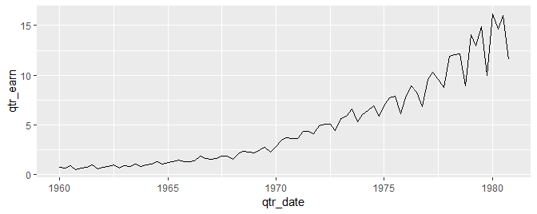

line graph
================


<!-- Notes: introduce the idea of using a separate data frame to add lines, with a data argument and aes() argument in the geom layer instead of the plot layer.  -->

## contents

[introduction](#introduction)  
[prerequisites](#prerequisites)  
[time series with separate year month
day](#time-series-with-separate-year-month-day)  
[time series with decimal dates](#time-series-with-decimal-dates)  
[edit the date scale](#edit-the-date-scale)  
[facet by a date variable](#facet-by-a-date-variable)  
[line color by group](#line-color-by-group)  
[panels with free y-scales](#panels-with-free-y-scales)  
[exercises](#exercises)  
[references](#references)

<!-- http://homepage.stat.uiowa.edu/~luke/classes/STAT4580/timeseries.html#time-series-objects  -->

## introduction

Line graphs are often used for time-series data, thus this tutorial is
paired with our introduction to time and dates. `geom_line()` can of
course be used with other data structures, but the time series is
possibly its most common application.

<br> <a href="#top">▲ top of page</a>

## prerequisites

Project setup

  - Start every work session by launching the RStudio Project file for
    the course, e.g., `portfolio.Rproj`  
  - Ensure your [project directory
    structure](cm501-proj-m-manage-files.md#planning-the-directory-structure)
    satisfies the course requirements

Ensure you have installed the following packages. See [install
packages](cm902-software-studio.md#install-packages) for instructions if
needed.

  - [**tidyverse**](http://tidyverse.tidyverse.org): The ‘tidyverse’ is
    a set of packages that work in harmony because they share common
    data representations and ‘API’ design. This package is designed to
    make it easy to install and load multiple ‘tidyverse’ packages in a
    single step. Learn more about the ‘tidyverse’ at
    <https://tidyverse.org>.
  - [**lubridate**](http://lubridate.tidyverse.org): Functions to work
    with date-times and time-spans: fast and user friendly parsing of
    date-time data, extraction and updating of components of a date-time
    (years, months, days, hours, minutes, and seconds), algebraic
    manipulation on date-time and time-span objects. The ‘lubridate’
    package has a consistent and memorable syntax that makes working
    with dates easy and fun. Parts of the ‘CCTZ’ source code, released
    under the Apache 2.0 License, are included in this package. See
    <https://github.com/google/cctz> for more details.
  - [**cdata**](https://github.com/WinVector/cdata/): Supplies
    higher-order fluid data transform operators that include pivot and
    anti-pivot as special cases. The methodology is describe in ‘Zumel’,
    2018, “Fluid data reshaping with ‘cdata’”,
    <http://winvector.github.io/FluidData/FluidDataReshapingWithCdata.html>
    , <doi:10.5281/zenodo.1173299> . Works on in-memory data or on
    remote data using ‘rquery’ and the ‘DBI’ database interface.
  - [**astsa**](http://www.stat.pitt.edu/stoffer/tsa4/%20https://github.com/nickpoison/astsa):
    Included are data sets and scripts to accompany Time Series Analysis
    and Its Applications: With R Examples (4th ed), by R.H. Shumway and
    D.S. Stoffer. Springer Texts in Statistics, 2017.
    <DOI:10.1007/978-3-319-52452-8>.
  - [**HistData**](https://CRAN.R-project.org/package=HistData): The
    ‘HistData’ package provides a collection of small data sets that
    are interesting and important in the history of statistics and data
    visualization. The goal of the package is to make these available,
    both for instructional use and for historical research. Some of
    these present interesting challenges for graphics or analysis in R.
  - **nycflights**

Scripts to initialize

``` 
explore/     0603-line-graph-explore.R  
```

And start with a minimal header

``` r
# your name
# date

# load packages
library("tidyverse")
library("lubridate")
library("HistData")
library("cdata")
```

Duplicate the lines of code in the session one chunk at a time. Save,
Source, and compare your results to the results shown.

<br> <a href="#top">▲ top of page</a>

## time series with separate year month day

From the help page (`? airquality`) we find that these data were
obtained in 1973, and the month and day are in separate columns.

``` r
glimpse(airquality)
#> Observations: 153
#> Variables: 6
#> $ Ozone   <int> 41, 36, 12, 18, NA, 28, 23, 19, 8, NA, 7, 16, 11, 14, ...
#> $ Solar.R <int> 190, 118, 149, 313, NA, NA, 299, 99, 19, 194, NA, 256,...
#> $ Wind    <dbl> 7.4, 8.0, 12.6, 11.5, 14.3, 14.9, 8.6, 13.8, 20.1, 8.6...
#> $ Temp    <int> 67, 72, 74, 62, 56, 66, 65, 59, 61, 69, 74, 69, 66, 68...
#> $ Month   <int> 5, 5, 5, 5, 5, 5, 5, 5, 5, 5, 5, 5, 5, 5, 5, 5, 5, 5, ...
#> $ Day     <int> 1, 2, 3, 4, 5, 6, 7, 8, 9, 10, 11, 12, 13, 14, 15, 16,...
```

We add a year column

``` r
df <- airquality %>% 
    mutate(Year = 1973L) %>% 
    glimpse()
#> Observations: 153
#> Variables: 7
#> $ Ozone   <int> 41, 36, 12, 18, NA, 28, 23, 19, 8, NA, 7, 16, 11, 14, ...
#> $ Solar.R <int> 190, 118, 149, 313, NA, NA, 299, 99, 19, 194, NA, 256,...
#> $ Wind    <dbl> 7.4, 8.0, 12.6, 11.5, 14.3, 14.9, 8.6, 13.8, 20.1, 8.6...
#> $ Temp    <int> 67, 72, 74, 62, 56, 66, 65, 59, 61, 69, 74, 69, 66, 68...
#> $ Month   <int> 5, 5, 5, 5, 5, 5, 5, 5, 5, 5, 5, 5, 5, 5, 5, 5, 5, 5, ...
#> $ Day     <int> 1, 2, 3, 4, 5, 6, 7, 8, 9, 10, 11, 12, 13, 14, 15, 16,...
#> $ Year    <int> 1973, 1973, 1973, 1973, 1973, 1973, 1973, 1973, 1973, ...
```

We create the `Date` class variable `meas-date`

``` r
df <- airquality %>% 
    mutate(Year = 1973L) %>% 
    mutate(meas_date = make_date(year = Year, month = Month, day = Day)) %>% 
    glimpse()
#> Observations: 153
#> Variables: 8
#> $ Ozone     <int> 41, 36, 12, 18, NA, 28, 23, 19, 8, NA, 7, 16, 11, 14...
#> $ Solar.R   <int> 190, 118, 149, 313, NA, NA, 299, 99, 19, 194, NA, 25...
#> $ Wind      <dbl> 7.4, 8.0, 12.6, 11.5, 14.3, 14.9, 8.6, 13.8, 20.1, 8...
#> $ Temp      <int> 67, 72, 74, 62, 56, 66, 65, 59, 61, 69, 74, 69, 66, ...
#> $ Month     <int> 5, 5, 5, 5, 5, 5, 5, 5, 5, 5, 5, 5, 5, 5, 5, 5, 5, 5...
#> $ Day       <int> 1, 2, 3, 4, 5, 6, 7, 8, 9, 10, 11, 12, 13, 14, 15, 1...
#> $ Year      <int> 1973, 1973, 1973, 1973, 1973, 1973, 1973, 1973, 1973...
#> $ meas_date <date> 1973-05-01, 1973-05-02, 1973-05-03, 1973-05-04, 197...


class(df$meas_date)
#> [1] "Date"
```

Graph the time series as a line graph and with data points shown. Note
that missing data are not connected by the line.

``` r
ggplot(df, aes(x = meas_date, y = Ozone)) + 
    geom_line() + 
    geom_point() 
```


<br> <a href="#top">▲ top of page</a>

## time series with decimal dates

CO<sub>2</sub> levels from the NOAA dataset from 1958 to the latest
available. Download using `download.file()` works well for text files.

``` r
co2_ftp  <- "ftp://aftp.cmdl.noaa.gov/products/trends/co2/co2_mm_mlo.txt"
co2_file <- "data/noaa_co2.txt"

# update file if more than 4 weeks since last download
if (!file.exists(co2_file) | now() > file.mtime(co2_file) + weeks(4)) {
    download.file(co2_ftp, co2_file)
}
```

If you open the text file, you see that dates are recorded as decimal
dates; missing data are encoded -99.99; -1 indicates no data for \#days.
Columns names are show too.

    # CO2 expressed as a mole fraction in dry air, micromol/mol, abbreviated as ppm
    #
    #  (-99.99 missing data;  -1 no data for #daily means in month)
    #
    #            decimal     average   interpolated    trend    #days
    #             date                             (season corr)
    1958   3    1958.208      315.71      315.71      314.62     -1
    1958   4    1958.292      317.45      317.45      315.29     -1
    1958   5    1958.375      317.50      317.50      314.71     -1
    1958   6    1958.458      -99.99      317.10      314.85     -1

To bring this file into R, use `read.table()`. It skips the explanatory
text at the top of the file.

``` r
co2 <- read.table(co2_file)
names(co2) <- c("year", "month", "decimal_date", "average",
                   "interpolated", "trend", "ndays") 
glimpse(co2)
#> Observations: 733
#> Variables: 7
#> $ year         <int> 1958, 1958, 1958, 1958, 1958, 1958, 1958, 1958, 1...
#> $ month        <int> 3, 4, 5, 6, 7, 8, 9, 10, 11, 12, 1, 2, 3, 4, 5, 6...
#> $ decimal_date <dbl> 1958.208, 1958.292, 1958.375, 1958.458, 1958.542,...
#> $ average      <dbl> 315.71, 317.45, 317.50, -99.99, 315.86, 314.93, 3...
#> $ interpolated <dbl> 315.71, 317.45, 317.50, 317.10, 315.86, 314.93, 3...
#> $ trend        <dbl> 314.62, 315.29, 314.71, 314.85, 314.98, 315.94, 3...
#> $ ndays        <int> -1, -1, -1, -1, -1, -1, -1, -1, -1, -1, -1, -1, -...
```

Make the missing values explicit NA.

``` r
co2 <- co2 %>% 
    mutate(average = if_else(average < -90, NA_real_, average)) %>% 
    mutate(ndays = if_else(ndays == -1, NA_integer_, ndays))
```

Convert the decimal dates to POSIXct to Date class.

``` r
co2 <- co2 %>% 
    mutate(date_meas = date_decimal(decimal_date)) %>% 
    mutate(date_meas = as_date(date_meas)) %>% 
    glimpse()
#> Observations: 733
#> Variables: 8
#> $ year         <int> 1958, 1958, 1958, 1958, 1958, 1958, 1958, 1958, 1...
#> $ month        <int> 3, 4, 5, 6, 7, 8, 9, 10, 11, 12, 1, 2, 3, 4, 5, 6...
#> $ decimal_date <dbl> 1958.208, 1958.292, 1958.375, 1958.458, 1958.542,...
#> $ average      <dbl> 315.71, 317.45, 317.50, NA, 315.86, 314.93, 313.2...
#> $ interpolated <dbl> 315.71, 317.45, 317.50, 317.10, 315.86, 314.93, 3...
#> $ trend        <dbl> 314.62, 315.29, 314.71, 314.85, 314.98, 315.94, 3...
#> $ ndays        <int> NA, NA, NA, NA, NA, NA, NA, NA, NA, NA, NA, NA, N...
#> $ date_meas    <date> 1958-03-17, 1958-04-17, 1958-05-17, 1958-06-17, ...
```

And graph it.

``` r
ggplot(co2, aes(x = date_meas, y = interpolated)) +
    geom_line()
```


<br> <a href="#top">▲ top of page</a>

## edit the date scale

ggplot2 has scale functions for dates. here we can set the interval
between tick marks to 5 years.

``` r
ggplot(co2, aes(x = date_meas, y = interpolated)) +
    geom_line() +
    scale_x_date(date_breaks = "5 years")
```


The `date_labels` argument lets us change the format of the date on the
scale. See available date formats by running `? strptime`.

``` r
ggplot(co2, aes(x = date_meas, y = interpolated)) +
    geom_line() +
    scale_x_date(date_breaks = "5 years", date_labels = "%Y")
```


<br> <a href="#top">▲ top of page</a>

## facet by a date variable

Cycle plots use faceting by some time period. Here, we have a month
variable in the data frame. We can use month as a facet variable.

``` r
ggplot(co2, aes(x = date_meas, y = interpolated)) +
    geom_line() +
    scale_x_date(date_breaks = "10 years", date_labels = "%y") +
    facet_wrap(vars(month))
```


Let’s replace the strip label (months 1 through 12) with month
abbreviations, Jan, Feb, etc.

``` r
co2 <- co2 %>% 
    mutate(month_abbrev = month.abb[month]) %>% 
    glimpse()
#> Observations: 733
#> Variables: 9
#> $ year         <int> 1958, 1958, 1958, 1958, 1958, 1958, 1958, 1958, 1...
#> $ month        <int> 3, 4, 5, 6, 7, 8, 9, 10, 11, 12, 1, 2, 3, 4, 5, 6...
#> $ decimal_date <dbl> 1958.208, 1958.292, 1958.375, 1958.458, 1958.542,...
#> $ average      <dbl> 315.71, 317.45, 317.50, NA, 315.86, 314.93, 313.2...
#> $ interpolated <dbl> 315.71, 317.45, 317.50, 317.10, 315.86, 314.93, 3...
#> $ trend        <dbl> 314.62, 315.29, 314.71, 314.85, 314.98, 315.94, 3...
#> $ ndays        <int> NA, NA, NA, NA, NA, NA, NA, NA, NA, NA, NA, NA, N...
#> $ date_meas    <date> 1958-03-17, 1958-04-17, 1958-05-17, 1958-06-17, ...
#> $ month_abbrev <chr> "Mar", "Apr", "May", "Jun", "Jul", "Aug", "Sep", ...
```

My abbreviation needs to be a factor,

``` r
co2 <- co2 %>% 
    mutate(month_abbrev = factor(month_abbrev, levels = month.abb)) %>% 
    glimpse()
#> Observations: 733
#> Variables: 9
#> $ year         <int> 1958, 1958, 1958, 1958, 1958, 1958, 1958, 1958, 1...
#> $ month        <int> 3, 4, 5, 6, 7, 8, 9, 10, 11, 12, 1, 2, 3, 4, 5, 6...
#> $ decimal_date <dbl> 1958.208, 1958.292, 1958.375, 1958.458, 1958.542,...
#> $ average      <dbl> 315.71, 317.45, 317.50, NA, 315.86, 314.93, 313.2...
#> $ interpolated <dbl> 315.71, 317.45, 317.50, 317.10, 315.86, 314.93, 3...
#> $ trend        <dbl> 314.62, 315.29, 314.71, 314.85, 314.98, 315.94, 3...
#> $ ndays        <int> NA, NA, NA, NA, NA, NA, NA, NA, NA, NA, NA, NA, N...
#> $ date_meas    <date> 1958-03-17, 1958-04-17, 1958-05-17, 1958-06-17, ...
#> $ month_abbrev <fct> Mar, Apr, May, Jun, Jul, Aug, Sep, Oct, Nov, Dec,...
```

OK

``` r
ggplot(co2, aes(x = date_meas, y = interpolated)) +
    geom_line() +
    scale_x_date(date_breaks = "10 years", date_labels = "%y") +
    facet_wrap(vars(month_abbrev))
```


## line color by group

``` r
ggplot(co2, aes(x = date_meas, y = interpolated, group = month_abbrev, color = month_abbrev)) +
    geom_line() +
    scale_x_date(date_breaks = "5 years", date_labels = "%Y") +
    guides(color = guide_legend(reverse = FALSE)) 
```


<br> <a href="#top">▲ top of page</a>

## panels with free y-scales

After witnessing deplorable sanitary conditions in the Crimea, Florence
Nightingale wrote several influential texts showing the number of deaths
in the Crimean from battle compared to disease or preventable causes
that could be reduced by better battlefield nursing care.

``` r
data(Nightingale, package = "HistData")
head(Nightingale)
#>         Date Month Year  Army Disease Wounds Other Disease.rate
#> 1 1854-04-01   Apr 1854  8571       1      0     5          1.4
#> 2 1854-05-01   May 1854 23333      12      0     9          6.2
#> 3 1854-06-01   Jun 1854 28333      11      0     6          4.7
#> 4 1854-07-01   Jul 1854 28722     359      0    23        150.0
#> 5 1854-08-01   Aug 1854 30246     828      1    30        328.5
#> 6 1854-09-01   Sep 1854 30290     788     81    70        312.2
#>   Wounds.rate Other.rate
#> 1         0.0        7.0
#> 2         0.0        4.6
#> 3         0.0        2.5
#> 4         0.0        9.6
#> 5         0.4       11.9
#> 6        32.1       27.7
```

The variables named `.rate` are the annual rate of deaths per 1000
people. We’d like to reshape the data so that all the rates are in one
column.

``` r
these_names <- c("Disease.rate", "Wounds.rate", "Other.rate")
crimea <- unpivot_to_blocks(
        data                  = Nightingale,
        nameForNewKeyColumn   = "cause",
        nameForNewValueColumn = "rate",
        columnsToTakeFrom     = these_names
        ) %>% 
    glimpse()
#> Observations: 72
#> Variables: 9
#> $ Date    <date> 1854-04-01, 1854-04-01, 1854-04-01, 1854-05-01, 1854-...
#> $ Month   <ord> Apr, Apr, Apr, May, May, May, Jun, Jun, Jun, Jul, Jul,...
#> $ Year    <int> 1854, 1854, 1854, 1854, 1854, 1854, 1854, 1854, 1854, ...
#> $ Army    <int> 8571, 8571, 8571, 23333, 23333, 23333, 28333, 28333, 2...
#> $ Disease <int> 1, 1, 1, 12, 12, 12, 11, 11, 11, 359, 359, 359, 828, 8...
#> $ Wounds  <int> 0, 0, 0, 0, 0, 0, 0, 0, 0, 0, 0, 0, 1, 1, 1, 81, 81, 8...
#> $ Other   <int> 5, 5, 5, 9, 9, 9, 6, 6, 6, 23, 23, 23, 30, 30, 30, 70,...
#> $ cause   <chr> "Disease.rate", "Wounds.rate", "Other.rate", "Disease....
#> $ rate    <dbl> 1.4, 0.0, 7.0, 6.2, 0.0, 4.6, 4.7, 0.0, 2.5, 150.0, 0....
```

The graph with the same scales shows how significant disease was
compared to other causes of death.

``` r
ggplot(data = crimea, mapping = aes(x = Date, y = rate)) + 
    geom_line() +
  facet_wrap(vars(cause), ncol = 1) +
    scale_x_date(date_breaks = "4 months", date_labels = "%b %Y")
```


However, if we want to see specific values, we can free the y scales.
Each panel has its own scale.

``` r
ggplot(data = crimea, mapping = aes(x = Date, y = rate)) + 
    geom_line() +
  facet_wrap(vars(cause), ncol = 1, scales = "free_y") +
    scale_x_date(date_breaks = "4 months", date_labels = "%b %Y")
```


<br> <a href="#top">▲ top of page</a>

## exercises

**1. NYC flights**

Script: `explore/0603-line-graph-flights-explore.R`

Data: `flights` in the nycflights13 package

  - Explore: Identify the number of observations and the number and type
    and class of variables. Determine the type of date variable.

  - Carpentry: Count the number of flights by year, month, and day. Use
    `wday()` to create a new variable whose values are the 3-letter
    abbreviations of a weekday.

  - Design: Graph of the number of flights per day faceted by day of the
    week. Edit the scale to show the month.

*Answer*

    #> Observations: 365
    #> Variables: 6
    #> $ year        <int> 2013, 2013, 2013, 2013, 2013, 2013, 2013, 2013, 20...
    #> $ month       <int> 1, 1, 1, 1, 1, 1, 1, 1, 1, 1, 1, 1, 1, 1, 1, 1, 1,...
    #> $ day         <int> 1, 2, 3, 4, 5, 6, 7, 8, 9, 10, 11, 12, 13, 14, 15,...
    #> $ n           <int> 842, 943, 914, 915, 720, 832, 933, 899, 902, 932, ...
    #> $ date_2013   <date> 2013-01-01, 2013-01-02, 2013-01-03, 2013-01-04, 2...
    #> $ day_of_week <ord> Tue, Wed, Thu, Fri, Sat, Sun, Mon, Tue, Wed, Thu, ...


**2. jj earnings**

Script: `explore/0603-line-graph-jj-explore.R`

Data: `jj` in the astsa package

  - Explore: Identify the number of observations and the number and type
    and class of variables. Determine the type of date variable. Recall
    that you can see a help page on any data set supplied with a
    package, e.g., `? jj`

  - Carpentry: Convert the Time-Series to a data frame. Convert the
    resulting time or date variable to an appropriate class or type.

  - Design: Graph quarterly earnings over time

*Answer*

    #> Observations: 84
    #> Variables: 2
    #> $ qtr_date <date> 1960-01-01, 1960-04-01, 1960-07-01, 1960-10-01, 1961...
    #> $ qtr_earn <dbl> 0.71, 0.63, 0.85, 0.44, 0.61, 0.69, 0.92, 0.55, 0.72,...



**3. blood tests**

Script: `explore/0603-line-graph-blood-explore.R`

Data: `blood` in the astsa package

  - Explore: Identify the number of observations and the number and type
    and class of variables. Determine the type of date variable. Recall
    that you can see a help page on any data set supplied with a
    package, e.g., `? blood`

  - Carpentry: Convert the Time-Series to a data frame. Convert the
    resulting time or date variable to an appropriate class or type.

  - Design: Line graph of the test results as a function of observation,
    faceted by test type.

*Answer*

    #> Observations: 273
    #> Variables: 3
    #> $ test_id     <chr> "WBC", "WBC", "WBC", "WBC", "WBC", "WBC", "WBC", "...
    #> $ test_result <dbl> 2.332, 1.887, 2.079, 1.820, 1.820, 1.529, 1.644, 1...
    #> $ observation <dbl> 1, 2, 3, 4, 5, 6, 7, 8, 9, 10, 11, 12, 13, 14, 15,...


## references

<div id="refs">

<div id="ref-Wickham+Grolemund:2017">

Wickham H and Grolemund G (2017) *R for Data Science.* O’Reilly Media,
Inc., Sebastopol, CA <https://r4ds.had.co.nz/>

</div>

</div>

***
<a href="#top">&#9650; top of page</a>    
[&#9665; calendar](../README.md#calendar)    
[&#9665; index](../README.md#index)
