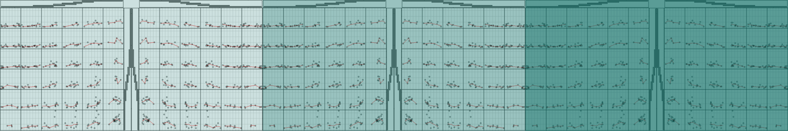
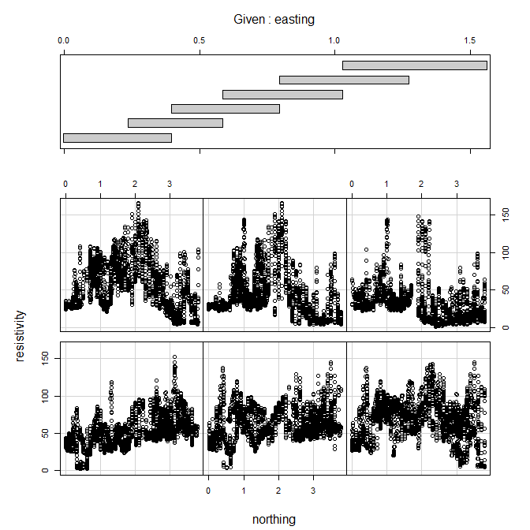
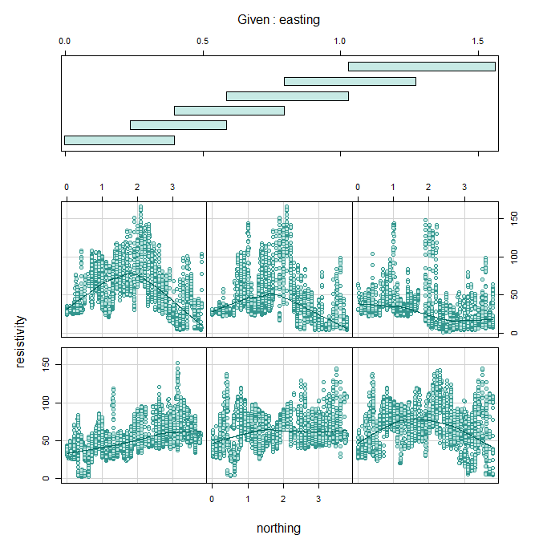
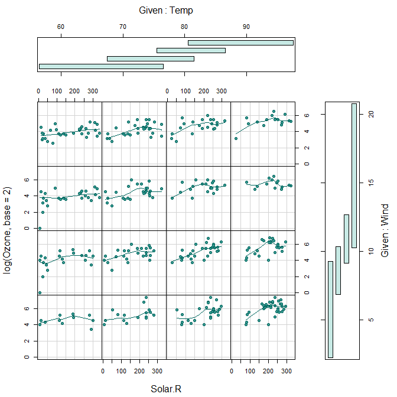
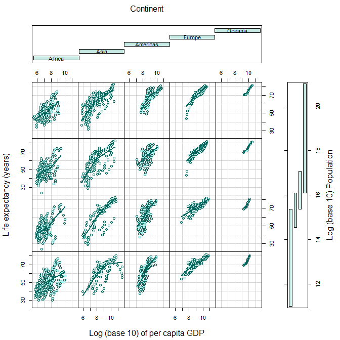

conditioning plot
================



## contents

[introduction](#introduction)  
[prerequisites](#prerequisites)  
[explore](#explore)  
[exercises](#exercises)  
[references](#references)

## introduction

A scatterplot matrix, while suitable for any number of quantitative
variables, shows the dependence of only two variables at a time. To see
the dependence of three or four quantitative variables simultaneously,
we use a conditioning plot (or coplot).

Data characteristics

  - 3 or 4 quantitative variables  
  - With 3 quantitative variables it is possible to have one categorical
    variable as one of the two conditioning variables and possibly a
    second categorical variable assigned to a data marker aesthetic  
  - With 4 quantitative variables it is possible to have a categorical
    variable assigned to a data marker aesthetic only

Graph characteristics

  - A grid of panels
  - Each panel is a scatterplot of the same two quantitative variables
    conditioned by the value or range of one or two conditioning
    variables - The conditioning variable ranges are shown in panels
    above or adjacent to the main grid  
  - Optional: loess or other smooth fit per panel

[D6 Multivariate](cm301-report-display-reqts.md#D6-multivariate) data
and graph requirements

<br> <a href="#top">▲ top of page</a>

## prerequisites

Project setup

  - Start every work session by launching the RStudio Project file for
    the course, e.g., `portfolio.Rproj`  
  - Ensure your [project directory
    structure](cm501-proj-m-manage-files.md#planning-the-directory-structure)
    satisfies the course requirements

Ensure you have installed the following packages. See [install
packages](cm902-software-studio.md#install-packages) for instructions if
needed.

  - [**tidyverse**](http://tidyverse.tidyverse.org): The ‘tidyverse’ is
    a set of packages that work in harmony because they share common
    data representations and ‘API’ design. This package is designed to
    make it easy to install and load multiple ‘tidyverse’ packages in a
    single step. Learn more about the ‘tidyverse’ at
    <https://tidyverse.org>.

Scripts to initialize

``` 
explore/     0801-conditioning-plot-explore.R  
```

And start the file with a minimal header

``` r
# your name
# date

# load packages
library("tidyverse")
```

Duplicate the lines of code in the session one chunk at a time. Save,
Source, and compare your results to the results shown.

<br> <a href="#top">▲ top of page</a>

## explore

Open the explore script you initialized earlier.

`coplot()` is a base R graphics function

``` r
soil <- read.table("http://homepage.divms.uiowa.edu/~luke/data/soil.dat")
glimpse(soil)
#> Observations: 8,641
#> Variables: 5
#> $ northing    <dbl> 0.0180, 0.0178, 0.0176, 0.0174, 0.0171, 0.0169, 0....
#> $ easting     <dbl> 0.0160, 0.0252, 0.0345, 0.0437, 0.0529, 0.0621, 0....
#> $ resistivity <dbl> 34.15, 34.81, 35.65, 36.44, 37.10, 37.53, 37.58, 3...
#> $ is.ns       <lgl> FALSE, FALSE, FALSE, FALSE, FALSE, FALSE, FALSE, F...
#> $ track       <int> 1, 1, 1, 1, 1, 1, 1, 1, 1, 1, 1, 1, 1, 1, 1, 1, 1,...
```

``` r
coplot(resistivity ~ northing | easting, 
             data = soil)
```



Add a panel function to create a smooth fit and use base R graphics
functions to edit the aesthetics. For details on the arguments, see the
help pages,

  - `? panel.smooth`
  - `? coplot`

<!-- end list -->

``` r
my_panel <- function(x, y, ...) {
        panel.smooth(x, y, 
                span = 0.6, 
                iter = 5, 
                lwd  = 1,
                col.smooth = rcb("dark_BG"), 
                ...)
}
coplot(resistivity ~ northing | easting, 
        data = soil, 
        pch  = 21, 
        col  = rcb("mid_BG"), 
        bg   = rcb("pale_BG"), 
        bar.bg = c(num = rcb("pale_BG"), fac = rcb("pale_BG")), 
        panel = my_panel)
```



With 4 variables

``` r
data(airquality)

airquality <- as_tibble(airquality) %>% 
    drop_na() %>% 
    glimpse()
#> Observations: 111
#> Variables: 6
#> $ Ozone   <int> 41, 36, 12, 18, 23, 19, 8, 16, 11, 14, 18, 14, 34, 6, ...
#> $ Solar.R <int> 190, 118, 149, 313, 299, 99, 19, 256, 290, 274, 65, 33...
#> $ Wind    <dbl> 7.4, 8.0, 12.6, 11.5, 8.6, 13.8, 20.1, 9.7, 9.2, 10.9,...
#> $ Temp    <int> 67, 72, 74, 62, 65, 59, 61, 69, 66, 68, 58, 64, 66, 57...
#> $ Month   <int> 5, 5, 5, 5, 5, 5, 5, 5, 5, 5, 5, 5, 5, 5, 5, 5, 5, 5, ...
#> $ Day     <int> 1, 2, 3, 4, 7, 8, 9, 12, 13, 14, 15, 16, 17, 18, 19, 2...
```

``` r
coplot(log(Ozone, base = 2) ~ Solar.R | Temp * Wind, 
        data = airquality, 
        pch  = 21, 
        col  = rcb("dark_BG"), 
        bg   = rcb("mid_BG"), 
        bar.bg = c(num = rcb("pale_BG"), fac = rcb("pale_BG")), 
        number = 4, 
        overlap = 0.5,
        panel = my_panel)
```



## exercises

**1. gapminder**

Script: `explore/0801-conditioning-plot-gapminder-explore.R`

Data: `gapminder` in the gapminder package.

Explore: Identify the number of observations and the number and type and
class of variables. Recall that you can see a help page on any data set
supplied with a package, e.g., `? gapminder`

Carpentry: Reorder the `continent` factor by the `gdpPercap` variable

Design: Create a coplot with `lifeExp` as a function of the log of
`gdpPercap` conditioned by `continent` and the log of `pop`. Note that
continent is a factor.

*Answer*



## references

<div id="refs">

<div id="ref-Wickham+Grolemund:2017">

Wickham H and Grolemund G (2017) *R for Data Science.* O’Reilly Media,
Inc., Sebastopol, CA <https://r4ds.had.co.nz/>

</div>

</div>

***
<a href="#top">&#9650; top of page</a>    
[&#9665; calendar](../README.md#calendar)    
[&#9665; index](../README.md#index)
