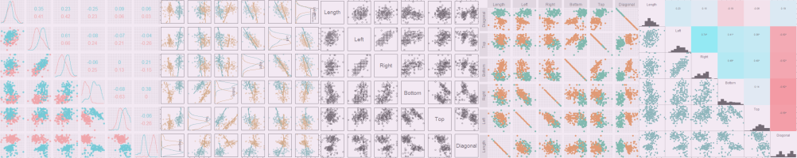
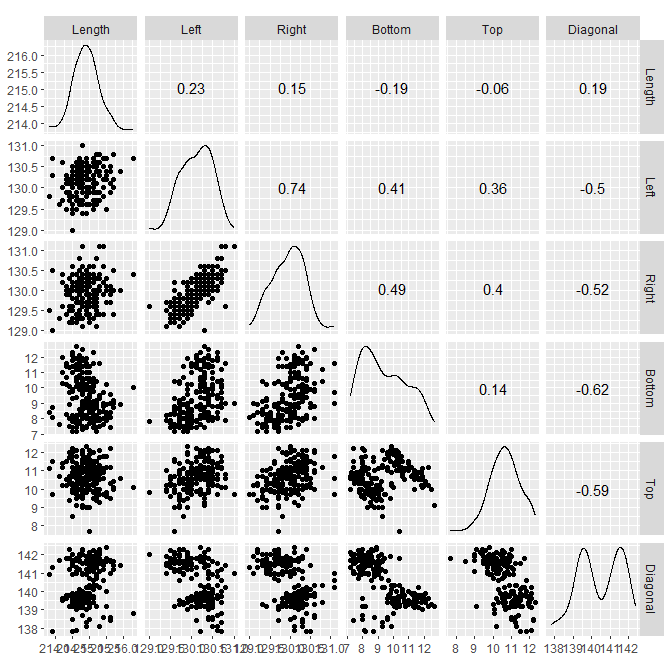
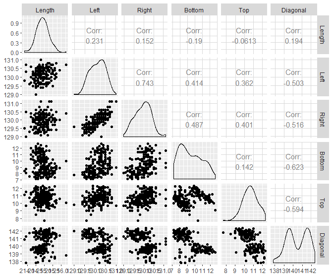
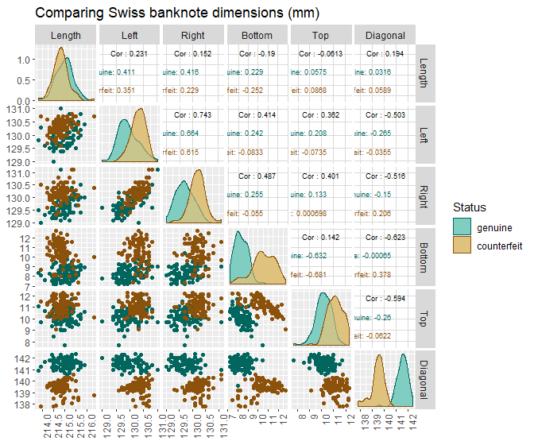
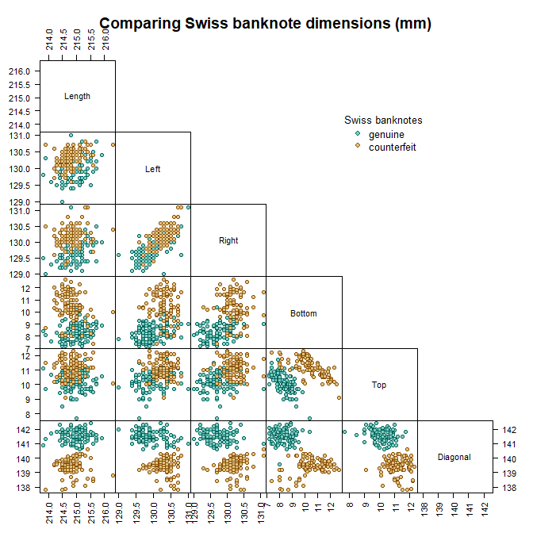
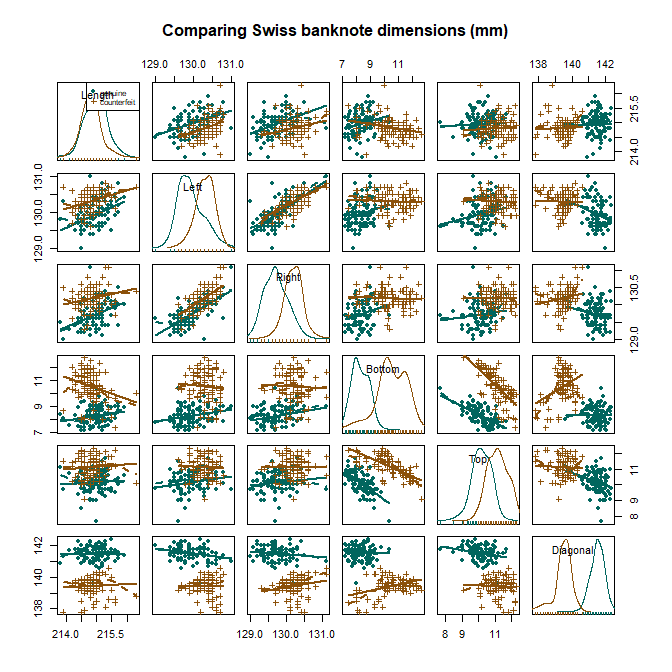
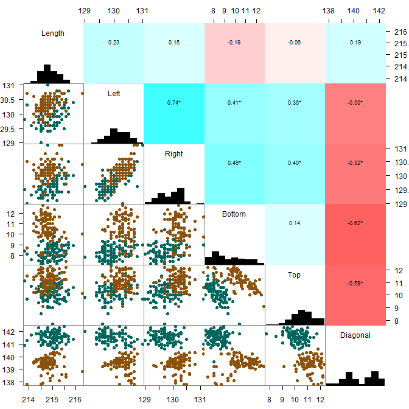
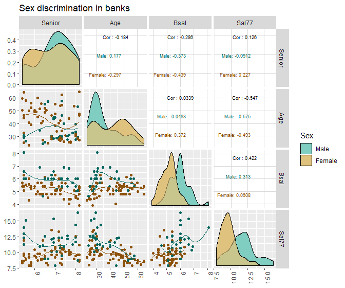

scatterplot matrix
================



## contents

[introduction](#introduction)  
[prerequisites](#prerequisites)  
[data](#data)  
[ggscatmat()](#ggscatmat)  
[ggpairs()](#ggpairs)  
[non-ggplot packages](#non-ggplot-packages)  
[exercises](#exercises)  
[references](#references)

## introduction

A *scatterplot matrix* (or *pairs plot*) is a graph design for
visualizing three or more quantitative variables and (possibly)
categorical variables. The scatterplot matrix is a grid of scatterplots
showing the bivariate relationships between all pairs of variables
(Emerson and others, [2013](#ref-Emerson+Green+etal:2013)).

Data characteristics

  - 3 or more quantitative variables  
  - 1 or more categorical variables (optional). If you have a
    categorical variable, some packages cannot be used.  
  - A key variable if data are not coordinatized

Graph characteristics

  - A matrix of scatterplots
  - The variable names are the labels of the rows and the columns of the
    matrix
  - Optional: loess or other smooth fit
  - Optional: the matrix diagonal shows a statistical summary of the
    variable
  - Optional: pair-wise correlation coefficients

[D6 Multivariate](cm301-report-display-reqts.md#D6-multivariate) data
and graph requirements

<br> <a href="#top">▲ top of page</a>

## prerequisites

Project setup

  - Start every work session by launching the RStudio Project file for
    the course, e.g., `portfolio.Rproj`  
  - Ensure your [project directory
    structure](cm501-proj-m-manage-files.md#planning-the-directory-structure)
    satisfies the course requirements

Ensure you have installed the following packages. See [install
packages](cm902-software-studio.md#install-packages) for instructions if
needed.

  - [**tidyverse**](http://tidyverse.tidyverse.org): The ‘tidyverse’ is
    a set of packages that work in harmony because they share common
    data representations and ‘API’ design. This package is designed to
    make it easy to install and load multiple ‘tidyverse’ packages in a
    single step. Learn more about the ‘tidyverse’ at
    <https://tidyverse.org>.
  - [**graphclassmate**](https://github.com/graphdr/graphclassmate): An
    R package with companion materials for a course in data
    visualization. The package provides data sets structured for a
    variety of graph types plus a ggplot2 theme.  
  - [**GGally**](https://ggobi.github.io/ggally): The R package
    ‘ggplot2’ is a plotting system based on the grammar of graphics.
    ‘GGally’ extends ‘ggplot2’ by adding several functions to reduce the
    complexity of combining geometric objects with transformed data.
    Some of these functions include a pairwise plot matrix, a two group
    pairwise plot matrix, a parallel coordinates plot, a survival plot,
    and several functions to plot networks.
  - [**Sleuth2**](http://r-forge.r-project.org/projects/sleuth2/): Data
    sets from Ramsey, F.L. and Schafer, D.W. (2002), “The Statistical
    Sleuth: A Course in Methods of Data Analysis (2nd ed)”, Duxbury.
  - [**car**](https://r-forge.r-project.org/projects/car/): Functions to
    Accompany J. Fox and S. Weisberg, An R Companion to Applied
    Regression, Third Edition, Sage, in press.
  - [**gclus**](https://CRAN.R-project.org/package=gclus): Orders panels
    in scatterplot matrices and parallel coordinate displays by some
    merit index. Package contains various indices of merit, ordering
    functions, and enhanced versions of pairs and parcoord which color
    panels according to their merit level.
  - [**gpairs**](https://CRAN.R-project.org/package=gpairs): Produces a
    generalized pairs (gpairs) plot.

Scripts to initialize

``` 
explore/     0801-scatterplot-matrix-explore.R  
```

And start the file with a minimal header

``` r
# your name
# date

# load packages
library("tidyverse")
library("graphclassmate")
```

Duplicate the lines of code in the session one chunk at a time. Save,
Source, and compare your results to the results shown.

<br> <a href="#top">▲ top of page</a>

## data

Open the explore script you initialized earlier. Load the package that
has the data. These data are measurements made of genuine and
counterfeit Swiss bank notes. To learn more about the data set, open its
help page by running `? bank`. All dimensions are in mm.

``` r
library("gclus")
data(bank, package = "gclus")
glimpse(bank)
#> Observations: 200
#> Variables: 7
#> $ Status   <int> 0, 0, 0, 0, 0, 0, 0, 0, 0, 0, 0, 0, 0, 0, 0, 0, 0, 0,...
#> $ Length   <dbl> 214.8, 214.6, 214.8, 214.8, 215.0, 215.7, 215.5, 214....
#> $ Left     <dbl> 131.0, 129.7, 129.7, 129.7, 129.6, 130.8, 129.5, 129....
#> $ Right    <dbl> 131.1, 129.7, 129.7, 129.6, 129.7, 130.5, 129.7, 129....
#> $ Bottom   <dbl> 9.0, 8.1, 8.7, 7.5, 10.4, 9.0, 7.9, 7.2, 8.2, 9.2, 7....
#> $ Top      <dbl> 9.7, 9.5, 9.6, 10.4, 7.7, 10.1, 9.6, 10.7, 11.0, 10.0...
#> $ Diagonal <dbl> 141.0, 141.7, 142.2, 142.0, 141.8, 141.4, 141.6, 141....
```

The status variable is an integer, where 0 = a genuine bank note and 1 =
a counterfeit bank note. To condition the graphs by status, we convert
the variable to a factor with the levels “genuine” and “counterfeit.”

``` r
bank <- bank %>%
        mutate(Status = factor(Status, labels = c("genuine", "counterfeit"))) %>% 
        glimpse()
#> Observations: 200
#> Variables: 7
#> $ Status   <fct> genuine, genuine, genuine, genuine, genuine, genuine,...
#> $ Length   <dbl> 214.8, 214.6, 214.8, 214.8, 215.0, 215.7, 215.5, 214....
#> $ Left     <dbl> 131.0, 129.7, 129.7, 129.7, 129.6, 130.8, 129.5, 129....
#> $ Right    <dbl> 131.1, 129.7, 129.7, 129.6, 129.7, 130.5, 129.7, 129....
#> $ Bottom   <dbl> 9.0, 8.1, 8.7, 7.5, 10.4, 9.0, 7.9, 7.2, 8.2, 9.2, 7....
#> $ Top      <dbl> 9.7, 9.5, 9.6, 10.4, 7.7, 10.1, 9.6, 10.7, 11.0, 10.0...
#> $ Diagonal <dbl> 141.0, 141.7, 142.2, 142.0, 141.8, 141.4, 141.6, 141....
```

In the following graphs, I use the scatterplot matrix function from
several packages. Each has a somewhat different look and feel. Some are
easier than others to edit.

I’ll be using the same color scheme in each case, so I’ll assign a
couple of color vectors here.

``` r
my_color <- c(rcb("dark_BG"),  rcb("dark_Br"))
my_fill  <- c(rcb("light_BG"), rcb("light_Br"))
my_title <- "Comparing Swiss banknote dimensions (mm)"
```

<br> <a href="#top">▲ top of page</a>

## ggscatmat()

Package GGally extends ggplot2.

`ggscatmat()` treats continuous variables only, though a categorical
variable can be mapped to the color aesthetic.

``` r
library("GGally")
ggscatmat(bank, columns = 2:7)
```



<br> Include the Status category and edit the aesthetics. GGally is an
extension of ggplot2, so its functions are generally compatible with
ggplot2 functions such as `scale_color_manual()`, `labs()`, and
`theme()`.

``` r
ggscatmat(bank, columns = 2:7, color = "Status") +
        geom_point(size = 1, alpha = 0.1, na.rm = TRUE)  +
        scale_x_continuous(breaks = seq(0, 300, 1)) +
        scale_y_continuous(breaks = seq(0, 300, 1)) +
        scale_color_manual(values = my_color) +
        labs(title = my_title) +
        theme(legend.position = "right",
                panel.spacing = unit(1, "mm"),  
                axis.text.x = element_text(angle = 90, hjust = 1))
```


<br> <a href="#top">▲ top of page</a>

## ggpairs()

Package GGally extends ggplot2.

`ggpairs()` is the most general of the scatterplot matrix functions,
permitting a lot of detailed control—and is thus more complex. It treats
both quantitative and categorical variables in the panels. .

``` r
library("GGally")
ggpairs(bank, columns = 2:7)
```



<br> Include the Status category and edit the aesthetics.

``` r
pm <- ggpairs(bank, columns = 2:7,  
                mapping = ggplot2::aes(color = Status, fill = Status), 
                title   = my_title, 
                legend  = 1, 
                upper   = list(continuous = wrap("cor", size = 2.5))) +
        theme(legend.position = "right",
                panel.spacing = unit(1, "mm"),  
                axis.text.x = element_text(angle = 90, hjust = 1))

# loop through each panel to edit colors
for(i in 1:pm$nrow) {
for(j in 1:pm$ncol){
        pm[i, j] <- pm[i, j] + 
        scale_fill_manual(values  = my_fill) +
        scale_color_manual(values = my_color)
}}

# index to the panels I want to edit alpha
row_col_index <- wrapr::build_frame(
        "row", "col" |
        1, 1 |
        2, 2 |
        3, 3 |
        4, 4 |
        5, 5 |
        6, 6
)

# add alpha to the density plots on the diagonal
for(i in 1:nrow(row_col_index)) {
        ii <- row_col_index$row[i]
        jj <- row_col_index$col[i]
        
        p <- pm[ii, jj]
        p <- p + geom_density(alpha = 0.6)
        
        pm[ii, jj] <- p
}
pm
```



<br> <a href="#top">▲ top of page</a>

## non-ggplot packages

If the GGally functions suit your needs, you may skip this section.

If not, here are some other packages that create scatterplot matrices.

<br> **base R** `pairs()`

Here I use the `pairs()` function and edit the aesthetics and group by
status using base R syntax.

``` r
pairs(~ Length + Left + Right + Bottom + Top + Diagonal, 
        data = bank, 
        pch  = c(21, 21)[bank$Status],
        col  = my_color[bank$Status],
        bg   = my_fill[bank$Status],
        gap  = 0, 
        upper.panel = NULL, 
        cex.labels = 1, 
        las  = 2, 
        main = my_title
)
par(xpd = NA) # clip to device
legend("topright",   
        title  = "Swiss banknotes", 
        legend = levels(bank$Status), 
        col    = my_color, 
        pt.bg  = my_fill, 
        pch    = 21, 
        inset  = c(0.2, 0.2), 
        bty    = "n", # no border on legend 
        cex    = 0.8, 
        y.intersp = 0.75, 
        title.adj = 0.5) 
```



``` r
par(xpd = FALSE) # return to default
```

<br> **car** `scatterplotMatrix()`

Package car (Companion to Applied Regression), `spm()` builds on the
base R `pairs()` function. Data must be numeric.

``` r
library("car")
scatterplotMatrix(~ Length + Left + Right + Bottom + Top + Diagonal | Status, 
        data = bank, 
        pch  = c(16, 3), 
        cex  = 0.75 * c(1, 1), 
        col  = my_color, 
        cex.labels = 1, 
        cex.axis = 1, 
        cex.main = 1, 
        main = my_title, 
        use = "pairwise.complete.obs"
)
```



<br> **gpairs** `gpairs()`

Package gpairs. Any combination of quantitative and categorical
variables is acceptable.

``` r
library("gpairs")
gpairs(bank[ , 2:7],
        lower.pars = list(scatter = "points"), 
        upper.pars = list(scatter = 'stats'), 
        scatter.pars = list(pch = 16, 
                size = unit(5, "pt"), 
                col  = my_color[bank$Status], 
                frame.fill = NULL, 
                border.col = "gray50"), 
        stat.pars = list(verbose = FALSE), 
        gap = 0
)
```



<br> <a href="#top">▲ top of page</a>

## exercises

**1. case1202**

Script: `explore/0801-scatterplot-matrix-case1202-explore.R`

Data: `case1202` from package Sleuth2

  - Explore: Identify the number of observations and the number and type
    and class of variables.

  - Carpentry: Select the variables Sex, Senior, Age, Bsal, Sal77.
    Convert dollars to 1000s and months to years.

  - Design: Create a scatterplot matrix using any of the
    packages/functions illustrated above. Plot the quantitative
    variables in the panels and condition by the categorical variable.
    Attempt to create a loess curve in each panel.

  - What stories do you see in these data?

*Answer*



## references

<div id="refs">

<div id="ref-Emerson+Green+etal:2013">

Emerson JW, Green WA, Schloerke B, Crowley J, Cook D, Hofmann H and
Wickham H (2013) The generalized pair plot. *Journal of Computational
and Graphical Statistics* **22**(1), 79–91
<doi:10.1080/10618600.2012.694762>

</div>

<div id="ref-Wickham+Grolemund:2017">

Wickham H and Grolemund G (2017) *R for Data Science.* O’Reilly Media,
Inc., Sebastopol, CA <https://r4ds.had.co.nz/>

</div>

</div>

***
<a href="#top">&#9650; top of page</a>    
[&#9665; calendar](../README.md#calendar)    
[&#9665; index](../README.md#index)
