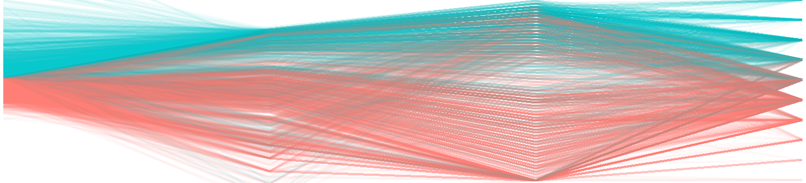
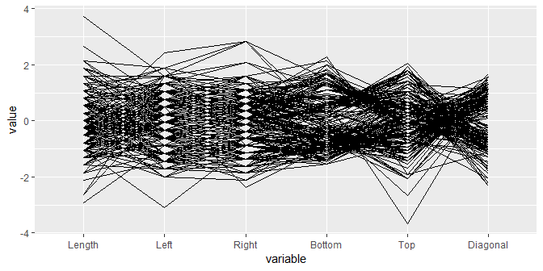
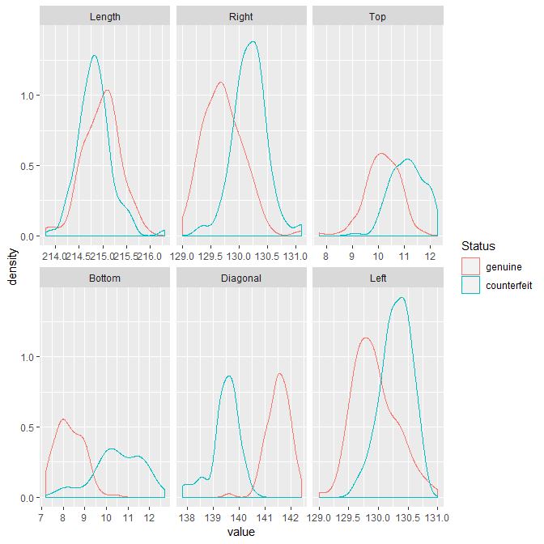

parallel coordinate
================



## contents

[introduction](#introduction)  
[prerequisites](#prerequisites)  
[explore](#explore)  
[exercises](#exercises)  
[references](#references)

## introduction

“With a scatterplot, the x and y axes are perpendicular to one another.
In a parallel coordinate plot all axes are parallel to one another. Each
variable has its own individual vertical axis (or alternatively all the
axes are horizontal) and the axis is usually scaled from the minimum to
the maximum case values for the variable, so that the full range of each
axis is used. The values of each case \[each observation\] are joined by
lines, so that a polygonal line across all axes defines a case \[an
observation\].” (Unwin, [2015](#ref-Unwin:2015:Ch.6))

Data characteristics

  - Any number of quantitative variables  
  - One or more categorical variables (optional)  
  - A key variable if data are not coordinatized

Graph characteristics

  - Axes are parallel
  - One axis per variable, usually scaled from the minimum to the
    maximum
  - One line per observation, running from point to point on the
    parallel axes

[D6 Multivariate](cm301-report-display-reqts.md#D6-multivariate) data
and graph requirements

<br> <a href="#top">▲ top of page</a>

## prerequisites

Project setup

  - Start every work session by launching the RStudio Project file for
    the course, e.g., `portfolio.Rproj`  
  - Ensure your [project directory
    structure](cm501-proj-m-manage-files.md#planning-the-directory-structure)
    satisfies the course requirements

Ensure you have installed the following packages. See [install
packages](cm902-software-studio.md#install-packages) for instructions if
needed.

  - [**tidyverse**](http://tidyverse.tidyverse.org): The ‘tidyverse’ is
    a set of packages that work in harmony because they share common
    data representations and ‘API’ design. This package is designed to
    make it easy to install and load multiple ‘tidyverse’ packages in a
    single step. Learn more about the ‘tidyverse’ at
    <https://tidyverse.org>.
  - [**graphclassmate**](https://github.com/graphdr/graphclassmate): An
    R package with companion materials for a course in data
    visualization. The package provides data sets structured for a
    variety of graph types plus a ggplot2 theme.  
  - [**GGally**](https://ggobi.github.io/ggally): The R package
    ‘ggplot2’ is a plotting system based on the grammar of graphics.
    ‘GGally’ extends ‘ggplot2’ by adding several functions to reduce the
    complexity of combining geometric objects with transformed data.
    Some of these functions include a pairwise plot matrix, a two group
    pairwise plot matrix, a parallel coordinates plot, a survival plot,
    and several functions to plot networks.
  - [**scagnostics**](http://www.rforge.net/scagnostics/): Calculates
    graph theoretic scagnostics. Scagnostics describe various measures
    of interest for pairs of variables, based on their appearance on a
    scatterplot. They are useful tool for discovering interesting or
    unusual scatterplots from a scatterplot matrix, without having to
    look at every individual plot.
  - [**gclus**](https://CRAN.R-project.org/package=gclus): Orders panels
    in scatterplot matrices and parallel coordinate displays by some
    merit index. Package contains various indices of merit, ordering
    functions, and enhanced versions of pairs and parcoord which color
    panels according to their merit level.

Scripts to initialize

``` 
explore/     0801-parallel-coord-explore.R  
```

And start the file with a minimal header

``` r
# your name
# date

# load packages
library("tidyverse")
library("graphclassmate")
library("GGally")
```

Duplicate the lines of code in the session one chunk at a time. Save,
Source, and compare your results to the results shown.

<http://ggobi.github.io/ggally/rd.html#ggparcoord>

<br> <a href="#top">▲ top of page</a>

## explore

Open the explore script you initialized earlier. Load the package that
has the data. We.re going to use the same Swiss banknote data we used in
the scatterplot matrix practice.

``` r
library("gclus")
data(bank, package = "gclus")

bank <- as_tibble(bank) %>% 
  glimpse()
#> Observations: 200
#> Variables: 7
#> $ Status   <int> 0, 0, 0, 0, 0, 0, 0, 0, 0, 0, 0, 0, 0, 0, 0, 0, 0, 0,...
#> $ Length   <dbl> 214.8, 214.6, 214.8, 214.8, 215.0, 215.7, 215.5, 214....
#> $ Left     <dbl> 131.0, 129.7, 129.7, 129.7, 129.6, 130.8, 129.5, 129....
#> $ Right    <dbl> 131.1, 129.7, 129.7, 129.6, 129.7, 130.5, 129.7, 129....
#> $ Bottom   <dbl> 9.0, 8.1, 8.7, 7.5, 10.4, 9.0, 7.9, 7.2, 8.2, 9.2, 7....
#> $ Top      <dbl> 9.7, 9.5, 9.6, 10.4, 7.7, 10.1, 9.6, 10.7, 11.0, 10.0...
#> $ Diagonal <dbl> 141.0, 141.7, 142.2, 142.0, 141.8, 141.4, 141.6, 141....
```

The basic parallel coordinate plot using `GGally::ggparcoord()`

``` r
ggparcoord(bank, columns = 2:7)
```



``` r
my_color <- c(rcb("dark_BG"),  rcb("dark_Br"))
my_fill  <- c(rcb("light_BG"), rcb("light_Br"))
my_title <- "Comparing Swiss banknote dimensions (mm)"
```

To use the bank not status \*genuine or counterfeit) as a conditioning
factor, we have to make it a factor.

``` r
bank <- bank %>%
  mutate(Status = factor(Status, labels = c("genuine", "counterfeit"))) %>% 
  drop_na() %>% 
  glimpse()
#> Observations: 200
#> Variables: 7
#> $ Status   <fct> genuine, genuine, genuine, genuine, genuine, genuine,...
#> $ Length   <dbl> 214.8, 214.6, 214.8, 214.8, 215.0, 215.7, 215.5, 214....
#> $ Left     <dbl> 131.0, 129.7, 129.7, 129.7, 129.6, 130.8, 129.5, 129....
#> $ Right    <dbl> 131.1, 129.7, 129.7, 129.6, 129.7, 130.5, 129.7, 129....
#> $ Bottom   <dbl> 9.0, 8.1, 8.7, 7.5, 10.4, 9.0, 7.9, 7.2, 8.2, 9.2, 7....
#> $ Top      <dbl> 9.7, 9.5, 9.6, 10.4, 7.7, 10.1, 9.6, 10.7, 11.0, 10.0...
#> $ Diagonal <dbl> 141.0, 141.7, 142.2, 142.0, 141.8, 141.4, 141.6, 141....
```

The possible values for the `scale` argument are

    std           subtract mean and divide by standard deviation
    robust        subtract median and divide by median absolute deviation
    uniminmax     minimum of the variable is zero, and the maximum is one
    globalminmax  no scaling
    center        uniminmax then center each variable at scaleSummary
    centerObs     uniminmax then center each variable at centerObsID

Using `scale = robust` gives us an idea of the measurements with
outliers and reduces their effect

``` r
library("scagnostics")
ggparcoord(data = bank, columns = 2:7, groupColumn  = "Status",
           scale        = "robust", 
           # scaleSummary = "median", # use with  scale == “center”
           # centerObsID  = 1,        # use with scale == “centerObs”
           missing      = "exclude", 
           order        = "Skewed", # scagnostic measures 
           alphaLines   = 0.4, 
           mapping      = NULL, 
           title        = my_title) +
  labs(x = "", y = "")
```


The order of the quantitative variables along the x-axis is important
for us to discern any stories. The scagnostic package has the following
ordering functions:

    Outlying 
    Skewed 
    Clumpy 
    Sparse 
    Striated 
    Convex 
    Skinny 
    Stringy 
    Monotonic

I selected skinny because of the shape of the distributions of the
variables. From the scagnostics, the three top choices for the ordering
are Skinny, Stringy, or Skewed.

``` r
bank2 <- bank %>% 
  gather(type, value, Length:Diagonal)

ggplot(bank2, aes(value, color = Status)) +
  geom_density() +
  facet_wrap(vars(type), scales = "free_x", as.table = FALSE)
```



``` r

library("scagnostics")
scag <- scagnostics(bank)

str(scag)
#>  'scagnostics' num [1:9, 1:21] 0.2302 0.9215 0.9559 0.0824 0.7097 ...
#>  - attr(*, "dimnames")=List of 2
#>   ..$ : chr [1:9] "Outlying" "Skewed" "Clumpy" "Sparse" ...
#>   ..$ : chr [1:21] "Status * Length" "Status * Left" "Length * Left" "Status * Right" ...

attributes(scag)
#> $dim
#> [1]  9 21
#> 
#> $dimnames
#> $dimnames[[1]]
#> [1] "Outlying"  "Skewed"    "Clumpy"    "Sparse"    "Striated"  "Convex"   
#> [7] "Skinny"    "Stringy"   "Monotonic"
#> 
#> $dimnames[[2]]
#>  [1] "Status * Length"   "Status * Left"     "Length * Left"    
#>  [4] "Status * Right"    "Length * Right"    "Left * Right"     
#>  [7] "Status * Bottom"   "Length * Bottom"   "Left * Bottom"    
#> [10] "Right * Bottom"    "Status * Top"      "Length * Top"     
#> [13] "Left * Top"        "Right * Top"       "Bottom * Top"     
#> [16] "Status * Diagonal" "Length * Diagonal" "Left * Diagonal"  
#> [19] "Right * Diagonal"  "Bottom * Diagonal" "Top * Diagonal"   
#> 
#> 
#> $class
#> [1] "scagnostics"

names(scag)
#> NULL
```

<br> <a href="#top">▲ top of page</a>

## java error

If you have a character variable, and get a Java error like this

    Error in newArray(jobj = x, ...) :
    o does not refer to a java array

Not solved yet. Related to rJava and scagnostics but not sure how.

## exercises

## references

<div id="refs">

<div id="ref-Unwin:2015:Ch.6">

Unwin A (2015) Investigating multivariate continuous data. *Graphical
Data Analysis with R*. CRC Press, Taylor & Francis, Boca Raton, FL,
99–130 <http://www.gradaanwr.net/>

</div>

<div id="ref-Wickham+Grolemund:2017">

Wickham H and Grolemund G (2017) *R for Data Science.* O’Reilly Media,
Inc., Sebastopol, CA <https://r4ds.had.co.nz/>

</div>

</div>

***
<a href="#top">&#9650; top of page</a>    
[&#9665; calendar](../README.md#calendar)    
[&#9665; index](../README.md#index)
