learn a display
================

<small>   <i>Moon, Earth-rise, Earth from the moon,</i> courtesy
NASA.  
  </small>

## contents

[introduction](#introduction)  
[cycle plot](#cycle-plot)  
[multivariate bar](#multivariate-bar)  
[financial (OHLC) plot](#financial-ohlc-plot)  
[diverging stacked bar](#diverging-stacked-bar)  
[micromap](#micromap)  
[proportional symbol map](#proportional-symbol-map)  
[dot density map](#dot-density-map)  
[references](#references)

## introduction

We’ve arrived at the final graphical challenge: to learn on your own to
construct a graph type that we haven’t covered in detail. You may find
that you have to learn the syntax of a graphics system other than
ggplot2. The structure of the R graphics system is illustrated in the
figure.

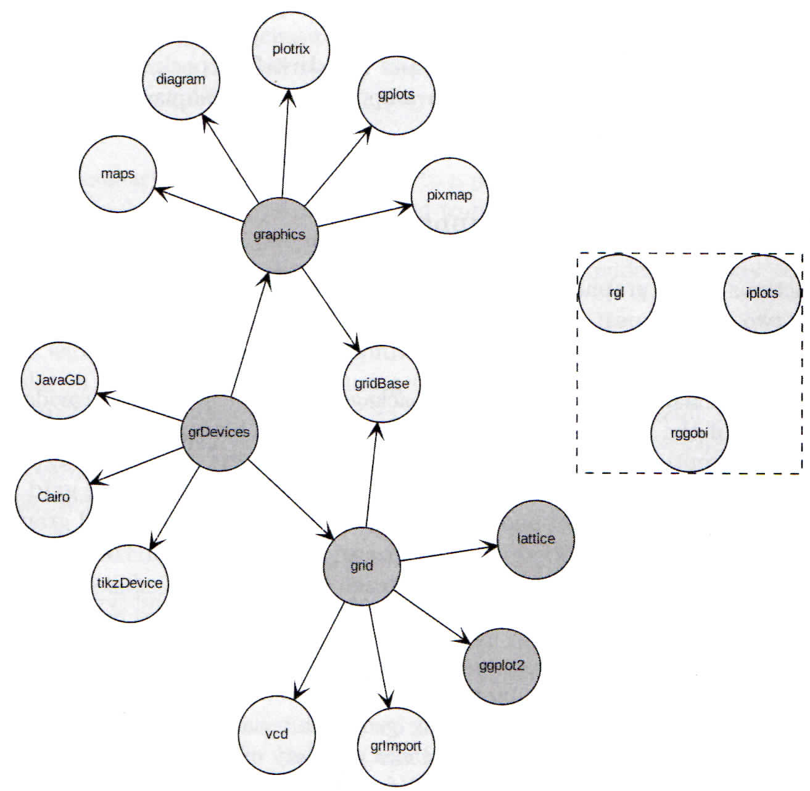

<small> <i>Figure 1.14 The structure of the R graphics system</i> by
Paul Murrell ([2011](#ref-Murrell:2011)) </small>

Working at a lower level—grid, graphics, or grDevices—can be quite a
challenge. I would expect that if you have to learn a new graphics
syntax it would be in the top layers, e.g., lattice, vcd, maps, etc.

You are required to select at least one of the following graph types and
create a display for your portfolio. Unlike our earlier display types,
this page is not a tutorial because you must learn how to create the
data graphic on your own. Instead, we show some representative graphs
and some references to get you started.

  <a href="#top">▲ top of page</a>

## cycle plot

As [Stephen Few](https://www.perceptualedge.com/blog/?p=1780) explains,
“A cycle plot is a type of line graph that is useful for displaying
cyclical patterns across time. Cycle plots were first created in 1978 by
William Cleveland and his colleagues at Bell Labs.” The period of the
cycle can vary depending on the data, e.g., hour of day, day of week,
month of year, quarter of year, etc.

Resources

  -  [Introduction to cycle
    plots](https://tinyurl.com/y3n8dh89) by Naomi Robbins
    ([2008](#ref-Robbins:2008))  
  - [Data
    requirements](cm301-report-display-reqts.md#cycle-plot-requirements)  
  - [monthplot()](https://www.rdocumentation.org/packages/stats/versions/3.6.0/topics/monthplot)
    in base R  
  - [plotMonth()](ttps://CRAN.R-project.org/package=season) in the
    **season** package

  Example: day of week cycle. First, at the left of the data
rectangle, the Monday values are graphed for eight successive weeks,
then the Tuesday values are graphed, and so forth. For each cycle
subseries, the mean of the values is shown by a horizontal line segment.

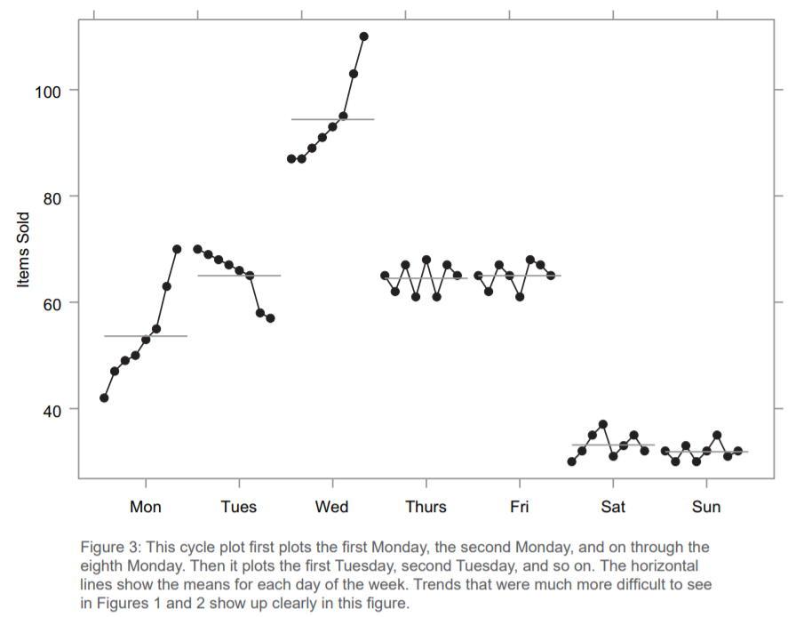

  Example: month of year cycle. First, at the left of the data
rectangle, the October values are graphed for 34 successive years, then
the November values are graphed, and so forth.

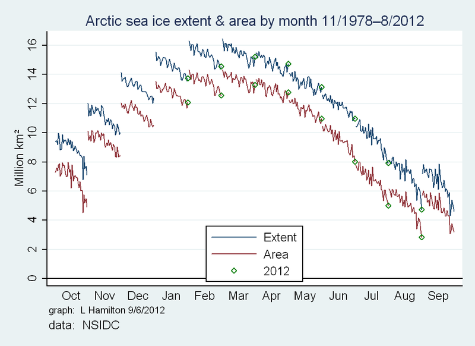

  Example: month of year cycle. First, at the left of the data
rectangle, the January values are graphed for 11 successive years, then
the February values are graphed, and so forth.

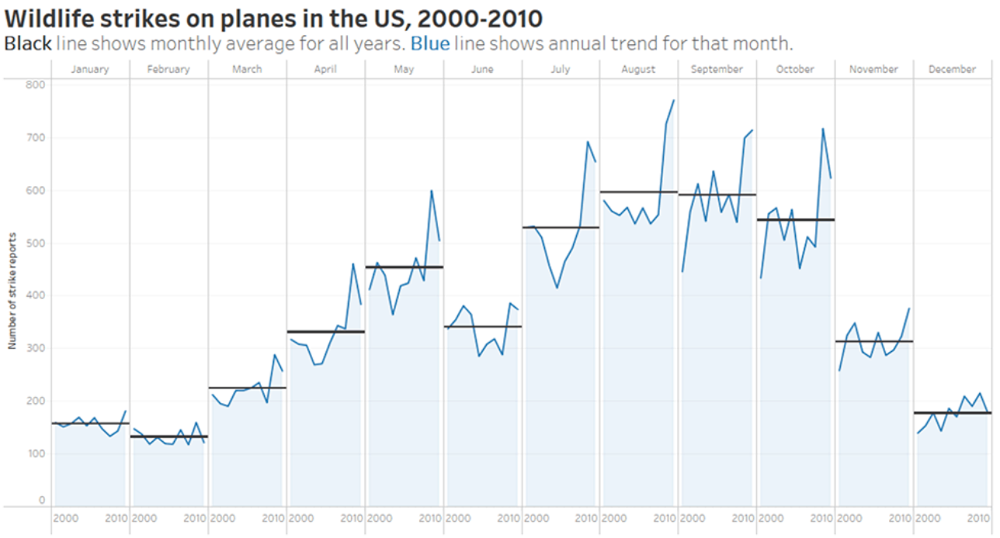

  <a href="#top">▲ top of page</a>

## multivariate bar

This type of bar graph is useful when we have multivariate categorical
data. Multivariate bar data has one or more quantitative values at each
intersection of levels of the categories.

Such data is often illustrated using a [mosaic
chart](https://ncss-wpengine.netdna-ssl.com/wp-content/themes/ncss/pdf/Procedures/NCSS/Mosaic_Plots.pdf)
(a graph type we have not used in the course). However, Stephen Few
argues that a multivariate bar graph is superior to a mosaic chart for
understanding multivariate categorical data. “A coordinated set of bar
graphs can reveal the same relationships in a way that can be more
easily and accurately perceived and understood.” (Few,
[2014](#ref-Few:2014))

Thus, any mosaic chart you find can be a good candidate for redesigning
as a multivariate bar chart.

Resources

  -  [Are mosaic plots
    worthwhile?](https://tinyurl.com/y23majn2) by Stephen Few
    ([2014](#ref-Few:2014))  
  - [Data
    requirements](cm301-report-display-reqts.md#multivariate-bar-requirements)  
  - [geom\_bar() and
    geom\_col()](https://ggplot2.tidyverse.org/reference/geom_bar.html)
    in **ggplot2**

  Example

  - Two quantitative variables: number of people in study and percentage
    who became paralyzed
  - Two categorical variables: age group (6 levels) and vaccination
    status (2 levels)

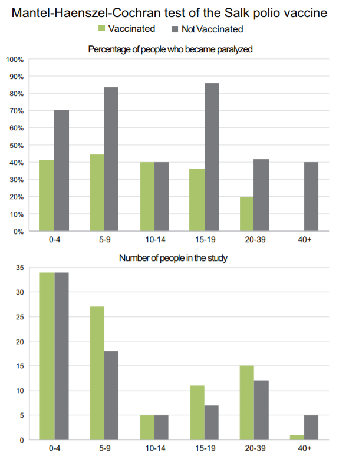

  Example

  - Two quantitative variables: number and percentage
  - Four categorical variables: Sex (2 levels), shipboard status (4
    levels), age (2 levels), and outcome (2 levels)

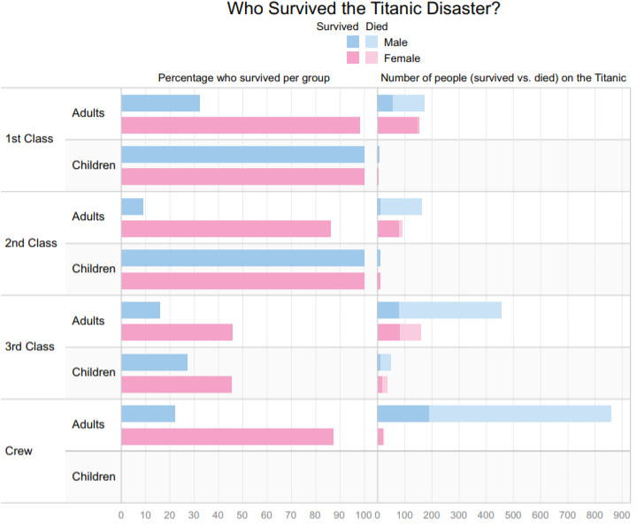

  <a href="#top">▲ top of page</a>

## financial (OHLC) plot

A financial plot, or OHLC (open-high-low-close) plot, represents a time
series of market behavior. You may use either a candlestick style or bar
style.

The quantitative variables are the opening value, high value, low value,
and closing value of a financial metric, e.g., the Dow Jones Industrial
Average (DJIA). The categorical variable is the date.

Resources

  -  [Candlesticks charts vs. bar charts
    (OHLC)](https://www.youtube.com/watch?v=vv5ImI1X9G8) an introduction
  - [Data
    requirements](cm301-report-display-reqts.md#financial-OHLC-plot-requirements)  
  - [Open-high-low-close
    Chart](https://datavizcatalogue.com/methods/OHLC_chart.html) in the
    Data Visualization Catalog

  Example OHLC plot, bar-style

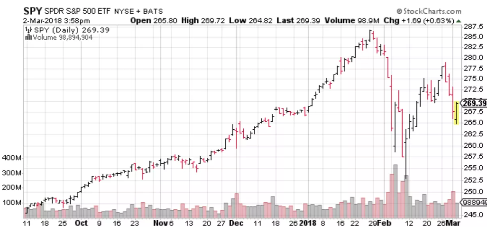

  Example OHLC plot, candle-stick-style. Here the high and low are
the whiskers and the open and close are the box limits. Green indicates
that the closing price was higher than the opening price; red that the
closing price was lower.

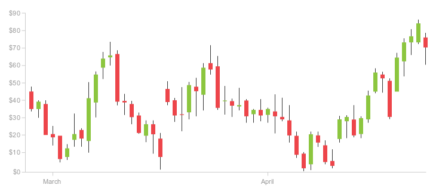

  <a href="#top">▲ top of page</a>

## diverging stacked bar

Diverging stacked bar charts are the primary graphical display technique
for reporting survey data. Respondents are typically asked to choose one
response from a discrete number of options such as Strongly Disagree,
Disagree, No Opinion, Agree, Strongly Agree.

Resources

  -  [Design of diverging stacked bar
    charts](http://tinyurl.com/y5yg2pze) by Heiberger and Robbins
    ([2014](#ref-Heiberger+Robbins:2014))  
  - [Data
    requirements](cm301-report-display-reqts.md#diverging-stacked-bar-requirements)  
  - [likert()](https://cran.r-project.org/web/packages/HH/index.html) in
    the **HH** package  
  -  [Likert-plots and grouped
    Likert-plots](https://strengejacke.wordpress.com/2019/05/08/likert-plots-and-grouped-likert-plots-rstats/)
    an introduction to the [sjPlot
    package](https://strengejacke.github.io/sjPlot/)

  Example

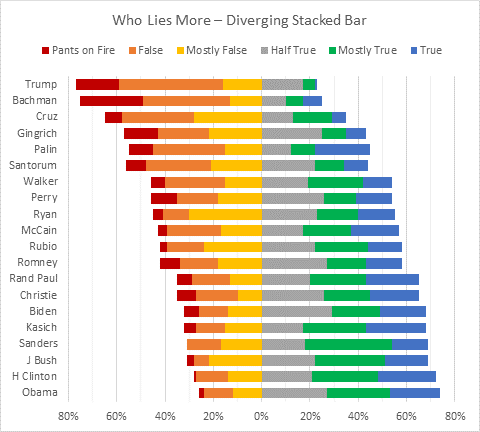

  Example

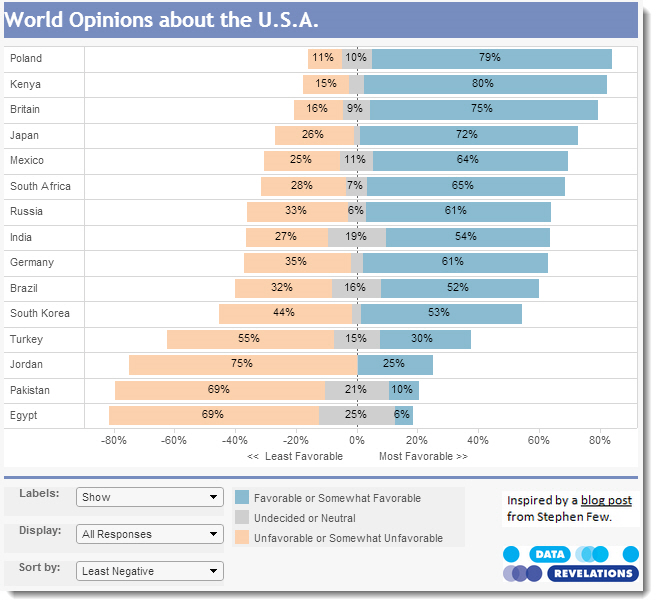

  Example

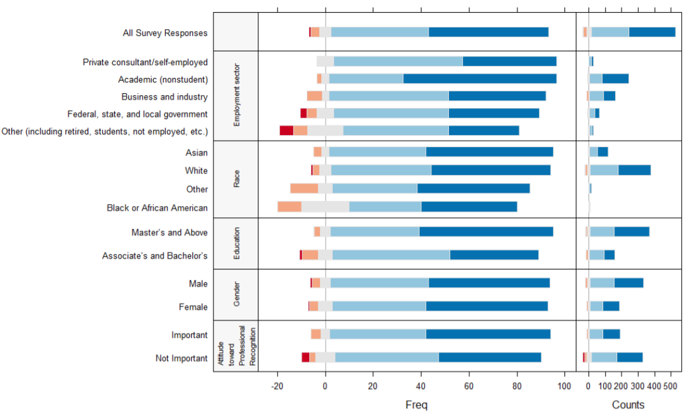

  <a href="#top">▲ top of page</a>

## micromap

A micromap is a graphic that links statistical information to an
organized set of small maps, and its primary purpose is to highlight
geographical patterns and associations among the variables in your data
set.

Micromaps are based on small multiples: When presenting multivariate
data for direct comparison, it is usually better to design several tiny
graphics rather than relying on recall of serially presented images
(animation) or on a single, large, ultra-complex, cluttered display.

Resources

  -  [Falling in love with
    micromaps](http://www.thefunctionalart.com/2013/07/falling-in-love-with-micromaps.html)
    by Alberto Cairo  
  - [Data
    requirements](cm301-report-display-reqts.md#micromap-requirements)  
  - [mmplot()](https://CRAN.R-project.org/package=micromap) in the
    **micromap** package  
  - [Linked
    micromaps](https://cran.r-project.org/web/packages/micromap/vignettes/Introduction_Guide.pdf)
    Introduction to the **micromap** package  
  - [ggmap()](https://github.com/dkahle/ggmap) in the **ggmap**
    package  
  - [Background maps](https://www.r-graph-gallery.com/map/) in the R
    Graph Gallery

  Example of a linked micromap.

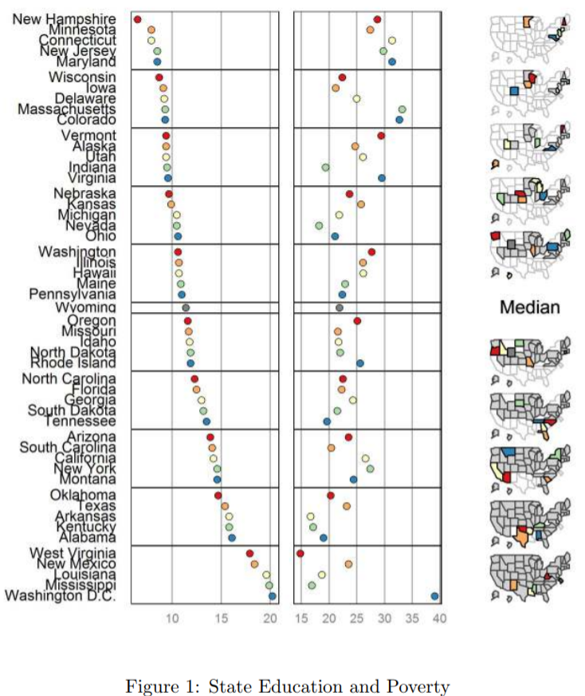

  Example of micromaps in a small-multiples design. Area and color
have been used correctly to show the geographic extent of drought.
Source: [New York
Times](https://archive.nytimes.com/www.nytimes.com/interactive/2012/07/20/us/drought-footprint.html?_r=0)

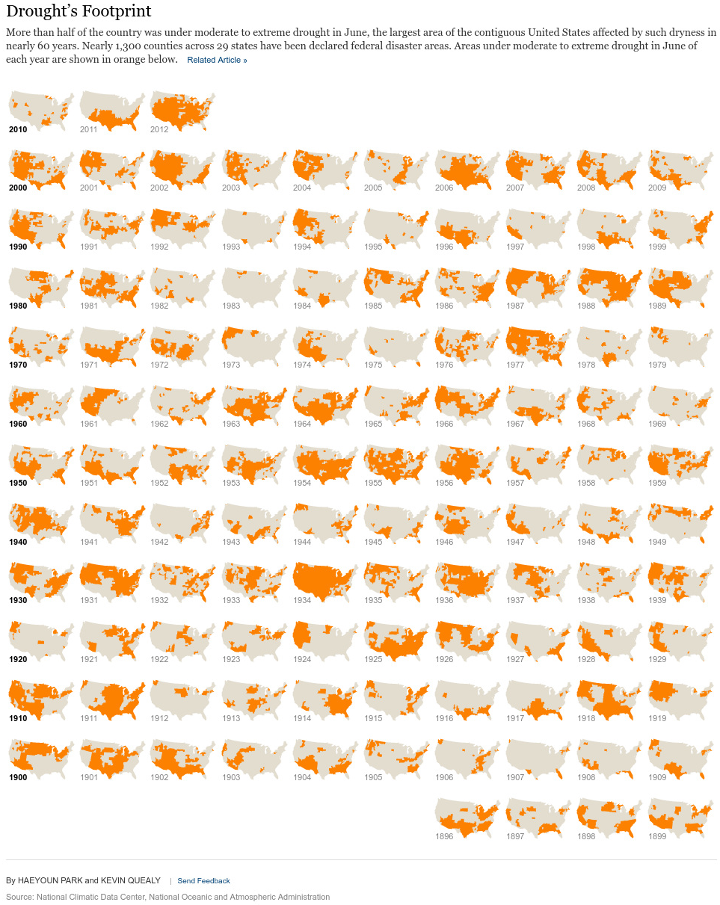

  <a href="#top">▲ top of page</a>

## proportional symbol map

Proportional symbol maps scale the size of a symbol (usually a circle or
square) proportionally to the data value found at that location. The
larger the symbol, the more of something exists at a location. Color can
be used to show levels of a category such as race, political party, etc.

The most basic method is to scale the circles directly proportionate to
the data so that if, for example, Toronto has twice the population of
Vancouver, the population symbol for Toronto will have twice the area.

However, you can also group (bin) your observations into categories or
numerical ranges and create graduated symbol maps that may, for example,
only have three symbol sizes corresponding to three categories of city
size (e.g., cities of \<1 million, 1-4 million, and over 4 million
people) [Cartography
guide](https://www.axismaps.com/guide/univariate/proportional-symbols/).

Resources

  -  [Visualize 2015 urban populations
    with proportional
    symbols](https://carto.com/blog/proportional-symbol-maps/) by Mamata
    Akella
  - [Data
    requirements](cm301-report-display-reqts.md#proportional-symbol-map-requirements)  
  - [ggmap package](https://github.com/dkahle/ggmap)  
  - [Background maps](https://www.r-graph-gallery.com/map/) in the R
    Graph Gallery  
  - [Bubblemap with
    ggplot2](https://www.r-graph-gallery.com/330-bubble-map-with-ggplot2/)
    in the R Graph Gallery

  Example

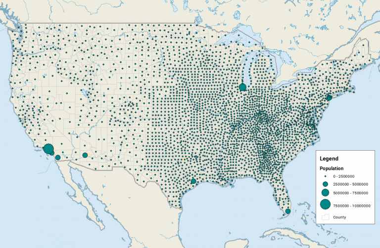

  Example

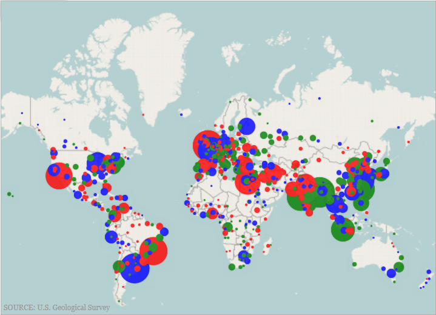

  Example

  <a href="#top">▲ top of page</a>

## dot density map

A dot-density map uses dots or other symbols on a map to represent a
quantitative variable. Dots are all the same size. Each dot on the map
represents the same amount of data, e.g., one dot = 100 votes, or one
dot = 1000 people, etc. Color can be used to show levels of a category
such as race, political party, etc.

Resources

  - [Data
    requirements](cm301-report-display-reqts.md#dot-density-map-requirements)  
  - [ggmap package](https://github.com/dkahle/ggmap)  
  - [Background maps](https://www.r-graph-gallery.com/map/) in the R
    Graph Gallery  
  - [sf
    package](https://www.cultureofinsight.com/blog/2018/05/02/2018-04-08-multivariate-dot-density-maps-in-r-with-sf-ggplot2/)
    Multivariate dot-density maps with sf and ggplot2

  Example

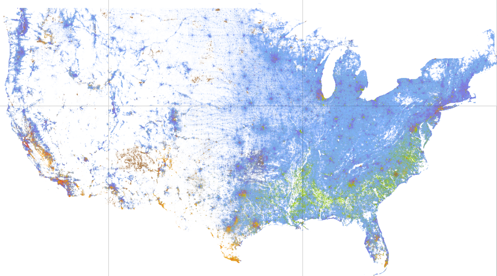

  Example

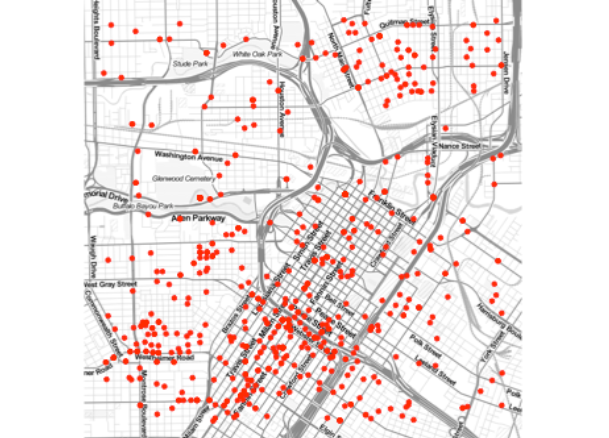

  <a href="#top">▲ top of page</a>

## references

Few S (2014) Are mosaic plots worthwhile? *Visual Business Intelligence
Newsletter*. Perceptual Edge <https://tinyurl.com/y23majn2>

Heiberger RM and Robbins NB (2014) Design of diverging stacked bar
charts for Likert scales and other applications. *Journal of Statistical
Software* **57**(5) <http://tinyurl.com/y5yg2pze>

Murrell P (2011) *R Graphics.*, 2nd edn. CRC Press, Boca Raton, FL
<https://www.stat.auckland.ac.nz/~paul/RG2e/>

Robbins N (2008) Introduction to cycle plots. *Visual Business
Intelligence Newsletter*. Perceptual Edge <https://tinyurl.com/y3n8dh89>

Wickham H and Grolemund G (2017) *R for Data Science.* O’Reilly Media,
Inc., Sebastopol, CA <https://r4ds.had.co.nz/>

***
<a href="#top">&#9650; top of page</a>    
[&#9665; calendar](../README.md#calendar)    
[&#9665; index](../README.md#index)
