points
================

 <small> <br>
<i>Nur scheinbar durcheinander (Only seemingly confused)</i> by Renate
Dodell is licensed under
<a href="https://creativecommons.org/licenses/by-nd/2.0/legalcode">CC
BY-ND 2.0</a> <br> </small>

## contents

[introduction](#introduction)  
[symbol color](#symbol-color)  
[symbol size](#symbol-size)  
[symbol shape](#symbol-shape)  
[text as symbols](#text-as-symbols)  
[text as symbols legend](#text-as-symbols-legend)  
[references](#references)

## introduction

Here, we illustrate techniques for editing graphical elements and
annotating graph panels. Some items were seen in previous tutorials. The
list is not exhaustive, but does cover the most frequently requested
editing and annotating tasks.

## symbol color

Color, size, and shape are the characteristics you are most likely to
want to edit.

``` r
library("tidyverse")
library("seplyr")
```

We’ll use the `mpg` dataset from ggplot2

``` r
ggplot2::mpg
#> # A tibble: 234 x 11
#>    manufacturer model displ  year   cyl trans drv     cty   hwy fl    class
#>    <chr>        <chr> <dbl> <int> <int> <chr> <chr> <int> <int> <chr> <chr>
#>  1 audi         a4      1.8  1999     4 auto~ f        18    29 p     comp~
#>  2 audi         a4      1.8  1999     4 manu~ f        21    29 p     comp~
#>  3 audi         a4      2    2008     4 manu~ f        20    31 p     comp~
#>  4 audi         a4      2    2008     4 auto~ f        21    30 p     comp~
#>  5 audi         a4      2.8  1999     6 auto~ f        16    26 p     comp~
#>  6 audi         a4      2.8  1999     6 manu~ f        18    26 p     comp~
#>  7 audi         a4      3.1  2008     6 auto~ f        18    27 p     comp~
#>  8 audi         a4 q~   1.8  1999     4 manu~ 4        18    26 p     comp~
#>  9 audi         a4 q~   1.8  1999     4 auto~ 4        16    25 p     comp~
#> 10 audi         a4 q~   2    2008     4 manu~ 4        20    28 p     comp~
#> # ... with 224 more rows
```

Simple graph

``` r
ggplot(data = mpg, mapping = aes(x = displ, y = hwy)) + 
        geom_point()
```

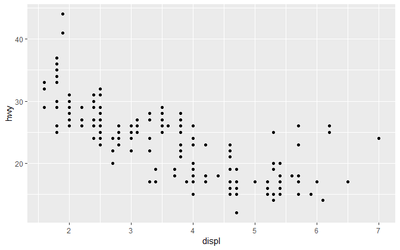

If we want all the dots the same color, we change color in the geom.

``` r
ggplot(data = mpg, mapping = aes(x = displ, y = hwy)) + 
        geom_point(color = rcb("mid_BG"))
```

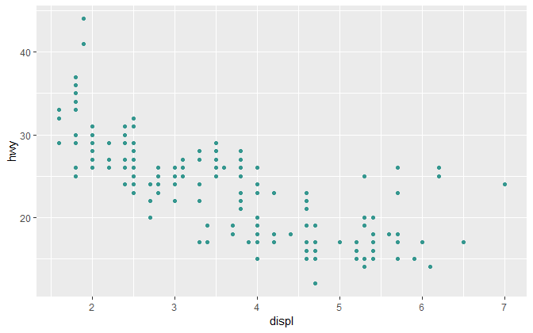

If we use color to distinguish between cars with different class, we
assign the color in the `aes()`.

``` r
# how many in each class?
mpg %>% count(class)
#> # A tibble: 7 x 2
#>   class          n
#>   <chr>      <int>
#> 1 2seater        5
#> 2 compact       47
#> 3 midsize       41
#> 4 minivan       11
#> 5 pickup        33
#> 6 subcompact    35
#> 7 suv           62

# let's omit the 2seater
mpg <- mpg %>% 
    filter(class != "2seater")

# graph
ggplot(data = mpg, mapping = aes(x = displ, y = hwy, color = class)) + 
        geom_point()
```

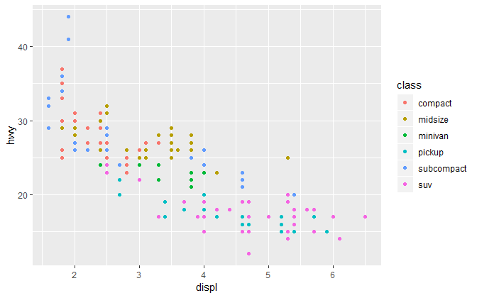

To change these colors, we add

``` r
my_color <- c(rcb("dark_BG"), rcb("mid_BG"), rcb("light_BG"), rcb("light_Br"), rcb("mid_Br"), rcb("dark_Br"))

ggplot(data = mpg, mapping = aes(x = displ, y = hwy, color = class)) + 
        geom_point() +
        scale_color_manual(values = my_color)
```

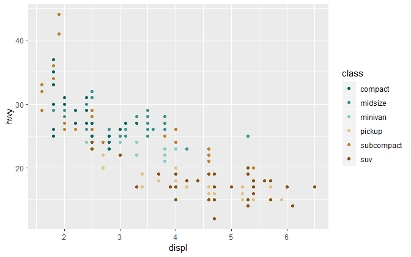

The classes should be ordered, so I convert class to a factor ordered by
hwy.

``` r
mpg  <-  mpg %>% 
        mutate(class = fct_reorder(class, hwy, mean))

ggplot(data = mpg, mapping = aes(x = displ, y = hwy, color = class)) + 
        geom_point() +
        scale_color_manual(values = my_color)
```

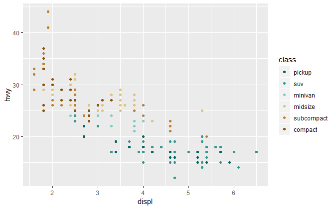

I want the colors assigned in the reverse order so that green represents
the best mileage and brown the worst.

``` r
my_color <- rev(my_color)

ggplot(data = mpg, mapping = aes(x = displ, y = hwy, color = class)) + 
        geom_point() +
        scale_color_manual(values = my_color)
```

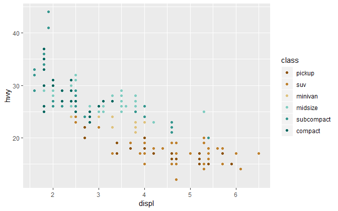

And I want the order of the legend reversed

``` r
ggplot(data = mpg, mapping = aes(x = displ, y = hwy, color = class)) + 
        geom_point() +
        scale_color_manual(values = my_color) +
        guides(color = guide_legend(reverse = TRUE))
```

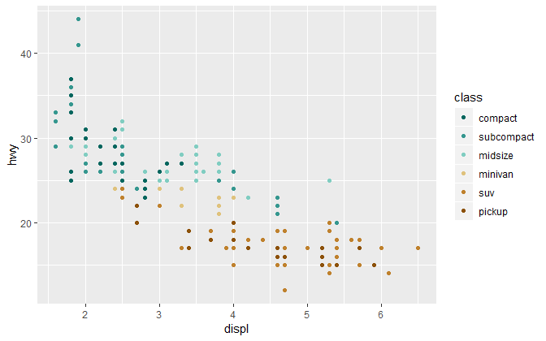

If we facet the graph on the same variable, the assigned colors remain

``` r
ggplot(data = mpg, mapping = aes(x = displ, y = hwy, color = class)) + 
        geom_point() +
        scale_color_manual(values = my_color) +
        guides(color = guide_legend(reverse = TRUE)) +
        facet_wrap(vars(class), as.table = FALSE)
```

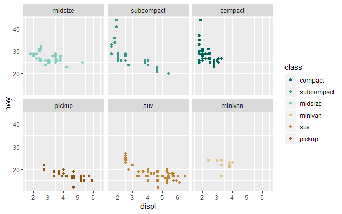

If we facet on a different arable, the assigned colors remain.

``` r
mpg <- mpg %>% 
        filter(cyl != 5) %>% 
        mutate(cyl = fct_reorder(factor(cyl), hwy, mean)) 

p <- ggplot(data = mpg, mapping = aes(x = displ, y = hwy, color = class)) + 
        geom_point() +
        scale_color_manual(values = my_color) +
        guides(color = guide_legend(reverse = TRUE)) +
        facet_wrap(vars(cyl), as.table = FALSE) 
p
```

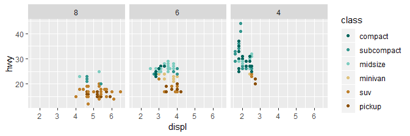

<br> <a href="#top">▲ top of page</a>

## symbol size

To uniformly change the size of all data markers, use size in the geom.
Here, I use `set.seed()` so that the random jittering is fixed.

``` r
set.seed(20190507)
ggplot(data = mpg, mapping = aes(x = displ, y = hwy)) + 
        geom_jitter(size = 3, alpha = 0.3)
```

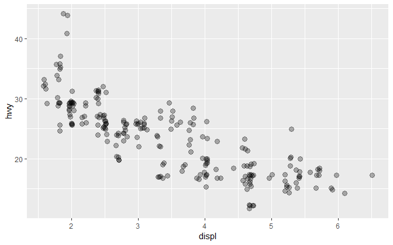

Likewise, in the faceted graph,

``` r
p <- p +
        geom_jitter(size = 3)
p
```

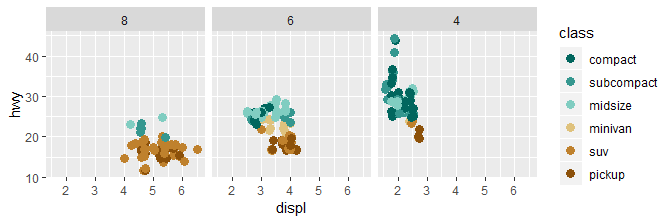

If size is assigned to a variable, we assign it in the `aes()`. Size can
be assigned to a continuous variable, as shown here,

``` r
mpg <- mpg %>% 
        mutate(manufacturer = fct_reorder(factor(manufacturer), hwy, mean)) 

ggplot(data = mpg, mapping = aes(x = hwy, y = manufacturer, size = displ))+
        geom_point(color = rcb("mid_BG"))
```

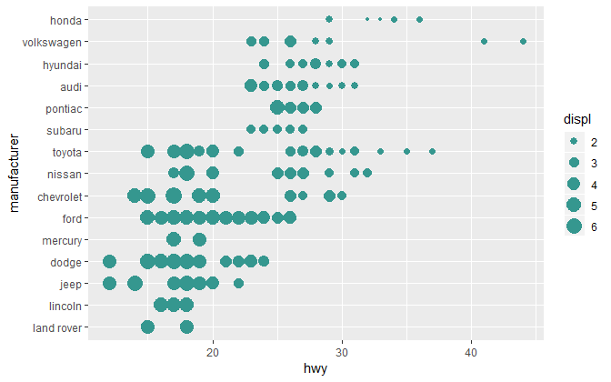

Plotting size and color in `aes()` produces two legends

``` r
ggplot(data = mpg, mapping = aes(x = hwy, y = manufacturer, 
                size = displ, 
                color = class))+
        geom_point() +
        scale_color_manual(values = my_color) +
        guides(color = guide_legend(reverse = TRUE))
```

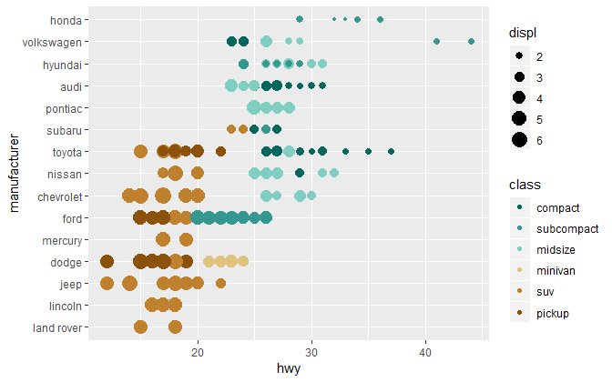

In this case, I’d like to increase the symbol size in the legend

``` r
ggplot(data = mpg, mapping = aes(x = hwy, y = manufacturer, 
                size = displ, 
                color = class))+
        geom_point() +
        scale_color_manual(values = my_color) +
        guides(color = guide_legend(reverse = TRUE, override.aes = list(size = 4)))
```


<br> <a href="#top">▲ top of page</a>

## symbol shape

The 26 conventional R symbol shapes are these. Numbers 21–25 have both a
color (border) and fill attribute.

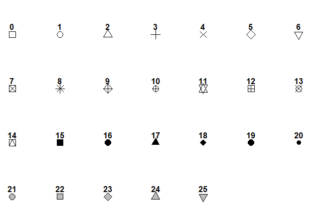

Like color, shape can be assigned to all the symbols in the geom

``` r
set.seed(20190507)
ggplot(data = mpg, mapping = aes(x = displ, y = hwy)) + 
        geom_jitter(shape = 5)
```

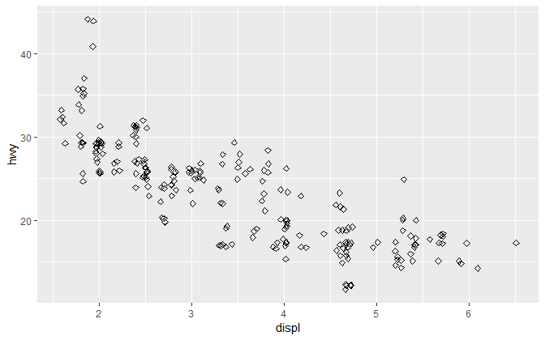

Like color, different shapes are used if mapped to a variable using
`aes()`.

``` r
ggplot(data = mpg, mapping = aes(x = hwy, y = manufacturer, shape = class)) +
        geom_jitter(size = 2, alpha = 0.5, width = 1, height = 0) +
        guides(shape = guide_legend(reverse = TRUE, override.aes = list(size = 2.5)))
```

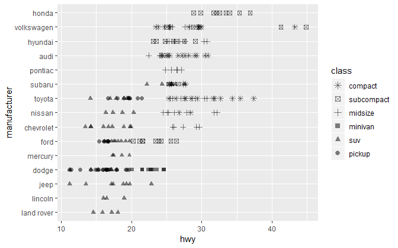

We can specify the shapes we want with `scale_shape_manual()`

``` r
my_shape <- c(17, 16, 15, 2, 1, 0)

ggplot(data = mpg, mapping = aes(x = hwy, y = manufacturer, shape = class)) +
        geom_jitter(size = 2, alpha = 0.5, width = 1, height = 0) +
        guides(shape = guide_legend(reverse = TRUE, override.aes = list(size = 2.5))) +
        scale_shape_manual(values = my_shape)
```

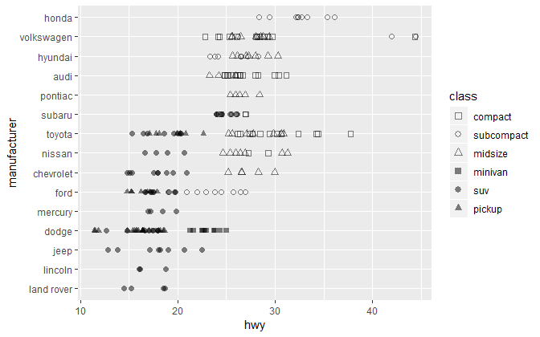

And we can combine color and shape, but we get two legends,

``` r
ggplot(data = mpg, mapping = aes(x = hwy, y = manufacturer, 
                shape = class, 
                color = class)) +
        geom_jitter(size = 2, width = 1, height = 0) +
        guides(shape = guide_legend(reverse = TRUE, override.aes = list(size = 2.5))) +
        scale_shape_manual(values = my_shape) +
        scale_color_manual(values = my_color)
```

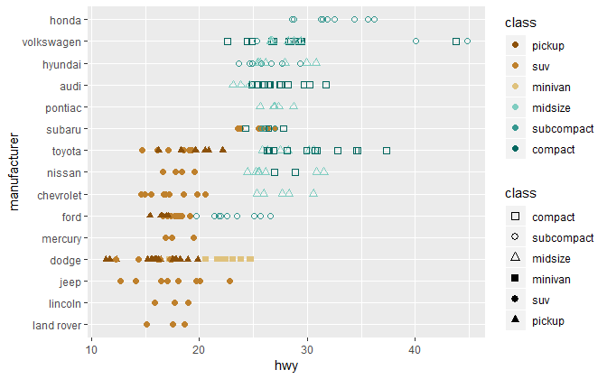

We can add color to the shape guide and omit the color-only legend.

``` r
ggplot(data = mpg, mapping = aes(x = hwy, y = manufacturer, 
                shape = class, 
                color = class)) +
        geom_jitter(size = 2, width = 1, height = 0) +
        guides(shape = guide_legend(reverse = TRUE, 
                override.aes = list(size = 2.5, color = my_color)), 
                color = "none") +
        scale_shape_manual(values = my_shape) +
        scale_color_manual(values = my_color)
```

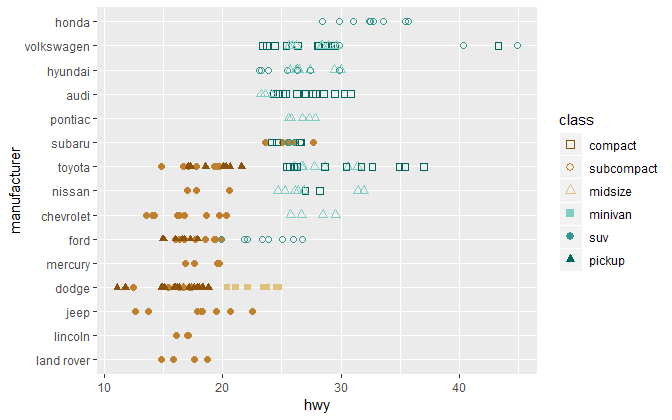

<br> <a href="#top">▲ top of page</a>

## text as symbols

You can use text that is already in the data frame, for example, the
number of cylinders is a factor

``` r
unique(mpg$cyl)
#> [1] 4 6 8
#> Levels: 8 6 4
```

Because `cyl` is a variable, we assign it to `label` in `aes()` and use
`geom_text()`

``` r
ggplot(data = mpg, mapping = aes(x = displ, y = hwy, 
                label = cyl, 
                color = cyl)) + 
        geom_text(size = 3) +
        scale_color_manual(values = my_color[c(1, 4, 5)]) +
        guides(color = guide_legend(reverse = TRUE)) +
        facet_wrap(vars(class), as.table = FALSE)
```

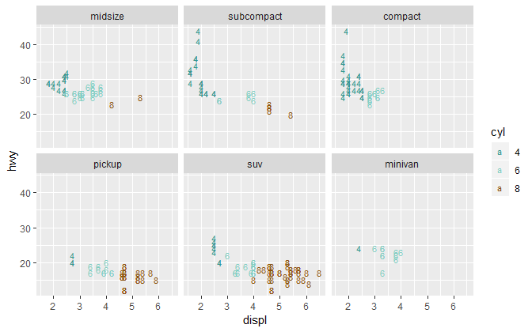

Sometimes the text you want to use is an abbreviation of an existing
variable. Let’s use the `nontraditional` dataset in graphclassmate, find
the mean years enrolled, and add the variable `abbrev` consisting of the
first letter of the race value.

``` r
library("graphclassmate")
library("seplyr")

grouping_variables <- c("sex", "race", "path")
df <- nontraditional %>% 
        group_summarize(grouping_variables, enrolled = mean(enrolled)) %>% 
        mutate(abbrev = str_sub(race, start = 1L, end = 1L))

df
#> # A tibble: 16 x 5
#>    sex    race     path           enrolled abbrev
#>    <chr>  <chr>    <chr>             <dbl> <chr> 
#>  1 Female Asian    Nontraditional     4.06 A     
#>  2 Female Asian    Traditional        4.14 A     
#>  3 Female Black    Nontraditional     4.14 B     
#>  4 Female Black    Traditional        4.08 B     
#>  5 Female Hispanic Nontraditional     3.95 H     
#>  6 Female Hispanic Traditional        4.04 H     
#>  7 Female White    Nontraditional     3.84 W     
#>  8 Female White    Traditional        3.93 W     
#>  9 Male   Asian    Nontraditional     4.22 A     
#> 10 Male   Asian    Traditional        4.27 A     
#> 11 Male   Black    Nontraditional     4.33 B     
#> 12 Male   Black    Traditional        4.28 B     
#> 13 Male   Hispanic Nontraditional     4.13 H     
#> 14 Male   Hispanic Traditional        4.26 H     
#> 15 Male   White    Nontraditional     4.14 W     
#> 16 Male   White    Traditional        4.19 W
```

Path and sex should be factors ordered by years enrolled.

``` r
df <- df %>% 
        mutate(path = fct_reorder(path, enrolled)) %>% 
        mutate(sex  = fct_reorder(sex , enrolled)) 
```

Graph with the abbreviation as the text data marker. Use the `fontface`
argument:

1.  plain text
2.  bold
3.  italic
4.  italic bold

<!-- end list -->

``` r
ggplot(data = df, mapping = aes(x = enrolled, y = path, label = abbrev)) + 
        geom_text(size = 3, fontface = 2) +
        facet_wrap(vars(sex), ncol = 1, as.table = FALSE)
```

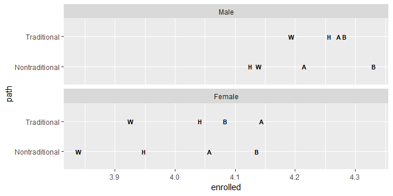

<br> <a href="#top">▲ top of page</a>

## text as symbols legend

To create a legend that defines the abbreviations, recall that legends
are generated by mapping variables to aesthetics, e.g., `color = var` or
`fill = var`, where `var` is a variable in the data frame.

For this purpose then, we create a new variable, `Key`.

``` r
df <- df %>% 
        mutate(Key = str_c(abbrev, " : ", race))
```

Now map this new variable to an aesthetic argument that is not
meaningful to the text geom (e.g., `fill`) but that is meaningful to the
point geom. Then we add the point geom to the graph. With these
additions, we get the legend.

``` r
ggplot(df, aes(x = enrolled, y = path, label = abbrev, fill = Key)) +
        geom_point() +
        geom_text(size = 3, fontface = 2) +
        facet_wrap(vars(sex), ncol = 1, as.table = FALSE)
```

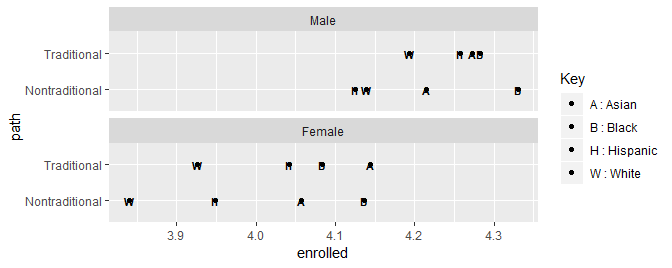

Now we edit to

  - `alpha = 0` makes the points disappear
  - `scale_fill_discrete()` to override the point color in the legend
  - `theme(legend.key = element_blank())` to eliminate the boxes around
    the points in the key

<!-- end list -->

``` r
ggplot(df, aes(x = enrolled, y = path, label = abbrev, fill = Key)) +
        geom_point(alpha = 0) +
        geom_text(size = 3, fontface = 2) +
        facet_wrap(vars(sex), ncol = 1, as.table = FALSE) +
        scale_fill_discrete(guide = guide_legend(title.hjust = 0.4, 
                override.aes = list(alpha = 0))) +
        theme(legend.key = element_blank())
```

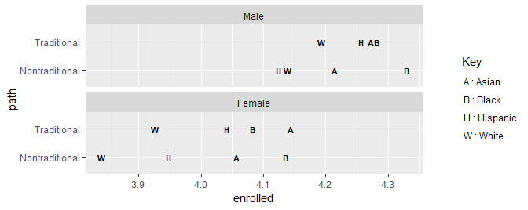

<br> <a href="#top">▲ top of page</a>

<!-- ## line color size type  -->

<!-- ```{r echo = FALSE} -->

<!-- opts_chunk$set(fig.asp = 1/1.6) -->

<!-- ``` -->

<!-- Editing lines is similar to editing symbols. The main difference is that we use `geom_line()` instead of `geom_point()` and that "linetype" has 7 levels,   -->

<!-- ```{r echo = FALSE} -->

<!-- # Line types -->

<!-- # http://www.sthda.com/english/wiki/line-types-in-r-lty -->

<!-- generate_lines <- function(){ -->

<!--   old_par <- par() -->

<!--   par(font = 1, mar = c(0 ,0, 0, 0)) -->

<!--   plot(1,  -->

<!--         pch = "",  -->

<!--         ylim = c(0, 6),  -->

<!--         xlim = c(0, 0.7),  -->

<!--         axes = FALSE,  -->

<!--         xlab = "",   -->

<!--         ylab = "") -->

<!--   for(i in 0:6) lines(x = c(0.2, 0.6), y = c(i, i), lty = 6-i, lwd = 2) -->

<!--   text(x = rep(0.1, 6), y = seq(6, 0, -1),  -->

<!--         labels = c("0. blank", "1. solid", "2. dashed", "3. dotted", "4. dot-dash", "5. long-dash", "6. two-dash")) -->

<!--   par(mar = old_par$mar, font = old_par$font ) -->

<!-- } -->

<!-- generate_lines() -->

<!-- ``` -->

<!-- I'll use the `UKLungDeaths` dataset in base R for three time series giving the monthly deaths from bronchitis, emphysema, and asthma in the UK, 1974--1979, males (`mdeaths`), females (`fdeaths`), and total (`ldeaths`).  -->

<!-- I use the tsbox package to convert the Time Series data format to a tidy data frame. -->

<!-- ```{r} -->

<!-- library("tsbox") -->

<!-- # collect the time series -->

<!-- collected_ts <- ts_c(mdeaths, fdeaths, ldeaths) -->

<!-- # convert to data frame  -->

<!-- df <- ts_df(collected_ts) -->

<!-- # then to a tibble -->

<!-- df <- as_tibble(df) -->

<!-- df -->

<!-- ``` -->

<!-- Distinguish by color. First, convert the id to a factor and order it.  -->

<!-- ```{r} -->

<!-- df <- df %>%  -->

<!--         mutate(id = fct_reorder(id, value)) -->

<!-- ggplot(data = df, mapping = aes(x = time, y = value, color = id)) + -->

<!--         geom_line() + -->

<!--         guides(color = guide_legend(reverse = TRUE)) -->

<!-- ``` -->

<!-- Distinguish by line type -->

<!-- ```{r} -->

<!-- ggplot(data = df, mapping = aes(x = time, y = value, linetype = id)) + -->

<!--         geom_line() + -->

<!--         guides(linetype = guide_legend(reverse = TRUE)) -->

<!-- ``` -->

<!-- Again, if we want to apply the same attributes to all lines, we do it in the geom.  -->

<!-- ```{r} -->

<!-- ggplot(data = df, mapping = aes(x = time, y = value, linetype = id)) + -->

<!--         geom_line(color = rcb("dark_BG"), size = 1) + -->

<!--         guides(linetype = guide_legend(reverse = TRUE)) -->

<!-- ``` -->

<!-- And multiple attributes can be assigned is `aes()`.  -->

<!-- ```{r} -->

<!-- ggplot(data = df, mapping = aes(x = time, y = value,  -->

<!--                 linetype = id,  -->

<!--                 color    = id)) + -->

<!--         geom_line(size = 1) + -->

<!--         guides(color = guide_legend(reverse = TRUE), linetype = "none") -->

<!-- ``` -->

<!-- And colors can be manually assigned,  -->

<!-- ```{r} -->

<!-- ggplot(data = df, mapping = aes(x = time, y = value,  -->

<!--                 linetype = id,  -->

<!--                 color    = id)) + -->

<!--         geom_line(size = 1) + -->

<!--         scale_color_manual(values = my_color[c(4, 5, 2)]) + -->

<!--         guides(color = guide_legend(reverse = TRUE), linetype = "none") -->

<!-- ``` -->

<!-- Facets,  -->

<!-- ```{r fig.asp = 1/3} -->

<!-- ggplot(data = df, mapping = aes(x = time, y = value)) + -->

<!--         geom_line(size = 1, color = rcb("dark_BG")) + -->

<!--         facet_wrap(vars(id), as.table = FALSE, ncol = 3) -->

<!-- ``` -->

<!-- <br> -->

<!-- <a href="#top">&#9650; top of page</a>  -->

<!-- ## smooth fit lines -->

<!-- ```{r echo = FALSE} -->

<!-- opts_chunk$set(fig.asp = 1/1.6) -->

<!-- ``` -->

<!-- The most common fits are linear and loess.  -->

<!-- A linear fit. Generally, plot the smooth curve first, then the symbols, so that the line does not obscure the data.  -->

<!-- ```{r} -->

<!-- ggplot(data = mpg, mapping = aes(x = displ, y = hwy)) +  -->

<!--         geom_smooth(method = "lm") + -->

<!--         geom_jitter(size = 2, alpha = 0.5)  -->

<!-- ``` -->

<!-- Omit the confidence interval with `se = FALSE` -->

<!-- ```{r} -->

<!-- ggplot(data = mpg, mapping = aes(x = displ, y = hwy)) +  -->

<!--         geom_smooth(method = "lm", se = FALSE) + -->

<!--         geom_jitter(size = 2, alpha = 0.5)  -->

<!-- ``` -->

<!-- Size, linetype, and color,  -->

<!-- ```{r} -->

<!-- ggplot(data = mpg, mapping = aes(x = displ, y = hwy)) +  -->

<!--    geom_smooth(method = "lm", se = FALSE, size = 0.5, linetype = 2, color = rcb("dark_BG")) + -->

<!--      geom_jitter(size = 2, alpha = 0.5) -->

<!-- ``` -->

<!-- Loess -->

<!-- ```{r} -->

<!-- ggplot(data = mpg, mapping = aes(x = displ, y = hwy)) +  -->

<!--         geom_smooth(method = "loess", se = FALSE) + -->

<!--         geom_jitter(size = 2, alpha = 0.5) -->

<!-- ``` -->

<!-- Control the amount of smoothing with `span`. Smaller numbers produce wigglier lines. -->

<!-- ```{r} -->

<!-- ggplot(data = mpg, mapping = aes(x = displ, y = hwy)) +  -->

<!--    geom_smooth(method = "loess", se = FALSE, span = 0.3) + -->

<!--      geom_jitter(size = 2, alpha = 0.5) -->

<!-- ``` -->

<!-- Larger `span` produces smoother lines. -->

<!-- ```{r} -->

<!-- ggplot(data = mpg, mapping = aes(x = displ, y = hwy)) +  -->

<!--         geom_smooth(method = "loess", se = FALSE, span = 0.9) + -->

<!--         geom_jitter(size = 2, alpha = 0.5) -->

<!-- ``` -->

<!-- Facets with unique smooth fits in each  -->

<!-- ```{r} -->

<!-- ggplot(data = mpg, mapping = aes(x = displ, y = hwy, color = class)) +  -->

<!--         geom_smooth(method = "loess", se = FALSE, span = 1) + -->

<!--         geom_point() + -->

<!--         scale_color_manual(values = my_color) + -->

<!--         guides(color = guide_legend(reverse = TRUE)) + -->

<!--         facet_wrap(vars(class), as.table = FALSE) -->

<!-- ``` -->

<!-- You can also fit to a function such as a polynomial. Color can be assigned in the smooth geom.  -->

<!-- ```{r} -->

<!-- ggplot(data = mpg, mapping = aes(x = displ, y = hwy, color = class)) +  -->

<!--         geom_smooth(method = "lm",  -->

<!--                 formula = y ~ poly(x, 2),  -->

<!--                 se    = FALSE,  -->

<!--                 color = "black",  -->

<!--                 size  = 0.5) + -->

<!--         geom_point() + -->

<!--         scale_color_manual(values = my_color) + -->

<!--         guides(color = guide_legend(reverse = TRUE)) + -->

<!--         facet_wrap(vars(class), as.table = FALSE) -->

<!-- ``` -->

<!-- ## identical smooth fit in every panel -->

<!-- As final example, revisit the code that produced the complex graph I showed you at the end of the [Graph basics lesson](cm201-graph-basics.md#beyond-basics-a-complex-design). I suspect that the code will make more sense to you now than it did then.  -->

## references

<div id="refs">

<div id="ref-Wickham+Grolemund:2017">

Wickham H and Grolemund G (2017) *R for Data Science.* O’Reilly Media,
Inc., Sebastopol, CA <https://r4ds.had.co.nz/>

</div>

</div>

***
<a href="#top">&#9650; top of page</a>    
[&#9665; calendar](../README.md#calendar)    
[&#9665; index](../README.md#index)
