lines
================

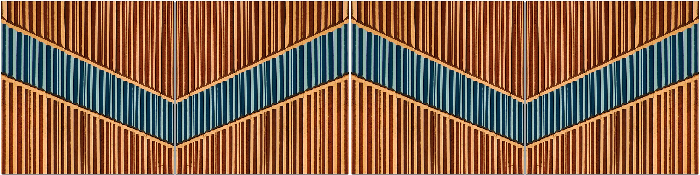 <small> <br>
<i>Lines</i> by jurek.d is licensed under
<a href="https://creativecommons.org/licenses/by-nc/2.0/legalcode">CC
BY-NC 2.0</a> <br> </small>

## contents

[introduction](#introduction)  
[line color](#line-color)  
[line type](#line-type)  
[line size](#line-size)  
[reference lines vertical](#reference-lines-vertical)  
[reference lines horizontal](#reference-lines-horizontal)  
[reference lines sloped](#reference-lines-sloped)  
[exercises](#exercises)  
[references](#references)

## introduction

Here we use lines to represent data or we add reference lines to assist
the reader’s comprehension.

``` r
library("tidyverse")
library("seplyr")
library("graphclassmate")
```

Some color assignments I like to use.

``` r
my_color_6 <- c(rcb("dark_BG"), rcb("mid_BG"), rcb("light_BG"), 
        rcb("light_Br"), rcb("mid_Br"), rcb("dark_Br"))

my_color_3 <- my_color_6[c(1, 2, 6)]
```

<br> <a href="#top">▲ top of page</a>

## line color

Editing lines is similar to editing symbols except we use `geom_line()`
instead of `geom_point()`.

I’ll use the `UKLungDeaths` dataset in base R for three time series
giving the monthly deaths from bronchitis, emphysema, and asthma in the
UK, 1974–1979, males (`mdeaths`), females (`fdeaths`), and total
(`ldeaths`).

I use the tsbox package to convert the Time Series data format to a tidy
data frame.

``` r
library("tsbox")

# collect the time series
collected_ts <- ts_c(mdeaths, fdeaths, ldeaths)

# convert to data frame 
df <- ts_df(collected_ts)

# then to a tibble
df <- as_tibble(df)

df
#> # A tibble: 216 x 3
#>    id      time       value
#>    <chr>   <date>     <dbl>
#>  1 mdeaths 1974-01-01  2134
#>  2 mdeaths 1974-02-01  1863
#>  3 mdeaths 1974-03-01  1877
#>  4 mdeaths 1974-04-01  1877
#>  5 mdeaths 1974-05-01  1492
#>  6 mdeaths 1974-06-01  1249
#>  7 mdeaths 1974-07-01  1280
#>  8 mdeaths 1974-08-01  1131
#>  9 mdeaths 1974-09-01  1209
#> 10 mdeaths 1974-10-01  1492
#> # ... with 206 more rows
```

Distinguish by color. First, convert the id to a factor and order it.

``` r
df <- df %>% 
        mutate(id = fct_reorder(id, value))
```

Then assign color to the `id` variable in the `aes()` function.

``` r
ggplot(data = df, mapping = aes(x = time, y = value, color = id)) +
        geom_line() +
        guides(color = guide_legend(reverse = TRUE))
```

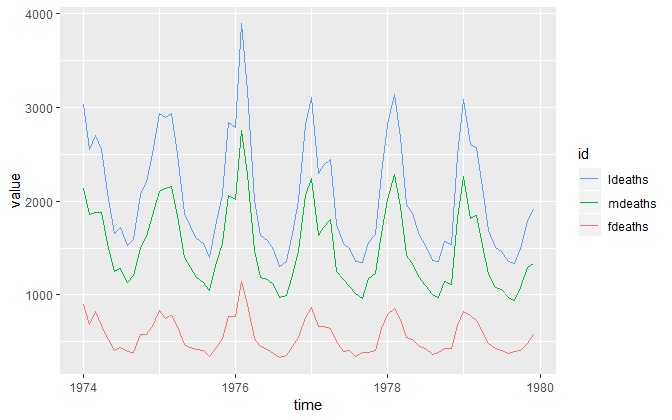

We can specify line colors using `scale_*` functions

``` r
ggplot(data = df, mapping = aes(x = time, y = value, color = id)) +
        geom_line() +
        guides(color = guide_legend(reverse = TRUE)) + 
    scale_color_manual(values = my_color_3)
```

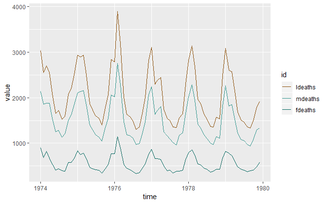

<br> <a href="#top">▲ top of page</a>

## line type

Like `geom_point()` has a `shape` argument, `geom_line()` has a
`linetype` argument with 7 levels,

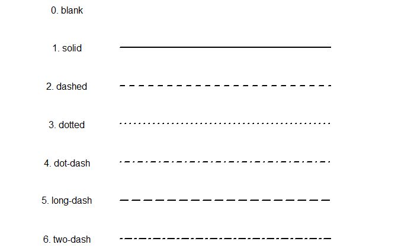

<br> Distinguish by line type

``` r
ggplot(data = df, mapping = aes(x = time, y = value, linetype = id)) +
        geom_line() +
        guides(linetype = guide_legend(reverse = TRUE))
```

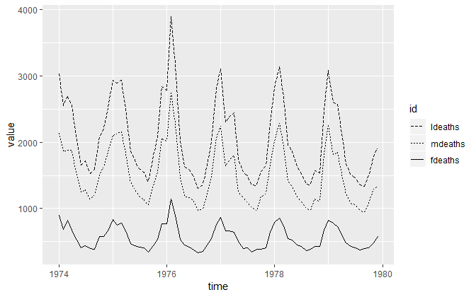

If we want to assign the same color to every line, we do it in the geom.

``` r
ggplot(data = df, mapping = aes(x = time, y = value, linetype = id)) +
        guides(linetype = guide_legend(reverse = TRUE)) +
        geom_line(color = rcb("dark_BG"))
```

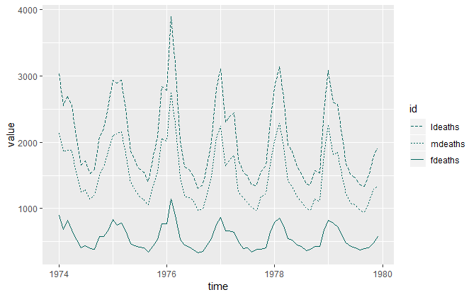

Line type and color can both be assigned to a variable. When we do that,
however, we get two legends.

``` r
ggplot(data = df, 
        mapping = aes(x = time, y = value, 
                linetype = id, 
                color    = id)) +
        guides(linetype  = guide_legend(reverse = TRUE)) +
        geom_line() +
        scale_color_manual(values = my_color_3)
```

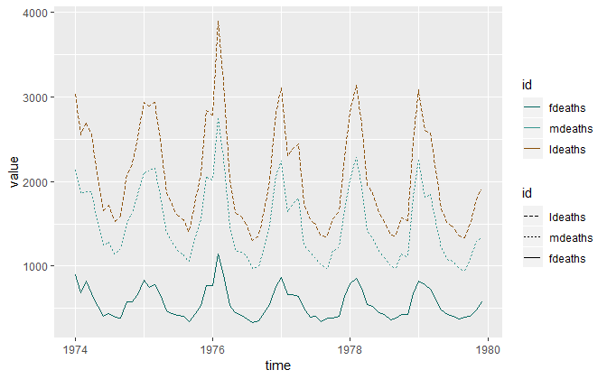

We’d prefer one legend. To keep the top legend with color and omit the
bottom legend, we use `guides()` with its `linetype` argument set to
`"none"`.

``` r
ggplot(data = df, 
        mapping = aes(x = time, y = value, 
                linetype = id, 
                color    = id)) +
        guides(linetype  = guide_legend(reverse = TRUE)) +
        geom_line() +
        scale_color_manual(values = my_color_3) +
        guides(color = guide_legend(reverse = TRUE), linetype = "none")
```

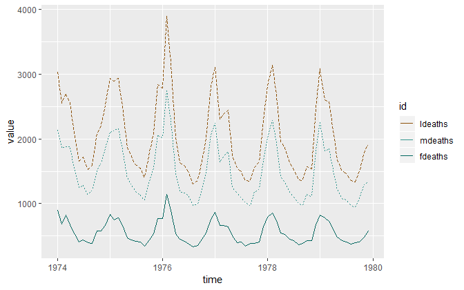

<br> <a href="#top">▲ top of page</a>

## line size

If we want all line sizes to be the same, we use the geom for the `size`
argument.

``` r
ggplot(data = df, mapping = aes(x = time, y = value, linetype = id)) +
        guides(linetype = guide_legend(reverse = TRUE)) +
        geom_line(color = rcb("dark_BG"), size = 1)
```

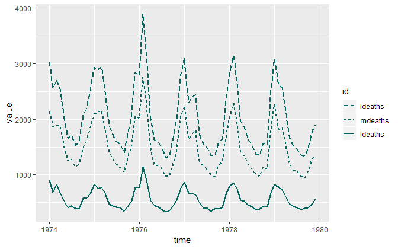

Using facets, can reduce the number of linetypes and colors needed to
distinguish between lines.

``` r
ggplot(data = df, mapping = aes(x = time, y = value)) +
        geom_line(size = 1, color = rcb("dark_BG")) +
        facet_wrap(vars(id), as.table = FALSE, ncol = 3)
```

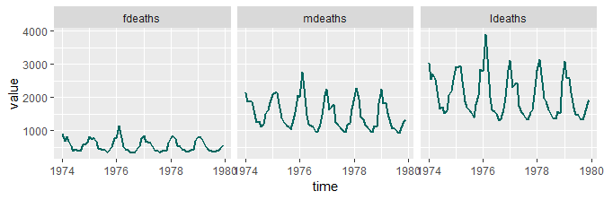

<br> <a href="#top">▲ top of page</a>

## reference lines vertical

The `geom_vline()` draws a vertical line at a specified `xintercept`.

Start with a basic scatterplot.

``` r
# diamonds dataset from ggplot2
df <- diamonds %>% 
        filter(carat <= 1 & price <= 4000) %>% 
        drop_na()

ggplot(data = df, aes(x = carat, y = price)) +
        geom_jitter(alpha = 0.3)
```

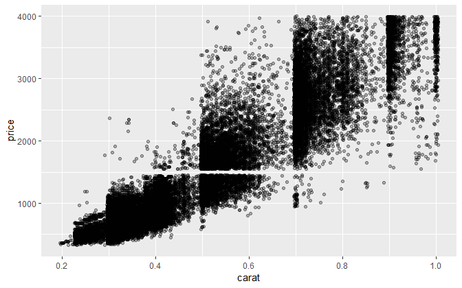

<br> `xintercept` is arbitrary

``` r
ggplot(data = df, aes(x = carat, y = price)) +
        geom_jitter(alpha = 0.3) + 
        geom_vline(xintercept = 0.69,  
                color = rcb("dark_PR"), 
                size  = 1)
```

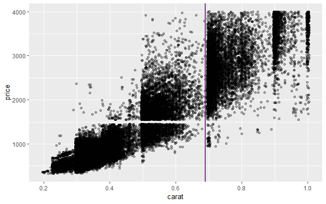

<br> `xintercept` depends on the data. Note that the `data` and
`mapping` arguments appear in `geom_vline()`

``` r
ggplot(data = df, aes(x = carat, y = price)) +
        geom_jitter(alpha = 0.3) + 
        geom_vline(data = df, 
                mapping = aes(xintercept = median(carat)), 
                color = rcb("dark_PR"), 
                size  = 1)
```

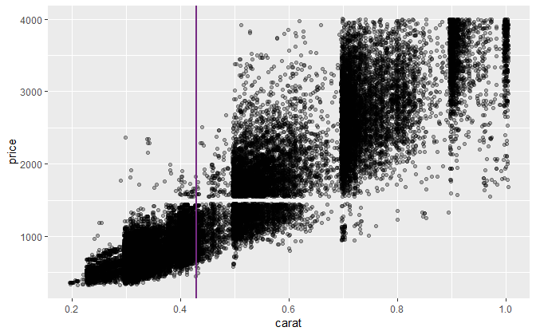

<br> `xintercept` is the same in every facet if we use the same
`geom_vline()` arguments as above

``` r
ggplot(data = df, aes(x = carat, y = price)) +
        geom_jitter(alpha = 0.3) + 
        geom_vline(data = df, 
                mapping = aes(xintercept = median(carat)), 
                color = rcb("dark_PR"), 
                size  = 1) +
        facet_wrap(vars(cut), as.table = FALSE, ncol = 1)
```

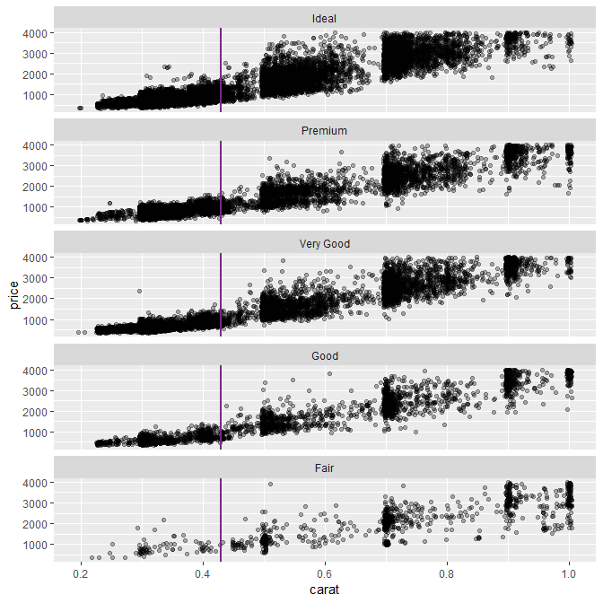

<br> To get the vertical line to represent the median in every panel, we
construct a new variable, `med_carat`, grouped by `cut` because that’s
what we are faceting on.

``` r
grouping_variables <- c("cut")
find_medians <- df %>% 
        group_summarize(grouping_variables, 
                med_carat = median(carat), 
                med_price = median(price)) %>% 
        glimpse()
#> Observations: 5
#> Variables: 3
#> $ cut       <ord> Fair, Good, Very Good, Premium, Ideal
#> $ med_carat <dbl> 0.71, 0.51, 0.50, 0.42, 0.41
#> $ med_price <dbl> 2117, 1351, 1213, 1087, 1075

df <- left_join(df, find_medians, by = "cut")
```

``` r
ggplot(data = df, aes(x = carat, y = price)) +
        geom_jitter(alpha = 0.3) + 
        geom_vline(data = df, 
                mapping = aes(xintercept = med_carat), 
                color = rcb("dark_PR"), 
                size  = 1) +
        facet_wrap(vars(cut), as.table = FALSE, ncol = 1)
```

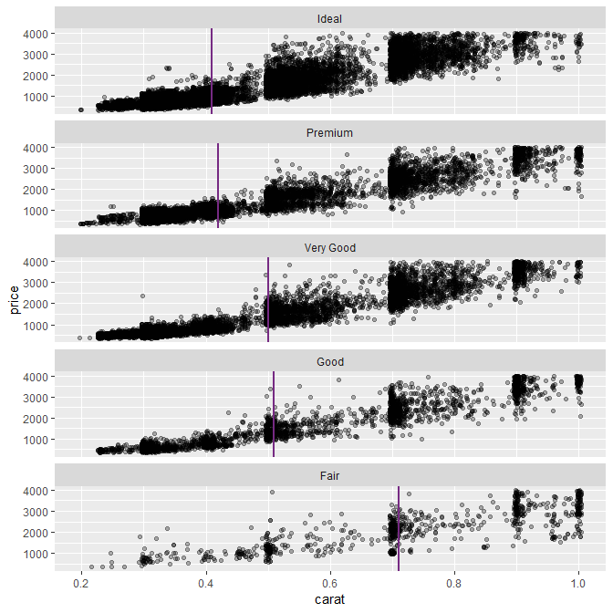

<br> <a href="#top">▲ top of page</a>

## reference lines horizontal

The `geom_hline()` draws a horiontal line at a specified `yintercept`.

<br> `yintercept` is arbitrary

``` r
ggplot(data = df, aes(x = carat, y = price)) +
        geom_jitter(alpha = 0.3) + 
        geom_hline(yintercept = 3000,  
                color = rcb("dark_PR"), 
                size  = 1)
```

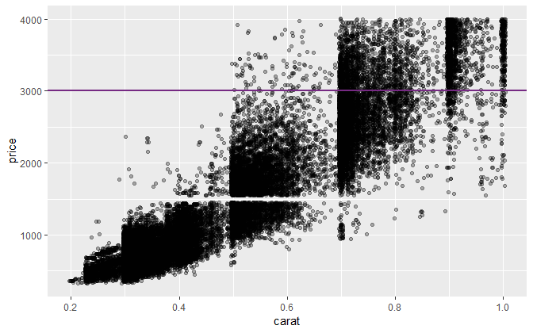

<br> `xintercept` depends on the data. Note that the `data` and
`mapping` arguments appear in `geom_vline()`

``` r
ggplot(data = df, aes(x = carat, y = price)) +
        geom_jitter(alpha = 0.3) + 
        geom_hline(data = df, 
                mapping = aes(yintercept = median(price)), 
                color = rcb("dark_PR"), 
                size  = 1)
```

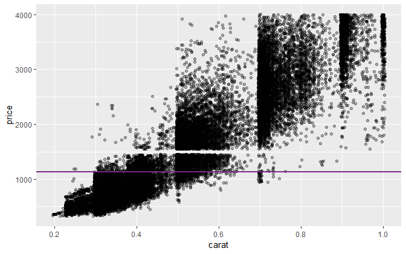

<br> `yintercept` is the same in every facet if we use the same
`geom_hline()` arguments as above

``` r
ggplot(data = df, aes(x = carat, y = price)) +
        geom_jitter(alpha = 0.3) + 
        geom_hline(data = df, 
                mapping = aes(yintercept = median(price)), 
                color = rcb("dark_PR"), 
                size  = 1) +
        facet_wrap(vars(cut), as.table = FALSE, ncol = 5)
```

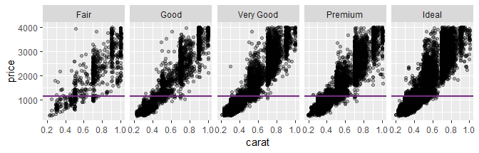

<br> To get the horizontal line to represent the median in every panel,
we use the `med_price` variable we constructed earlier.

``` r
ggplot(data = df, aes(x = carat, y = price)) +
        geom_jitter(alpha = 0.3) + 
        geom_hline(data = df, 
                mapping = aes(yintercept = med_price), 
                color = rcb("dark_PR"), 
                size  = 1) +
        facet_wrap(vars(cut), as.table = FALSE, ncol = 5)
```

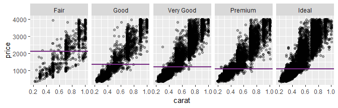

<br> <a href="#top">▲ top of page</a>

## reference lines sloped

Lines of any slope are constructed using `geom_abline()` which requires
two arguments: `slope` and `intercept`.

``` r
grouping_variables <- c("race", "path", "sex")
df <- nontraditional  %>% 
        seplyr::group_summarize(grouping_variables, 
                enrolled = mean(enrolled))
df
#> # A tibble: 16 x 4
#>    race     path           sex    enrolled
#>    <chr>    <chr>          <chr>     <dbl>
#>  1 Asian    Nontraditional Female     4.06
#>  2 Asian    Nontraditional Male       4.22
#>  3 Asian    Traditional    Female     4.14
#>  4 Asian    Traditional    Male       4.27
#>  5 Black    Nontraditional Female     4.14
#>  6 Black    Nontraditional Male       4.33
#>  7 Black    Traditional    Female     4.08
#>  8 Black    Traditional    Male       4.28
#>  9 Hispanic Nontraditional Female     3.95
#> 10 Hispanic Nontraditional Male       4.13
#> 11 Hispanic Traditional    Female     4.04
#> 12 Hispanic Traditional    Male       4.26
#> 13 White    Nontraditional Female     3.84
#> 14 White    Nontraditional Male       4.14
#> 15 White    Traditional    Female     3.93
#> 16 White    Traditional    Male       4.19
```

I’d like to plot compare traditional students to nontraditional students
by having one on each axis of a scatterplot, so I need to reshape the
data frame to create two new variables `trad` and `nontrad`.

``` r
df <- cdata::pivot_to_rowrecs(df,
        columnToTakeKeysFrom   = "path",
        columnToTakeValuesFrom = "enrolled",
        rowKeyColumns          = c("race", "sex")) 

 knitr::kable(df)
```

| race     | sex    | Nontraditional | Traditional |
| :------- | :----- | -------------: | ----------: |
| Asian    | Female |       4.057262 |    4.143750 |
| Asian    | Male   |       4.215313 |    4.272284 |
| Black    | Female |       4.136124 |    4.084110 |
| Black    | Male   |       4.330957 |    4.282462 |
| Hispanic | Female |       3.948345 |    4.042273 |
| Hispanic | Male   |       4.125917 |    4.257056 |
| White    | Female |       3.839782 |    3.925950 |
| White    | Male   |       4.138989 |    4.193669 |

The point was to plot Nontraditional students on one axis and
Traditional students on the other.

``` r
ggplot(data = df, mapping = aes(x = Traditional, y = Nontraditional)) +
        geom_point()
```

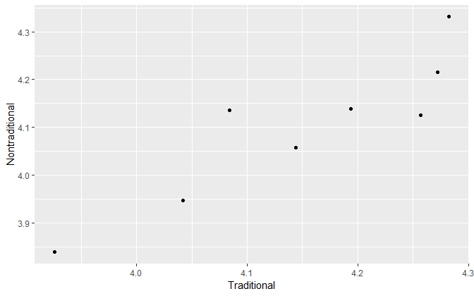

To which I can add a 45-degree line using `geom_abline()`. Points below
the line indiacte groups for which Traditional students take more years
to graduate.

``` r
ggplot(data = df, mapping = aes(x = Traditional, y = Nontraditional)) +
        geom_abline(slope = 1, intercept = 0, color = rcb("light_Gray")) +
        geom_point()
```

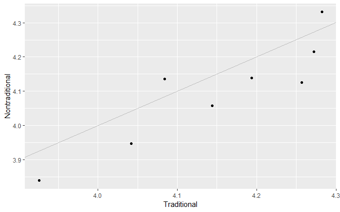

Add `coord_fixed()` to ensure the line is at 45 degrees.

``` r
p <- ggplot(data = df, mapping = aes(x = Traditional, y = Nontraditional)) +
        geom_abline(slope = 1, intercept = 0, color = rcb("light_Gray")) +
        geom_point() +
        coord_fixed(ratio = 1)
p
```

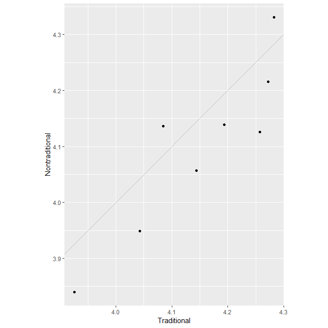

The graph tells us that for most groups by race and sex, traditional
students on average take longer to graduate than nontraditional
students.

Try a facet,

``` r
ggplot(data = df, mapping = aes(x = Traditional, y = Nontraditional)) +
        geom_abline(slope = 1, intercept = 0, color = rcb("light_Gray")) +
        geom_point() +
        coord_fixed(ratio = 1) +
        facet_wrap(vars(sex), as.table = FALSE, ncol = 2)
```

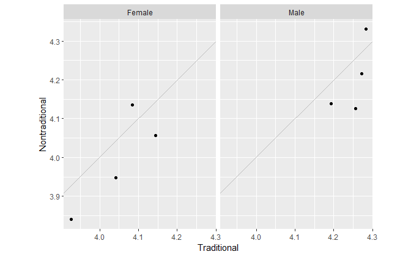

We might add horizontal and vertical lines reference lines at 4 years.

``` r
ggplot(data = df, mapping = aes(x = Traditional, y = Nontraditional)) +
        geom_hline(yintercept = 4, color = rcb("light_Gray")) +
        geom_vline(xintercept = 4, color = rcb("light_Gray")) +
        geom_abline(slope = 1, intercept = 0, color = rcb("light_Gray")) +
        geom_point() +
        coord_fixed(ratio = 1) +
        facet_wrap(vars(sex), as.table = FALSE, ncol = 2)
```

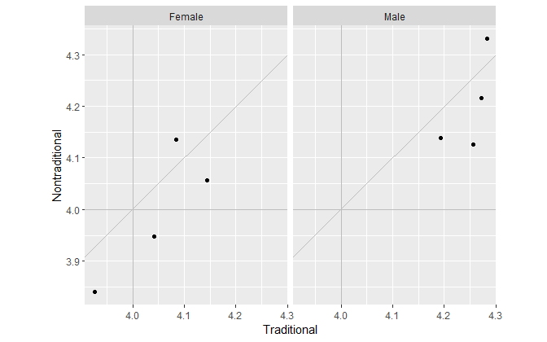

Only women are graduating on average in under 4 years. Of course, these
are means.

<br> <a href="#top">▲ top of page</a>

## exercises

**1. nontraditional**

Edit this graph (developed earlier) to that the data markers are
replaced with a letter to represent race and that sex is encoded using
color.

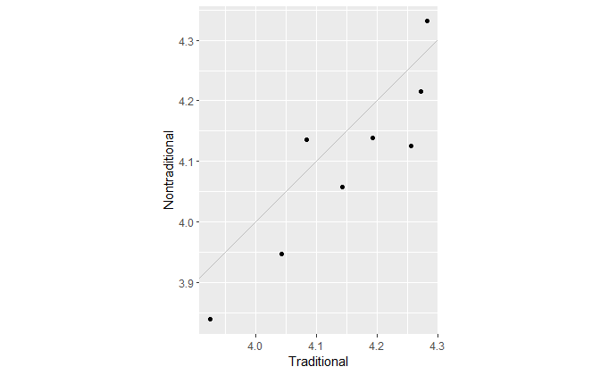

## references

<div id="refs">

<div id="ref-Wickham+Grolemund:2017">

Wickham H and Grolemund G (2017) *R for Data Science.* O’Reilly Media,
Inc., Sebastopol, CA <https://r4ds.had.co.nz/>

</div>

</div>

***
<a href="#top">&#9650; top of page</a>    
[&#9665; calendar](../README.md#calendar)    
[&#9665; index](../README.md#index)
