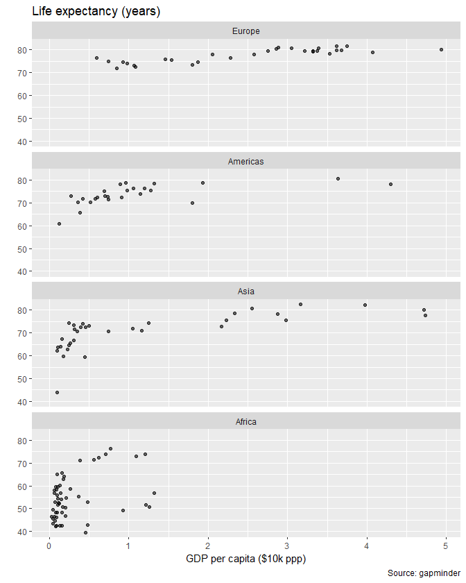
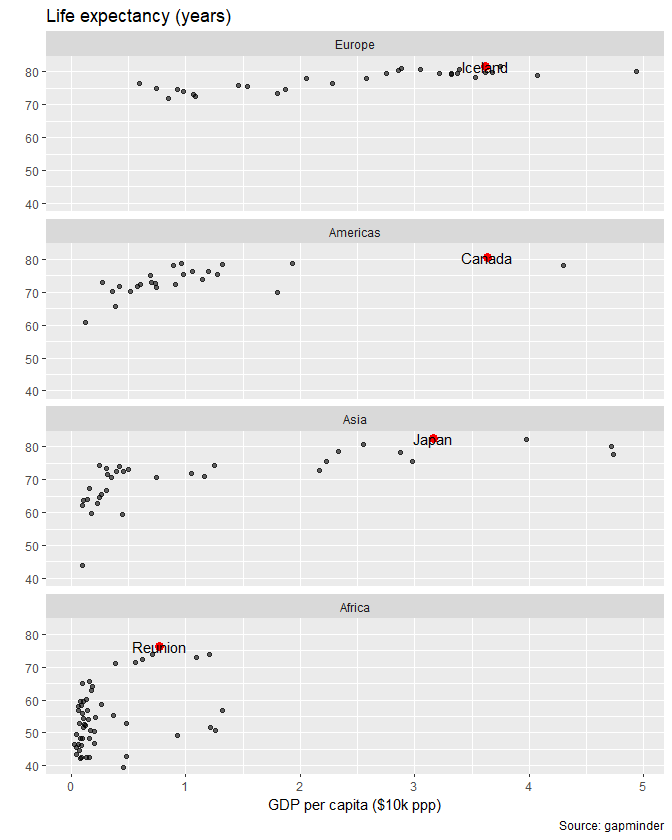
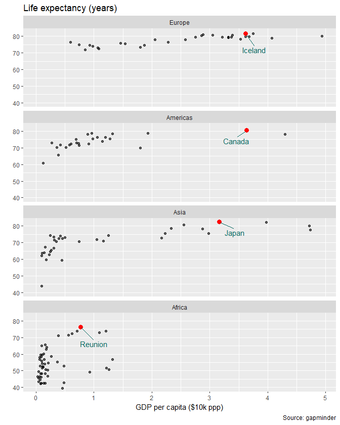
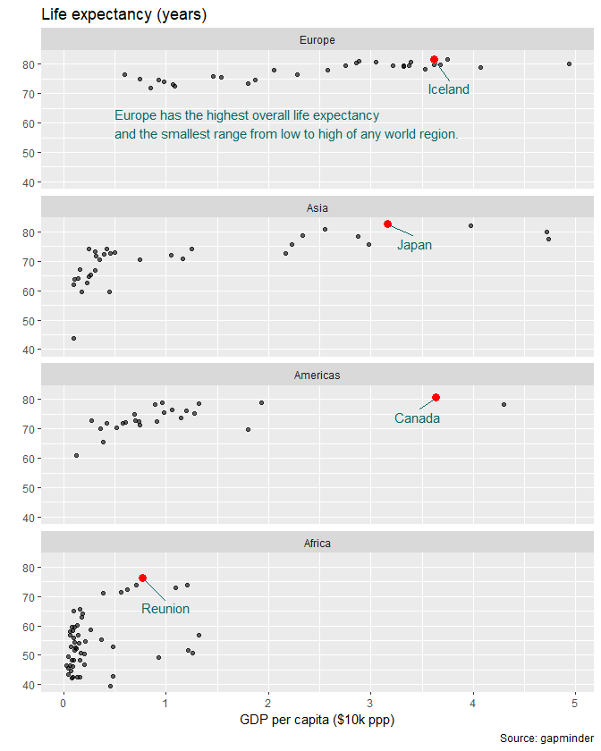
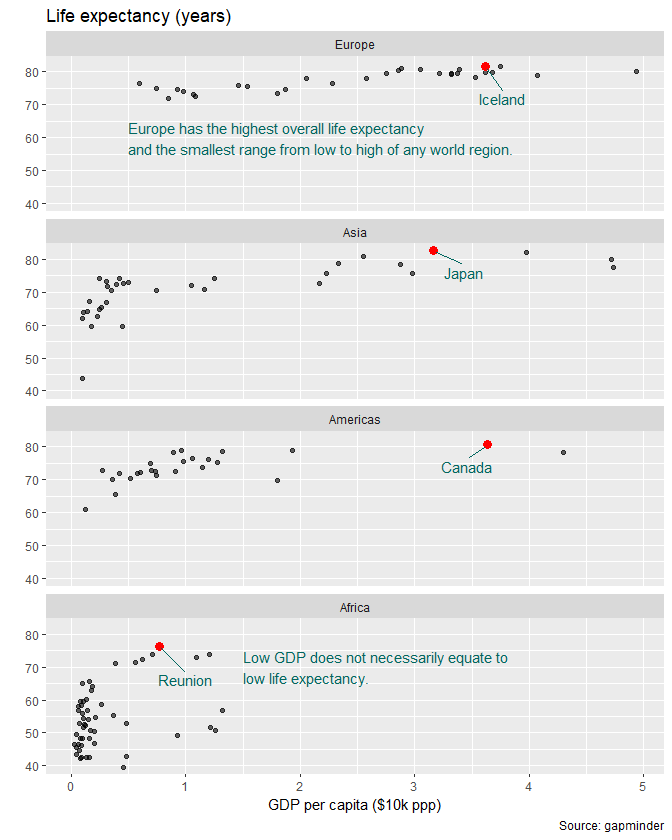

annotation
================

 <small> <br>
<i>Annotations</i> by Nicolas Nova is licensed under
<a href="https://creativecommons.org/licenses/by-nc/2.0/legalcode">CC
BY-NC 2.0</a> <br> </small>

<!-- adding extra text, points -->

<!-- - similar annotations all panels  -->

<!-- - math in annotation  -->

<!-- theme -->

<!-- - edit font and font size  -->

<!-- - edit line size, type, and color  -->

<!-- - change panel spacing  -->

<!-- - other themes  -->

<!-- Data sets in package ‘graphclassmate’: -->

<!-- county_income      Median income by US county in 2016 -->

<!-- infant_mortality   Infant mortality in the US, 2007-2016 -->

<!-- metro_pop          Population in the NY metro area -->

<!-- museum_exhibits    Visit duration at museum exhibitions -->

<!-- nontraditional     Nontraditional and traditional undergraduates -->

<!-- ucb_admit          Student admissions at UC Berkeley -->

## contents

[introduction](#introduction)  
[highlight data symbols](#highlight-data-symbols)  
[highlight data with labels](#highlight-data-with-labels)  
[text placed arbitrarily](#text-placed-arbitrarily)  
[text placed arbitrarily in multiple
panels](#text-placed-arbitrarily-in-multiple-panels)  
[references](#references)

## introduction

By annotation, I mean adding text or points to a graph to draw the
reader’s attention to specific data.

One consistent approach is to create a data frame for the annotation and
use it as the data argument in a geom.

Sometimes the coordinates of the annotation depend on the data; other
times the annotation has arbitrary coordinates.

``` r
library("tidyverse")
library("graphclassmate")
library("gapminder")
library("ggrepel")
```

## highlight data symbols

Suppose we have this graph

``` r
df <- gapminder %>% 
        filter(year == 2007) %>% 
        filter(continent != "Oceania") %>% 
        select(-year) %>% 
        mutate(continent = fct_reorder(continent, lifeExp)) %>% 
        droplevels() 

p <- ggplot(df, aes(x = gdpPercap/10000, y = lifeExp)) +
        geom_point(alpha = 0.6) +
        facet_wrap(vars(continent), as.table = FALSE, ncol = 1) +
        labs(x = "GDP per capita ($10k ppp)", y = "", title = "Life expectancy (years)", caption = "Source: gapminder")

p
```



And we would like to highlight the country with highest life expectancy
in each group. We extract that subset of the data.

``` r
high_four <- df %>% 
        group_by(continent) %>% 
        filter(lifeExp == max(lifeExp))

high_four
#> # A tibble: 4 x 5
#> # Groups:   continent [4]
#>   country continent lifeExp       pop gdpPercap
#>   <fct>   <fct>       <dbl>     <int>     <dbl>
#> 1 Canada  Americas     80.7  33390141    36319.
#> 2 Iceland Europe       81.8    301931    36181.
#> 3 Japan   Asia         82.6 127467972    31656.
#> 4 Reunion Africa       76.4    798094     7670.
```

We use this data frame as the `data` argument in a new `geom_point()`
layer.

``` r
p1 <- p + geom_point(data = high_four, 
        aes(x = gdpPercap/10000, y = lifeExp), 
                color = "red", size = 3)
p1
```


## highlight data with labels

To label the country, use could use `geom_text()`, but the printing
overlaps the data points.

``` r
p2 <- p1 + geom_text(data = high_four, 
        aes(x = gdpPercap/10000, y = lifeExp, label = country))
p2
```



Try the ggrepel package to move the labels away from the data points.
This takes a little bit of work. First, I create a data frame that has
an empty character string for all country names except the four I want.
For `geom_text_repel()` to avoid all the data points, we have to print
all the countries. But in this new data frame, all country names are
blank except the four I want.

Because I’m adding a new value (`""`) to the country factor I use
`fct_expand()` to add this as a new level (recall that factors have a
fixed set of levels).

``` r
blank_country <- df %>% 
        filter(!country %in% high_four$country) %>% 
        mutate(country = fct_expand("")) %>% 
        mutate(country = factor("")) %>% 
        glimpse()
#> Observations: 136
#> Variables: 5
#> $ country   <fct> , , , , , , , , , , , , , , , , , , , , , , , , 
#> $ continent <fct> Asia, Europe, Africa, Africa, Americas, Europe, Asia...
#> $ lifeExp   <dbl> 43.828, 76.423, 72.301, 42.731, 75.320, 79.829, 75.6...
#> $ pop       <int> 31889923, 3600523, 33333216, 12420476, 40301927, 819...
#> $ gdpPercap <dbl> 974.5803, 5937.0295, 6223.3675, 4797.2313, 12779.379...

# combine with the four countries
blank_country <- bind_rows(blank_country, high_four)

# check the values of country
unique(blank_country$country)
#> [1] ""        "Canada"  "Iceland" "Japan"   "Reunion"
```

Good. Ready to try `geom_text_repel()` as a new layer to the existing
graph. By trial and error, I edited some of the arguments to obtain a
text alignment I liked.

``` r
p3 <- p1 + ggrepel::geom_text_repel(data = blank_country, 
        aes(x = gdpPercap/10000, y = lifeExp, label = country), 
                color = rcb("dark_BG"), 
                box.padding = 0.5, 
                point.padding = 0.3, 
                min.segment.length = 0.4, 
                nudge_x = -0.1, 
                nudge_y = -5)

p3
```



## text placed arbitrarily

I create a new data frame with one row that contains variables to locate
the text in one panel. The variable names that place the text have to be
the same columns as in the graph data frame, e.g., `continent`,
`gdpPercap`, and `lifeExp.` The new variable is `label`, which contains
the text I want to add to the panel

``` r
continent <- "Europe"
gdpPercap <- 0.5
lifeExp   <- 60
label     <- "Europe has the highest overall life expectancy\nand the smallest range from low to high of any world region."

# create the tibble 
text_eu <- tibble(continent, gdpPercap, lifeExp, label) %>% 
        glimpse()
#> Observations: 1
#> Variables: 4
#> $ continent <chr> "Europe"
#> $ gdpPercap <dbl> 0.5
#> $ lifeExp   <dbl> 60
#> $ label     <chr> "Europe has the highest overall life expectancy\nand...
```

Use `geom_text()` with the new data frame as the `data` argument.

``` r
p4 <- p3 + geom_text(data = text_eu, 
                mapping = aes(x = gdpPercap, y = lifeExp, label = label), 
        color = rcb("dark_BG"), 
        hjust = 0) 
p4
```



## text placed arbitrarily in multiple panels

Create a tibble like the one above, but this one has multiple rows; one
row per text label.

``` r
text_panels <- wrapr::build_frame(
        "continent" , "gdpPercap"  , "lifeExp", "label" |
        "Europe"  , 0.5          , 60,  
                "Europe has the highest overall life expectancy\nand the smallest range from low to high of any world region." |
        "Africa"  , 1.5          , 70,  
                "Low GDP does not necessarily equate to\nlow life expectancy.")

glimpse(text_panels)
#> Observations: 2
#> Variables: 4
#> $ continent <chr> "Europe", "Africa"
#> $ gdpPercap <dbl> 0.5, 1.5
#> $ lifeExp   <dbl> 60, 70
#> $ label     <chr> "Europe has the highest overall life expectancy\nand...
```

The `geom_text()` is identical to the one above excpet a change in data
in the geom.

``` r
p5 <- p3 + geom_text(data = text_panels, 
        mapping = aes(x = gdpPercap, y = lifeExp, label = label), 
                color = rcb("dark_BG"), 
                hjust = 0) 
p5
```



## references

<div id="refs">

<div id="ref-Wickham+Grolemund:2017">

Wickham H and Grolemund G (2017) *R for Data Science.* O’Reilly Media,
Inc., Sebastopol, CA <https://r4ds.had.co.nz/>

</div>

</div>

***
<a href="#top">&#9650; top of page</a>    
[&#9665; calendar](../README.md#calendar)    
[&#9665; index](../README.md#index)
