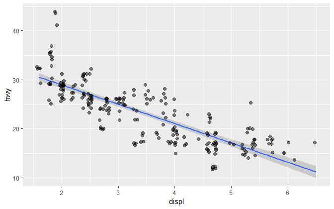
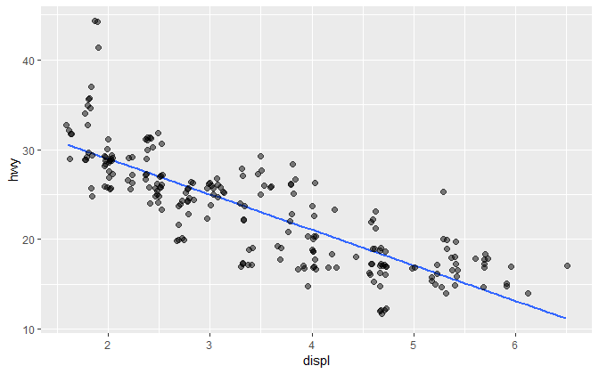
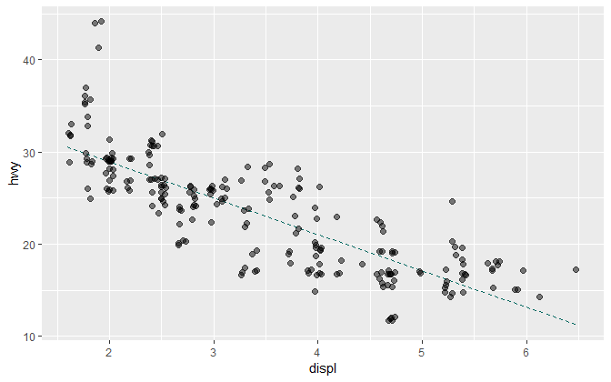
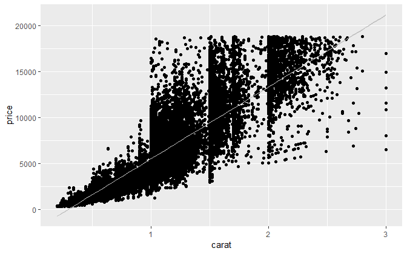
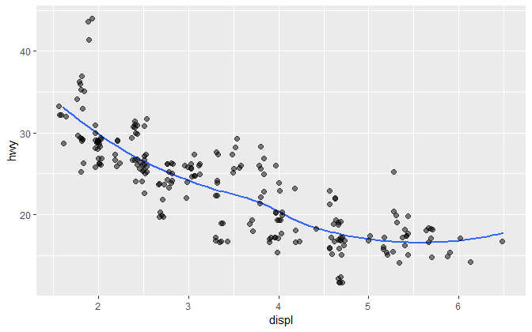
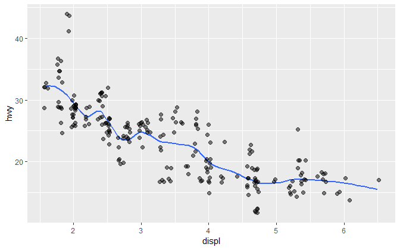
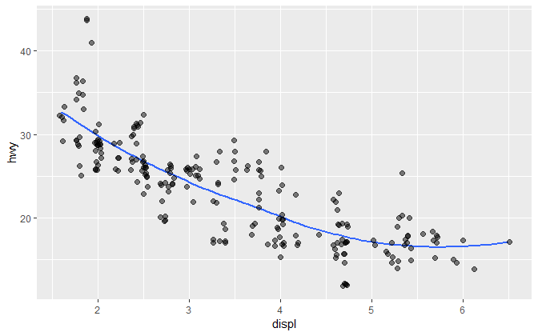
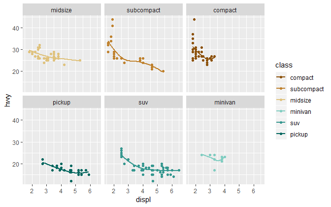
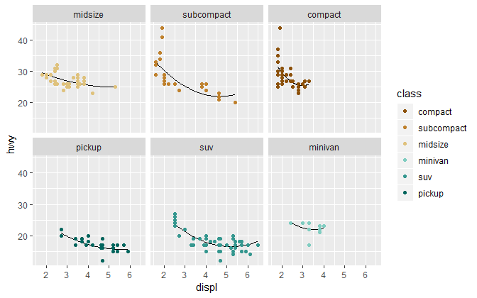

smooth fit
================

 <small> <br>
<i>Linear Regression</i> by Kiernan McCloskey is licensed under
<a href="https://creativecommons.org/licenses/by-sa/2.0/legalcode">CC
BY-SA 2.0</a> <br> </small>

## contents

[introduction](#introduction)  
[linear fit](#linear-fit)  
[loess fit](#loess-fit)  
[identical fit in every panel](#identical-fit-in-every-panel)  
[references](#references)

## introduction

The most common smooth fits are linear and loess.

``` r
library("tidyverse")
library("seplyr")
library("graphclassmate")
```

<br> <a href="#top">▲ top of page</a>

## linear fit

We’ll use the mpg dataset, slightly edited,

``` r
mpg <- mpg %>% 
        filter(class != "2seater") %>% 
        mutate(class  = fct_reorder(class, hwy, mean)) %>% 
        filter(cyl   != 5) %>% 
        mutate(cyl    = fct_reorder(factor(cyl), hwy, mean)) 
```

Generally, plot the smooth curve first, then the symbols, so that the
line does not obscure the data.

``` r
ggplot(data = mpg, mapping = aes(x = displ, y = hwy)) + 
        geom_smooth(method = "lm") +
        geom_jitter(size = 2, alpha = 0.5) 
```



Omit the confidence interval with `se = FALSE`

``` r
ggplot(data = mpg, mapping = aes(x = displ, y = hwy)) + 
        geom_smooth(method = "lm", se = FALSE) +
        geom_jitter(size = 2, alpha = 0.5) 
```



Size, linetype, and color,

``` r
ggplot(data = mpg, mapping = aes(x = displ, y = hwy)) + 
    geom_smooth(method = "lm", se = FALSE, size = 0.5, linetype = 2, color = rcb("dark_BG")) +
      geom_jitter(size = 2, alpha = 0.5)
```



There are times where the data are so dense they obscure the smooth fit.
In such a case, draw the data first, them the fit, using a thin line
with high contrast.

``` r
ggplot(data = filter(diamonds, carat <= 3), mapping= aes(x = carat, y = price)) +
    geom_point() + 
    geom_smooth(method = "lm", color = rcb("light_Gray"), size = 0.5)
```



<br> <a href="#top">▲ top of page</a>

## loess fit

The name *loess* (pronounced like the proper name Lois) is short for
*local regression.* Loess is a nonparametric curve-fitting method that
is easy to compute and to use (Cleveland, [1993](#ref-Cleveland:1993),
94).

``` r
ggplot(data = mpg, mapping = aes(x = displ, y = hwy)) + 
        geom_smooth(method = "loess", se = FALSE) +
        geom_jitter(size = 2, alpha = 0.5)
```



The distance from x that is considered “near” is controlled by the
`span` setting between 0 and 1. Smaller numbers produce wigglier lines.

``` r
ggplot(data = mpg, mapping = aes(x = displ, y = hwy)) + 
    geom_smooth(method = "loess", se = FALSE, span = 0.3) +
      geom_jitter(size = 2, alpha = 0.5)
```



Larger `span` produces smoother lines.

``` r
ggplot(data = mpg, mapping = aes(x = displ, y = hwy)) + 
        geom_smooth(method = "loess", se = FALSE, span = 0.9) +
        geom_jitter(size = 2, alpha = 0.5)
```



Facets with unique smooth fits in each,.

``` r
# color assignment I like to use 
my_color_6 <- c(rcb("dark_BG"), rcb("mid_BG"), rcb("light_BG"), 
        rcb("light_Br"), rcb("mid_Br"), rcb("dark_Br"))

ggplot(data = mpg, mapping = aes(x = displ, y = hwy, color = class)) + 
        geom_smooth(method = "loess", se = FALSE, span = 1) +
        geom_point() +
        scale_color_manual(values = my_color_6) +
        guides(color = guide_legend(reverse = TRUE)) +
        facet_wrap(vars(class), as.table = FALSE)
```



You can also fit to a function such as a polynomial. Color can be
assigned in the smooth geom.

``` r
ggplot(data = mpg, mapping = aes(x = displ, y = hwy, color = class)) + 
        geom_smooth(method = "lm", 
                formula = y ~ poly(x, 2), 
                se    = FALSE, 
                color = "black", 
                size  = 0.5) +
        geom_point() +
        scale_color_manual(values = my_color_6) +
        guides(color = guide_legend(reverse = TRUE)) +
        facet_wrap(vars(class), as.table = FALSE)
```



<br> <a href="#top">▲ top of page</a>

## identical fit in every panel

[Graph basics
lesson](cm201-graph-basics.md#beyond-basics-a-complex-design). Revisit
this graph we saw earlier in the term. I suspect that the code will make
more sense to you now than it did then.

Pay particular attention to the `data` and `aes()` arguments in the
geoms.

## references

<div id="refs">

<div id="ref-Cleveland:1993">

Cleveland WS (1993) *Visualizing Data.* Hobart Press, Summit, NJ

</div>

<div id="ref-Wickham+Grolemund:2017">

Wickham H and Grolemund G (2017) *R for Data Science.* O’Reilly Media,
Inc., Sebastopol, CA <https://r4ds.had.co.nz/>

</div>

</div>

***
<a href="#top">&#9650; top of page</a>    
[&#9665; calendar](../README.md#calendar)    
[&#9665; index](../README.md#index)
