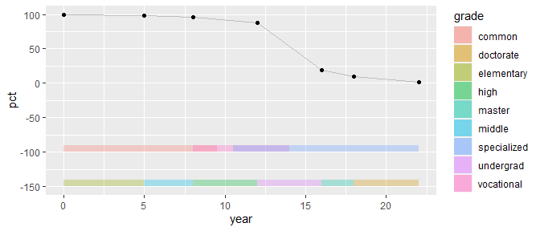
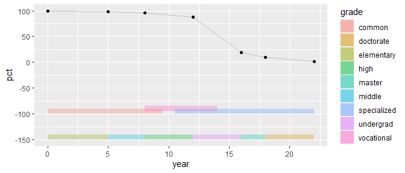
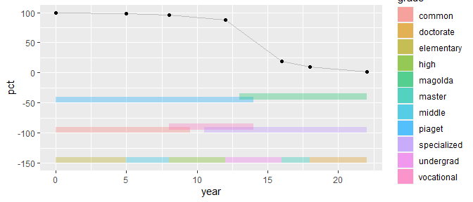
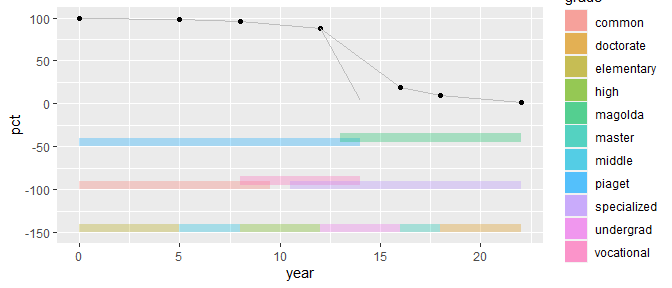
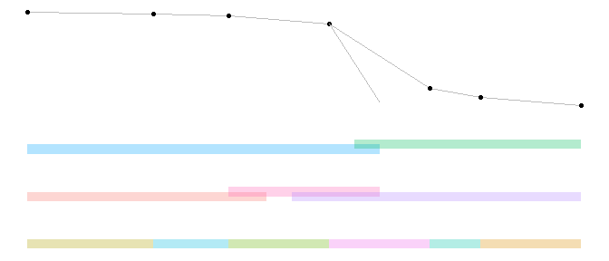

graph design improvisation
================

 <small> <br> <i>Endlessly
Improvised</i> by Chris Piascik is licensed under
<a href="https://creativecommons.org/licenses/by-nc-nd/2.0/legalcode">CC
BY-NC-ND 2.0</a> <br> </small>

[introduction](#introduction)  
[data](#data)  
[rectangles: grade level](#rectangles-grade-level)  
[rectangles: curriculum model](#rectangles-curriculum-model)  
[rectangles: developmental model](#rectangles-developmental-model)  
[line segment: vocational path](#line-segment-vocational-path)  
[theme work](#theme-work)  
[published display](#published-display)

## introduction

The type of graphical improvisation I’ll illustrate here can be
described as drafting graphical primitives (points, lines, rectangles,
text, etc.) on a Cartesian grid that is invisible to the viewer.

A client gave me the following figure to illustrate aspects of the US
educational system (Sipes, [2013](#ref-Sipes:2013)).

  - The author used the triangle shape to imply the progression from
    entry level at the bottom to exit level at the top.
  - The triangle also implies that population decreases at successive
    levels. The percentage of the population concluding each level are
    shown along the outer right edge.
  - Along the inner sides of the triangle are overlapping labels of
    model types, indicating at which level of schooling the models are
    used. On the left are models of cognitive development; on the right
    are models of curricula.


At first glance, the data we have is

  - percent of population, quantitative
  - grade level achieved (6 levels, ordered)
  - developmental model (2 levels)
  - curriculum model (3 levels)

The graphic is an excellent conceptual draft. It organizes the author’s
ideas and displays all their content. However, the graphic has some
perceptual problems.

The dominant visual cue is area: area of the overall triangle and area
of each segment separated by the horizontal lines. Using area to encode
information introduces three perceptual problems.

1.  The areas are not proportional to the numerical values shown.
2.  Even if the areas were correctly encoded, area is a poor method of
    encoding quantitative data.
3.  The horizontal bands all have the same height, incorrectly implying
    an equal amount of time between levels.

The triangle shape also subtly implies social stratification, with
people at the top of the triangle (or pyramid) superior in some way to
people at lower levels. Whether or not the stratification is real,
social status is not part of the story the author wants to convey.

My final concern is that this draft does not emphasize the data.
Instead, visual prominence is given to the triangle and the school
labels, “Elementary School”, “Middle School”, etc. These elements
describe the framework of the story, not the story itself. They should
be visually de-emphasized.

The story, about the models and percent population, should be
emphasized.

<br> <a href="#top">▲ top of page</a>

## data

Construct first data frame for the quantitative variable (percent of
population completing a grade level) and add the number of years that
corresponds to conventional educational path.

The original graphic did not contain the`year` variable, so I had to
create it to be able to construct the line graph.

``` r
df <- wrapr::build_frame(
        "grade"       , "year"  , "pct"  |
        "start"       , 0       , 100    | 
        "elementary"  , 5       , 97.9   |
        "middle"      , 8       , 95.8   |
        "high"        , 12      , 87.6   |
        "undergrad"   , 16      , 19.5   |
        "master"      , 18      , 9.5    |
        "doctorate"   , 22      , 1.6    )

df <- df %>% 
    mutate(grade = as_factor(grade))
kable(df)
```

| grade      | year |   pct |
| :--------- | ---: | ----: |
| start      |    0 | 100.0 |
| elementary |    5 |  97.9 |
| middle     |    8 |  95.8 |
| high       |   12 |  87.6 |
| undergrad  |   16 |  19.5 |
| master     |   18 |   9.5 |
| doctorate  |   22 |   1.6 |

Graph the quantitative variable

``` r
    ggplot(data = df, mapping = aes(x = year, y = pct)) +
        geom_line() +
        geom_point()
```


<br> <a href="#top">▲ top of page</a>

## rectangles: grade level

`geom_rect()` requires the x-y coordinates of the lower left corner
(xmin, ymin) and the upper right corner (xmax, ymax)

Create data frame with coordinates of rectangles

``` r
# a constant used for all rectangle heights 
yheight <- 10

df_rect <- df %>% 
        mutate(xmin = year[c(NA, 1:6)]) %>% 
        mutate(xmax = year[c(NA, 2:7)]) %>% 
        filter(grade != "start") %>%
        select(grade, xmin, xmax) %>% 
        mutate(ymin = -150) %>% 
        mutate(ymax = ymin + yheight)

kable(df_rect)
```

| grade      | xmin | xmax |  ymin |  ymax |
| :--------- | ---: | ---: | ----: | ----: |
| elementary |    0 |    5 | \-150 | \-140 |
| middle     |    5 |    8 | \-150 | \-140 |
| high       |    8 |   12 | \-150 | \-140 |
| undergrad  |   12 |   16 | \-150 | \-140 |
| master     |   16 |   18 | \-150 | \-140 |
| doctorate  |   18 |   22 | \-150 | \-140 |

  - the `geom_rect()` is assigned its own data frame
  - the `geom_line()` and `geom_point()` are assigned the original data
    frame

<!-- end list -->

``` r
p <- ggplot() +
        geom_line(data = df, mapping = aes(x = year, y = pct), color = "gray") +
        geom_point(data = df, mapping = aes(x = year, y = pct)) +
        geom_rect(data = df_rect, 
                mapping = aes(xmin = xmin, xmax = xmax, ymin = ymin, ymax = ymax, fill = grade), 
                alpha = 0.3)
p
```


<br> <a href="#top">▲ top of page</a>

## rectangles: curriculum model

Create data frame with coordinates of rectangles

``` r
df_curr <- wrapr::build_frame(
        "curriculum"   , "xmin"  , "xmax" |
        "common"           , 0       , 9.5    |
        "vocational"     , 8         , 14     |
        "specialized"    , 10.5    , 22     )

df_curr <- df_curr %>% 
        mutate(ymin = -100) %>% 
        mutate(ymax = ymin + yheight)

kable(df_curr)
```

| curriculum  | xmin | xmax |  ymin | ymax |
| :---------- | ---: | ---: | ----: | ---: |
| common      |  0.0 |  9.5 | \-100 | \-90 |
| vocational  |  8.0 | 14.0 | \-100 | \-90 |
| specialized | 10.5 | 22.0 | \-100 | \-90 |

``` r
p1 <- p + geom_rect(data = df_curr, 
        mapping = aes(xmin = xmin, xmax = xmax, ymin = ymin, ymax = ymax, fill = curriculum), 
        alpha = 0.3)

p1
```



Edit coordinates to offset one rectangle

``` r
df_curr <- df_curr %>% 
        mutate(ymin = ifelse(curriculum == "vocational", ymin + yheight/2, ymin)) %>% 
        mutate(ymax = ifelse(curriculum == "vocational", ymax + yheight/2, ymax))

kable(df_curr)
```

| curriculum  | xmin | xmax |  ymin | ymax |
| :---------- | ---: | ---: | ----: | ---: |
| common      |  0.0 |  9.5 | \-100 | \-90 |
| vocational  |  8.0 | 14.0 |  \-95 | \-85 |
| specialized | 10.5 | 22.0 | \-100 | \-90 |

Graph

``` r
p2 <- p + geom_rect(data = df_curr, 
        mapping = aes(xmin = xmin, xmax = xmax, ymin = ymin, ymax = ymax, fill = curriculum), 
        alpha = 0.3)

p2
```



<br> <a href="#top">▲ top of page</a>

## rectangles: developmental model

Create data frame with coordinates of rectangles. Edit coordinates to
offset one rectangle.

``` r
df_devel <- wrapr::build_frame(
        "development"   , "xmin"  , "xmax" |
        "piaget"          , 0         , 14     |
        "magolda"         , 13      , 22     )

df_devel <- df_devel %>% 
        mutate(ymin = -50) %>% 
        mutate(ymax = ymin + yheight)

df_devel <- df_devel %>% 
        mutate(ymin = ifelse(development == "magolda", ymin + yheight/2, ymin)) %>% 
        mutate(ymax = ifelse(development == "magolda", ymax + yheight/2, ymax))

kable(df_devel)
```

| development | xmin | xmax | ymin | ymax |
| :---------- | ---: | ---: | ---: | ---: |
| piaget      |    0 |   14 | \-50 | \-40 |
| magolda     |   13 |   22 | \-45 | \-35 |

Graph

``` r
p3 <- p2 + geom_rect(data = df_devel, 
        mapping = aes(xmin = xmin, xmax = xmax, ymin = ymin, ymax = ymax, fill = development), 
        alpha = 0.3)

p3
```



<br> <a href="#top">▲ top of page</a>

## line segment: vocational path

``` r
lines2 <- df_curr %>% 
    filter(curriculum == "vocational") %>% 
    select(xend = xmax) %>% 
    mutate(y = df$pct[df$year == 12]) %>% 
    mutate(x = 12, yend = 4.3) %>% 
    select(x, y, xend, yend)


kable(lines2)
```

|  x |    y | xend | yend |
| -: | ---: | ---: | ---: |
| 12 | 87.6 |   14 |  4.3 |

I graph the line but not the data symbol at the endpoint because I will
edit all symbols a little farther on.

``` r
p3 <- p3 + geom_segment(data = lines2, 
        mapping = aes(x = x, y = y, xend = xend, yend = yend), 
        color = "gray")
p3
```



<br> <a href="#top">▲ top of page</a>

## theme work

Omit everything except the primitive elements in the data rectangle.

``` r
p4 <- p3 +
        theme_void() +
        theme(legend.position = "none")

p4
```



Create data frame with coordinates of scale lines

``` r
lines1 <- wrapr::build_frame(
        "x"   , "y"  |
        0     , 100  |
        0     , 0      |
        22    , 0    )

p4 <- p4 +
        geom_line(lines1, mapping = aes(x, y), color = "gray")

p4
```


Create data frame with coordinates of vertical line segments

``` r
df_vert <- df %>% 
        select(x = year) %>% 
        mutate(xend = x, y = -150, yend = 0) %>% 
        select(x, xend, y, yend)


kable(df_vert)
```

|  x | xend |     y | yend |
| -: | ---: | ----: | ---: |
|  0 |    0 | \-150 |    0 |
|  5 |    5 | \-150 |    0 |
|  8 |    8 | \-150 |    0 |
| 12 |   12 | \-150 |    0 |
| 16 |   16 | \-150 |    0 |
| 18 |   18 | \-150 |    0 |
| 22 |   22 | \-150 |    0 |

Graph

``` r
p4 <- p4 + geom_segment(data = df_vert, 
        mapping = aes(x = x, y = y, xend = xend, yend = yend), 
        color = "gray")

p4
```


Create data frame with coordinates of cross-hairs

``` r
df_plus <- df_vert %>% 
        select(x, y) %>% 
        mutate(y = 0)

kable(df_plus)
```

|  x | y |
| -: | -: |
|  0 | 0 |
|  5 | 0 |
|  8 | 0 |
| 12 | 0 |
| 16 | 0 |
| 18 | 0 |
| 22 | 0 |

Over-print a white dot and a cross hair aloing the scatterplot x-axis.

``` r
p4 <- p4 + 
        geom_point(data = df_plus, 
                mapping = aes(x = x, y = y), 
                color = "white", 
                size = 6) +
        geom_point(data = df_plus, 
                mapping = aes(x = x, y = y), 
                color = "gray", 
                shape = 3, 
                size = 2)
p4
```


Do the same for the original data symbols: a gray marker with a larger
white marker under it creates a gap between the data marker and the
“helper line.”

``` r
# add vocational point to df 
df_points <- df %>% 
    select(year, pct)

add_coord <- lines2 %>% 
    select(year = xend, pct = yend)
    
df_points <- bind_rows(df_points, add_coord)

kable(df_points)
```

| year |   pct |
| ---: | ----: |
|    0 | 100.0 |
|    5 |  97.9 |
|    8 |  95.8 |
|   12 |  87.6 |
|   16 |  19.5 |
|   18 |   9.5 |
|   22 |   1.6 |
|   14 |   4.3 |

``` r
p5 <- p4 +
        geom_point(data = df_points, 
                mapping = aes(x = year, y = pct), 
                size = 6, 
                color = "white") +
        geom_point(data = df_points, 
                mapping = aes(x = year, y = pct), 
                size = 3, 
                color = "gray50")

p5
```


And so it goes. The rest of the code is similar. You continue to build
up layer on layer of primitive graphical elements.

<br> <a href="#top">▲ top of page</a>

## published display

The compelling story of the graph is the sharp decline of people
completing post-secondary education. The graph raises several questions
about the population decline and the specialized curriculum and
self-authorship developmental models of the post-secondary years. Are
they correlated? Does another variable underlying both? If so, can it be
measured?


### graph design

The time scale is conventionally oriented from left to right. With the
start of kindergarten (K) as year 0, the year axis is drawn to scale,
providing the common, aligned scale recommended by Cleveland and McGill
([1984](#ref-Cleveland+McGill:1984)). This new structure is
de-emphasized by drawing it in shades of gray. Because the school labels
“elementary”, “middle”, etc., describe spans of years, the year axis
labels are also shown as spans of years. Axis tick marks are therefore
unnecessary.

To show both types of data in one graph, the data rectangle is divided
into upper and lower regions separated by a horizontal line. Vertical
grid lines span the lower portion only, enhancing the visual separation
between the two regions and helping a viewer compare the spans and
overlaps of the categorical data. At the top of the grid lines, a small
plus symbol acts as a tick mark for the time series, subtly emphasizing
that the upper region is a conventional scatter plot.

The upper region of the graph is devoted to the time series data: the
percent of the US population attaining each educational level. The
appropriate graph type is a time series showing the evolution of the
percentage over time (Doumont, [2009](#ref-Doumont:2009:Ch.4)). The data
are discrete, so the line from point to point is not continuous. The
vertical scale labeled 0–100% gives another visual cue that the data are
bivariate. The data markers are labeled with values to meet the needs of
the audience. The data set is small enough that the value labels do not
crowd the data rectangle (Robbins, [2013](#ref-Robbins:2013), 175).
Labeling the data markers makes additional ticks marks on the vertical
scale unnecessary.

Thin, gray lines between data markers help dramatize the sharp decline
in the percent of the population completing post-secondary education. A
separate line indicates those completing a terminal vocational
associates degree. This observation was not in the original concept but
was easily added once the new design was established.

The lower region of the graph is devoted to the categorical variables
The spans are drawn as bars, contrary to Tufte’s advice to reduce
non-data ink (Tufte, [1983](#ref-Tufte:1983), 96). The bars give the
lower graph region prominence equal to that of the upper graph region,
balancing the importance of the two data types (Doumont,
[2009](#ref-Doumont:2009:Ch.4)). The bars also provide higher contrast
to the background structure and help a viewer compare the spans and
overlaps. Following Few’s advice ([2018](#ref-Few:2008)), the bars are
colored for prominence using a categorical palette that separates the
categorical data into distinct groups and the level of color saturation
is moderate for the bar area but higher for the outlines.

## references

<div id="refs">

<div id="ref-Cleveland+McGill:1984">

Cleveland WS and McGill R (1984) Graphical perception: Theory,
experimentation, and application to the development of graphical
methods. *Journal of the American Statistical Association* **79**(387),
531–554

</div>

<div id="ref-Doumont:2009:Ch.4">

Doumont J-L (2009) Designing the graph. *Trees, maps, and theorems:
Effective communication for rational minds*. Principiae, Kraainem,
Belgium, 133–143 <http://www.treesmapsandtheorems.com/>

</div>

<div id="ref-Few:2008">

Few S (2018) Practical rules for using color in charts.
<https://tinyurl.com/od7qsd>

</div>

<div id="ref-Robbins:2013">

Robbins N (2013) *Creating More Effective Graphs.* Chart House, Wayne,
NJ

</div>

<div id="ref-Sipes:2013">

Sipes S (2013) *Curriculum utilitarianism.* unpublished, personal
communication

</div>

<div id="ref-Tufte:1983">

Tufte E (1983) *The visual display of quantitative information.*
Graphics Press, Cheshire, CT
<https://www.edwardtufte.com/tufte/books_vdqi>

</div>

<div id="ref-Wickham+Grolemund:2017">

Wickham H and Grolemund G (2017) *R for Data Science.* O’Reilly Media,
Inc., Sebastopol, CA <https://r4ds.had.co.nz/>

</div>

</div>

***
<a href="#top">&#9650; top of page</a>    
[&#9665; calendar](../README.md#calendar)    
[&#9665; index](../README.md#index)
