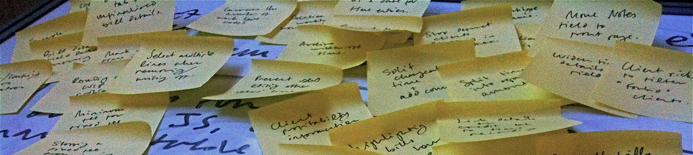

portfolio
================

 <small>  
<i>Requirements, requirements, requirements</i> by John Keane is
licensed under
<a href="https://creativecommons.org/licenses/by-sa/2.0/">CC BY-SA
2.0</a>    </small>

## contents

[highlights](#highlights)  
[README](#readme)  
[reports](#reports)  
[variety of data sources](#variety-of-data-sources)  
[discussion notes](#discussion-notes)  
[citations in design and rhetoric](#citations-in-design-and-rhetoric)  
[compelling story](#compelling-story)  
[500-level course](#level-course)  
[reproductions](#reproductions)  
[redesigns](#redesigns)  
[revising](#revising)  
[grading](#grading)  
[references](#references)

## highlights

This section summarizes the portfolio highlights. Subsequent sections
provide detail in depth.

**Goals.** An exceptional portfolio showcases your ability to
communicate truthful and compelling stories using quantitative data and
effective visual rhetoric. My goal is to help you craft a document that
you would be proud to include in your employment portfolio.

All coursework is directed towards completing a portfolio that
demonstrates the degree to which you can:

  - Design effective and truthful data displays
  - Credibly explain your design rationale
  - Produce publication-quality visuals
  - Credibly critique a data display

**The portfolio is a website** that resides on GitHub as a private
repository. When the course is complete you may edit the repo and make
it public if there are elements you want to share with prospective
employers. A [sample
README](https://github.com/graphdr/portfolio-sample) illustrates the
layout of the main page.

**You start writing portfolio content** in the Portfolio studio session
(week 3) after we have introduced R Markdown.

**You write a report for each display** presenting the context,
graph(s), and critique. The reasoning of the critique is supported by
our readings, discussions, and reflections with relevant citations from
that work. Seven reports are required:

  - [D1 distributions](cm301-report-display-reqts.md#D1-distributions)
  - [D2 multiway](cm301-report-display-reqts.md#D2-multiway)
  - [D3 correlations](cm301-report-display-reqts.md#D3-correlations)
  - [D4 injuries or
    fatalities](cm301-report-display-reqts.md#D4-injuries-or-fatalities)
  - [D5 redesign a graphical
    lie](cm301-report-display-reqts.md#D5-redesign-a-graphical-lie)
  - [D6 multivariate](cm301-report-display-reqts.md#D6-multivariate)
  - [D7 self-taught](cm301-report-display-reqts.md#D7-self-taught)

**Data requirements include:**

  - Each display has a specific minimum required [data
    structure](cm301-report-display-reqts.md#portfolio-data-requirements)
  - The portfolio is expected to use a [variety of data
    sources](#variety-of-data-sources)

**Graph requirements** in addition to the required display types
include:

  - At least one graph must tell a [compelling story](#compelling-story)
  - A maximum of 2 displays can be [reproductions](#reproductions)
  - A maximum of 3 displays can be [redesigns](#redesigns)

## README

README introduces the reader to your portfolio. It should start with an
image that showcases your best work and introduction that engages the
reader. The intended audience are professional peers or prospective
employers.

  - [Set up README.](cm902-software-studio.md#setup-readme) The landing
    page for the repository (we did this in the software studio)  
  - [Importing an
    image.](cm302-report-portfolio-studio.md#importing-images) Showcase
    your best work (portfolio studio)  
  - [Adding links to
    README.](cm302-report-portfolio-studio.md#adding-links-to-readme)
    Link to the reports and the discussion notes (portfolio studio)  
  - [Sample README.](https://github.com/graphdr/portfolio-sample)
    Illustrating the layout of the main page

Writing the introduction (Strider, [2019](#ref-Strider:2019))

  - The introduction should engage the reader, giving them a reason to
    keep reading.
  - Decide upon the overall theme of your portfolio. Think of one
    sentence that best describes this theme and use it as your opening
    statement.  
  - Describe, in general terms, the content of your portfolio and how
    the content demonstrates your theme. Avoid listing all of the
    contents in your portfolio in the introduction.  
  - Explain why the reader should want to review your portfolio. Think
    about what sets your portfolio apart from others and how it
    describes you as an individual.

  <a href="#top">▲ top of page</a>

## reports

One report is written for each display presenting the graph(s), context,
critique, and references.

  - [Initialize a
    report.](cm305-report-rmd-basics.md#initialize-a-report) How to
    setup a new Rmd script (from R Markdown basics)  
  - [Initialize knitr.](cm305-report-rmd-basics.md#initialize-a-report)
    Assign settings to control the behavior of code chunks (R Markdown
    basics)

Seven displays (D1–D7) are required. Students sometimes exceed the
minimum number of displays to meet all the requirements, to explore data
they find interesting, or to showcase something they’ve learned on their
own. A display can meet more than one requirement. For example, a D3
correlation graph can also meet the technical discipline requirement.

Required display types and data specifications:

  - [D1 distributions](cm301-report-display-reqts.md#D1-distributions)
  - [D2 multiway](cm301-report-display-reqts.md#D2-multiway)
  - [D3 correlations](cm301-report-display-reqts.md#D3-correlations)
  - [D4 injuries or
    fatalities](cm301-report-display-reqts.md#D4-injuries-or-fatalities)
  - [D5 redesign a graphical
    lie](cm301-report-display-reqts.md#D5-redesign-a-graphical-lie)
  - [D6 multivariate](cm301-report-display-reqts.md#D6-multivariate)
  - [D7 self-taught](cm301-report-display-reqts.md#D7-self-taught)

*Critiques.* A written critique is required for every display. Effective
critiques are well-reasoned and well-informed. The following elements
should be incorporated in every report (not necessarily in order):

  - [Introductory prose](cm305-report-rmd-basics.md#introductory-prose)
    to start each report describing the data and the requirements being
    met (from R Markdown basics)  
  - Describe the type of story being told with relevant citations—recall
    the paper by Doumont ([2009](#ref-Doumont:2009:Ch.4))  
  - Explain how the graph design is appropriate to the [data
    structure](cm102-data-studio.md#classify-your-data-structure)  
  - Explain your rationale for important design elements with relevant
    citations
  - Explain the application of basic principles in graph design and
    visual rhetoric that we have discussed and that you have noted in
    your discussion notes (reading responses, video reflections, and
    presentation notes) with relevant citations

*Document design.* See the [document
design](cm304-report-document-design.md#document-design) page for
detailed discussion about the portfolio media, fonts, headings, text
color, use of bold and italic, etc.

  <a href="#top">▲ top of page</a>

## variety of data sources

The following constraints are to ensure some variety in your data
sources. My rationale follows.

  - The seven required data displays must be based on at least four
    independent raw data sets.
  - At least two of your displays must use data relevant to problems in
    your technical area.
  - No more than two displays can be related to sport.
  - Displays may not be based on practice data provided with R packages
    (with the exception noted below)

*Independent raw data sets.* To encourage you to deal with as much data
acquired “in the wild” as possible, I would like you to resist using the
same data set repeatedly.

*Data in your technical area.* Because your audience includes
professional peers and prospective employers, some displays should
relate to your technical discipline. For example, you could: redesign a
poorly designed graph from a journal or conference proceedings in your
technical area; use data from research with which you have been
involved; obtain data from a faculty member who needs help with data
graphics; use data associated with another technical course or
extracurricular activity.

*Displays related to sport.* Because our goal is to create a portfolio
of data displays suitable for an audience of your professional peers and
prospective employers, I impose a limit on the number of sports-related
data.

*Avoid practice data.* Many R packages include bundled data to help one
learn about the package functionality. Such data, while excellent for
practice, are generally unsuitable for portfolio displays because they
have been “tamed”—much of the work of creating an effective graph (and
therefore much of the learning in the course) is in obtaining data “in
the wild” and performing the necessary data carpentry to tame it
yourself.

An exception can be made for R data packages such as the
[midfielddata](https://midfieldr.github.io/midfielddata/) package where
the package *is* the source, that is, the package provides public access
to data that is otherwise unavailable.

  <a href="#top">▲ top of page</a>

## discussion notes

The discussion notes are reports in which you record your summaries of
the readings, video reflections, and weekly presentations. In
particular, you are recording specific instances of principles of graph
design and visual rhetoric that can be used as evdience to suppoort the
design choices you make in creating the final displays in your
portfolio.

In most cases, the reports record your response to prompts and class
discussion.

  - [Reading response
    setup](cm902-software-studio.md#setup-reading-response) (we did this
    in the software studio)
  - [Reading
    response](cm302-report-portfolio-studio.md#reading-responses)
    (portfolio studio)
  - [Reflection
    1](cm403-rhetoric-discovering-stories.md#reflection-on-rhetoric)
    (discovering stories)
  - [Reflection
    2](cm404-rhetoric-graphical-lies.md#reflection-on-rhetoric)
    (graphical lies)  
  - [Presentation
    response](cm302-report-portfolio-studio.md#presentation-responses)
    (portfolio studio)  
  - [Correspondence](cm902-software-studio.md#setup-correspondence) My
    feedback on your work-in-progress plus your response (software
    studio)

  <a href="#top">▲ top of page</a>

## citations in design and rhetoric

The credibility of your critique is supported by the credibility and
relevance of your citations in graph design and visual rhetoric. The
whole point of our reading discussions, video reflections, and
presentation notes is to provide evidence to support your assertions in
the report.

Avoid the novice practice of sprinkling citations like confetti at New
Year’s to make an argument *appear* supported. Instead, construct your
argument first—say what you are trying to say—based on the stuff you’re
learning. That stuff is based on credible sources. Cite those sources.

Use the
[author-date](cm302-report-portfolio-studio.md#format-the-citations-and-references)
citation style we introduced in the portfolio studio and automate the
generation of formatted citations and references using R Markdown.

Each report in your portfolio has its own page, so each concludes with
its own [reference
section](cm302-report-portfolio-studio.md#add-a-references-heading).

  <a href="#top">▲ top of page</a>

## compelling story

At least one display must tell a compelling story, that is, a story that
compels an audience to re-examine their assumptions or compels them to
action.

Attributes of a compelling story are: the story is important, based on
complete and credible data, with insights into the story’s context.
Examples of compelling data graphics we discuss this term:

  - Hans Rosling: [Life expectancy, family
    size](https://www.youtube.com/watch?v=hVimVzgtD6w&t=180s)  
  - Amanda Cox: [The story depends on what you
    believe](https://vimeo.com/287093172#t=8m52s)  
  - David McCandless: [The
    billion-dollar-o-gram](https://www.ted.com/talks/david_mccandless_the_beauty_of_data_visualization?utm_campaign=tedspread&utm_medium=referral&utm_source=tedcomshare&t=40s)  
  - Eric Rodenbeck: [Maps of
    emotion](https://vimeo.com/166948025#t=1m40s)

  <a href="#top">▲ top of page</a>

## 500-level course

Students enrolled in the 500-level course must also use data from their
project or thesis research to develop additional displays:

1.  Three different types of exploratory displays for the same data,
    with critiques
2.  A final display suitable for publication in their thesis or project
    report, with critique\#\# 500-level course

Students enrolled in the 500-level course must also use data from their
project or thesis research to develop additional displays:

1.  Three different types of exploratory displays for the same data,
    with critiques
2.  A final display suitable for publication in their thesis or project
    report, with critique

  <a href="#top">▲ top of page</a>

## reproductions

A maximum of 2 displays can be reproductions: designs you have copied
from someone else. (The “someone else” may not be current or past
Rose-Hulman faculty, staff, or students.) Reproductions come in two
flavors: imitate the design and recreate the graph.

**Imitate the design**

  - Use someone’s design as a guide with a completely different set of
    variables.
  - Adapting their R code to your design is permitted.
  - Revise the reproduction to correct any major deficiencies.
  - Display requirements must still be met.

**Recreate a graph**

  - Recreate a graph as published but for which no R code is available.
  - Write original code to recreate the display.  
  - Revise the reproduction to correct any major deficiencies.
  - Display requirements must still be met.

The portfolio must include an image of the original graph with a
critique of any deficiencies. The critique of the reproduction should
discuss the rationale underlying any improvements.

A reproduction cannot be used to satisfy the [compelling
story](#compelling-story) requirement.

  <a href="#top">▲ top of page</a>

## redesigns

A **redesign** is where you start with someone else’s published graph,
use their data, and redesign the display tell a more truthful or
compelling story.

Redesigns often include: changing the display type, e.g., from a pie
chart to a dot plot; adding information, such as extending a time series
to include more data; or correcting a lie, such as converting nominal
dollars to constant dollars.

The only required redesign is D5, Redesigning a graphical lie. A maximum
of two additional displays can be redesigns as long as the data
structure satisfies the display requirements.

The portfolio must include an image of the original graph with a
critique of its deficiencies. The critique of the redesign should
discuss the rationale underlying your improvements.

  <a href="#top">▲ top of page</a>

## revising

The portfolio is intended to be a showcase document, so you should
expect that the first draft ≠ final draft. For every display and every
critique, plan to

  - pre-write (elements of your argument)  
  - draft (it won’t be pretty but get it down)
  - revise (writing *is* rewriting)
  - edit (to polish)
  - check (facts and sources must be correct)

As your knowledge and ability develop over the term, you may find that
displays you created in the first few weeks no longer meet your
developing standards of excellence. You may want to revise them to
incorporate new knowledge or skills in design and rhetoric.

Alternatively, you might want to use a different data set entirely if
they tell a more interesting or compelling story.

[Final editing](cm307-report-final-editing.md#final-editing) provides
editing guidelines to apply throughout the work.

  <a href="#top">▲ top of page</a>

## grading

Grading is described in the [syllabus](cm001-course-syllabus.md#grades).

## references

Doumont J-L (2009) Designing the graph. *Trees, maps, and theorems:
Effective communication for rational minds*. Principiae, Kraainem,
Belgium, 133–143 <http://www.treesmapsandtheorems.com/>

Strider C (2019) How to write an introduction for an educational
portfolio. <https://tinyurl.com/y47g98kh>

Wickham H and Grolemund G (2017) *R for Data Science.* O’Reilly Media,
Inc., Sebastopol, CA <https://r4ds.had.co.nz/>

***
<a href="#top">&#9650; top of page</a>    
[&#9665; calendar](../README.md#calendar)    
[&#9665; index](../README.md#index)
