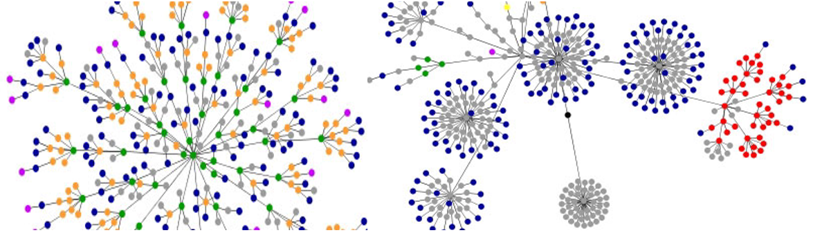

portfolio data requirements
================

<small>   <i>dennisyang.com DOM graph</i> by Dennis Yang is licensed
under <a href="https://creativecommons.org/licenses/by/2.0/">CC BY
2.0</a>    </small>

Many R packages include bundled data to help one learn about the package
functionality. Such data, while excellent for practice, are generally
unsuitable for portfolio displays because they have been “tamed”—much of
the work of creating an effective graph (and therefore much of the
learning in the course) is in obtaining data “in the wild” and
performing the necessary data carpentry to tame it yourself.

An exception can be made for *R data packages* such as the
[midfielddata](https://midfieldr.github.io/midfielddata/) package where
the *package is the source*, that is, the package provides public access
to data that is otherwise unavailable.

| requirements                                                | descriptions and tutorials                                                        | quantitative  | categorical   |
| :---------------------------------------------------------- | :-------------------------------------------------------------------------------- | :------------ | :------------ |
| [D1 distributions](#d1-distributions)                       | [strip plot](cm202-graph-strip-plot.md#strip-plot)                                | one           | one or two    |
|                                                             | [box plot](cm203-graph-boxplot.md#box-plots)                                      | one           | one or two    |
| [D2 multiway](#d2-multiway)                                 | [multiway](cm204-graph-multiway.md#multiway-dot-plot)                             | one           | two           |
| [D3 correlations](#d3-correlations)                         | [scatterplot](cm205-graph-scatterplot.md#scatterplot)                             | two           | one or two    |
| [D4 injuries or fatalities](#d4-injuries-or-fatalities)     | [dot plot](cm206-graph-dot-plot.md#dot-plot)                                      | one           | one or more   |
|                                                             | [line graph](cm207-graph-line-graph.md#line-graph)                                | two           | optional      |
|                                                             | [scatterplot](cm205-graph-scatterplot.md#scatterplot)                             | two           | optional      |
| [D5 redesign a graphical lie](#d5-redesign-a-graphical-lie) | [dot plot](cm206-graph-dot-plot.md#dot-plot)                                      | one           | optional      |
|                                                             | [line graph](cm207-graph-line-graph.md#line-graph)                                | two           | optional      |
|                                                             | [scatterplot](cm205-graph-scatterplot.md#scatterplot)                             | two           | optional      |
| [D6 multivariate](#d6-multivariate)                         | [scatterplot matrix](cm209-graph-scatterplot-matrix.md#scatterplot-matrix)        | four or more  | one optional  |
|                                                             | [parallel coordinate](cm210-graph-parallel-coord.md#parallel-coordinate)          | four or more  | one optional  |
|                                                             | [conditioning plot](cm208-graph-conditioning-plot.md#conditioning-plot)           | three or four | none          |
| [D7 learn a display](#d7-learn-a-display)                   | [cycle plot](cm211-graph-learn-a-display.md#cycle-plot)                           | one           | time          |
|                                                             | [multivariate bar](cm211-graph-learn-a-display.md#multivariate-bar)               | two           | three or more |
|                                                             | [financial (OHLC) plot](cm211-graph-learn-a-display.md#financial-OHLC-plot)       | four          | time          |
|                                                             | [diverging stacked bar](cm211-graph-learn-a-display.md#diverging-stacked-bar)     | one           | two           |
|                                                             | [micromap](cm211-graph-learn-a-display.md#micromap)                               | one or two    | two or one    |
|                                                             | [proportional symbol map](cm211-graph-learn-a-display.md#proportional-symbol-map) | one           | one           |
|                                                             | [dot density map](cm211-graph-learn-a-display.md#dot-density-map)                 | one           | one           |

## D1 distributions

Univariate data are measurements of a single quantitative variable. The
data can be separated into groups by a categorical variable, creating
one distribution for each level of the category for comparison.

We will use two prospective graph designs for comparing distributions.
Include only one of these graph types in your portfolio. Select the
design that best conveys the stories in your data.

Data requirements

  - Minimum 200 observations of one quantitative variable  
  - One or two categorical variables  
  - Time is excluded as a variable

Categorical variables

  - If one category is used, it must have at least three levels for a
    minimum of three comparisons.  
  - If two categories are used, they must have at least two levels each
    for a minimum of four comparisons.

Tutorials and samples

  - [Strip plot tutorial](cm202-graph-strip-plot.md#strip-plot)
  - [Sample strip plot: Speed
    skiing](../figures/0302-strip-plot-speedski.png)
  - [Box plot tutorial](cm203-graph-boxplot.md#box-plots)
  - [Sample box plot: Nontraditional students graduation
    rates](../figures/0303-boxplot-nontrad.png)

  <a href="#top">▲ top of page</a>

## D2 multiway

The distinguishing characteristic of multiway data is that there is a
quantitative value associated with every combination of levels of two
independent categorical variables.

  - 2019: For those students who discussed it with me in lab, we will
    accept time as an ordinal categorical variable in a multiway graph  
  - 2020: Time as a categorical variable: Though time can be considered
    an ordinal categorical variable, time series data are more commonly
    displayed using line graphs or spark charts where the dots can be
    connected. We would not expect to connect the dots in a multiway
    graph, thus we avoid using date and time as one of the two
    independent categories.

Graph both the original multiway and its dual (swapping rows and
panels). Include only one of these graphs in your portfolio. Select the
design that best conveys the stories in your data.

Data requirements

  - One quantitative variable with a minimum of 24 observations
  - Two independent categorical variables with minimum numbers of levels
    as follows
      - 3 levels in category 1 and at least 8 levels in category 2
      - 4 levels in category 1 and at least 6 levels in category 2  
      - 5 levels in category 1 and at least 5 levels in category 2

Tutorials and samples

  - [Multiway tutorial](cm204-graph-multiway.md#multiway-dot-plot)
  - [Sample multiway: NY population, panels by
    county](../figures/0402-multiway-metropop-01.png)
  - [Sample multiway: NY population, panels by
    race/ethnicity](../figures/0402-multiway-metropop-02.png)

  <a href="#top">▲ top of page</a>

## D3 correlations

A two-dimensional scatterplot reveals the strength of the relationship
between two quantitative variables. When you condition on a categorical
variable try two approaches and select the design that communicates most
effectively.

  - map the levels to data marker color or shape all in one panel
  - use the categorical variable as the facet argument with one panel
    for each level

Data requirements

  - Minimum 100 observations  
  - Two quantitative variables  
  - One or two categorical variables
  - Time is excluded as a variable

Categorical variables

  - The first category must have at least 5 levels.  
  - If a second category is used, it must have at least two levels.

Tutorials and samples

  - [Scatterplot tutorial](cm205-graph-scatterplot.md#scatterplot)
  - [Sample scatterplot: 2012 Summer Olympic athlete height and
    weight](../figures/0503-scatterplot-oly12.png)

  <a href="#top">▲ top of page</a>

## D4 injuries or fatalities

The data must convey information about human ailments, injuries or
fatalities similar to the data in *Cruel Pies* (Dragga and Voss,
[2001](#ref-Dragga+Voss:2001)). Consult with me on your data
selection—the graph type depends on the data. Finding a “cruel pie” in
a publication and redesigning it is an acceptable submission.

If you redesign a published graph, include the original in your
portfolio and discuss its shortcomings in your critique. The redesigned
graphs are often dot plots or line graphs (especially for time series).

Data requirements

  - Minimum 20 observations  
  - One quantitative variable conveying information about human injury
    or fatality  
  - One or two categorical variables, one of which can be time (time
    series)  
  - If you display a time series, consider whether or not the
    quantitative variable should be normalized. For example, graphing
    injuries per capita may be more truthful than graphing the raw
    number of injuries.

Tutorials and samples

  - [Dot plot tutorial](cm206-graph-dot-plot.md#dot-plot)  
  - [Sample dot plot: US infant
    mortality](../figures/0602-dotplot-cdc-infants-2.png)  
  - [Line graph tutorial](cm207-graph-line-graph.md#line-graph)  
  - [Sample bar graph: Borderline personality
    disorder](../resources/bipolar-disorder-bar-chart.png) and the most
    common co-occurring disorders. One quantitative variable, one
    categorical variable with 8 levels, 8 observations, one of which has
    a range (self-injury, 55–85%).

  <a href="#top">▲ top of page</a>

## D5 redesign a graphical lie

Sources

  - The original graph that you redesign must not be one that has been
    used in class or by other data journalists or data scientists to
    illustrate deceptive data graphics.
  - In recent years, Republicans and Fox News have used deceptive graphs
    with incredible frequency. There are websites devoted to the
    subject. If anyone finds a deceptive graph from the left, I would
    appreciate a link.  
  - Advertising is a good source
  - The tobacco industry and fossil fuel industry (climate-change
    deniers) are all good sources for cherry-picking data, incorrect
    representation, and using the wrong data
  - Politicians are a good source for graphs that pander to their
    audience’s biases
  - Consider reviewing data graphics in your discipline’s publications
    for any of the offenses described by Alberto Cairo’s taxonomy
    (below).

Use Alberto Cairo’s taxonomy (from his
[talk](https://www.youtube.com/watch?v=Cd046xZhO_8&t=21m29s)) to
classify the original offense(s). The original data display lies by:

  - pandering to our expectations or biases
  - using the wrong data
  - showing an inappropriate amount of data, either too little or too
    much
  - representing the data incorrectly
  - suggesting spurious patterns or fails to reveal crucial ones
  - concealing or confuses uncertainty

Data requirements

  - Minimum 20 observations  
  - One or two quantitative variables  
  - Categories are optional, depending on the data

Tutorials

  - [Beware Simpson’s
    paradox](cm405-rhetoric-correcting-graphical-lies.md#beware-simpsons-paradox)
  - [Adjust for
    inflation](cm405-rhetoric-correcting-graphical-lies.md#adjust-for-inflation)
  - [Adjust for
    population](cm405-rhetoric-correcting-graphical-lies.md#adjust-for-population)

The graph type depends on the data structure. Any of the basic chart
types might be appropriate.

  - [Strip plot](cm202-graph-strip-plot.md#strip-plot)  
  - [Box plot](cm203-graph-boxplot.md#box-plot)  
  - [Multiway](cm204-graph-multiway.md#multiway-dot-plot)
  - [Scatterplot](cm205-graph-scatterplot.md#scatterplot)
  - [Dot plot](cm206-graph-dot-plot.md#dot-plot)  
  - [Line graph](cm207-graph-line-graph.md#line-graph)

Read my blog post, [Another look at a misleading
graph](http://www.graphdoctor.com/archives/1248), as an example of the
type of critique that I expect.

  <a href="#top">▲ top of page</a>

## D6 multivariate

We use the term *multivariate* for data comprising 3 or more
quantitative variables per observation. We use three graph designs for
exploring multivariate data. In your portfolio, only one of these graphs
is required.

  - scatterplot matrix
  - parallel coordinate plot
  - conditioning plot

Data requirements

  - Minimum 20 observations  
  - Three or more quantitative variables  
  - Time is excluded as a variable  
  - Categorical variables are possible, depending on the graph type.

Selecting a chart type

  - In general, try to minimize the use of categorical variables. These
    graphs types are most effective with multivariate, quantitative,
    continuous data with at most one categorical variable assigned to
    the color aesthetic.
  - Always start the exploration using a scatterplot matrix to look for
    pair-wise correlations, see how each variable is distributed, and
    look for patterns.  
  - If you have multiple categorical variables, use a scatterplot matrix
    function that can handle categorical variables.
  - After the initial exploration, if you have no categorical variables
    no more than 4 quantitative variables, try a conditioning plot.
    Co-plots are especially easy for technical audiences to grasp.
  - On the other hand, if you do have categorical variables and/or 3, 4,
    or more quantitative variables, try the parallel coordinate plot as
    the next exploration. One categorical variable can be assigned to
    the color aesthetic to group the data.
  - If you have more than one categorical variable, use one as above and
    plot the others along with the quantitative variables.

Tutorials

  - [Scatterplot
    matrix](cm209-graph-scatterplot-matrix.md#scatterplot-matrix)  
  - [Parallel
    coordinate](cm210-graph-parallel-coord.md#parallel-coordinate)  
  - [Conditioning
    plot](cm208-graph-conditioning-plot.md#conditioning-plot)

  <a href="#top">▲ top of page</a>

## D7 learn a display

This is a graph type you learn to construct on your own. Select one only
from the list and include it in the portfolio.

Requirements listed below

  - [cycle plot requirements](#cycle-plot-requirements)  
  - [multivariate bar requirements](#multivariate-bar-requirements)  
  - [financial (OHLC) plot
    requirements](#financial-ohlc-plot-requirements)  
  - [diverging stacked bar
    requirements](#diverging-stacked-bar-requirements)  
  - [micromap requirements](#micromap-requirements)  
  - [proportional symbol map
    requirements](#proportional-symbol-map-requirements)  
  - [dot density map requirements](#dot-density-map-requirements)

  <a href="#top">▲ top of page</a>

## cycle plot requirements

Data requirements

  - Minimum 100 observations  
  - One quantitative variable  
  - One categorical variable: time
  - Optional second categorical variable with two levels (or more)

Graph requirements

  - The period used to create the cycle plot depends on the data. Years,
    months, weeks, days, or hours may be the appropriate cycle depending
    on the data.  
  - Show the original time series as a line graph so that we can see the
    cyclic nature of the data, then display the cycle plot, and discuss
    your rationale for the period you selected.

Examples

  - [Cycle plot](cm211-graph-learn-a-display.md#cycle-plot) examples and
    resources

  <a href="#top">▲ top of page</a>

## multivariate bar requirements

Data requirements

  - Minimum 20 observations  
  - Two quantitative variables, for example, number and percentage  
  - Three categorical variables, one with 5 levels or more

Examples

  - [Multivariate bar](cm211-graph-learn-a-display.md#multivariate-bar)
    examples and resources

  <a href="#top">▲ top of page</a>

## financial (OHLC) plot requirements

Data requirements

  - The number of observations depends on the time interval: every day
    for a year (365 observations), every week for five years (260
    observations), or every month for 20 years (240 observations)
  - Four quantitative variables: open, high, low, closing price  
  - One categorical variable: time
  - Price must be adjusted for inflation

Examples

  - [Financial (OHLC)
    plot](cm211-graph-learn-a-display.md#financial-OHLC-plot) examples
    and resources

  <a href="#top">▲ top of page</a>

## diverging stacked bar requirements

Data requirements

  - Likert-like survey data
  - One quantitative variable: frequency of each response
  - One categorical variable: Seven survey questions minimum
  - The second categorical variable: Ordered, mutually exclusive
    response terms (4 minimum) such as Strongly Agree, Agree, Disagree,
    Strongly Disagree
  - 100 respondents minimum
  - Optional: a third categorical variable whose levels form the survey
    questions into groups
  - Optional: Showing the number of responses to each question

Examples

  - [Diverging stacked
    bar](cm211-graph-learn-a-display.md#diverging-stacked-bar) examples
    and resources

  <a href="#top">▲ top of page</a>

## micromap requirements

Data requirements

  - 50 observations minimum
  - Geographic regions can be at any level you choose, e.g., city,
    county, state, province, region, country, etc.
  - Two quantitative variables minimum if geographic region is the only
    categorical variable
  - One quantitative variable if you have at least one additional
    categorical variable in addition to geographic region

Examples

  - [Micromap](cm211-graph-learn-a-display.md#micromap) examples and
    resources

  <a href="#top">▲ top of page</a>

## proportional symbol map requirements

Data requirements

  - 200 observations  
  - Geographic regions can be at any level you choose, e.g., city,
    county, state, province, region, country, etc.
  - One quantitative variable
  - One categorical variable with 5 or more levels

Examples

  - [Proportional symbol
    map](cm211-graph-learn-a-display.md#proportional-symbol-map)
    examples and resources

  <a href="#top">▲ top of page</a>

## dot density map requirements

Data requirements

  - 1000 observations  
  - Geographic regions can be at any level you choose, e.g., city,
    county, state, province, region, country, etc.
  - One quantitative variable or count, e.g., one dot represents one
    vote, one dot represents 100 people, etc.
  - One categorical variable with 3 or more levels

Examples

  - [Dot density map](cm211-graph-learn-a-display.md#dot-density-map)
    examples and resources

  <a href="#top">▲ top of page</a>

## references

Dragga S and Voss D (2001) Cruel pies: The inhumanity of technical
illustrations. *Technical Communication* **48**(3), 265–274

Wickham H and Grolemund G (2017) *R for Data Science.* O’Reilly Media,
Inc., Sebastopol, CA <https://r4ds.had.co.nz/>

***
<a href="#top">&#9650; top of page</a>    
[&#9665; calendar](../README.md#calendar)    
[&#9665; index](../README.md#index)
