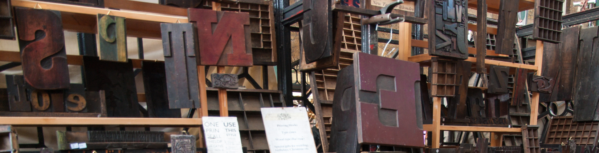

document design
================

 <small> <br>
<i>Wood and metal type</i> licensed under
<a href="https://creativecommons.org/licenses/by-sa/2.0/">CC BY-SA
2.0</a> <br> </small>

Document design, whether for the printed page or the Internet, is a
highly personal matter of taste and purpose. Here I give some general
advice for formatting your online portfolio.

The first principle is that all document design choices (fonts,
headings, color, etc.) should be consistently applied on every page.

## contents

[media](#media)  
[fonts](#fonts)  
[headings](#headings)  
[text color](#text-color)  
[emphasis](#emphasis)  
[hyphens and dashes](#hyphens-and-dashes)

## media

Your portfolio is a website in the form of a GitHub repository. The repo
is private, accessible only to people you invite as collaborators.
However, your intended audience are your professional peers and
prospective employers.

[This sample](https://github.com/graphdr/portfolio-sample) shows the
basic layout.

## fonts

For a visual comparison of fonts with and without (sans) serifs, see
these articles:

  - [Serif vs sans serif
    fonts](https://about.easil.com/support/serif-vs-sans-serif/)  
  - [What’s the difference between serif and sans-serif
    fonts?](https://www.cdgi.com/2016/09/serif-vs-sans-serif-fonts/)

#### sans serif is the GitHub default

The default font for a `github_document` output is sans serif—like the
font used on this page. That’s what we’ll use for your portfolio.

#### use serif for printed documents

Use a serif font if you produce a printed version of your portfolio.

  - One approach is to [install TeX](https://miktex.org/) on your
    machine and change the YAML header output type to `pdf_document`.  
  - A second approach is to use `word_document` output and [use a style
    file](https://rmarkdown.rstudio.com/articles_docx.html) to assign a
    serif font.

<br> <a href="#top">▲ top of page</a>

## headings

In these course documents, my personal style preference is for lowercase
headings except for proper nouns. In general, however, I suggest you use
“sentence case” even in headings, capitalizing only the first word and
proper nouns.

Other than the title, plan on having two levels of headings only. For a
`github_document`, my personal preferences are:

  - `# level-1 heading` for titles only  
  - `## level-2 heading` for section headings  
  - `#### level-4 heading` for subsections  
  - <span style="color:darkgoldenrod"> `accented text` </span> can be a
    third level if needed

## text color

Rmd does not have a built-in method for creating color text. Often, if
Rmd lacks a markup feature, we can write short chunks of HTML markup.
However, GitHub [aggressively
sanitizes](https://github.com/github/markup/tree/master#html-sanitization)
HTML markup, allowing only a limited number of HTML elements and
attributes—and text color is not one of them.

Thus you cannot color plain text in a GitHub .md file.

On the other hand, GitHub .md files are rendered with colored text for
[links](cm304-report-document-design.md#headings) and for code syntax
highlighting, e.g.,

``` r
ggplot(data = gapminder, mapping = aes(x = gdpPercap, y = lifeExp)) +
        geom_smooth(size = 2) +
        labs(x = "GDP per capita", y = "Life expectancy (years)")
```

<br> <a href="#top">▲ top of
page</a>

## emphasis

| format               | usage                                                                                                    |
| :------------------- | :------------------------------------------------------------------------------------------------------- |
| *italic*             | Useful for serif fonts. Less useful for sans serif fonts which have only a *mild slant* when italicized. |
| **bold**             | Useful for both serif and sans serif fonts. Often used (as in this document) to emphasize headings.      |
| <ins>underline</ins> | Underlining is a relic of the typewriting era and is no longer used for emphasis.                        |
| ALL CAPS             | Capitalization is emphatic, but should be avoided because it tends to convey anger or aggression.        |

  - **Bold** and *italic* are usually mutually exclusive.
  - **If everything is emphasized, then nothing is emphasized. Use bold
    and italic as little as
possible**.

## hyphens and dashes

| type | usage                                                                                                                                     |
| :--- | :---------------------------------------------------------------------------------------------------------------------------------------- |
| \-   | hyphen: For compound words such as ‘first-year’ or for numbers that do not span, e.g., phone numbers 1-812-555-8900 or dates 2019-01-23.  |
| –    | en-dash: Created in Rmd with two hyphens `--`, designates an inclusive span, e.g., July 9–August 17 or pages 37–59.                       |
| —    | em-dash: Created in Rmd with three hyphens `---`, punctuation that can replace commas, parentheses, or colons, creating greater emphasis. |

Examples of punctuation using an em-dash:

> And yet, when the car was finally delivered—nearly three months after
> it was ordered—she decided she no longer wanted it.

> Upon discovering the errors—all 124 of them—the publisher immediately
> recalled the books.

> The white sand, the warm water, the sparkling sun—this is what brought
> them to Hawaii.

## references

<div id="refs">

<div id="ref-Baker:2001">

Baker WH (2001) Guide to Document Design. <http://tinyurl.com/y3p6dxv3>

</div>

<div id="ref-House+Layton+Livingston+Moseley:2017">

House R, Layton R, Livingston J and Moseley S (2017) *The Engineering
Communication Manual.* Oxford University Press, New York, NY
<http://tinyurl.com/y3f2k8s5>

</div>

<div id="ref-Penn:2018">

Penn J (2018) The Punctuation Guide.
<http://www.thepunctuationguide.com/hyphen-and-dashes.html>

</div>

<div id="ref-Tufte:2018">

Tufte E (2018) Book design: advice and examples.
<https://www.edwardtufte.com/bboard/q-and-a-fetch-msg?msg_id=0000hB>

</div>

</div>

***
<a href="#top">&#9650; top of page</a>    
[&#9665; calendar](../README.md#calendar)    
[&#9665; index](../README.md#index)
