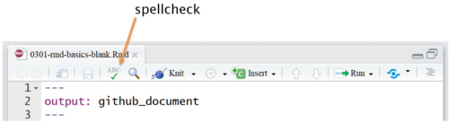

R markdown basics
================


<small> <br> <i>R Markdown flow</i> by RStudio from the
<a href="https://rmarkdown.rstudio.com/authoring_quick_tour.html">R
Markdown quick tour</a>. <br> </small>

## contents

[prerequisites](#prerequisites)  
[create an Rmd script](#create-an-rmd-script)  
[set the Rmd output format](#set-the-rmd-output-format)  
[how to format text](#how-to-format-text)  
[initialize a report](#initialize-a-report)  
[initialize knitr](#initialize-knitr)  
[introductory prose](#introductory-prose)  
[using code chunks](#using-code-chunks)  
[source R scripts](#source-r-scripts)  
[data table](#data-table)  
[include graphics](#include-graphics)  
[spell check](#spell-check)

## prerequisites

  - Start every work session by launching `portfolio.Rproj`  
  - Your [project directory
    structure](cm501-proj-m-manage-files.md#plan-the-directory-structure)
    satisfies the course requirements

If any of these packages have not yet been installed, they can be
installed using these commands,

    install.packages("knitr")
    install.packages("png")

## create an Rmd script

From RStudio, create a new R Markdown file *File \> New File \> R
Markdown…*

In the dialog box, leave all the default settings for now, select *OK*.

An untitled R Markdown file is created. Use *File \> Save As…* to save
the file to your `explore` directory with the filename

    explore/0301-rmd-basics-explore.Rmd

The Rmd script contains three types of content:

1.  A YAML header surrounded by dashes `---`
2.  Text mixed with simple text formatting like `# heading` and
    `_italics_`
3.  Chunks of R code surrounded by backticks ` ``` `


<br>To render the document, click the *Knit* button or use the pulldown
menu, *Knit \> Knit to HTML*


<br>The report appears in your RStudio viewer.


## set the Rmd output format

The header or front matter is in YAML (YAML Ain’t Markup Language)
syntax. The YAML header specifies how the file is rendered. The default
YAML is this:

``` yaml
---
title: "Untitled"
output: html_document
---
```

The knit pulldown menu shows three basic document types: HTML, PDF, and
Word. We won’t be using any of these regularly, but it is handy to know
they exist,

  - HTML is handy for draft documents viewed onscreen locally  
  - PDFs can only be created if you have TeX installed  
  - Word is very useful for collaborating with non-R users, but it
    requires that you have Word installed on your machine

We’ll be using a markdown variant specifically design to be used with
GitHub because that’s where you will post your portfolio. Change the
title to “Test Report” and the output type to `github_document`, then
knit,

``` yaml
---
title: "Test report"
output: github_document
---
```

The report appears in your RStudio viewer.


<br>If you take another look at the knit pulldown menu, its options have
changed.

## how to format text

Prose in Rmd files is plain text with markup syntax from Markdown to
produce

  - section headings
  - italic text
  - bold text
  - code text
  - superscripts and subscripts
  - lists
  - URL links

The default Rmd document, for example, illustrates several of these
markups,


<br> For the complete list of common markups, please read

  - [Text formatting with
    Markdown](https://r4ds.had.co.nz/r-markdown.html#text-formatting-with-markdown)
    \[@Wickham+Grolemund:2017\]

You may also wish to bookmark the RStudio cheat sheet for future
reference:

  - [R Markdown cheat
    sheet](https://www.rstudio.com/wp-content/uploads/2016/03/rmarkdown-cheatsheet-2.0.pdf)

For a preview of our course guidelines on text formatting and
punctuation, see

  - [Document design](cm304-report-document-design.md#document-design)

## initialize a report

To initialize a new Rmd script, we delete most of the default text, add
the author name and date, and assign settings to control code chunk
behavior.

In the `explore/0301-rmd-basics-explore.Rmd` file,

  - Delete everything below the YAML header
  - Knit

The output should show a title only. If you prefer to place author and
date fields inside the YAML header,

``` yaml
---
title:  "Test Report"
author: "Author Name"
date:   "yyyy-mm-dd"
output: github_document
---
```

If you prefer to place author and date fields outside the YAML header,
just add them as the first two lines. To ensure the two lines are
separate, each line must end with two spaces, i.e., “Author
Name”

``` yaml
---
title:  "Test Report"
output: github_document
---

Author Name  
yyyy-mm-dd  
```

The date can be automatically updated using the `Sys.time()` function.
If inside the YAML header, replace the date with an inline code chunk
surrounded by single quotes,

``` yaml
---
title:  "Test Report"
author: "Author Name"
date:   '`r format(Sys.time(), "%Y-%m-%d")`'
output: github_document
---
```

If outside the header, use the inline code chunk without the single
quotes,

``` yaml
---
title:  "Test Report"
output: github_document
---

Author Name  
`r format(Sys.time(), "%Y-%m-%d")`
```

  - Make appropriate changes to the name and date of your Test Report.
  - Knit and confirm the result is what you expect.

## initialize knitr

After the YAML header, name, and date, we usually insert an initial R
code chunk to assign settings that control the behavior of later code
chunks in the document.

Insert an R code chunk using either

  - the `Ctrl-Alt-I` keyboard shortcut, or  
  - the pulldown menu *Insert \> R*

An empty code chunk appears

    ```{r}
    
    ```

Edit the code chunk header to prevent the code from being printed
(“echoed”) in the output document.

    ```{r echo = FALSE}

Inside the code chunk, add these lines

``` r
library("knitr")  
opts_knit$set(root.dir = "../")  
opts_chunk$set(echo = FALSE)  
```

What the code does:

  - loads the knitr library
  - sets the knitr working directory one level up  
  - prevents subsequent code chunks from being printed in the output
    document (For a complete listing of chunk options, see [Chunk
    options](https://r4ds.had.co.nz/r-markdown.html#chunk-options)
    \[@Wickham+Grolemund:2017\].)

By setting the knitr working directory one level up, we match the
behavior of plain R scripts for which the working directory is always
the RStudio project directory. Thus all relative file paths in an Rmd
script are with respect to the project directory just as they are in
plain R scripts, permitting us to run all the R code in an Rmd file
without knitting.

Every time you start a new Rmd script, the initial file should look
something like this if you prefer name and date outside the header


<br>As always, having added a few lines to the report, knit to check
that the output is what you expect.

## introductory prose

Typically the next entry in the Rmd document is the prose that begins
your report. You might start with a heading, for example,

``` 
## Introduction   
```

followed by prose that gives the reader an overview of the graph,

    This display illustrates the distribution of speeds attained by skiers
    in three downhill events in the 2012 Olympic Winter Games disaggregated
    by sex. 

For the benefit of your instructor, the next section addresses the
display data requirements and document requirements.

    ## Requirements 
    
    This display meets the data requirements for D1 distributions
    
    - 250 observations 
    - One quantitative variable (speed) 
    - Two categorical variables: sex (2 levels) and event (3 levels)  
    
    This display also meets the following document requirements 
    
    - sports data limit (this display is one of two) 

In the list of document requirements, you would only include relevant
items. Possible document requirements include your technical discipline,
graph redesigns, a compelling story, etc., as described in [Portfolio
document
requirements](cm300-report-portfolio-reqts.md#portfolio-document-requirements).

If you choose to make your portfolio public at the end of the course,
you might want to delete the “Requirements” section.

For practice, add the Introduction and Requirements sections to your Rmd
file and knit.

## using code chunks

Code chunks are interwoven with your text prose in an Rmd document. When
you knit the document, knitr executes the code chucks and places the R
code output in the .md file along with your prose.

We will use Rmd code chunks to:

  - to write and run small scripts
  - to run R scripts using `source()`
  - to import images using `include_graphics()`

For example, add a code chunk to your explore file

    ```{r}
    
    ```

In the code chunk, add the following lines to load a small data set,

``` r
# in a code chunk in your Rmd file 
data(starwars, package = "dplyr")

# examine it
glimpse(starwars)
```

    #> Observations: 87
    #> Variables: 13
    #> $ name       <chr> "Luke Skywalker", "C-3PO", "R2-D2", "Darth Vader", "Leia...
    #> $ height     <int> 172, 167, 96, 202, 150, 178, 165, 97, 183, 182, 188, 180...
    #> $ mass       <dbl> 77.0, 75.0, 32.0, 136.0, 49.0, 120.0, 75.0, 32.0, 84.0, ...
    #> $ hair_color <chr> "blond", NA, NA, "none", "brown", "brown, grey", "brown"...
    #> $ skin_color <chr> "fair", "gold", "white, blue", "white", "light", "light"...
    #> $ eye_color  <chr> "blue", "yellow", "red", "yellow", "brown", "blue", "blu...
    #> $ birth_year <dbl> 19.0, 112.0, 33.0, 41.9, 19.0, 52.0, 47.0, NA, 24.0, 57....
    #> $ gender     <chr> "male", NA, NA, "male", "female", "male", "female", NA, ...
    #> $ homeworld  <chr> "Tatooine", "Tatooine", "Naboo", "Tatooine", "Alderaan",...
    #> $ species    <chr> "Human", "Droid", "Droid", "Human", "Human", "Human", "H...
    #> $ films      <list> [<"Revenge of the Sith", "Return of the Jedi", "The Emp...
    #> $ vehicles   <list> [<"Snowspeeder", "Imperial Speeder Bike">, <>, <>, <>, ...
    #> $ starships  <list> [<"X-wing", "Imperial shuttle">, <>, <>, "TIE Advanced ...

Anything you can do in an R script can be written into an Rmd code
chunk, for example,

``` r
# in a code chunk in your Rmd file 
starwars %>% 
    select(films) %>% 
    unlist() %>% 
    unique()
```

    #> [1] "Revenge of the Sith"     "Return of the Jedi"     
    #> [3] "The Empire Strikes Back" "A New Hope"             
    #> [5] "The Force Awakens"       "Attack of the Clones"   
    #> [7] "The Phantom Menace"

Or,

``` r
# in a code chunk in your Rmd file 
starwars_worlds <- starwars %>% 
    filter(!is.na(homeworld)) %>% 
    select(homeworld) %>% 
    count(homeworld) %>% 
    filter(n > 1) %>% 
    mutate(homeworld = fct_reorder(homeworld, n))

ggplot(starwars_worlds, aes(x = n, y = homeworld)) +
    geom_point(size = 1.5) +
    labs(x = "Character count (for N > 1)", 
       y = "", 
       title = "Home worlds of Star Wars characters") + 
    scale_x_continuous(breaks = seq(from = 2, to = 10, by = 2)) +
    theme_graphclass()
```


## source R scripts

In your portfolio reports, you should generally not be writing extensive
R code in code chunks. Instead, your R code that operates on data or
creates graphs will be in stand-alone R scripts.

To enhance reproducibility, those scripts will be run from your Rmd
scripts using the `source()` function.

For example, during the data studio ([Interacting with
R](cm101b-interacting-with-R.md#interacting-with-R)) you were asked to
create the R script `explore/0204-more-R-basics-explore.R`. If that file
exists, you can run it from the Rmd file.

In your Rmd script, add a new code chunk for the following code,

``` r
# code chunk in your Rmd file 
source("explore/0204-more-R-basics-explore.R")
```

Knit the file, the R script runs, creating the data frame `df` that is
now in your workspace. You can glimpse it,

``` r
# code chunk in your Rmd file  
glimpse(df)
```

    #> Observations: 21
    #> Variables: 2
    #> $ x1 <dbl> 0.0, 0.5, 1.0, 1.5, 2.0, 2.5, 3.0, 3.5, 4.0, 4.5, 5.0, 5.5, 6.0,...
    #> $ y1 <dbl> 0.00000000, 0.47942554, 0.84147098, 0.99749499, 0.90929743, 0.59...

and graph it,

``` r
# code chunk in your Rmd file 
ggplot(df, aes(x = x1, y = y1)) +
    geom_point() +
    geom_line()
```


R code can be in one code chunk or many code chunks in your Rmd script.

## data table

If you think your audience would like to see a table of the data to
accompany the graph, the simplest approach is to use `knitr::kable`.

Add a code chunk with `kable()`

``` r
# code chunk in your Rmd file 
kable(starwars_worlds)
```

| homeworld |  n |
| :-------- | -: |
| Alderaan  |  3 |
| Corellia  |  2 |
| Coruscant |  3 |
| Kamino    |  3 |
| Kashyyyk  |  2 |
| Mirial    |  2 |
| Naboo     | 11 |
| Ryloth    |  2 |
| Tatooine  | 10 |

We almost always prefer the rows to be ordered other than
alphabetically, e.g.,

``` r
# code chunk in your Rmd file 
starwars_worlds %>% 
    arrange(desc(n)) %>% 
    kable()
```

| homeworld |  n |
| :-------- | -: |
| Naboo     | 11 |
| Tatooine  | 10 |
| Alderaan  |  3 |
| Coruscant |  3 |
| Kamino    |  3 |
| Corellia  |  2 |
| Kashyyyk  |  2 |
| Mirial    |  2 |
| Ryloth    |  2 |

Tidy data frames are generally too long for printing in full. For small
enough data sets, you can transform t hem from long (tidy) to wide
(untidy) for the convenience of the reader. For example, the `metro_pop`
data frame has 60 rows, too long to read comfortably,

``` r
library("graphclassmate")
kable(metro_pop)
```

| race   | county      | population |
| :----- | :---------- | ---------: |
| White  | Bronx       |     194000 |
| Latino | Bronx       |     645000 |
| Black  | Bronx       |     415000 |
| Asian  | Bronx       |      38000 |
| Others | Bronx       |      40000 |
| White  | Kings       |     855000 |
| Latino | Kings       |     488000 |
| Black  | Kings       |     845000 |
| Asian  | Kings       |     184000 |
| Others | Kings       |      93000 |
| White  | New York    |     703000 |
| Latino | New York    |     418000 |
| Black  | New York    |     233000 |
| Asian  | New York    |     143000 |
| Others | New York    |      39000 |
| White  | Queens      |     733000 |
| Latino | Queens      |     556000 |
| Black  | Queens      |     420000 |
| Asian  | Queens      |     392000 |
| Others | Queens      |     128000 |
| White  | Richmond    |     317000 |
| Latino | Richmond    |      54000 |
| Black  | Richmond    |      40000 |
| Asian  | Richmond    |      24000 |
| Others | Richmond    |       9000 |
| White  | Nassau      |     986000 |
| Latino | Nassau      |     133000 |
| Black  | Nassau      |     129000 |
| Asian  | Nassau      |      62000 |
| Others | Nassau      |      24000 |
| White  | Suffolk     |    1118000 |
| Latino | Suffolk     |     149000 |
| Black  | Suffolk     |      92000 |
| Asian  | Suffolk     |      34000 |
| Others | Suffolk     |      26000 |
| White  | Westchester |     592000 |
| Latino | Westchester |     145000 |
| Black  | Westchester |     123000 |
| Asian  | Westchester |      41000 |
| Others | Westchester |      23000 |
| White  | Rockland    |     205000 |
| Latino | Rockland    |      29000 |
| Black  | Rockland    |      30000 |
| Asian  | Rockland    |      16000 |
| Others | Rockland    |       6000 |
| White  | Bergen      |     638000 |
| Latino | Bergen      |      91000 |
| Black  | Bergen      |      43000 |
| Asian  | Bergen      |      94000 |
| Others | Bergen      |      18000 |
| White  | Hudson      |     215000 |
| Latino | Hudson      |     242000 |
| Black  | Hudson      |      73000 |
| Asian  | Hudson      |      57000 |
| Others | Hudson      |      22000 |
| White  | Passiac     |     252000 |
| Latino | Passiac     |     147000 |
| Black  | Passiac     |      60000 |
| Asian  | Passiac     |      18000 |
| Others | Passiac     |      12000 |

If the data are rearranged in wide form (untidy), the resulting data
table is better suited for print publication,

| county      |  Asian |  Black | Latino | Others |   White |
| :---------- | -----: | -----: | -----: | -----: | ------: |
| Bergen      |  94000 |  43000 |  91000 |  18000 |  638000 |
| Bronx       |  38000 | 415000 | 645000 |  40000 |  194000 |
| Hudson      |  57000 |  73000 | 242000 |  22000 |  215000 |
| Kings       | 184000 | 845000 | 488000 |  93000 |  855000 |
| Nassau      |  62000 | 129000 | 133000 |  24000 |  986000 |
| New York    | 143000 | 233000 | 418000 |  39000 |  703000 |
| Passiac     |  18000 |  60000 | 147000 |  12000 |  252000 |
| Queens      | 392000 | 420000 | 556000 | 128000 |  733000 |
| Richmond    |  24000 |  40000 |  54000 |   9000 |  317000 |
| Rockland    |  16000 |  30000 |  29000 |   6000 |  205000 |
| Suffolk     |  34000 |  92000 | 149000 |  26000 | 1118000 |
| Westchester |  41000 | 123000 | 145000 |  23000 |  592000 |

Data table transformations like this is a topic for another day. We will
cover it in the future.

## include graphics

Instead of the Markdown markup for importing images, we will usually use
the `include_graphics()` function from the knitr package.

For example, suppose we have `an_image_file.png` in the resources
directory. The Rmd file code chunk to import the image looks as follows,
where the `echo` argument in the header determines if the code chunk is
printed in the output and the `out.width` argument changes the size of
the image in the output document.

    ```{r echo = FALSE, out.width = "70%"}
    library(knitr)
    include_graphics("../resources/an_image.png")
    ```

**The file path argument for `include_graphics()` assumes that the
working directory is the Rmd file folder.** For us, this would usually
be the `explore/` or `reports/` directory. So our relative path argument
is composed of these elements: `../` to go up one level, `resources/` to
go down one level, and `an_image.png` to retrieve the file.

To see how it works, let’s obtain the R logo from the png package and
write it to the resources directory. To the tutorial Rmd script, add the
following heading.

    ## Try include_graphics()

Copy and paste the following into your Console (we only need to run this
once).

``` r
# run in your Console
library("png")
R_logo <- readPNG(system.file("img", "Rlogo.png", package = "png"))
writePNG(R_logo, target = "resources/Rlogo.png")
```

Check your resources directory. You should find it contains the R logo
PNG file. Now add an R code chunk to import the image and Knit.

    ```{r out.width = "10%"}
    # import an image from resources 
    library("knitr")
    
    ```

Your output document should now include the R logo.


## spell check

In RStudio, with the Rmd file open, press function F7 to spell check
your document.

Alternatively (there’s always more than one way to do things), you can
use the spellcheck button in the menu.



<br> Make spelling corrections, save, and knit.

## references

<div id="refs">

</div>

***
<a href="#top">&#9650; top of page</a>    
[&#9665; calendar](../README.md#calendar)    
[&#9665; index](../README.md#index)
