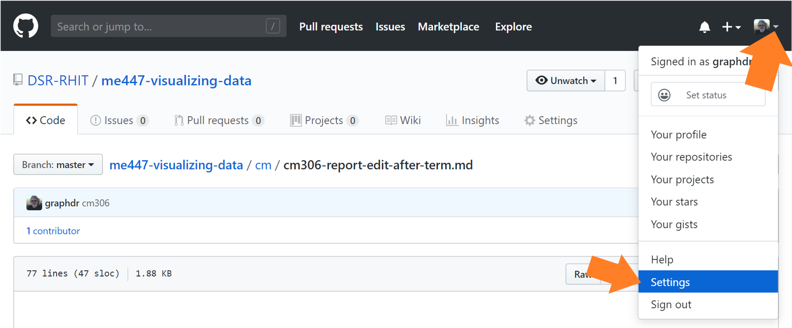
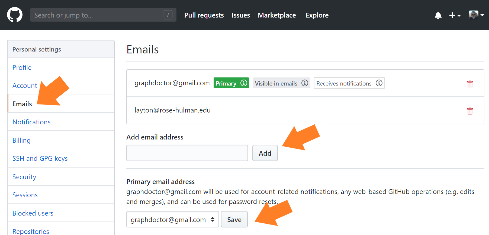
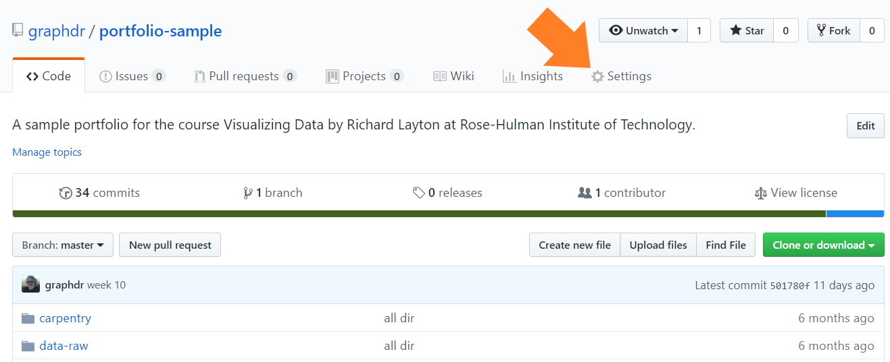
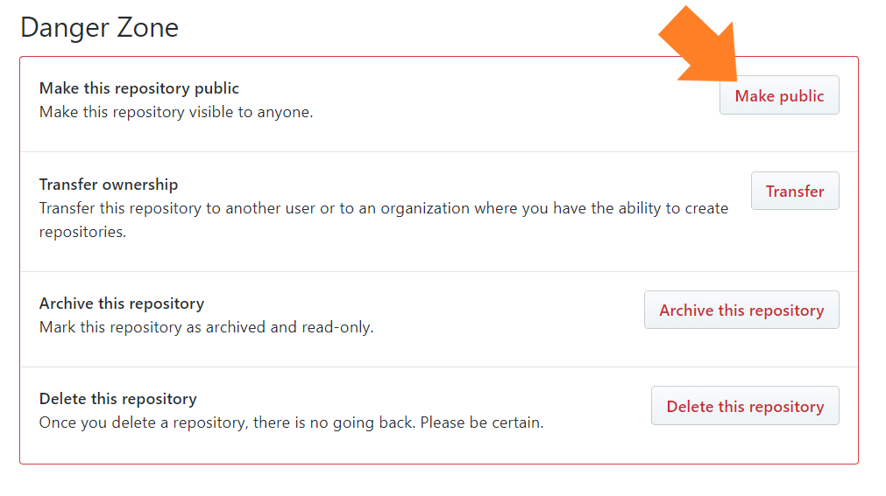
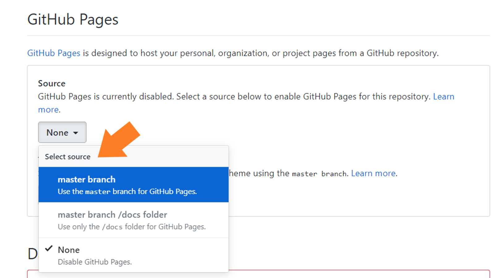
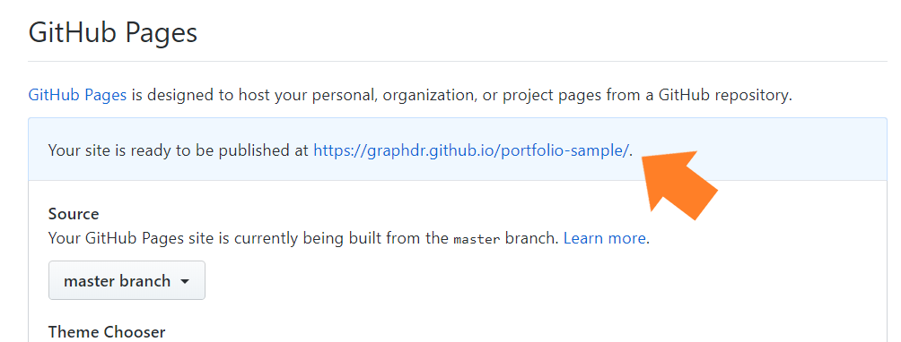

the portfolio after the term
================

## contents

[edit before publication](#edit-before-publication)  
[change your primary GitHub email](#change-your-primary-github-email)  
[make your portfolio public](#make-your-portfolio-public)  
[create a website](#create-a-website)  
[conclusion](#conclusion)

## edit before publication

At the end of the term, if you decide to make your portfolio public, you
may wish to

  - Delete the links to the reading and presentation discussions
  - Edit the README for a personalized layout
  - Edit the links to the displays to include only those you wish to
    showcase
  - Edit the portfolio to remove the D1, D2, etc designations that are
    there for my convenience
  - Edit the reports to remove the data and display requirements lists
    that are there for my convenience

Please wait to do any editing until after grades are turned in.

  <a href="#top">▲ top of page</a>

## change your primary GitHub email

If you are leaving Rose-Hulman, your Rose-Hulman email address will be
cancelled. But, you probably set up your portfolio repo using your RHIT
email address.

If you want to maintain the existence of your repo, you’ll have to
change your GitHub account primary email.

Wait until the term ends, otherwise I will lose access to your repo for
grading purposes. In practical terms, this means that you must wait
until I have truned grades in.

  - For graduating seniors, grades are turned in the Monday of finals
    week.
  - For every one else, grades are turned in the Tuesday after
    commencement.

After grades are turned in, but before your Rose email address goes
away, take these steps:

  - Navigate to your GitHub account  
  - In the upper right corner, use the account pull-down menu and select
    *Settings*

   

To change the email settings,

  - Select the *Emails* tab
  - Type a new email address and *Add*
  - Type the new address again in the *Priamry email address* box and
    *Save*
  - The new address should appear in the box above marked with the
    *Primary* tag 
  - If so, you can delete the RHIT address by clicking the trash icon
    

  <a href="#top">▲ top of page</a>

## make your portfolio public

If you decide to make your repo public and you have edited it,

0 

   

In the settings window, scroll down the the “Danger Zone” and click
*Make public.*

  <a href="#top">▲ top of page</a>

## create a website

This is optional.

You can also convert your public repo into a GitHub webpage.

  - Again, in the *Settings* window, scroll down to GitHub Pages  
  - Under the *Source* pull-down menu, select *Master branch*

   

In a short time, the URL of your website shows up with the form
`https://user_name.github.io/repo_name/`.

   

## conclusion

To conclude the course, I offer two additional short pages of final
thoughts

  - [Updating the R
    habitat](cm904-software-R-update.md#updating-the-r-habitat)
  - [Final thoughts](cm004-course-final-thoughts.md#final-thoughts)

***
<a href="#top">&#9650; top of page</a>    
[&#9665; calendar](../README.md#calendar)    
[&#9665; index](../README.md#index)
