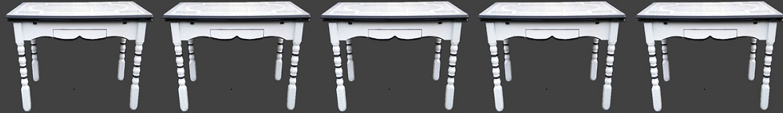

tables
================

 <small> <br>
<i>Mom’s Table</i> by Sara Shuman is licensed under
<a href="https://creativecommons.org/licenses/by/2.0//">CC BY 2.0</a>
<br> </small>

## contents

[introduction](#introduction)  
[prerequisites](#prerequisites)  
[edit the data frame for
readability](#edit-the-data-frame-for-readability)  
[informal tables](#informal-tables)  
[random sample](#random-sample)  
[kable with caption below table](#kable-with-caption-below-table)  
[kable with caption above table](#kable-with-caption-above-table)  
[selected subset](#selected-subset)  
[multiway data table](#multiway-data-table)  
[align columns](#align-columns)  
[stargazer tables](#stargazer-tables)  
[cells with images](#cells-with-images)  
[references](#references)

<!-- still on the to-do list -->

<!-- ## cells with multiple entries  -->

<!-- Like the table that indexes data sets used in tutorials  -->

<!-- ## cells with links  -->

<!-- Like the table that indexes data sets used in tutorials and links to the tutorials  -->

## introduction

We use tables to organize information for the benefit of our audience.
On the course repo, for example, I use tables to organize the [course
calendar](../README.md#calendar) and the [tutorial data
index](cm906-software-function-index.md#data). We can also use tables to
display the data underlying a graph or to display a statistical summary
of the data.

The RStudio [cheat sheet for R
Markdown](https://www.rstudio.com/wp-content/uploads/2016/03/rmarkdown-cheatsheet-2.0.pdf)
suggests three possible packages for creating tables: knitr, stargazer,
and xtable. Both knitr and stargazer produce table markups compatible
with `github_document` output; xtable produces nice tables in LaTeX or
HTML but its HTML output is not rendered particularly well by GitHub.

<br> <a href="#top">▲ top of page</a>

## prerequisites

Packages: Ensure you have installed the following packages. See [install
packages](cm902-software-studio.md#install-packages) for instructions if
needed.

  - [**tidyverse**](http://tidyverse.tidyverse.org): The ‘tidyverse’ is
    a set of packages that work in harmony because they share common
    data representations and ‘API’ design. This package is designed to
    make it easy to install and load multiple ‘tidyverse’ packages in a
    single step. Learn more about the ‘tidyverse’ at
    <https://tidyverse.org>.
  - [**graphclassmate**](https://github.com/graphdr/graphclassmate): An
    R package with companion materials for a course in data
    visualization. The package provides data sets structured for a
    variety of graph types plus a ggplot2 theme.  
  - [**xtable**](http://xtable.r-forge.r-project.org/): Coerce data to
    LaTeX and HTML tables.
  - [**knitr**](https://yihui.name/knitr/): Provides a general-purpose
    tool for dynamic report generation in R using Literate Programming
    techniques.
  - [**nycflights13**](http://github.com/hadley/nycflights13): Airline
    on-time data for all flights departing NYC in 2013. Also includes
    useful ‘metadata’ on airlines, airports, weather, and planes.
  - [**stargazer**](https://CRAN.R-project.org/package=stargazer):
    Produces LaTeX code, HTML/CSS code and ASCII text for well-formatted
    tables that hold regression analysis results from several models
    side-by-side, as well as summary statistics.

If you intend to run the code shown here as a tutorial, open a new Rmd
script in the explore directory

    explore/1003-tables-explore.Rmd

Start the report in the usual way,

    --- 
    title: Tables  
    author: name  
    date: date  
    output: github_document 
    --- 

Packages

``` r
library("tidyverse")  
library("graphclassmate")  
library("xtable")  
library("knitr")  
library("nycflights13")  
library("stargazer") 
```

In this explore Rmd file you may add prose as you wish. Type the
practice code into code chunks.

<br> <a href="#top">▲ top of page</a>

## edit the data frame for readability

Always start with a data frame.

I’m using the `tli` dataset (Math scores from Texas Assessment of
Academic Skills) from the xtable package. This dataset has 100
observations—probably too many to print in a table as-is. I explore
different ways to tabulate the data for a reader.

``` r
data(tli, package = "xtable")
df <- tli %>% 
        as_tibble() %>% 
        glimpse()
#> Observations: 100
#> Variables: 5
#> $ grade    <int> 6, 7, 5, 3, 8, 5, 8, 4, 6, 7, 3, 6, 8, 5, 8, 6, 4, 3,...
#> $ sex      <fct> M, M, F, M, M, M, F, M, M, M, M, F, M, M, F, F, M, F,...
#> $ disadvg  <fct> YES, NO, YES, YES, YES, NO, YES, YES, NO, YES, NO, NO...
#> $ ethnicty <fct> HISPANIC, BLACK, HISPANIC, HISPANIC, WHITE, BLACK, HI...
#> $ tlimth   <int> 43, 88, 34, 65, 75, 74, 72, 79, 88, 87, 79, 84, 90, 7...
```

For readability, tables should have words rather than acronyms or
abbreviations (as much as possible). Words should be in lower case or
sentence case, but never all-caps.

If a variable is a factor, you can use `recode_factor()` to perform the
conversion.

``` r
df <- df %>% 
        rename("score" = "tlimth", 
                "ethnicity" = "ethnicty", 
                "disadvantaged" = "disadvg") %>%
        mutate(sex = dplyr::recode_factor(sex, 
                "M" = "Male", 
                "F" = "Female")) %>% 
        mutate(disadvantaged = dplyr::recode_factor(disadvantaged, 
                "NO"  = "No", 
                "YES" = "Yes")) %>% 
        glimpse()
#> Observations: 100
#> Variables: 5
#> $ grade         <int> 6, 7, 5, 3, 8, 5, 8, 4, 6, 7, 3, 6, 8, 5, 8, 6, ...
#> $ sex           <fct> Male, Male, Female, Male, Male, Male, Female, Ma...
#> $ disadvantaged <fct> Yes, No, Yes, Yes, Yes, No, Yes, Yes, No, Yes, N...
#> $ ethnicity     <fct> HISPANIC, BLACK, HISPANIC, HISPANIC, WHITE, BLAC...
#> $ score         <int> 43, 88, 34, 65, 75, 74, 72, 79, 88, 87, 79, 84, ...
```

If you don’t mind converting a factor to a character, you can change
all-caps to sentence case using `stringr::str_to_sentence()`,

``` r
df <- df %>% 
        mutate(ethnicity = as.character(ethnicity)) %>% 
        mutate(ethnicity = stringr::str_to_sentence(ethnicity)) %>% 
        glimpse() 
#> Observations: 100
#> Variables: 5
#> $ grade         <int> 6, 7, 5, 3, 8, 5, 8, 4, 6, 7, 3, 6, 8, 5, 8, 6, ...
#> $ sex           <fct> Male, Male, Female, Male, Male, Male, Female, Ma...
#> $ disadvantaged <fct> Yes, No, Yes, Yes, Yes, No, Yes, Yes, No, Yes, N...
#> $ ethnicity     <chr> "Hispanic", "Black", "Hispanic", "Hispanic", "Wh...
#> $ score         <int> 43, 88, 34, 65, 75, 74, 72, 79, 88, 87, 79, 84, ...
```

<br> <a href="#top">▲ top of page</a>

## informal tables

In internal collaborative reports, it is often acceptable to simply
print the data frame using `glimpse()` or `print()` (this would not be
appropriate for your portfolio).

For example,

``` r
glimpse(df)
#> Observations: 100
#> Variables: 5
#> $ grade         <int> 6, 7, 5, 3, 8, 5, 8, 4, 6, 7, 3, 6, 8, 5, 8, 6, ...
#> $ sex           <fct> Male, Male, Female, Male, Male, Male, Female, Ma...
#> $ disadvantaged <fct> Yes, No, Yes, Yes, Yes, No, Yes, Yes, No, Yes, N...
#> $ ethnicity     <chr> "Hispanic", "Black", "Hispanic", "Hispanic", "Wh...
#> $ score         <int> 43, 88, 34, 65, 75, 74, 72, 79, 88, 87, 79, 84, ...
```

or

``` r
print(df)
#> # A tibble: 100 x 5
#>    grade sex    disadvantaged ethnicity score
#>    <int> <fct>  <fct>         <chr>     <int>
#>  1     6 Male   Yes           Hispanic     43
#>  2     7 Male   No            Black        88
#>  3     5 Female Yes           Hispanic     34
#>  4     3 Male   Yes           Hispanic     65
#>  5     8 Male   Yes           White        75
#>  6     5 Male   No            Black        74
#>  7     8 Female Yes           Hispanic     72
#>  8     4 Male   Yes           Black        79
#>  9     6 Male   No            White        88
#> 10     7 Male   Yes           Hispanic     87
#> # ... with 90 more rows
```

Because this data frame is a tibble, only the first few rows are shown.
We can override that behavior with the `n` and `width` arguments.

``` r
print(df, n = 25)
#> # A tibble: 100 x 5
#>    grade sex    disadvantaged ethnicity score
#>    <int> <fct>  <fct>         <chr>     <int>
#>  1     6 Male   Yes           Hispanic     43
#>  2     7 Male   No            Black        88
#>  3     5 Female Yes           Hispanic     34
#>  4     3 Male   Yes           Hispanic     65
#>  5     8 Male   Yes           White        75
#>  6     5 Male   No            Black        74
#>  7     8 Female Yes           Hispanic     72
#>  8     4 Male   Yes           Black        79
#>  9     6 Male   No            White        88
#> 10     7 Male   Yes           Hispanic     87
#> 11     3 Male   No            White        79
#> 12     6 Female No            White        84
#> 13     8 Male   No            White        90
#> 14     5 Male   No            White        73
#> 15     8 Female No            White        72
#> 16     6 Female No            Black        82
#> 17     4 Male   No            White        69
#> 18     3 Female Yes           Hispanic     17
#> 19     3 Male   No            Hispanic     37
#> 20     5 Male   No            White        70
#> 21     6 Male   No            White        90
#> 22     6 Female No            White        91
#> 23     5 Female No            White        50
#> 24     7 Male   No            White        83
#> 25     4 Female Yes           Black        58
#> # ... with 75 more rows
```

The `width` argument is used to set how many columns are printed. For
example, here is the default behavior of printing a tibble with 19
columns.

``` r
print(flights)
#> # A tibble: 336,776 x 19
#>     year month   day dep_time sched_dep_time dep_delay arr_time
#>    <int> <int> <int>    <int>          <int>     <dbl>    <int>
#>  1  2013     1     1      517            515         2      830
#>  2  2013     1     1      533            529         4      850
#>  3  2013     1     1      542            540         2      923
#>  4  2013     1     1      544            545        -1     1004
#>  5  2013     1     1      554            600        -6      812
#>  6  2013     1     1      554            558        -4      740
#>  7  2013     1     1      555            600        -5      913
#>  8  2013     1     1      557            600        -3      709
#>  9  2013     1     1      557            600        -3      838
#> 10  2013     1     1      558            600        -2      753
#> # ... with 336,766 more rows, and 12 more variables: sched_arr_time <int>,
#> #   arr_delay <dbl>, carrier <chr>, flight <int>, tailnum <chr>,
#> #   origin <chr>, dest <chr>, air_time <dbl>, distance <dbl>, hour <dbl>,
#> #   minute <dbl>, time_hour <dttm>
```

We can use the width argument to print all columns.

``` r
print(flights, width = Inf)
#> # A tibble: 336,776 x 19
#>     year month   day dep_time sched_dep_time dep_delay arr_time
#>    <int> <int> <int>    <int>          <int>     <dbl>    <int>
#>  1  2013     1     1      517            515         2      830
#>  2  2013     1     1      533            529         4      850
#>  3  2013     1     1      542            540         2      923
#>  4  2013     1     1      544            545        -1     1004
#>  5  2013     1     1      554            600        -6      812
#>  6  2013     1     1      554            558        -4      740
#>  7  2013     1     1      555            600        -5      913
#>  8  2013     1     1      557            600        -3      709
#>  9  2013     1     1      557            600        -3      838
#> 10  2013     1     1      558            600        -2      753
#>    sched_arr_time arr_delay carrier flight tailnum origin dest  air_time
#>             <int>     <dbl> <chr>    <int> <chr>   <chr>  <chr>    <dbl>
#>  1            819        11 UA        1545 N14228  EWR    IAH        227
#>  2            830        20 UA        1714 N24211  LGA    IAH        227
#>  3            850        33 AA        1141 N619AA  JFK    MIA        160
#>  4           1022       -18 B6         725 N804JB  JFK    BQN        183
#>  5            837       -25 DL         461 N668DN  LGA    ATL        116
#>  6            728        12 UA        1696 N39463  EWR    ORD        150
#>  7            854        19 B6         507 N516JB  EWR    FLL        158
#>  8            723       -14 EV        5708 N829AS  LGA    IAD         53
#>  9            846        -8 B6          79 N593JB  JFK    MCO        140
#> 10            745         8 AA         301 N3ALAA  LGA    ORD        138
#>    distance  hour minute time_hour          
#>       <dbl> <dbl>  <dbl> <dttm>             
#>  1     1400     5     15 2013-01-01 05:00:00
#>  2     1416     5     29 2013-01-01 05:00:00
#>  3     1089     5     40 2013-01-01 05:00:00
#>  4     1576     5     45 2013-01-01 05:00:00
#>  5      762     6      0 2013-01-01 06:00:00
#>  6      719     5     58 2013-01-01 05:00:00
#>  7     1065     6      0 2013-01-01 06:00:00
#>  8      229     6      0 2013-01-01 06:00:00
#>  9      944     6      0 2013-01-01 06:00:00
#> 10      733     6      0 2013-01-01 06:00:00
#> # ... with 336,766 more rows
```

<br> <a href="#top">▲ top of page</a>

## random sample

One approach to providing a table for the reader is to randomly sample
the dataset and show just those values. By using `set.seed()` we obtain
the same result every time we run the script.

Here, I’ll arbitrarily select a sample size of 15.

``` r
set.seed(20190515)
df1 <- dplyr::sample_n(df, 15) %>% 
        glimpse()
#> Observations: 15
#> Variables: 5
#> $ grade         <int> 4, 6, 4, 8, 5, 5, 7, 8, 5, 5, 3, 3, 6, 6, 7
#> $ sex           <fct> Male, Male, Female, Female, Female, Male, Female...
#> $ disadvantaged <fct> No, No, Yes, No, Yes, No, No, No, No, No, Yes, N...
#> $ ethnicity     <chr> "White", "White", "Black", "White", "Hispanic", ...
#> $ score         <int> 69, 92, 58, 57, 34, 91, 91, 51, 93, 69, 76, 70, ...
```

Always order the columns and rows deliberately. Use `arrange()` with
different combinations until you find one that suits your rhetorical
goals.

Then I recommend that you make the first few arguments of `select()` the
same as the first few arguments of `arrange()` to help make it obvious
to the reader the manner in which you have organized the table rows.

``` r
df1 <- df1 %>% 
        select(disadvantaged, sex, ethnicity, everything()) %>% 
        arrange(disadvantaged, sex, desc(score))

df1
#> # A tibble: 15 x 5
#>    disadvantaged sex    ethnicity grade score
#>    <fct>         <fct>  <chr>     <int> <int>
#>  1 No            Male   White         6    92
#>  2 No            Male   White         5    91
#>  3 No            Male   White         6    91
#>  4 No            Male   White         3    70
#>  5 No            Male   White         4    69
#>  6 No            Male   Hispanic      8    51
#>  7 No            Female White         5    93
#>  8 No            Female White         7    91
#>  9 No            Female White         6    84
#> 10 No            Female White         5    69
#> 11 No            Female White         8    57
#> 12 Yes           Male   Hispanic      7    87
#> 13 Yes           Female Hispanic      3    76
#> 14 Yes           Female Black         4    58
#> 15 Yes           Female Hispanic      5    34
```

## kable with caption below table

I use `knitr::kable()` regularly as a default table-maker.

If you don’t mind having the table caption printed below the table (the
`kable()` default), them include the caption as a `kable(`)\` argument.

``` r
kable(df1, caption = "Table 1: Random sample of math scores")
```

| disadvantaged | sex    | ethnicity | grade | score |
| :------------ | :----- | :-------- | ----: | ----: |
| No            | Male   | White     |     6 |    92 |
| No            | Male   | White     |     5 |    91 |
| No            | Male   | White     |     6 |    91 |
| No            | Male   | White     |     3 |    70 |
| No            | Male   | White     |     4 |    69 |
| No            | Male   | Hispanic  |     8 |    51 |
| No            | Female | White     |     5 |    93 |
| No            | Female | White     |     7 |    91 |
| No            | Female | White     |     6 |    84 |
| No            | Female | White     |     5 |    69 |
| No            | Female | White     |     8 |    57 |
| Yes           | Male   | Hispanic  |     7 |    87 |
| Yes           | Female | Hispanic  |     3 |    76 |
| Yes           | Female | Black     |     4 |    58 |
| Yes           | Female | Hispanic  |     5 |    34 |

Table 1: Random sample of math scores

<br> <a href="#top">▲ top of page</a>

## kable with caption above table

If you want the caption above the table, type the caption as its own
line of text, then print the table without the caption argument. For the
remainder of the tutorial, I’ll use this approach whenever I use
`kable()`.

The markup in Rmd looks like this:

    <br>
    **Table 2: Random sample of math scores**
    ``` {r echo = FALSE} 
    kable(df1)
    ``` 

And it produces this:

<br> **Table 1: Random sample of math scores**

| disadvantaged | sex    | ethnicity | grade | score |
| :------------ | :----- | :-------- | ----: | ----: |
| No            | Male   | White     |     6 |    92 |
| No            | Male   | White     |     5 |    91 |
| No            | Male   | White     |     6 |    91 |
| No            | Male   | White     |     3 |    70 |
| No            | Male   | White     |     4 |    69 |
| No            | Male   | Hispanic  |     8 |    51 |
| No            | Female | White     |     5 |    93 |
| No            | Female | White     |     7 |    91 |
| No            | Female | White     |     6 |    84 |
| No            | Female | White     |     5 |    69 |
| No            | Female | White     |     8 |    57 |
| Yes           | Male   | Hispanic  |     7 |    87 |
| Yes           | Female | Hispanic  |     3 |    76 |
| Yes           | Female | Black     |     4 |    58 |
| Yes           | Female | Hispanic  |     5 |    34 |

<br> <a href="#top">▲ top of page</a>

## selected subset

Another approach is to select a specific subset as representative, for
example, all the 8th grade scores

``` r
df2 <- df %>%
        filter(grade == 8L) %>% 
        glimpse()
#> Observations: 14
#> Variables: 5
#> $ grade         <int> 8, 8, 8, 8, 8, 8, 8, 8, 8, 8, 8, 8, 8, 8
#> $ sex           <fct> Male, Female, Male, Female, Male, Female, Male, ...
#> $ disadvantaged <fct> Yes, Yes, No, No, No, Yes, No, No, No, No, No, Y...
#> $ ethnicity     <chr> "White", "Hispanic", "White", "White", "White", ...
#> $ score         <int> 75, 72, 90, 72, 48, 88, 87, 57, 59, 51, 85, 47, ...
```

Always order the columns and rows deliberately. Again, use `arrange()`
with different combinations until you find one that suits your
rhetorical goals.

``` r
df2 <- df2 %>% 
        select(disadvantaged, sex, ethnicity, everything()) %>% 
        arrange(disadvantaged, sex, desc(score))
```

Then print the table. Iteratively edit the `arrange()` variables until

    <br>
    **Table 2: 8th grade math scores**
    ``` {r echo = FALSE} 
    kable(df2)
    ``` 

<br> **Table 2: 8th grade math scores**

| disadvantaged | sex    | ethnicity | grade | score |
| :------------ | :----- | :-------- | ----: | ----: |
| No            | Male   | White     |     8 |    90 |
| No            | Male   | White     |     8 |    87 |
| No            | Male   | Hispanic  |     8 |    51 |
| No            | Male   | White     |     8 |    48 |
| No            | Female | White     |     8 |    85 |
| No            | Female | White     |     8 |    82 |
| No            | Female | White     |     8 |    72 |
| No            | Female | Black     |     8 |    59 |
| No            | Female | White     |     8 |    57 |
| Yes           | Male   | Hispanic  |     8 |    86 |
| Yes           | Male   | White     |     8 |    75 |
| Yes           | Male   | Black     |     8 |    47 |
| Yes           | Female | White     |     8 |    88 |
| Yes           | Female | Hispanic  |     8 |    72 |

<br> <a href="#top">▲ top of page</a>

## multiway data table

Recall that multiway data consists of a single quantitative variable (or
response) dependent on two independent categorical variables.

Thus multiway data can be reshaped into a table with the levels of one
category as row headings and the levels of the second category as column
headings.

Let’s revisit the `metro_pop` dataset in graphclassmate.

``` r
metro_pop
#> # A tibble: 60 x 3
#>    race   county population
#>    <chr>  <chr>       <dbl>
#>  1 White  Bronx      194000
#>  2 Latino Bronx      645000
#>  3 Black  Bronx      415000
#>  4 Asian  Bronx       38000
#>  5 Others Bronx       40000
#>  6 White  Kings      855000
#>  7 Latino Kings      488000
#>  8 Black  Kings      845000
#>  9 Asian  Kings      184000
#> 10 Others Kings       93000
#> # ... with 50 more rows
```

Reshape the data,

``` r
options(scipen = 999)
df3 <- metro_pop %>% 
        spread(race, population) %>% 
        glimpse()
#> Observations: 12
#> Variables: 6
#> $ county <chr> "Bergen", "Bronx", "Hudson", "Kings", "Nassau", "New Yo...
#> $ Asian  <dbl> 94000, 38000, 57000, 184000, 62000, 143000, 18000, 3920...
#> $ Black  <dbl> 43000, 415000, 73000, 845000, 129000, 233000, 60000, 42...
#> $ Latino <dbl> 91000, 645000, 242000, 488000, 133000, 418000, 147000, ...
#> $ Others <dbl> 18000, 40000, 22000, 93000, 24000, 39000, 12000, 128000...
#> $ White  <dbl> 638000, 194000, 215000, 855000, 986000, 703000, 252000,...
```

Then print the table. Iteratively edit the `arrange()` variables until

    <br>
    **Table 3: New York counties population**
    ``` {r echo = FALSE} 
    kable(df3)
    ``` 

<br> **Table 3: New York counties population**

| county      |  Asian |  Black | Latino | Others |   White |
| :---------- | -----: | -----: | -----: | -----: | ------: |
| Bergen      |  94000 |  43000 |  91000 |  18000 |  638000 |
| Bronx       |  38000 | 415000 | 645000 |  40000 |  194000 |
| Hudson      |  57000 |  73000 | 242000 |  22000 |  215000 |
| Kings       | 184000 | 845000 | 488000 |  93000 |  855000 |
| Nassau      |  62000 | 129000 | 133000 |  24000 |  986000 |
| New York    | 143000 | 233000 | 418000 |  39000 |  703000 |
| Passiac     |  18000 |  60000 | 147000 |  12000 |  252000 |
| Queens      | 392000 | 420000 | 556000 | 128000 |  733000 |
| Richmond    |  24000 |  40000 |  54000 |   9000 |  317000 |
| Rockland    |  16000 |  30000 |  29000 |   6000 |  205000 |
| Suffolk     |  34000 |  92000 | 149000 |  26000 | 1118000 |
| Westchester |  41000 | 123000 | 145000 |  23000 |  592000 |

<br> With as many zeros as we have, we might edit the numbers

``` r
df3 <- metro_pop %>% 
        mutate(population = round(population / 1000, 1)) %>% 
        spread(race, population)
```

<br> **Table 3: New York counties population (in thousands)**

| county      | Asian | Black | Latino | Others | White |
| :---------- | ----: | ----: | -----: | -----: | ----: |
| Bergen      |    94 |    43 |     91 |     18 |   638 |
| Bronx       |    38 |   415 |    645 |     40 |   194 |
| Hudson      |    57 |    73 |    242 |     22 |   215 |
| Kings       |   184 |   845 |    488 |     93 |   855 |
| Nassau      |    62 |   129 |    133 |     24 |   986 |
| New York    |   143 |   233 |    418 |     39 |   703 |
| Passiac     |    18 |    60 |    147 |     12 |   252 |
| Queens      |   392 |   420 |    556 |    128 |   733 |
| Richmond    |    24 |    40 |     54 |      9 |   317 |
| Rockland    |    16 |    30 |     29 |      6 |   205 |
| Suffolk     |    34 |    92 |    149 |     26 |  1118 |
| Westchester |    41 |   123 |    145 |     23 |   592 |

<br> <a href="#top">▲ top of page</a>

## align columns

Using `kable()`, the alignment defaults actually agree with suggested
practice:

  - text aligned left
  - numbers aligned right

For example, look again at Table 3 above.

However, you can change that behavior if it approves readability. For
example, we can change the alignment of the columns of Table 1.
Normally, I stick with right-alignment for numbers, but in this table
all the scores are 2-digit numbers, so centering is OK.

    <br>
    **Table 1 revisited: Random sample of math scores**
    ``` {r echo = FALSE} 
    kable(df1, align = "cllcc")
    ``` 

<br> **Table 1 revisited: Random sample of math scores**

| disadvantaged | sex    | ethnicity | grade | score |
| :-----------: | :----- | :-------- | :---: | :---: |
|      No       | Male   | White     |   6   |  92   |
|      No       | Male   | White     |   5   |  91   |
|      No       | Male   | White     |   6   |  91   |
|      No       | Male   | White     |   3   |  70   |
|      No       | Male   | White     |   4   |  69   |
|      No       | Male   | Hispanic  |   8   |  51   |
|      No       | Female | White     |   5   |  93   |
|      No       | Female | White     |   7   |  91   |
|      No       | Female | White     |   6   |  84   |
|      No       | Female | White     |   5   |  69   |
|      No       | Female | White     |   8   |  57   |
|      Yes      | Male   | Hispanic  |   7   |  87   |
|      Yes      | Female | Hispanic  |   3   |  76   |
|      Yes      | Female | Black     |   4   |  58   |
|      Yes      | Female | Hispanic  |   5   |  34   |

<br> <a href="#top">▲ top of page</a>

## stargazer tables

The stargazer package has a lot of features for producing tables of
statistical summaries. Read more about it

  - [stargazer: beautiful LATEX, HTML and ASCII tables from R
    statistical
    output](https://cran.r-project.org/web/packages/stargazer/vignettes/stargazer.pdf)

For our purposes, however, stargazer can also produce a data table.
Stargazer does not play nicely with tibbles, so we convert our tibbles
to data frames first.

The Rmd code chunk header must include the `results = "asis"` option, as
in

    ``` {r results = "asis"}
    df3 <- as.data.frame(df3)
    stargazer(df3,
            type = "html",
            title = "Table 3 revisited with stargazer",
            summary = FALSE,
            rownames = FALSE)
    ``` 

<table style="text-align:center">

<caption>

<strong>Table 3 revisited with stargazer</strong>

</caption>

<tr>

<td colspan="6" style="border-bottom: 1px solid black">

</td>

</tr>

<tr>

<td style="text-align:left">

county

</td>

<td>

Asian

</td>

<td>

Black

</td>

<td>

Latino

</td>

<td>

Others

</td>

<td>

White

</td>

</tr>

<tr>

<td colspan="6" style="border-bottom: 1px solid black">

</td>

</tr>

<tr>

<td style="text-align:left">

Bergen

</td>

<td>

94

</td>

<td>

43

</td>

<td>

91

</td>

<td>

18

</td>

<td>

638

</td>

</tr>

<tr>

<td style="text-align:left">

Bronx

</td>

<td>

38

</td>

<td>

415

</td>

<td>

645

</td>

<td>

40

</td>

<td>

194

</td>

</tr>

<tr>

<td style="text-align:left">

Hudson

</td>

<td>

57

</td>

<td>

73

</td>

<td>

242

</td>

<td>

22

</td>

<td>

215

</td>

</tr>

<tr>

<td style="text-align:left">

Kings

</td>

<td>

184

</td>

<td>

845

</td>

<td>

488

</td>

<td>

93

</td>

<td>

855

</td>

</tr>

<tr>

<td style="text-align:left">

Nassau

</td>

<td>

62

</td>

<td>

129

</td>

<td>

133

</td>

<td>

24

</td>

<td>

986

</td>

</tr>

<tr>

<td style="text-align:left">

New York

</td>

<td>

143

</td>

<td>

233

</td>

<td>

418

</td>

<td>

39

</td>

<td>

703

</td>

</tr>

<tr>

<td style="text-align:left">

Passiac

</td>

<td>

18

</td>

<td>

60

</td>

<td>

147

</td>

<td>

12

</td>

<td>

252

</td>

</tr>

<tr>

<td style="text-align:left">

Queens

</td>

<td>

392

</td>

<td>

420

</td>

<td>

556

</td>

<td>

128

</td>

<td>

733

</td>

</tr>

<tr>

<td style="text-align:left">

Richmond

</td>

<td>

24

</td>

<td>

40

</td>

<td>

54

</td>

<td>

9

</td>

<td>

317

</td>

</tr>

<tr>

<td style="text-align:left">

Rockland

</td>

<td>

16

</td>

<td>

30

</td>

<td>

29

</td>

<td>

6

</td>

<td>

205

</td>

</tr>

<tr>

<td style="text-align:left">

Suffolk

</td>

<td>

34

</td>

<td>

92

</td>

<td>

149

</td>

<td>

26

</td>

<td>

1,118

</td>

</tr>

<tr>

<td style="text-align:left">

Westchester

</td>

<td>

41

</td>

<td>

123

</td>

<td>

145

</td>

<td>

23

</td>

<td>

592

</td>

</tr>

<tr>

<td colspan="6" style="border-bottom: 1px solid black">

</td>

</tr>

</table>

The main disadvantage compared to `kable()` is that for GitHub output,
we have to use the `type = "html"` argument, which does not give us
control over the column alignment. Default text is aligned left (good)
and numbers are centered (not best practice).

The real advantage of stargazer is that it automatically generates
statistical summary tables. For example, a summary of the `metro_pop`
data set,

``` r
df4 <- airquality %>% 
        select(Ozone, Solar.R, Wind, Temp)

stargazer(df4,
        type   = "html",
        title  = "Table 4: Statistical summary table",
        digits = 2)
```

<table style="text-align:center">

<caption>

<strong>Table 4: Statistical summary table</strong>

</caption>

<tr>

<td colspan="8" style="border-bottom: 1px solid black">

</td>

</tr>

<tr>

<td style="text-align:left">

Statistic

</td>

<td>

N

</td>

<td>

Mean

</td>

<td>

St. Dev.

</td>

<td>

Min

</td>

<td>

Pctl(25)

</td>

<td>

Pctl(75)

</td>

<td>

Max

</td>

</tr>

<tr>

<td colspan="8" style="border-bottom: 1px solid black">

</td>

</tr>

<tr>

<td style="text-align:left">

Ozone

</td>

<td>

116

</td>

<td>

42.13

</td>

<td>

32.99

</td>

<td>

1.00

</td>

<td>

18.00

</td>

<td>

63.25

</td>

<td>

168.00

</td>

</tr>

<tr>

<td style="text-align:left">

Solar.R

</td>

<td>

146

</td>

<td>

185.93

</td>

<td>

90.06

</td>

<td>

7.00

</td>

<td>

115.75

</td>

<td>

258.75

</td>

<td>

334.00

</td>

</tr>

<tr>

<td style="text-align:left">

Wind

</td>

<td>

153

</td>

<td>

9.96

</td>

<td>

3.52

</td>

<td>

1.70

</td>

<td>

7.40

</td>

<td>

11.50

</td>

<td>

20.70

</td>

</tr>

<tr>

<td style="text-align:left">

Temp

</td>

<td>

153

</td>

<td>

77.88

</td>

<td>

9.47

</td>

<td>

56

</td>

<td>

72

</td>

<td>

85

</td>

<td>

97

</td>

</tr>

<tr>

<td colspan="8" style="border-bottom: 1px solid black">

</td>

</tr>

</table>

<br> <a href="#top">▲ top of page</a>

## cells with images

Create a data frame with a variable that has image links as its values.
The links are URLs. The `mutate()` function creates the Rmd string that
imports images.

``` r
url_stem <- "http://flagpedia.net/data/flags/mini/"

df5 <- wrapr::build_frame(
                "country"         , "var1" , "var2"    , "abbr" |
                "Canada"          , 1      ,  3.5      , "ca"   |
                "United Kingdom"  , 2      ,  4.6      , "gb"   ) %>% 
        mutate(flag = str_c("")) %>% 
    select(-abbr) %>% 
    select(country, flag, everything())
df5
#>          country                                             flag var1
#> 1         Canada     1
#> 2 United Kingdom     2
#>   var2
#> 1  3.5
#> 2  4.6
```

Use `kable()` to print the table.

    <br>
    **Table 5: Images in cells**
    ``` {r echo = FALSE} 
    kable(df5, align = "lccrc")
    ``` 

<br> **Table 5: Images in cells**

| country        |                       flag                       | var1 | var2 |
| :------------- | :----------------------------------------------: | :--: | ---: |
| Canada         |  |  1   |  3.5 |
| United Kingdom |  |  2   |  4.6 |

<br> Try the same thing with images stored locally. First make the
images all the same height using magick.

``` r
library("magick")
image_read("resources/logo-R.png") %>% 
        image_scale("40") %>% 
        image_write(., path = "resources/cm308-logo-R.png")
image_read("resources/logo-RStudio.png") %>% 
        image_scale("40") %>% 
        image_write(., path = "resources/cm308-logo-RStudio.png")
image_read("resources/logo-GitHub.png") %>% 
        image_scale("40") %>% 
        image_write(., path = "resources/cm308-logo-GitHub.png")
image_read("resources/icon-Rmd.png") %>% 
        image_scale("40") %>% 
        image_write(., path = "resources/cm308-logo-Rmd.png")
```

Then create the data frame with links to images stored locally

``` r
df6 <- wrapr::build_frame(
                "software"   , "filename"                , "url"|
                "R"          , "cm308-logo-R.png"        , "https://www.r-project.org/" |
                "RStudio"    , "cm308-logo-RStudio.png"  , "https://www.rstudio.com/" |
                "GitHub"     , "cm308-logo-GitHub.png"   , "https://github.com/github" |
                "Rmarkdown"  , "cm308-logo-Rmd.png"      , "https://rmarkdown.rstudio.com/" ) %>% 
        mutate(image = str_c("")) %>% 
        select(-filename) %>% 
        select(software, image, url)

df6
#>    software                                    image
#> 1         R       
#> 2   RStudio 
#> 3    GitHub  
#> 4 Rmarkdown     
#>                              url
#> 1     https://www.r-project.org/
#> 2       https://www.rstudio.com/
#> 3      https://github.com/github
#> 4 https://rmarkdown.rstudio.com/
```

<br> **Table 6: Useful links**

| software  | image                                    | url                              |
| :-------- | :--------------------------------------- | :------------------------------- |
| R         |        | <https://www.r-project.org/>     |
| RStudio   |  | <https://www.rstudio.com/>       |
| GitHub    |   | <https://github.com/github>      |
| Rmarkdown |      | <https://rmarkdown.rstudio.com/> |

## references

<div id="refs">

</div>

***
<a href="#top">&#9650; top of page</a>    
[&#9665; calendar](../README.md#calendar)    
[&#9665; index](../README.md#index)
