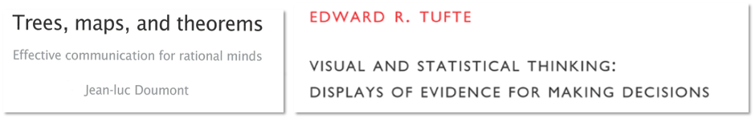

signout reprints
================

  - The Doumont ([2009](#ref-Doumont:2009:Ch.4)) reprints are printed
    with permission of the publisher for our course. These copies are
    yours to keep. You may write in them.

  - The Tufte ([1997](#ref-Tufte:1997)) pamphlets are my personal
    copies. **These are not yours to keep; please do not write in
    them.** Please return them per the calendar.

## references

Doumont J-L (2009) Designing the graph. *Trees, maps, and theorems:
Effective communication for rational minds*. Principiae, Kraainem,
Belgium, 133–143 <http://www.treesmapsandtheorems.com/>

Tufte E (1997) The decision to launch the space shuttle Challenger.
*Visual and statistical thinking: Displays of evidence for making
decisions*. Graphics Press, Cheshire, CT, 16–31
<https://www.edwardtufte.com/tufte/books_textb>

***
<a href="#top">&#9650; top of page</a>    
[&#9665; calendar](../README.md#calendar)    
[&#9665; index](../README.md#index)
