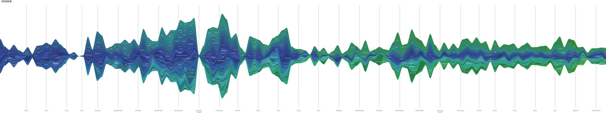
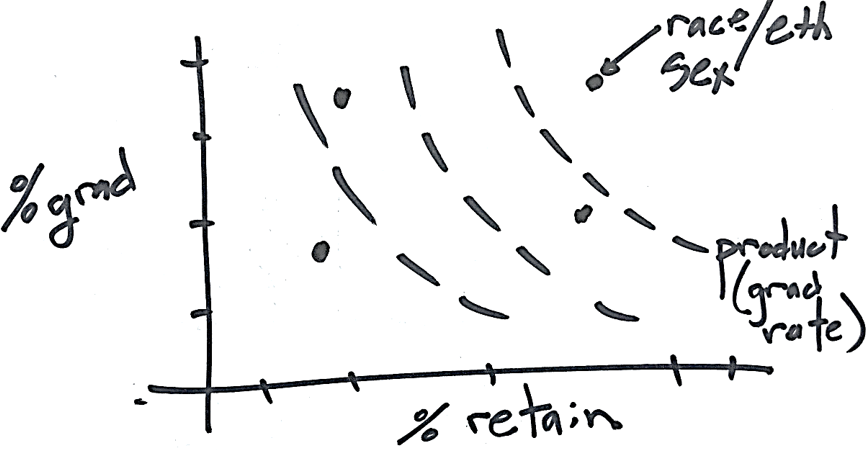
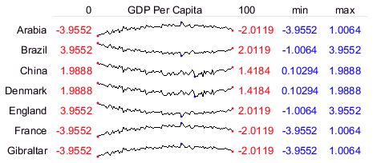
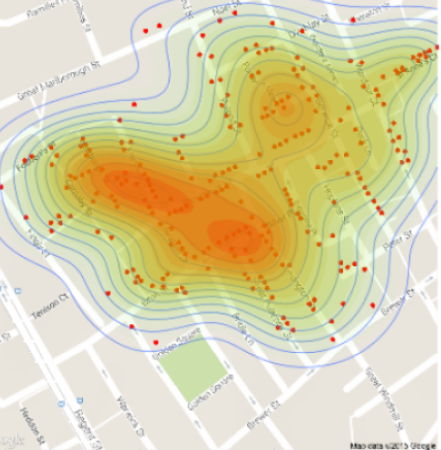
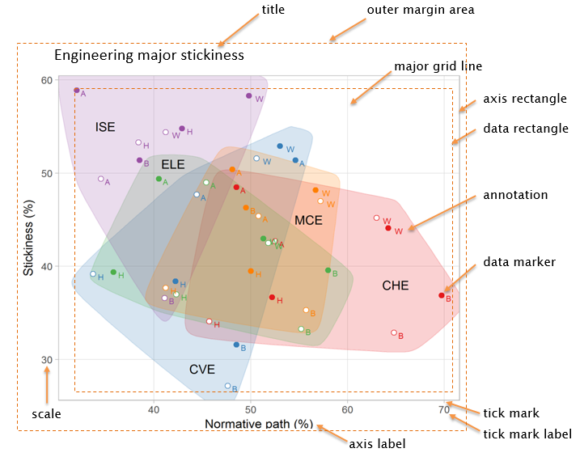

design basics
================

 <small>  
<i>Lastfm Graph</i> by kjell is licensed under
<a href="https://creativecommons.org/licenses/by-sa/2.0/0/">CC BY-SA
2.0</a>   </small>

## contents

[rhetoric of science](#rhetoric-of-science)  
[guiding principles](#guiding-principles)  
[workflow](#workflow)  
[visual standards](#visual-standards)  
[references](#references)

## rhetoric of science

If your education is in math, science, or engineering, your training in
data graphics is most likely grounded in the “rhetoric of science”
(Kostelnick, [2007](#ref-Kostelnick:2007)). From this perspective, data
visualization is a rational, scientific process; its practitioners value
clarity, minimalism, and truth.

In this context (of the rhetoric of science), I outline the following
principles of design.

## guiding principles

*The optimal graph design depends on two factors, primarily: the message
to be conveyed to the audience, or, equivalently, the research question
to be answered and the structure of the data set (the variables to be
shown).* (Doumont, [2009](#ref-Doumont:2009:Ch.4))

*What is to be sought in designs for the display of information is the
clear portrayal of complexity. Not the complications of the simple;
rather the task of the designer is to give visual access to the subtle
and the difficult — that is, the revelation of the complex.* (Tufte,
[1983](#ref-Tufte:1983))

*What’s your point? — Seriously, that’s the most important question to
ask when creating a data visualization. It’s the first thing I ask a
client who sends me data for redesign. And it’s the primary reason we
visualize: because we have a point to communicate to the world.*
(Evergreen, [2017](#ref-Evergreen:2017))

## workflow

Applying the principles in practice

**Process**

  - Graphing data should be an iterative, experimental process  
  - Be prepared to control every pixel
  - Imagine a design that tells your story; sketch it; develop the
    coding expertise to create it.

<small>  </small>

**Data and design**

  - Study the structure of your data
  - Use different designs to visually explore the stories in the data
  - Seek additional data to reveal the context of the stories
  - A large amount of quantitative information can be packed into a
    small region

 <small> 
Sparkline graph by
<a href="https://creativecommons.org/licenses/by-sa/2.0/0/">James
Houghton</a> (2016)   </small>

**Rhetoric**

  - Align the logic of the display to the logic of your thinking
  - Fine tune a display to meet the rhetorical goals for your audience
  - You are allowed to ask your audience to give a graph careful,
    detailed
study

<small>  John Snow’s map of the 1854 London cholera outbreak updated
with density contours by
<a href="https://freakonometrics.hypotheses.org/19213">Arthur
Charpentier</a> (2015).   </small>

## visual standards

(Robbins, [2011](#ref-Robbins:2011))

Our visual standards comprise the technical minutiae of graph
construction within the rhetoric of science. These standards are
primarily from (Robbins, [2013](#ref-Robbins:2013)) with additional
details adapted from (Tufte, [1983](#ref-Tufte:1983); Cleveland and
others, [1988](#ref-Cleveland+McGill+McGill:1988); Talbot and others,
[2012](#ref-Talbot+Gerth+Hanrahan:2012); Wickham,
[2016](#ref-Wickham:2016)).

**Terminology**

|                |                  |                 |
| :------------- | :--------------- | :-------------- |
| aspect ratio   | facet or lattice | scale           |
| axis label     | grid, major      | strip           |
| axis rectangle | grid, minor      | subtitle        |
| caption        | legend           | tick mark       |
| data marker    | margin           | tick mark label |
| data rectangle | panel            | title           |

<small>  </small>

**Visual clarity**

1.  Make the data prominent. Deemphasize grid lines and distinguish grid
    lines from data.
2.  Avoid superfluity; eliminate “chart junk.”
3.  Overlapping plotting symbols must be visually distinguishable.
4.  Superposed data sets must be readily visually assembled.
5.  Do not clutter the interior of the axis rectangle.
6.  Make the data rectangle slightly smaller than the axis rectangle.
7.  Do not overdo the number of tick marks or tick mark labels.
8.  Use color that can be distinguished by people with color-vision
    deficiency.
9.  The graph must be consistent with the text.
10. Proofread graphs.

 <small>   An
update of Hans Rosling’s graph on life expectancy and income, from the
<a href="https://www.gapminder.org/tools/?from=world#$chart-type=bubbles">Gapminder
project</a> (2018)   </small>

**Clear understanding**

1.  Draw data to scale.
2.  Select an aspect ratio that “banks to 45” or that is flatter rather
    than steeper.
3.  Do not show changes in one dimension by area (2D) or volume (3D).
4.  Eliminate gratuitous 3D effects.
5.  Use a common baseline wherever possible.
6.  Label data directly when it doesn’t clutter the graph.
7.  Plot the variable of interest. If interested in change, plot the
    change; if difference, plot the difference.
8.  Use order, color, and other graphical elements consistently among
    groups of charts.  
9.  If more than one principle applies and they conflict with one
    another, choose the principle least likely to mislead.

 <small>  Charles
Joseph Minard’s map of Napoleon’s 1812 advance and retreat to Moscow.
  </small>

## references

Cleveland WS, McGill ME and McGill R (1988) The shape parameter of a
two-variable graph. *Journal of the American Statistical Association*
**83**(402), 289–300 <https://www.jstor.org/stable/2288843>

Doumont J-L (2009) Designing the graph. *Trees, maps, and theorems:
Effective communication for rational minds*. Principiae, Kraainem,
Belgium, 133–143 <http://www.treesmapsandtheorems.com/>

Evergreen S (2017) *Effective Data Visualization: The Right Chart for
the Right Data.*, 1st edn. Sage, Thousand Oaks, CA

Kostelnick C (2007) The visual rhetoric of data displays: The conundrum
of clarity. *IEEE Transactions on Professional Communication* **50**(2),
280–294

Robbins N (2011) Thinking outside the chart menu.
<https://www.forbes.com/sites/naomirobbins/2011/11/29/thinking-outside-the-chart-menu/#785f2c07171a>

Robbins N (2013) *Creating More Effective Graphs.* Chart House, Wayne,
NJ

Talbot J, Gerth J and Hanrahan P (2012) An empirical model of slope
ratio comparison. *IEEE Transactions on Visualization and Computer
Graphics* **18**(12), 2613–2620
<http://vis.stanford.edu/papers/slope-ratio-comparison>

Tufte E (1983) *The visual display of quantitative information.*
Graphics Press, Cheshire, CT
<https://www.edwardtufte.com/tufte/books_vdqi>

Wickham H (2016) *ggplot2: Elegant Graphics for Data Analysis.*
Springer-Verlag, New York <http://ggplot2.org>

***
<a href="#top">&#9650; top of page</a>    
[&#9665; calendar](../README.md#calendar)    
[&#9665; index](../README.md#index)
