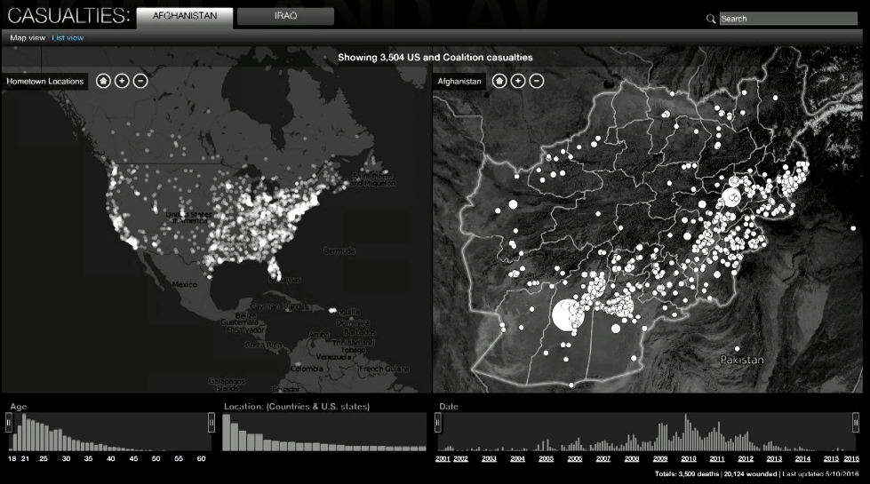
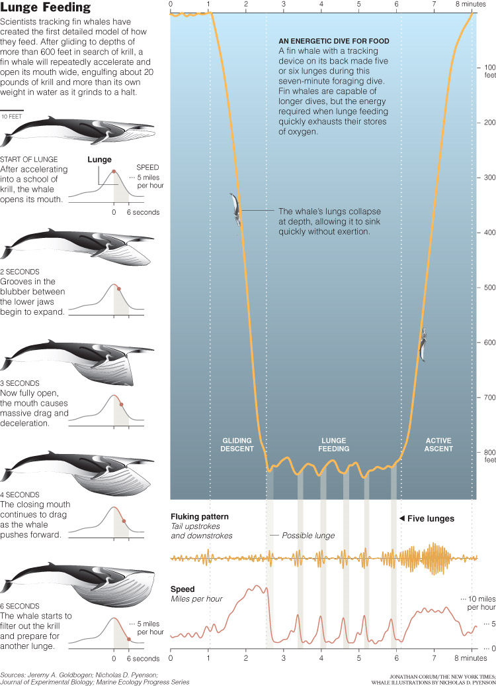
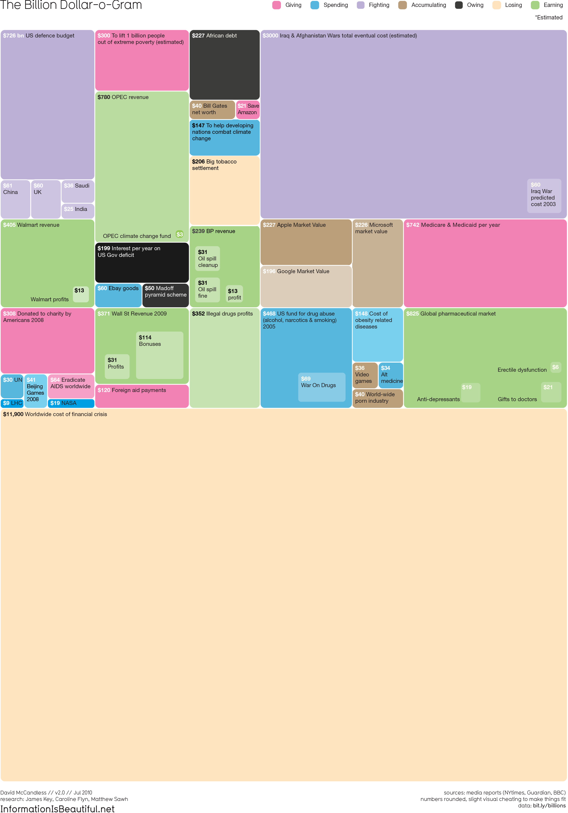
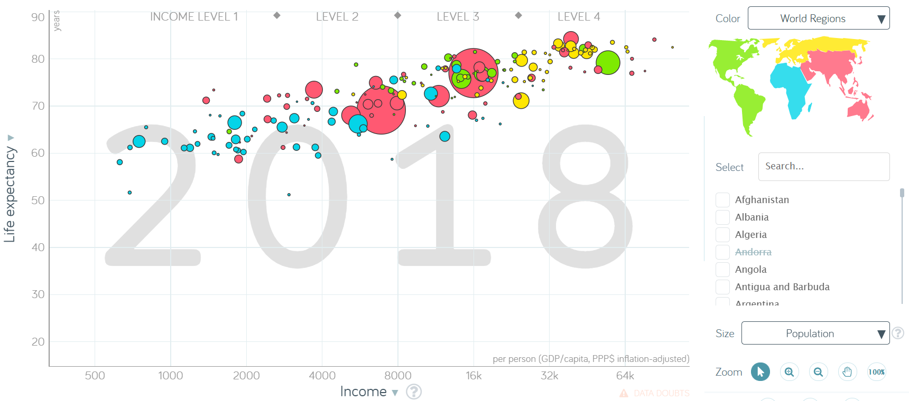
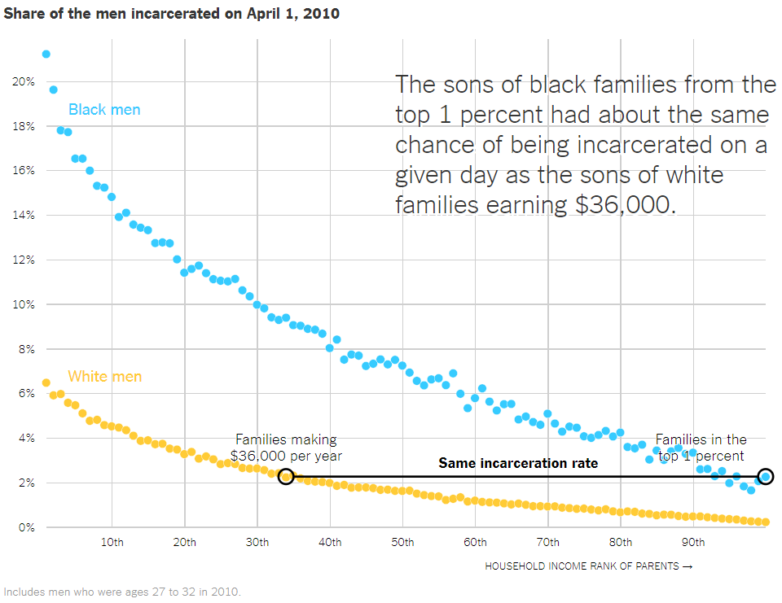

discovering stories
================

 <small>  
<i>Control room</i> by Michael Newman is licensed under
<a href="https://creativecommons.org/licenses/by-nc-nd/2.0/legalcode">CC
BY-NC-ND 2.0</a>   </small>

## contents

[reading](#reading)  
[reflection on rhetoric](#reflection-on-rhetoric)  
[video links](#video-links)

## reading

Cole Nussbaumer Knaflic

[Multifaceted data and
story](http://www.storytellingwithdata.com/blog/2014/01/multifaceted-data-and-story)
or emphasizing one story de-emphasizes another  
[The right amount of
detail](http://www.storytellingwithdata.com/blog/2013/10/the-right-amount-of-detail)
or the importance of context  
[Logic in
order](http://www.storytellingwithdata.com/blog/2013/09/logic-in-order)
or ordering your data deliberately  
[Telling multiple
stories 1](http://www.storytellingwithdata.com/blog/2012/05/telling-multiple-stories-part-1)
or group data to tell a story  
[Telling multiple
stories 2](http://www.storytellingwithdata.com/blog/2012/06/telling-multiple-stories-part-2)  
[And the winner
is…](http://www.storytellingwithdata.com/blog/2012/12/and-winner-is)
or responses to a data visualization challenge

  <a href="#top">▲ top of page</a>

## reflection on rhetoric

After seeing the video clips (in class) and reading Knaflic’s blog posts
(outside of class), select any two of our “discovering stories” authors
to write about in your reflection assignment.

  - Jonathan Corum (whale dive and feed)  
  - Amanda Cox (one image, two interpretations)  
  - David McCandless (the billion-dollar-o-gram)  
  - Cole Nussbaumer Knaflic (blog posts)  
  - Eric Rodenbeck (maps of emotion)

For each of the two authors you select, reflect on their ideas and their
messages.

**Prompt:** What is the most significant idea you can borrow from your
selected authors that you can apply to your own portfolio? Make your
responses as specific as you can.

  - In your `reports` directory, create an Rmd file into which you copy
    and paste the contents of the [Reflections on
    rhetoric](../reports/video-reflection-1.Rmd) script. Add this report
    to your collection of reading responses.  
  - Link to this report from your portfolio README page as illustrated
    on the [sample portfolio
    repo](https://github.com/graphdr/portfolio-sample#Discussion-notes).  
  - You can find my [sample Reflections on
    rhetoric](https://github.com/graphdr/portfolio-sample/blob/master/reports/video-reflection-1.md#discovering-stories-reflection)
    on the sample portfolio repo.

  <a href="#top">▲ top of page</a>

## video links

[Maps of emotion](https://vimeo.com/166948025#t=1m40s) (1:40–9:45) Eric
Rodenbeck

  <a href="#top">▲ top of page</a>

  [Show ideas +
evidence](https://www.youtube.com/watch?v=VrQ8rQoOuhA&t=430s)
(7:10–11:44) Jonathan Corum

  <a href="#top">▲ top of page</a>

  [The beauty of data
visualization](https://www.ted.com/talks/david_mccandless_the_beauty_of_data_visualization?utm_campaign=tedspread&utm_medium=referral&utm_source=tedcomshare&t=40s)
(0:40–5:00) David McCandless

  <a href="#top">▲ top of page</a>

  [gapminder](https://www.youtube.com/watch?v=hVimVzgtD6w&t=180s)
(3:00–6:17) Hans Rosling

  <a href="#top">▲ top of page</a>

  Amanda Cox

  - [The images are the same](https://vimeo.com/287093172#t=16s)
    (00:16–02:22)  
  - [Where you come from matters](https://vimeo.com/287093172#t=4m55s)
    (04:55–06:34)  
  - [The story depends on what you
    believe](https://vimeo.com/287093172#t=8m52s) (8:52–11:25)
  - [Complexity, beauty, policiy, and
    patterns](https://vimeo.com/287093172#t=20m0s) (20:00–22:23)

## references

***
<a href="#top">&#9650; top of page</a>    
[&#9665; calendar](../README.md#calendar)    
[&#9665; index](../README.md#index)
