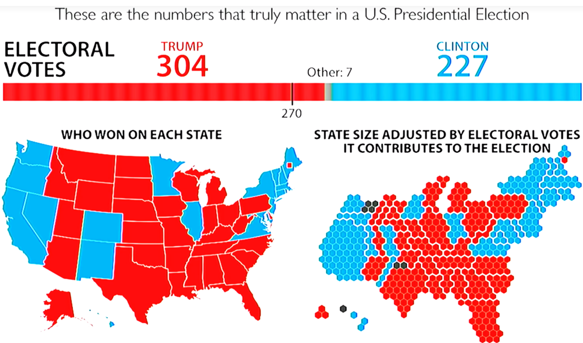
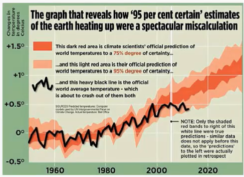
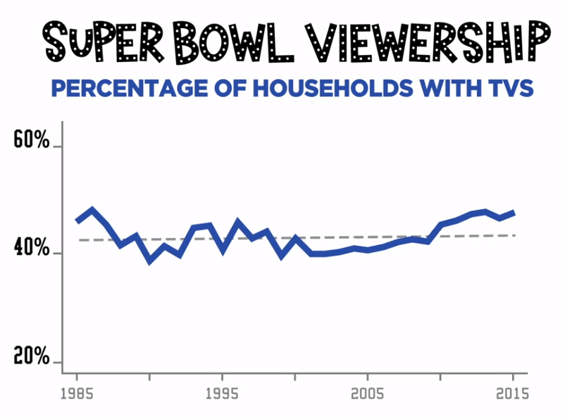

graphical lies
================

 <small>  
<i>Lies</i> by tq2cute, <i>Lies</i> by Kevin O’Mara, and
<i>Lies\!\!\!</i> by Nick are all licensed under
<a href="https://creativecommons.org/licenses/by-nc-nd/2.0/legalcode">CC
BY-NC-ND 2.0</a>   </small>

## contents

[reading](#reading)  
[video links](#video-links)  
[reflection on rhetoric](#reflection-on-rhetoric)  
[references](#references)

## reading

The required reading before class is “How to display data badly”
(Wainer, [2000](#ref-Wainer:2000:Ch.1)). Which of Wainer’s ideas might
influence some of your portfolio displays?

## video links

[How charts lie](https://www.youtube.com/watch?v=Cd046xZhO_8&t=21m29s)
by Alberto Cairo (in-class, 40 min starting at 21:28)

  - [It panders to our expectations or
    biases](https://www.youtube.com/watch?v=Cd046xZhO_8&t=21m38s) (12
    min)  
  - [It uses the wrong
    data](https://www.youtube.com/watch?v=Cd046xZhO_8&t=33m45s) (7.5
    min)  
  - [It shows an inappropriate amount of data, either too little or too
    much](https://www.youtube.com/watch?v=Cd046xZhO_8&t=41m22s) (5.5
    min)  
  - [It represents the data
    incorrectly](https://www.youtube.com/watch?v=Cd046xZhO_8&t=46m42s)
    (3.5 min)  
  - [It suggests spurious patterns or fails to reveal crucial
    ones](https://www.youtube.com/watch?v=Cd046xZhO_8&t=49m58s) (5
    min)  
  - [It conceals or confuses
    uncertainty](https://www.youtube.com/watch?v=Cd046xZhO_8&t=54m50s)
    (5.5 min)

  <a href="#top">▲ top of page</a>

  [Misleading graphs in real
life](https://www.youtube.com/watch?time_continue=1&v=1F7gm_BG0iQ) by
Stephanie Glen (5 min)

  <a href="#top">▲ top of page</a>

  [How to spot a misleading
graph](https://www.youtube.com/watch?v=E91bGT9BjYk) by Lea Gaslowitz (4
min)

  <a href="#top">▲ top of page</a>

  [Lurking variables: Simpson’s
paradox](https://www.youtube.com/watch?v=sxYrzzy3cq8) by Mark Liddell (4
min)

  <a href="#top">▲ top of page</a>

## reflection on rhetoric

Source material

  - Watch the Albert Cairo talk (in class)  
  - Read the article by Wainer ([2000](#ref-Wainer:2000:Ch.1))
  - Watch the other short videos (outside of class)

Assignment

  - In your `reports` directory, create an Rmd file into which you copy
    and paste the contents of the [Reflections on rhetoric: graphical
    lies](../reports/video-reflection-2.Rmd) script. Add this report to
    your collection of reading responses.  
  - Link to this report from your portfolio README page as illustrated
    on the [sample portfolio
    repo](https://github.com/graphdr/portfolio-sample#Discussion-notes).
  - For the Cairo talk and the Wainer article, describe the author’s
    idea or ideas that you found most memorable.
  - Discuss how you will apply the idea(s) to one of your designs

  <a href="#top">▲ top of page</a>

## references

Wainer H (2000) Graphical failures: How to display data badly. *Visual
revelations: Graphical tales of fate and deception from Napoleon
Bonaparte To Ross Perot*. Psychology Press, Mahwah, NJ, 11–40

***
<a href="#top">&#9650; top of page</a>    
[&#9665; calendar](../README.md#calendar)    
[&#9665; index](../README.md#index)
