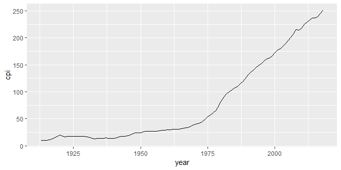
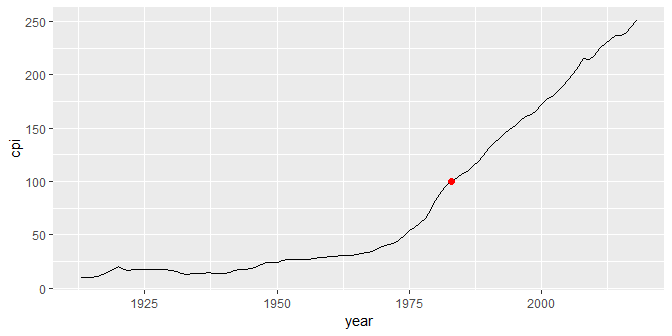
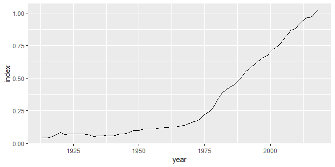
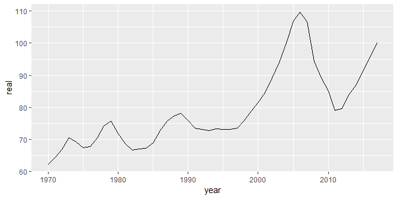
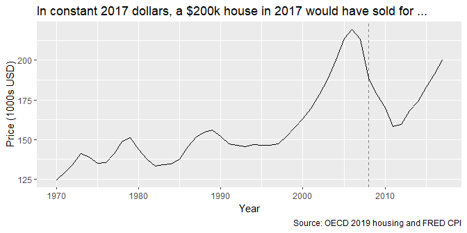
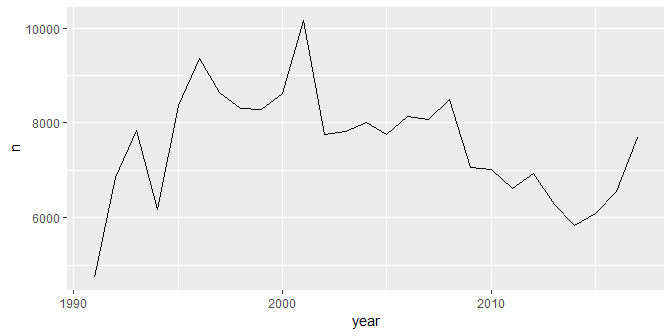
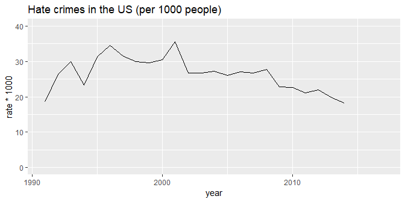

correcting graphical lies
================

 <small> <br>
<i>Truth</i> by Revise\_Di is licensed under
<a href="https://creativecommons.org/licenses/by-sa/2.0/legalcode">CC
BY-SA 2.0</a> <br> </small>

## contents

[introduction](#introduction)  
[follow good design practices](#follow-good-design-practices)  
[beware Simpson’s paradox](#beware-simpsons-paradox)  
[adjust for inflation](#adjust-for-inflation)  
[adjust for population](#adjust-for-population)  
[adjust for PPP](#adjust-for-ppp)  
[adjust for lack of context](#adjust-for-lack-of-context)  
[references](#references)

<br> <a href="#top">▲ top of page</a>

## introduction

## follow good design practices

Do

  - Show sufficient information to reveal the context of the story
  - Select an aspect ratio to reveal meaningful variation
  - Always label your scales and axes
  - Ensure your numbers add up
  - Start bar chart scales at zero
  - Use constant-interval scales
  - Show all the data

Don’t

  - Do not select an aspect ratio that conceals meaningful variation  
  - Do not cherry-pick your data, do not omit relevant data  
  - Do not use double-y scales
  - Do not use irrelevant data

<br> <a href="#top">▲ top of page</a>

## beware Simpson’s paradox

If a data graphic tells a compelling story to inform the making of
decisions or public policy, hidden variables must be explored to avoid
Simpson’s paradox—otherwise the decision or policy could be exactly the
opposite of what it should be.

The [video by by Mark
Liddell](https://www.youtube.com/watch?v=sxYrzzy3cq8) compared the
survival rates of patients at hospitals A and B. Below, I show the
numbers he used to illustrate Simpson’s paradox.

A thousand patients each are admitted to hospitals A and B. The data
frame shows the patients’ health when admitted (good or poor), the
number admitted, and the number who survived.

``` r
library("tidyverse")
library("wrapr")
library("seplyr")

df <- wrapr::build_frame(
        "hospital", "patient_health", "admitted", "survived" |
        "A", "good", 900, 870 |
        "A", "poor", 100, 30 |
        "B", "good", 600, 590 |
        "B", "poor", 400, 210)

df <- df %>% 
        mutate(survival_rate = round(survived/admitted, 2)) %>% 
        arrange(desc(survival_rate))
```

For both types of patients, hospital B has a higher survival rate than
hospital A.

``` r
kable(df)
```

| hospital | patient\_health | admitted | survived | survival\_rate |
| :------- | :-------------- | -------: | -------: | -------------: |
| B        | good            |      600 |      590 |           0.98 |
| A        | good            |      900 |      870 |           0.97 |
| B        | poor            |      400 |      210 |           0.52 |
| A        | poor            |      100 |       30 |           0.30 |

If we group and summarize the data by hospital, ignoring the state of
the patients’ health when admitted, hospital A has a higher survival
rate than hospital B.

``` r
grouping_variables <- c("hospital")
df <- seplyr::group_summarise(df, 
                grouping_variables, 
                admitted = sum(admitted), 
                survived = sum(survived), 
                survival_rate = survived/admitted) %>% 
        arrange(desc(survival_rate))
kable(df)
```

| hospital | admitted | survived | survival\_rate |
| :------- | -------: | -------: | -------------: |
| A        |     1000 |      900 |            0.9 |
| B        |     1000 |      800 |            0.8 |

That’s the paradox. When the data are grouped to account for a
particular variable, we get one result. When the data are aggregated and
that variable is hidden, we get the opposite result.

The paradox does occur in actual research. For example,

  - Comparing two treatments for kidney stones, treatment A was more
    effective when used on small stones, and also when used on large
    stones. When the data are grouped and summarized (stone size is now
    a hidden variable), treatment B is more effective. (Charig and
    others, [1986](#ref-Charig+Webb+Payne+Wickham:1986))

  - In a study of gender bias in the 1973 graduate school admissions to
    University of California, Berkeley, when the data were grouped to
    account for the difficulty of admission to a department by either
    sex, a small but statistically significant bias *in favor of women*
    was found, that is, women were admitted at a higher rate than men.
    In contrast, when the data are aggregated (difficulty of entry is
    the hidden variable), only 6 departments of 85 were biased in favor
    of women and 4 departments were biased in favor of men. Ignoring
    departments altogether (both department and the difficulty of entry
    are hidden variables), admissions were biased *in favor of men*
    (Bickel and others, [1975](#ref-Bickel+Hammel+OConnell:1975)).

<br> <a href="#top">▲ top of page</a>

## adjust for inflation

Over any time period with inflation, a dollar buys less at the end the
period than it did at the beginning of the period. Thus, in 1973 a
single 20-year old could live comfortably on $5/hour but in 2018 (45
years later) that same 20-year-old has to earn $30/hour to achieve the
same modest standard of living.

Thus, a graph of dollar amounts over time that does not adjust for
inflation is lying.

We usually adjust for the effects of inflation in US dollars using the
Consumer Price Index (CPI) published by the US Bureau of Labor
Statistics (BLS). The CPI is available by month from the BLS or from the
Federal Reserve (FRED), from 1913 to the present.

  - Annual CPI is the average of the 12 monthly CPI
  - In general we use the CPI for all urban consumers, all items.
  - You can obtain the CPI for specific items (medical, transportation,
    recreation, etc.) and for specific cities or regions of the country.
  - Seasonally-adjusted CPI is used for short-term price trends in the
    economy due to cyclic influences such as the season or holidays.
    Otherwise, the seasonally unadjusted data are used.

**Obtaining the CPI**

When reading a table from FRED today (2019-04-21) we use the following
table codes:

  - `CPIAUCNS` for Consumer Price Index for All Urban Consumers: All
    Items, Not Seasonally Adjusted (skip the first 13 lines)
  - `CPIAUCSL` for Consumer Price Index for All Urban Consumers: All
    Items, Seasonally Adjusted (skip the first 52 lines)

<!-- end list -->

``` r
library("tidyverse")
library("lubridate") 
```

  - Include the table code `CPIAUCNS` in the URL

<!-- end list -->

``` r
cpi_url  <- "http://research.stlouisfed.org/fred2/data/CPIAUCNS.txt"
```

  - Download and save to the `data-raw` directory

<!-- end list -->

``` r
cpi_file <- "data-raw/cpi.txt"

# update file if more than 4 weeks since last download
if (!file.exists(cpi_file) | now() > file.mtime(cpi_file) + weeks(4)) {
        download.file(cpi_url, cpi_file)
}
```

  - Read the data and omit the meta-data lines

<!-- end list -->

``` r
cpi <- read.table(cpi_file, 
                skip = 13, 
                header = TRUE, 
                stringsAsFactors = FALSE) %>% 
        glimpse()
#> Observations: 1,275
#> Variables: 2
#> $ DATE  <chr> "1913-01-01", "1913-02-01", "1913-03-01", "1913-04-01", ...
#> $ VALUE <dbl> 9.8, 9.8, 9.8, 9.8, 9.7, 9.8, 9.9, 9.9, 10.0, 10.0, 10.1...
```

  - Change the column names

<!-- end list -->

``` r
cpi <- cpi %>% 
        dplyr::rename(date = DATE, cpi = VALUE) %>% 
        glimpse()
#> Observations: 1,275
#> Variables: 2
#> $ date <chr> "1913-01-01", "1913-02-01", "1913-03-01", "1913-04-01", "...
#> $ cpi  <dbl> 9.8, 9.8, 9.8, 9.8, 9.7, 9.8, 9.9, 9.9, 10.0, 10.0, 10.1,...
```

  - Convert the date to a date variable and extract the year

<!-- end list -->

``` r
cpi <- cpi %>% 
        mutate(date = ymd(date)) %>% 
        mutate(year = year(date)) %>% 
        glimpse()
#> Observations: 1,275
#> Variables: 3
#> $ date <date> 1913-01-01, 1913-02-01, 1913-03-01, 1913-04-01, 1913-05-...
#> $ cpi  <dbl> 9.8, 9.8, 9.8, 9.8, 9.7, 9.8, 9.9, 9.9, 10.0, 10.0, 10.1,...
#> $ year <dbl> 1913, 1913, 1913, 1913, 1913, 1913, 1913, 1913, 1913, 191...
```

  - Omit 2019 data because we don’t have a full year
  - Group and summarize by year to determine the annual CPI (this
    assumes our data we wish to adjust is annual data)

<!-- end list -->

``` r
cpi <- cpi %>% 
        filter(year != 2019) %>% 
        seplyr::group_summarise(., "year", cpi = mean(cpi)) %>% 
        mutate(cpi = round(cpi, 2)) %>% 
        glimpse()
#> Observations: 106
#> Variables: 2
#> $ year <dbl> 1913, 1914, 1915, 1916, 1917, 1918, 1919, 1920, 1921, 192...
#> $ cpi  <dbl> 9.88, 10.02, 10.11, 10.88, 12.82, 15.04, 17.33, 20.04, 17...
```

To see what the CPI numbers look like, we can graph it.

``` r
p <- ggplot(data = cpi, mapping = aes(x = year, y =  cpi)) + 
    geom_line()
p
```



The basis year is the year for which the CPI = 100. In this data, the
basis year is 1983-1984.

``` r
df_note <- cpi %>% 
    filter(near(cpi, 100, tol = 0.5))

p <- p +
    geom_point(data = df_note, aes(x = year, y =  cpi), size = 2, color = "red")
p
```



**Create the price index**

Inflation-adjusted dollars are often called “constant dollars” with
respect to the basis year. For example, we might say that data are
reported in “constant 1984 dollars” or “constant 2018 dollars”. Unless
you have a compelling reason otherwise, I recommend that you always use
the most recent basis year because the purchasing power of recent
dollars is what your audience will be most familiar with.

In the housing data I use later, the latest information we have is 2017,
so I’ll use 2017 as the basis year.

``` r
(cpi_2017 <- cpi$cpi[cpi$year == 2017])
#> [1] 245.12
```

To use the CPI, we create a *price index* by dividing the all CPI values
by the CPI in the basis year.

``` r
cpi <- cpi %>% 
        mutate(index = cpi / cpi_2017) %>% 
    glimpse()
#> Observations: 106
#> Variables: 3
#> $ year  <dbl> 1913, 1914, 1915, 1916, 1917, 1918, 1919, 1920, 1921, 19...
#> $ cpi   <dbl> 9.88, 10.02, 10.11, 10.88, 12.82, 15.04, 17.33, 20.04, 1...
#> $ index <dbl> 0.04030679, 0.04087794, 0.04124510, 0.04438642, 0.052300...

ggplot(data = cpi, mapping = aes(x = year, y =  index)) + 
    geom_line() 
```



**Nominal housing prices**

Obtain some practice data with dollars recorded as “nominal” dollars.
“Nominal” indicates that the dollars have not been adjusted for
inflation. For this example, I manually downloaded annual US housing
price data (OECD, [2019](#ref-OECD:2019:UShousing)) and saved it in the
`data-raw` directory. You can download it manually from the course
`data-raw` directory.

``` r
data_file <- "data-raw/DP_LIVE_21042019192003239.csv"
housing   <- read_csv(data_file) %>% 
    glimpse()
#> Observations: 48
#> Variables: 8
#> $ LOCATION     <chr> "USA", "USA", "USA", "USA", "USA", "USA", "USA", ...
#> $ INDICATOR    <chr> "HOUSECOST", "HOUSECOST", "HOUSECOST", "HOUSECOST...
#> $ SUBJECT      <chr> "NOMINAL", "NOMINAL", "NOMINAL", "NOMINAL", "NOMI...
#> $ MEASURE      <chr> "IDX2015", "IDX2015", "IDX2015", "IDX2015", "IDX2...
#> $ FREQUENCY    <chr> "A", "A", "A", "A", "A", "A", "A", "A", "A", "A",...
#> $ TIME         <dbl> 1970, 1971, 1972, 1973, 1974, 1975, 1976, 1977, 1...
#> $ Value        <dbl> 11.14842, 12.04820, 12.91322, 14.44506, 15.76601,...
#> $ `Flag Codes` <lgl> NA, NA, NA, NA, NA, NA, NA, NA, NA, NA, NA, NA, N...
```

  - keep the TIME and Value columns
  - rename the columns

<!-- end list -->

``` r
housing <- housing %>% 
    select(TIME, Value) %>% 
    dplyr::rename(year = TIME, nominal = Value) %>% 
    glimpse()
#> Observations: 48
#> Variables: 2
#> $ year    <dbl> 1970, 1971, 1972, 1973, 1974, 1975, 1976, 1977, 1978, ...
#> $ nominal <dbl> 11.14842, 12.04820, 12.91322, 14.44506, 15.76601, 16.7...
```

The prices have been normalized with a 2015 basis, that is in 2015, the
price is 100. I’d like to normalize these data to 2017 prices by
dividing all nominal values by the one recorded for 2017, then multiply
by 100, so that the $100 price value is in the same basis year as my
price index.

``` r
(nominal_2017 <- housing$nominal[housing$year == 2017])
#> [1] 113.0211

housing <- housing %>% 
  mutate(nominal = nominal / nominal_2017 * 100)

tail(housing, n = 10L)
#> # A tibble: 10 x 2
#>     year nominal
#>    <dbl>   <dbl>
#>  1  2008    82.9
#>  2  2009    78.0
#>  3  2010    75.7
#>  4  2011    72.5
#>  5  2012    74.6
#>  6  2013    79.9
#>  7  2014    84.0
#>  8  2015    88.5
#>  9  2016    93.8
#> 10  2017   100
```

**Real housing prices**

  - Join the CPI data to the housing data

<!-- end list -->

``` r
housing <- left_join(housing, cpi, by = "year") %>% 
    select(year, nominal, index)

tail(housing)
#> # A tibble: 6 x 3
#>    year nominal index
#>   <dbl>   <dbl> <dbl>
#> 1  2012    74.6 0.937
#> 2  2013    79.9 0.950
#> 3  2014    84.0 0.966
#> 4  2015    88.5 0.967
#> 5  2016    93.8 0.979
#> 6  2017   100   1
```

After joining, you can see that in 2017, the price index is 1 and the
nominal house price is $100. Divide the nominal price by the price index
to obtain the real price (adjusted for inflation).

``` r
housing <- housing %>% 
    mutate(real = nominal / index) %>% 
    glimpse()
#> Observations: 48
#> Variables: 4
#> $ year    <dbl> 1970, 1971, 1972, 1973, 1974, 1975, 1976, 1977, 1978, ...
#> $ nominal <dbl> 9.864023, 10.660136, 11.425499, 12.780854, 13.949620, ...
#> $ index   <dbl> 0.1584122, 0.1651844, 0.1706103, 0.1811358, 0.2011668,...
#> $ real    <dbl> 62.26807, 64.53476, 66.96840, 70.55953, 69.34356, 67.4...

tail(housing)
#> # A tibble: 6 x 4
#>    year nominal index  real
#>   <dbl>   <dbl> <dbl> <dbl>
#> 1  2012    74.6 0.937  79.7
#> 2  2013    79.9 0.950  84.1
#> 3  2014    84.0 0.966  87.0
#> 4  2015    88.5 0.967  91.5
#> 5  2016    93.8 0.979  95.8
#> 6  2017   100   1     100
```

If the 2017 price of a house is $100, it would have been priced as
follows in previous years (in constant 2017 dollars).

``` r
ggplot(data = housing, mapping = aes(x = year, y =  real)) +
                geom_line()
```



You can scale the y-axis by any amount to obtain a comparison for any
2017 house price. For example, the median house price in the US in 2017
was $200k. If we multiply our real dollar column by 2, we obtain a graph
of how much that house would have cost in previous years in constant
2017 dollars (in thousands).

``` r
housing <- housing %>% 
    mutate(real = real * 2) %>% 
    glimpse()
#> Observations: 48
#> Variables: 4
#> $ year    <dbl> 1970, 1971, 1972, 1973, 1974, 1975, 1976, 1977, 1978, ...
#> $ nominal <dbl> 9.864023, 10.660136, 11.425499, 12.780854, 13.949620, ...
#> $ index   <dbl> 0.1584122, 0.1651844, 0.1706103, 0.1811358, 0.2011668,...
#> $ real    <dbl> 124.5361, 129.0695, 133.9368, 141.1191, 138.6871, 134....
```

I’ve added a line to indicate the 2008 global financial disaster.

``` r
ggplot(data = housing, mapping = aes(x = year, y =  real)) +
                geom_line() +
    labs(x = "Year", 
             y = "Price (1000s USD)", 
             title = "In constant 2017 dollars, a $200k house in 2017 would have sold for ...", 
             caption = "Source: OECD 2019 housing and FRED CPI"
             ) +
    geom_vline(xintercept = 2008, linetype = 2, color = "gray50")
```



In summary, we have used the OECD housing index to account for the
fluctuations in house prices and we have used the CPI to account for
inflation.

<br> <a href="#top">▲ top of page</a>

## adjust for population

Greater numbers of people in a region may inherently mean more of *X* in
the region.

  - [tidycensus](https://walkerke.github.io/tidycensus/index.html)
    obtain information about US population
  - [gapminder](https://www.gapminder.org/data/) for world population
    data

For example, the number of hate crimes in the FBI data.

``` r
hate_crimes <- read_csv("data-raw/hate_crime.csv") 

hate_crimes <- hate_crimes %>%
    select(DATA_YEAR, OFFENDER_RACE, VICTIM_COUNT, OFFENSE_NAME) %>% 
    dplyr::rename(year    = DATA_YEAR, 
                                race    = OFFENDER_RACE, 
                                n       = VICTIM_COUNT, 
                                offense = OFFENSE_NAME) %>% 
    glimpse()
#> Observations: 194,194
#> Variables: 4
#> $ year    <dbl> 1991, 1991, 1991, 1991, 1991, 1991, 1991, 1991, 1991, ...
#> $ race    <chr> "White", "Black or African American", "Black or Africa...
#> $ n       <dbl> 1, 1, 1, 2, 1, 1, 1, 2, 1, 1, 1, 1, 1, 1, 1, 1, 1, 1, ...
#> $ offense <chr> "Intimidation", "Simple Assault", "Aggravated Assault"...

hate_crimes <- seplyr::group_summarize(hate_crimes, 
                                                                             c("year"), 
                                                                             n = sum(n, na.rm = TRUE)) 

glimpse(hate_crimes)
#> Observations: 27
#> Variables: 2
#> $ year <dbl> 1991, 1992, 1993, 1994, 1995, 1996, 1997, 1998, 1999, 200...
#> $ n    <dbl> 4735, 6838, 7842, 6164, 8379, 9362, 8647, 8297, 8291, 861...

ggplot(hate_crimes, aes(year, n)) +
    geom_line()
```



Now adjust for population. The `economics` data set in ggplot2 has
population numbers from 1967 to 2015.

``` r
data(economics, package = "ggplot2")
glimpse(economics)
#> Observations: 574
#> Variables: 6
#> $ date     <date> 1967-07-01, 1967-08-01, 1967-09-01, 1967-10-01, 1967...
#> $ pce      <dbl> 507.4, 510.5, 516.3, 512.9, 518.1, 525.8, 531.5, 534....
#> $ pop      <int> 198712, 198911, 199113, 199311, 199498, 199657, 19980...
#> $ psavert  <dbl> 12.5, 12.5, 11.7, 12.5, 12.5, 12.1, 11.7, 12.2, 11.6,...
#> $ uempmed  <dbl> 4.5, 4.7, 4.6, 4.9, 4.7, 4.8, 5.1, 4.5, 4.1, 4.6, 4.4...
#> $ unemploy <int> 2944, 2945, 2958, 3143, 3066, 3018, 2878, 3001, 2877,...

pop <- economics %>% 
    mutate(year = year(date)) %>% 
    mutate(month = month(date)) %>% 
    filter(month == 12) %>% 
    select(year, pop) %>% 
    glimpse()
#> Observations: 48
#> Variables: 2
#> $ year <dbl> 1967, 1968, 1969, 1970, 1971, 1972, 1973, 1974, 1975, 197...
#> $ pop  <int> 199657, 201621, 203675, 206238, 208740, 210821, 212785, 2...
```

Now join.

``` r
hate_crimes <- left_join(hate_crimes, pop, by = "year") %>%
mutate(rate = n / pop) %>% 
    glimpse()
#> Observations: 27
#> Variables: 4
#> $ year <dbl> 1991, 1992, 1993, 1994, 1995, 1996, 1997, 1998, 1999, 200...
#> $ n    <dbl> 4735, 6838, 7842, 6164, 8379, 9362, 8647, 8297, 8291, 861...
#> $ pop  <int> 254964, 258413, 261674, 264804, 267943, 271125, 274372, 2...
#> $ rate <dbl> 0.01857125, 0.02646152, 0.02996859, 0.02327759, 0.0312715...
```

And the graph shows that while the number of hate crimes is up, the per
capita rate is the lowest its been since 1991.

``` r
ggplot(hate_crimes, aes(year, rate * 1000)) +
    geom_line() + 
    labs(title = "Hate crimes in the US (per 1000 people)") +
    scale_y_continuous(limits = c(0, 40))
```



I would not release this graph however because more work is needed to
understand this story. These data are aggregated—there are differences
to be found by city or region and by race and poverty.

I include the example simply to illustrate a population adjustment.

<br> <a href="#top">▲ top of page</a>

## adjust for PPP

Purchasing Power Parities (PPP) are the rates of currency conversion
that equalize the purchasing power of different currencies by
eliminating the differences in price levels between countries.

Thus, a graph about money among countries that does not adjust for PPP
is lying. If you have data that needs to be adjusted for PPP, consult
the following sites:

[What are
PPPs?](http://www.oecd.org/sdd/purchasingpowerparities-frequentlyaskedquestionsfaqs.htm#FAQ1)
from OECD  
[Where can I download PPP
data?](http://www.oecd.org/sdd/purchasingpowerparities-frequentlyaskedquestionsfaqs.htm#FAQ5)

<br> <a href="#top">▲ top of page</a>

## adjust for lack of context

Adjusting for lack of context usually means you need to obtain more
data, either more of the same data over a longer time period or
comparable data over the same time period.

There were several examples in the [Correcting graphical lies
slides](../slides/sd072-correcting-graphical-lies.pdf).

<br> <a href="#top">▲ top of page</a>

## references

<div id="refs">

<div id="ref-Bickel+Hammel+OConnell:1975">

Bickel PJ, Hammel EA and O’Connell JW (1975) Sex bias in graduate
admissions: Data from Berkeley. *Science* **187**, 398–404
<https://homepage.stat.uiowa.edu/~mbognar/1030/Bickel-Berkeley.pdf>

</div>

<div id="ref-Charig+Webb+Payne+Wickham:1986">

Charig CR, Webb DR, Payne SR and Wickham JE (1986) Comparison of
treatment of renal calculi by open surgery, percutaneous
nephrolithotomy, and extracorporeal shockwave lithotripsy. *British
Medical Journal (Clinical Research Ed.)* **292**(6524), 879–882
<doi:10.1136/bmj.292.6524.879>

</div>

<div id="ref-OECD:2019:UShousing">

OECD (2019) Housing prices (indicator).
<https://doi.org/10.1787/63008438-en>

</div>

</div>

***
<a href="#top">&#9650; top of page</a>    
[&#9665; calendar](../README.md#calendar)    
[&#9665; index](../README.md#index)
