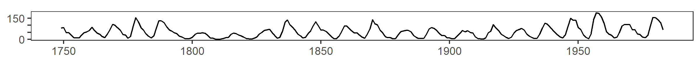
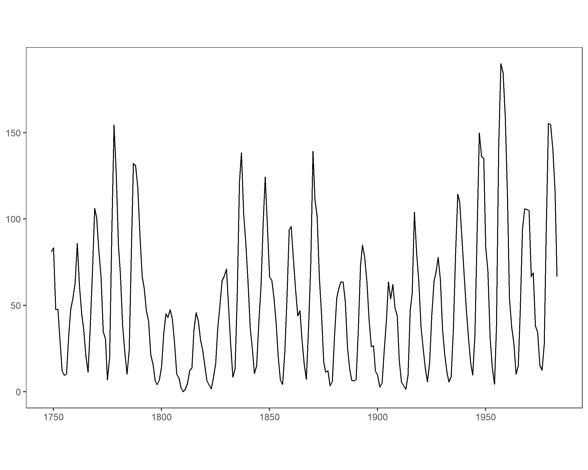

scales
================

<!-- <small> -->

<!-- <br> -->

<!-- <i>Truth</i> by Revise_Di is licensed under <a href="https://creativecommons.org/licenses/by-sa/2.0/legalcode">CC BY-SA 2.0</a> -->

<!-- <br> -->

<!-- </small> -->

## contents

[introduction](#introduction)  
\[\]  
\[\]  
\[\]  
\[\]  
\[\]  
\[\]  
[references](#references)

<br> <a href="#top">▲ top of page</a>

## introduction

## aspect ratio

``` r
library(ggplot2)
library(gridExtra) #arrangeGrob
library(plyr) #ddply

this_base <- "cm/images/cm406-rhetoric-scales"

my_data <- data.frame(
  sunspots = as.numeric(sunspots),
  year = floor(time(sunspots)))

my_data_avg <- ddply(my_data, .(year), summarize, mean = mean(sunspots))

p <- ggplot(my_data_avg, aes(x = year, y = mean)) +
  geom_line() +
  theme_bw() +
  theme(panel.grid.major = element_blank(),
        panel.grid.minor = element_blank(),
        axis.title = element_blank())

ratio = 0.055
p1 <- p +
  coord_fixed(ratio = ratio) +
  scale_y_continuous(breaks = seq(0, 150, 50), 
                                     labels = c(0, "", "", 150))

ratio = 179/1796
ggsave(paste0(this_base, "-01.png"), 
             p1, 
             width  = 8, 
             height = 8 * ratio,
             units  = "in")


ratio = 0.8
p2 <- p +
  coord_fixed(ratio =ratio)
ggsave(paste0(this_base, "-02.png"), 
             p2, 
             width  = 8, 
             height = 8 * ratio,
             units  = "in")


# p3 <- arrangeGrob(
#   p1, p2, nrow = 2, heights = c(0.8, 0.2),
#   main = textGrob("Fig 7.1 Sunspot Data: Aspect Ratio 1",
#                   just = "top", vjust = 0.75, gp = gpar(fontsize = 16,
#                                                         lineheight = 1,
#                                                         fontface = "bold")))
# 
# p3
# 
# ggsave(paste0(this_base, ".png"),
#        p3, width = 6, height = 6)
```



<br> <a href="#top">▲ top of page</a>

## references

<div id="refs">

</div>

***
<a href="#top">&#9650; top of page</a>    
[&#9665; calendar](../README.md#calendar)    
[&#9665; index](../README.md#index)
