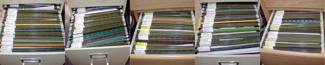
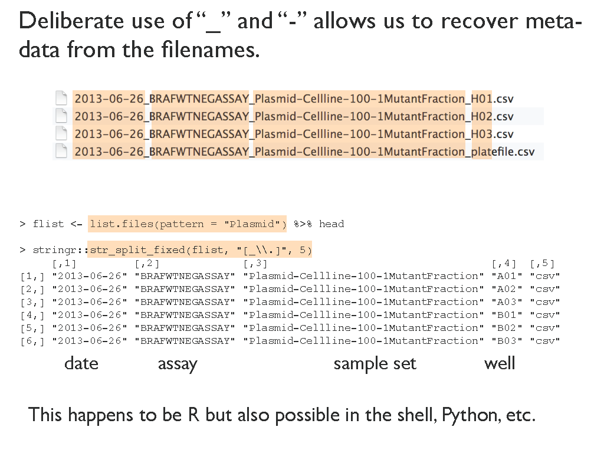
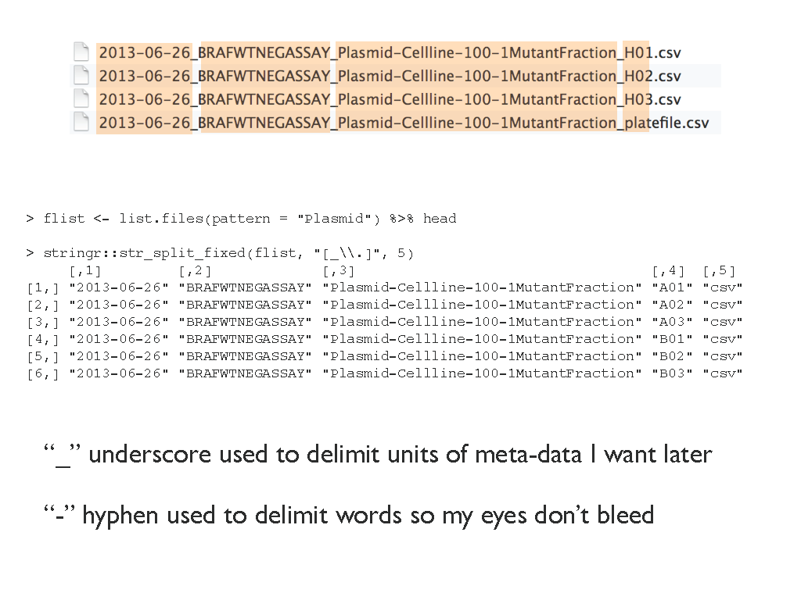
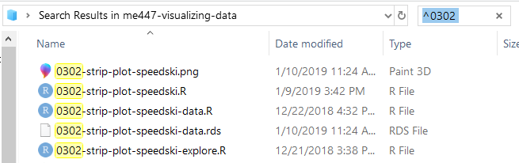

managing files
================


<small> <br> <i>Files</i> by Mitch Barrie is licensed under
<a href="https://creativecommons.org/licenses/by-sa/2.0/">CC BY-SA
2.0</a> <br> </small>

## contents

[prerequisites](#prerequisites)  
[planning the directory structure](#planning-the-directory-structure)  
[hyphens and underscores in file
names](#hyphens-and-underscores-in-file-names)  
[planning a file-naming scheme](#planning-a-file-naming-scheme)  
[using relative paths](#using-relative-paths)  
[searching files](#searching-files)  
[references](#references)

## prerequisites

  - Start every work session by launching `portfolio.Rproj`  
  - Your [project directory
    structure](cm501-proj-m-manage-files.md#plan-the-directory-structure)
    satisfies the course requirements

## planning the directory structure

At the start of a project, you should carefully consider the number and
types of files you will create over the life of the project and lay out
a directory structure that helps you consistently organize your work.

For this course, I have done that planning for you. The directory
structure is:

 carpentry  
 data  
 data-raw  
 design  
 explore  
 figures  
 manage  
 reports  
 resources  

.gitignore  
 .Renviron  
 README.Rmd  
 README.md  
 portfolio.Rproj

A summarized in the [lecture
slides](../slides/wk03-4-file-management.pdf), the purpose of each
directory is shown below, organized in the order of a typical workflow.

  - **`data-raw/`**  
    Data in their original form, never edited manually  
    R scripts for web-scraping or downloading raw data  
    Version control optional
  - **`explore/`**  
    R scripts for exploring new data sets  
    Scripts for learning about new graphs, packges, functions, etc.  
    Version control optional
  - **`carpentry/`**  
    R scripts that turn raw data into tidy data  
    Reads from `data-raw/`  
    Writes CSV or RDS to **`data/`** ready for graphs or analysis
  - **`design/`**  
    R scripts that create and save graphs  
    Reads CSV or RDS from `data/`  
    Writes publication-ready PNG to **`figures/`**
  - **`reports/`**  
    Rmd scripts that present and critique displays  
    One report per display  
    Runs R scripts in `carpentry/` and `design/` and imports graphs from
    `figures/`
  - **`resources/`**  
    Other files used to create the reports  
    Bibliography and CSL files  
    Image downloads and screenshots
  - **`README.Rmd`**  
    Creates the main page of the portfolio website  
    Provides explicit links to every report

Administrative files

  - **`manage/`**  
    Correspondence and project management  
    Project-related files sent by others  
    Excused from version control
  - **`portfolio.Rproj`**  
    Sets the current working directory to the project directory
  - **`.gitignore`**  
    Directs Git to ignore specific files, excusing them from version
    control
  - **`.Renviron`**  
    Stores packages in a library separate from the base R installation

For different opinions on directory structure schemes, see

  - Mira Céline Klein (2017) [A meaningful file structure for R
    projects](https://www.inwt-statistics.com/read-blog/a-meaningful-file-structure-for-r-projects.html)  
  - Chris von Csefalvay (2018) [Structuring R
    projects](https://chrisvoncsefalvay.com/structuring-r-projects/)  
  - The Carpentries (n.d.) [Project management with
    RStudio](https://swcarpentry.github.io/r-novice-gapminder/02-project-intro/)
  - Karl Broman (n.d.) [Organize your data and
    code](https://kbroman.org/steps2rr/pages/organize.html)

<br> <a href="#top">▲ top of page</a>

## hyphens and underscores in file names

  - Use a hyphen “-” to separate words for ease of reading  
  - Use an underscore "\_" to separate meta-data that happens to be in
    the filename. For example, the file names below mix underscores and
    hyphens to identify the date, assay, sample set, and “well” (Bryan,
    [2015](#ref-Bryan:2015)).



<br> <a href="#top">▲ top of page</a>

## planning a file-naming scheme

At the start of a project, you should carefully consider the number and
types of files you will create over the life of the project and lay out
a file-naming scheme that supports machine readability and human
readability. Once you start a scheme, stick with it. It is really
time-consuming and error-prone to change a file-naming scheme after
several files are written.

#### portfolio files

For this course, I have done that planning for you. The file naming plan
for the portfolio is:

  - Every file starts with the display number `dn`, i.e., `d1`, `d2`,
    etc.
  - Followed by the graph type and abbreviated data name
    `-graphtype-dataname`  
  - Followed by additional modifiers as needed such as `-explore` or
    `-data`  
  - Ending of course with the relevant suffix `.Rmd`, `.R`, `.rds`, etc.

The basic form of the file names is summarized,

``` 
explore/     dn-graphtype-dataname-explore.R  
carpentry/   dn-graphtype-dataname-data.R   
data/        dn-graphtype-dataname-data.rds   
design/      dn-graphtype-dataname.R 
figures/     dn-graphtype-dataname.png 
reports/     dn-graphtype-dataname.Rmd  
```

To illustrate our file-naming scheme, assume that display D1 is a
strip-plot of `speedski` data. The report script would be named,

``` 
reports/     d1-strip-plot-speedski.Rmd   
```

The R script that creates the graph has the same name with the .R
suffix,

    design/      d1-strip-plot-speedski.R 

I expect to have two additional R scripts, one in `explore/` and one in
`carpentry/`. To differentiate them, I append `-explore` and `-data` as
follows

``` 
explore/     d1-strip-plot-speedski-explore.R  
carpentry/   d1-strip-plot-speedski-data.R   
```

As an aid to knowing which R scripts produce which files, every data
file has the same name as the R script that produced it,

``` 
carpentry/   d1-strip-plot-speedski-data.R   
data/        d1-strip-plot-speedski-data.rds  
```

Similarly, for R scripts that create graphs,

    design/      d1-strip-plot-speedski.R 
    figures/     d1-strip-plot-speedski.png 

Thus, for this example, the complete set of file names would be:

``` 
explore/     d1-strip-plot-speedski-explore.R  
carpentry/   d1-strip-plot-speedski-data.R   
data/        d1-strip-plot-speedski-data.rds   
design/      d1-strip-plot-speedski.R 
figures/     d1-strip-plot-speedski.png 
reports/     d1-strip-plot-speedski.Rmd   
```

If I need more than one script of the same type in a directory, I’ll add
a sequential number to the file name. e.g.,

``` 
carpentry/   d1-strip-plot-speedski-data-01.R   
carpentry/   d1-strip-plot-speedski-data-02.R   
```

#### practice files

For exercises and tutorials, the display number `dn` is replaced by a
4-digit number that represents the week of the term and the activity
number in that week. For example, suppose that in week `03` the second
activity `02` is to create a `strip-plot` using the `speedski` data. The
files for this exercise would include:

``` 
explore/     0302-strip-plot-speedski-explore.R  
carpentry/   0302-strip-plot-speedski-data.R   
data/        0302-strip-plot-speedski-data.rds  
design/      0302-strip-plot-speedski.R 
figures/     0302-strip-plot-speedski.png   
```

By the end of the term, every directory will have a large collection of
files. Using this file-naming scheme, however, the tutorial and
portfolio files are easy to differentiate. For example, the design
directory might include:

    design/      0201-graph-basics.R  
    design/      0302-strip-plot-speedski.R 
    design/      0303-boxplot-nontrad.R 
    design/      0402-multiway-metropop.R 
    design/      0502-scatterplot-dataname.R 
    design/      0602-dot-plot-dataname.R 
    design/      d1-your-graphtype-dataname.R 
    design/      d2-multiway-dataname.R 
    design/      d3-scatterplot-dataname.R 
    design/      d4-your-graphtype-dataname.R 
    design/      d5-your-graphtype-dataname.R 
    design/      d6-your-graphtype-dataname.R 
    design/      d7-your-graphtype-dataname.R 

<br> <a href="#top">▲ top of page</a>

## using relative paths

Explicitly link files using relative file paths. For example, report
script

    reports/d1-strip-plot-speedski.Rmd

contains code chunks that run every R script,

    source("carpentry/d1-strip-plot-speedski-data.R")
    source("design/d1-strip-plot-speedski.R")

import data to print a data table,

    readRDS("data/d1-strip-plot-speedsk-data.rds")

and import figures.

    include_graphics("figures/d1-strip-plot-speedski.png")

In every case, the file path argument is relative to the project working
directory.

<br> <a href="#top">▲ top of page</a>

## searching files

A file-naming scheme like ours supports machine readability for file
searches. For example, in Windows to find all files in my course
directory that start with the 4 digits 0302, I type `^0302` in the
search box,



<br>Or in R, I can use the `list.files()` function to search for all
file names that include `strip-plot`.

``` r
sapply(search_path, function(x) list.files(
    path        = ".", 
    pattern     = "strip-plot", 
    recursive   = TRUE, 
    ignore.case = TRUE
    )) 
```

With an output something like this,

``` 
#>  [1,] "carpentry/0302-strip-plot-speedski-data.R"  
#>  [2,] "data/0302-strip-plot-speedski-data.rds"  
#>  [3,] "design/0302-strip-plot-speedski.R"  
#>  [4,] "explore/0302-strip-plot-speedski-explore.R"  
#>  [5,] "figures/0302-strip-plot-speedski.png"  
```

## references

<div id="refs">

<div id="ref-Bryan:2015">

Bryan J (2015) Naming things.
<https://speakerdeck.com/jennybc/how-to-name-files>

</div>

</div>

***
<a href="#top">&#9650; top of page</a>    
[&#9665; calendar](../README.md#calendar)    
[&#9665; index](../README.md#index)
