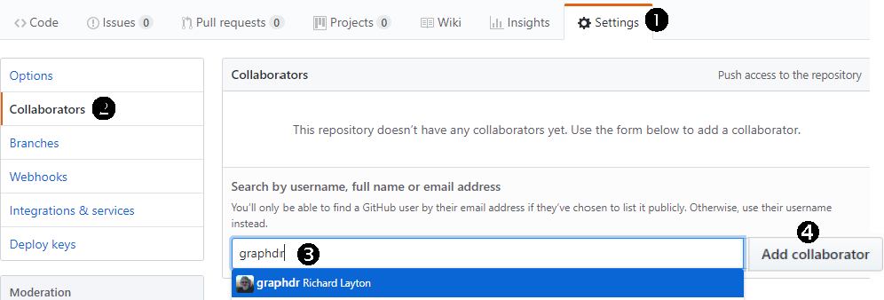
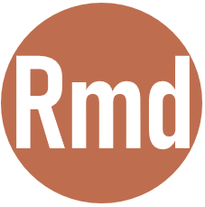

software studio
================

 <small> <br>
<i>Troy from Mount Ida</i> by the NY Public Library has
<a href="https://www.flickr.com/photos/nypl/3990762946/in/photolist-75DGMG">no
known copyright restrictions</a> <br> </small>

## contents

[prerequisites](#prerequisites)  
[setup GitHub](#setup-github)  
[create a repo](#create-a-repo)  
[invite collaborator](#invite-collaborator)  
[create an R project](#create-an-r-project)  
[create the Renviron](#create-the-renviron)  
[install packages](#install-packages)  
[setup directories](#setup-directories)  
[edit gitignore](#edit-gitignore)  
[setup README](#setup-readme)  
[setup reading response](#setup-reading-response)  
[setup correspondence](#setup-correspondence)  
[commits](#commits)  
[references](#references)

## prerequisites

You should already have done the following

  - Installed git locally
  - Obtained a free GitHub account
  - Practiced creating a test repo (when you cached your credentials)

<br> <a href="#top">▲ top of page</a>

## setup GitHub

GitHub is a hosting service that provides an online home for your
Git-based projects—critically important for sharing with collaborators.
Once you have a GitHub account, you will update your repositories using
the RStudio interface.

  - [Join GitHub Education](https://education.github.com/students) —
    it’s free.

Optional reading: Read section 4 of [Excuse me, do you have a moment to
talk about version
control?](https://dx.doi.org/10.7287%2Fpeerj.preprints.3159v2) for a
good introduction to GitHub repositories.

I suggest you read the full instructions for a step before doing that
step.

  - Some instructions ask you to type commands in the “shell”. To access
    the shell, open RStudio and use the pulldown menu *Tools \> Shell*.
  - [Introduce yourself to
    Git](http://happygitwithr.com/hello-git.html#hello-git) using the
    name and email you used with your GitHub account
  - [Cache your username and
    password](http://happygitwithr.com/credential-caching.html#credential-caching)
    or so you don’t need to authenticate yourself to GitHub
    interactively ad nauseum. Alternatively, you can [set up SSH
    keys](http://happygitwithr.com/ssh-keys.html#ssh-keys).  
  - [Prove RStudio can find local
    Git](http://happygitwithr.com/rstudio-git-github.html#rstudio-git-github)
    and, therefore, can talk to GitHub

Cleanup

  - Close the Shell window
  - Delete the test project on your machine
  - Delete the test repo on GitHub, *Settings \> Danger Zone \> Delete
    this repository*

<br> <a href="#top">▲ top of page</a>

## create a repo

Create a repo on GitHub called `portfolio-last-first`, replacing `last`
with your last name (family name or surname) and `first` with your first
name (given name or forename)

  - Make the repo private
  - Check the box to *Initialize this repository with a README*
  - Pull down the *Add gitignore* menu to *R*
  - A license is optional (private repos for classwork don’t generally
    need a license)
  - *Create repository*

<br> <a href="#top">▲ top of page</a>

## invite collaborator

We get two primary benefits from using version control

  - I can easily review and comment on your work  
  - You can easily revert to an earlier version of the project

To invite me to be a collaborator, navigate to your portfolio repo on
GitHub and

1.  Select the *Settings* tab
2.  Select the *Collaborators* menu
3.  In the *Search by user name* box, type my GitHub name, “graphdr”
4.  *Add Collaborator*



<br> <a href="#top">▲ top of page</a>

## create an R project

Instructions adapted from (Bryan, [2018](#ref-Bryan:2018))

  - Navigate to your portfolio repo on GitHub  
  - Copy the HTTPS clone URL to your clipboard via the green “Clone or
    Download” button. The URL will look something like this:
    `https://github.com/jennybc/myrepo.git`

In RStudio,

  - *File \> New Project \> Version Control \> Git*
  - Paste the repo URL into the *repository URL* box
  - Select a location on your computer to save the project  
  - Click *Create Project* to create a new directory

The new project directory will be all of these things: a directory or
“folder” on your computer; a local Git repository linked to a remote
GitHub repository;  
an RStudio Project.

Check yourself

  - Close RStudio
  - Launch the portfolio R project `portfolio-last-first.Rproj`
  - You should see a `Git` tab in a pane ribbon as well as in the
    RStudio top ribbon

Lastly, let’s check your project directory. While you may have
additional files or folders (for example, when you initialized your repo
you may have created `.gitignore` or `README.md`), you should have at
least the following folders and files,

    portfolio-last-first/
        `-- portfolio-last-first.Rproj

If you want to read more about it.

  - Optional reading outlining the steps we just followed above: [New
    project, GitHub
    first](http://happygitwithr.com/new-github-first.html)  
  - Optional reading if you need it at some point: [Existing project,
    GitHub first](http://happygitwithr.com/existing-github-first.html)
  - Optional reading if you need it at some point: [Existing project,
    GitHub last](http://happygitwithr.com/existing-github-last.html)

<br> <a href="#top">▲ top of page</a>

## create the Renviron

The `.Renviron` file is a text file that directs R packages to be
installed in the `R/library` directory created earlier. To create the
file, with RStudio open,

  - Create a new text file, *File menu \> New File \> Text File*.
  - Save the file to the `portfolio` main directory using the filename
    *.Renviron*

In this file, write the following line of text that tells R the path to
the stand-alone package library you created earlier.

  - Windows: `R_LIBS_USER="C:/R/library"`
  - Linux: `R_LIBS_USER="~/R/library"`

Save and close to recognize the .Renviron file.

  - Save and close the `.Renviron` file.
  - Close RStudio

Let’s check your project directory. While you may have additional files
or folders (for example, when you initialized your repo you may have
created `.gitignore` or `README.md`), you should have at least the
following folders and files,

    portfolio-last-first/
        |-- .Renviron
        `-- portfolio-last-first.Rproj

Remember, every time you create a new project (with or without version
control), paste a copy of the `.Renviron` file at the top level of the
project directory.

<br> <a href="#top">▲ top of page </a>

## install packages

Now let’s see if the library path you made works.

  - Re-open the R project for your portfolio  
  - Find the RStudio pane with *Packages* in its ribbon. Select
    *Packages \> Install*
  - In the dialog box that appears, the *Install to Library* strip
    should show `C:/R/library [Default]` (in Windows) or `~/R/library
    [Default]` in Linux

If the *Install to Library* is not correct, check that

  - Your have opened an R project
  - The `.Renviron` file is in the project top level directory
  - The `.Renviron` file has the correct contents described earlier  
  - The file path in the `.Renviron` file agrees with the path to the
    `R/library` directory you made earlier

If the *Install to Library* is correct,

  - Type `tidyverse` in the *Packages* box  
  - *Install*

If all goes well, you’ll see something like this in the R Console

    ## > install.packages("tidyverse")
    ## Installing package into 'C:/R/library' 
    ## (as 'lib' is unspecified)
    ## trying URL 'https://cran.rstudio.com/bin/windows/contrib/3.5/tidyverse_1.2.1.zip'
    ## Content type 'application/zip' length 92547 bytes (90 KB)
    ## downloaded 90 KB
    ## 
    ## package 'tidyverse' successfully unpacked and MD5 sums checked

Packages can also be installed from the command line, for example, the
tidyverse package could have been installed by typing

``` r
install.packages("tidyverse")
```

However, these methods work only for packages available from the
Comprehensive R Archive Network (CRAN). Some authors make their packages
available on GitHub only. To install packages from GitHub, first install
the devtools package using the RStudio *Packages \> Install* as shown
above, or from the console by typing

``` r
install.packages("devtools")
```

Now use the devtools function `install_github()` to install a package
containing companion materials for our course,

``` r
devtools::install_github("graphdr/graphclassmate")
```

To check that graphclassmate was installed, in your Console type

    library("graphclassmate")

If a warning message appears, try to respond to it. If you are not sure
what to do, you can copy the warning and google it. If that fails,
discuss it with a classmate. If that fails, see me.

Next, type

    ? metro_pop

A help page for the `metro_pop` data set in the graphclassmate package
should appear in the RStudio Help pane. Again, if a warning message
appears, please follow up on it as described above

<br> <a href="#top">▲ top of page </a>

## setup directories

All we are going to do is create a set of empty sub-directories
(folders).

  - Re-open (if you closed it) the R project for your portfolio

Next, create new folders for `carpentry`, `data`, `data-raw`, etc. so
that your top level project directory has the sub-directories (folders)
shown below.

 carpentry  
 data  
 data-raw  
 design  
 explore  
 figures  
 manage  
 reports  
 resources

<br> <a href="#top">▲ top of page </a>

## edit gitignore

The `.gitignore` file lists local files excused from version control and
therefore not shared with collaborators.

You originally created the `.gitignore` file when you set up the repo.
In RStudio, open `.gitignore`. If you set it up to ignore R, the first
few lines of your file should look something like this,

    # History files
    .Rhistory
    .Rapp.history
    
    # Session Data files
    .RData
    
    ... (etc) 

If your project directory does not contain `.gitignore` file, you
probably skipped that step when you created the repo. No worries. You
can create the file as follows,

  - In RStudio, *File \> New File \> Text File*  
  - *File \> Save As* to your project main directory with the name
    (starts with a period) `.gitignore`

Once the file exists,

  - Open the `.gitignore` file
  - Add these lines

<!-- end list -->

    # R files not version controlled
    .Rhistory
    .Rapp.history
    .RData
    .Rproj.user/
    
    # project files not version controlled 
    manage

We can also generally omit HTML files (we are using github-specific .md
files for the web pages) and binary files like Office .docx, .pptx, and
.xlsx.

Add these lines of code to the `.gitignore` file.

    # top directory files not version controlled
    *.html
    
    # sub-directory files not version controlled
    */*.html
    */*.docx
    */*.pptx
    */*.xlsx

Optional: Raw data does not generally have to be version controlled. If
the files are large, some analysts list the raw data directory in
gitignore.

    # raw data files not version controlled 
    data-raw

  - Save and close the gitignore file

Anytime you create a folder or a file you want git to ignore, just add
its path to the `.gitignore` file

  - Check yourself: the `.gitignore` file should be in the top-level
    project directory.

If you select the `Git` tab in the RStudio pane, all files you
identified in `.gitignore` should disappear from the list of unstaged
files.

<br> <a href="#top">▲ top of page </a>

## setup README

The README file that resides at the top level of your project directory
is the landing page of your repo. This is the first glimpse a reader has
of your project.

When you created your project repo, if you checked the box for
*Initialize the repo with a README*, then your project should have a
`README.md` file. If not, no worries. We’re going to edit it using R
Markdown anyway.

We’re going to create an R Markdown file to edit or create the README
file.

  - In RStudio, *File \> New File \> R Markdown … \> OK*
  - Delete the default script
  - *Save As* to the top level of your project with the filename
    `README.Rmd`

Add the YAML header for a GitHub document.

    ---
    output: github_document
    ---

After the header, add a title for the webpage (in R Markdown, a single
hashtag indicates a level-1 header)

    # Portfolio of data displays 

Next add your name and date. We set up an inline code chunk that allows
the R function `Sys.Date()` to be evaluated when we knit the document.
Inline R code chunks are denoted by enclosing the code with `` `r ` ``.
Whenever the file is knitted, the date will be set to the current date.

``` 
Your Name  
`r Sys.Date()`  
```

If you wish to use a non-default data format, for example, to list just
the month and year, use the `format()` function. For additional date
formatting tips, see
[Quick-R](https://www.statmethods.net/input/dates.html).

    `r format(Sys.Date(), '%B %Y')` 

Add some prose that introduces your portfolio. For more information on
writing a good README file, see Whitmore ([2018](#ref-Whitmore:2018)).

    ## Introduction
    
    A portfolio documents your professional growth and competence by providing 
    tangible evidence of your knowledge and skills in data visualization and 
    visual rhetoric. The introduction is the reader's first glimpse of your 
    work; give them a reason to keep reading.

In the RStudio menu ribbon, click the *Knit* button. You can also use
the keyboard shortcut Ctrl + Shift + K. Knitting README.Rmd to
`github_document` output produces the README.md file used by GitHub to
produce the portfolio main webpage.

Your project directory, in addition to the folders shown earlier, should
now contain the following files:  

.gitignore  

.Renviron  
 README.Rmd  
 README.md  
 portfolio.Rproj

<br> <a href="#top">▲ top of page </a>

## setup reading response

The reading response report is the first R markdown report to set up.

  - In RStudio *File \> New File \> R Markdown… \> OK*
  - *Save As* the Untitled file to your `reports` folder with the name
    `reading-responses.Rmd`
  - Delete all the default content
  - Add a YAML header at the top of the file

<!-- end list -->

    ---
    output: github_document
    ---

Next, we’ll add a heading for the page and a heading for the week 2
reading response. You can copy the lines from the [online Rmd
file](../reports/reading-prompts-1.Rmd) and paste them into your Rmd
file.

    ## week 2 reading prompts  
    
    Tufte, Edward (1997) The decision to launch the space shuttle Challenger.
    In: *Visual and statistical thinking: Displays of evidence for making
    decisions.* Cheshire, CT: Graphics Press, 16--31.

Next we add some prompts and space for your responses. (You can just
copy the text from the online source and paste it into your Rmd script.

    **Prompt:** Tufte says, "Regardless of the indirect cultural
    causes of the accident, there was a clear proximate cause."
    Summarize Tufte's explanation of the proximate cause.  
    
    **Response:** 
    
    *Prompt:** Describe the evidence the author presents to 
    support those ideas.
    
    **Response:**  
    
    (and so forth) 

  - Save the file
  - Knit the file to see the rendered output document
  - When you read the article, return to this file and write your
    responses.

<br> <a href="#top">▲ top of page </a>

## setup correspondence

We will place a correspondence file in the reports folder for the two of
us to correspond about the portfolio.

Create a correspondence Rmd script just like we did above for the
reading response.

  - In RStudio *File \> New File \> R Markdown… \> OK*
  - *Save As* the Untitled file to your `reports` folder with the name
    `correspondence.Rmd`
  - Delete all the default content
  - Add a YAML header at the top of the file

<!-- end list -->

    ---
    output: github_document
    ---

Copy the following text, paste it into the correspondence file, and edit
the dates and your initials.

    ### yyy-mm-dd (edit for today's date)
    
    **RL** This is an example of a second comment in reverse chronological order. 
    
    **xx** (replace with your initials) And its response. 
    
    
    
    ### yyy-mm-dd (edit for today's date)
    
    **RL** I will use this Rmd file for corresponding with you about your
    portfolio. Entries will be dated and listed in reverse chronological
    order--that is, with the most recent at the top of the page. You should record
    your responses directly below, for example: 
    
    **xx** (replace with your initials) This is a sample response to the comment
    above.

<br> <a href="#top">▲ top of page </a>

## commits

The process of *Commit \> Pull \> Push* is how you upload your latest
version of your project to the GitHub repo.

  - Re-open (if you closed it) the R project for your portfolio  
  - Select the *Git* tab

If there are files shown in the Git pane,

  - Click your cursor in the *git* pane
  - Select all the files using the keyboard shortcut *Ctrl A* (*Command
    A* in the Mac OS)
  - Stage all files by clicking in one of the *Staged* boxes
  - Select *Commit*
  - In the text box, write a short but descriptive message that
    summarizes the nature of the commit
  - *Commit*
  - *Pull* and you will see the message *Current branch master is up to
    date*  
  - *Close*
  - *Push*
  - *Close*

Navigate to your online repo and you should find that it includes all
your changes.

I will clone your repo to my local machine to review and comment on your
work. Therefore, to avoid version conflicts, it is critical that you:

  - Every time you start a work session in your Rproj file, the first
    thing you should do is select the Git tab and PULL.  
  - Every time you commit changes, check all the stage boxes, type a
    commit message, COMMIT, then PULL, then PUSH
  - At the end of your work session, commit, PULL, then PUSH

## references

<div id="refs">

<div id="ref-Bryan:2018">

Bryan J (2018) Happy Git and GitHub for the useR.
<http://happygitwithr.com/>

</div>

<div id="ref-Whitmore:2018">

Whitmore S (2018) Art of README.
<https://github.com/noffle/art-of-readme>

</div>

<div id="ref-Wickham+Grolemund:2017">

Wickham H and Grolemund G (2017) *R for Data Science.* O’Reilly Media,
Inc., Sebastopol, CA <https://r4ds.had.co.nz/>

</div>

</div>

***
<a href="#top">&#9650; top of page</a>    
[&#9665; calendar](../README.md#calendar)    
[&#9665; index](../README.md#index)
