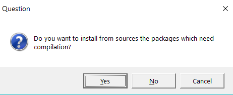

updating the R habitat
================

 <small>  
<i>Habitat</i> by Patrice Ouellet is licensed under
<a href="https://creativecommons.org/licenses/by-nc-nd/2.0/">CC BY-NC-ND
2.0</a>   </small>

## contents

[prerequisites](#prerequisites)  
[stay current](#stay-current)  
[update R](#update-r)  
[update RStudio](#update-rstudio)  
[update R packages](#update-r-packages)  
[conclusion](#conclusion)  
[references](#references)

## prerequisites

Start every work session by launching `portfolio.Rproj`

You have set up a package library independent of the R installation, for
example, at `C:/R/library`, as [instructed
here](cm901-software-install.md#create-a-library-for-packages).

Packages

    install.packages("installr")
    install.packages("devtools")

## stay current

Running old software can be considerably harder than running new
software.

R updates about twice a year.

Get current at the start of a new project, but avoid updating if you are
approaching a project deadline.

Read more about it at [Maintaining
R](https://whattheyforgot.org/maintaining-r.html), a chapter in (Bryan
and Hester, [2019](#ref-Bryan+Hester:2019)).

## update R

On a Windows machine, we update R using the R GUI running as an
administrator.

  - Navigate to your most recent `Rgui.exe` file located in your
    Programs directory, e.g., `C:\Program
    Files\R\R-3.5.3\bin\x64\Rgui.exe`  
  - Right-click on `Rgui.exe` and run as administrator

In the R GUI window that appears, run the commands

    .libPaths("C:/R/library")
    library("installr")
    updateR()

OK all defaults except the libraries questions. We are using the
`C:/R/libr ary` directory for packages—independent of the R
installation. So we can answer “no” to the library questions in the R
update.

## update RStudio

Check for updates from the menu *Help \> Check for Updates*.

If *Check for Updates* does not appear in the menu,

  - Find the current version of RStudio from the menu *Help \> About
    RStudio*  
  - Navigate to the [RStudio
    website](https://www.rstudio.com/products/rstudio/#Desktop), find
    out what the current version is.

If you decide to update RStudio, close RStudio on your machine, download
the new version, and run the `RStudio-n.n.n.exe` as an administrator
(`n.n.n` is the current version number).

## update R packages

When updating packages, if a window pops up asking about compilation,

  - NO saves time
  - YES gets you the latest version but can be time-consuming. Don’t say
    yes if you are in a hurry to get some work done.

**From within RStudio**

  - From the RStudio pane, Select *Packages \> Update*
  - OR, from the menu, *Tools \> Check for Package updates …*

**CRAN packages only**

  - Copy and paste these lines in the Console
  - Follow the instructions that appear to select the packages to update

<!-- end list -->

    update.packages(lib.loc = "C:/R/library", 
        ask = FALSE, 
        checkBuilt = TRUE)

**GitHub packages** (and CRAN packages)

  - Copy and paste these lines in the Console
  - Follow the instructions that appear to select the packages to update

<!-- end list -->

    devtools::update_packages(packages = TRUE, 
        lib.loc = "C:/R/library",
        ask = FALSE)

## conclusion

To conclude the course, I offer two additional short pages of final
thoughts

  - [The portfolio after the
    term](cm306-report-edit-after-term.md#the-portfolio-after-the-term%5D)
  - [Final thoughts](cm004-course-final-thoughts.md#final-thoughts)

## references

Bryan J and Hester J (2019) What They Forgot to Teach You About R.
<https://whattheyforgot.org/>

Wickham H and Grolemund G (2017) *R for Data Science.* O’Reilly Media,
Inc., Sebastopol, CA <https://r4ds.had.co.nz/>

***
<a href="#top">&#9650; top of page</a>    
[&#9665; calendar](../README.md#calendar)    
[&#9665; index](../README.md#index)
