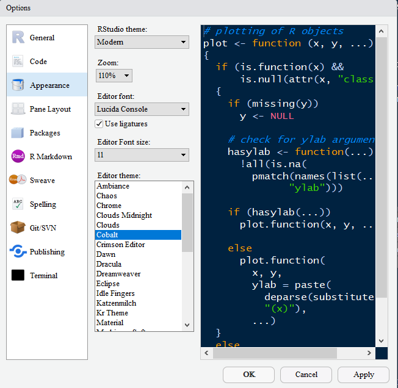
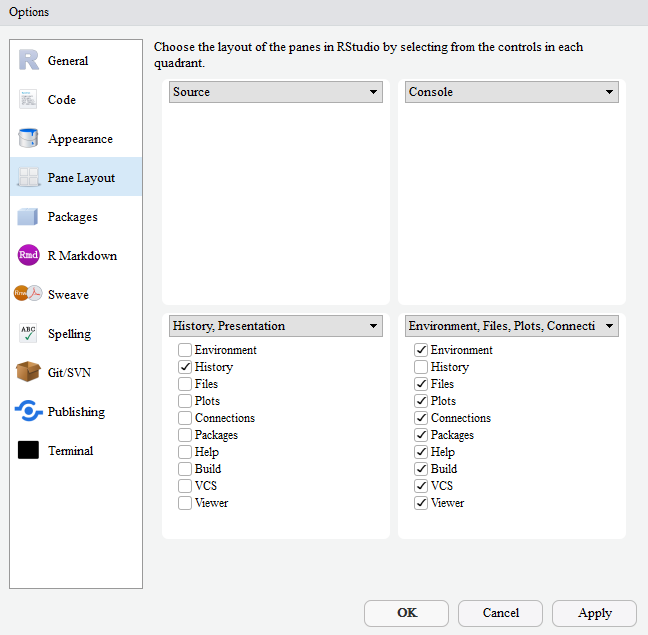
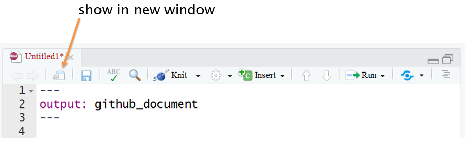

RStudio tips
================

An occasionally updated collection of tips and tricks to make more
efficient use of RStudio

## contents

[Editor theme](#editor-theme)  
[Pane layout](#pane-layout)  
[Tearable panes](#tearable-panes)  
[Recall previous commands](#recall-previous-commands)

## editor theme

Use *Tools \> Global Options … \> Appearance* to edit the way your
RStudio editor looks—a highly personal choice.

I like the **cobalt** color scheme because it is much easier to read
than the default white background in public, e.g., in airports where the
light levels or glare are variable.

Below are the settings I use. Your mileage may vary.

## pane layout

Use *Tools \> Global Options … \> Pane Layout* to rearrange the RStudio
pane layout —also a highly personal choice.

R blogger Ilya Kashnitsky in his 2018 post [A perfect RStudio
layout](https://ikashnitsky.github.io/2018/perfect-rstudio-layout/)
recommends a specific pane layout. Like him, I have found the layout
perfectly suited to my workflow.

Minimizing the History pane (I almost never use it) yields a full
screen-height for the Source pane without hiding the Console.

## tearable panes

Use the *Show in new window* button to tear off the Source pane,
facilitating the use of multiple screens.

R blogger Sean Lopp in his 2011 post [RStudio IDE easy tricks you
might’ve
missed](https://rviews.rstudio.com/2016/11/11/easy-tricks-you-mightve-missed/)
mentions this feature. As he says, “Tearable panes are anything but
terrible.”

## recall previous commands

The RStudio Console supports the ability to recall previous commands
using the arrow keys.

  - up arrow: recall previous command(s)  
  - down arrow: reverse of up

## references

***
<a href="#top">&#9650; top of page</a>    
[&#9665; calendar](../README.md#calendar)    
[&#9665; index](../README.md#index)
